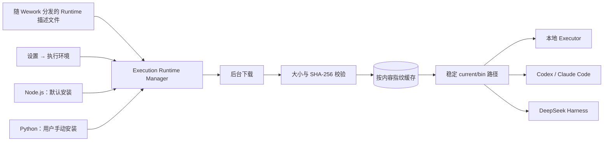
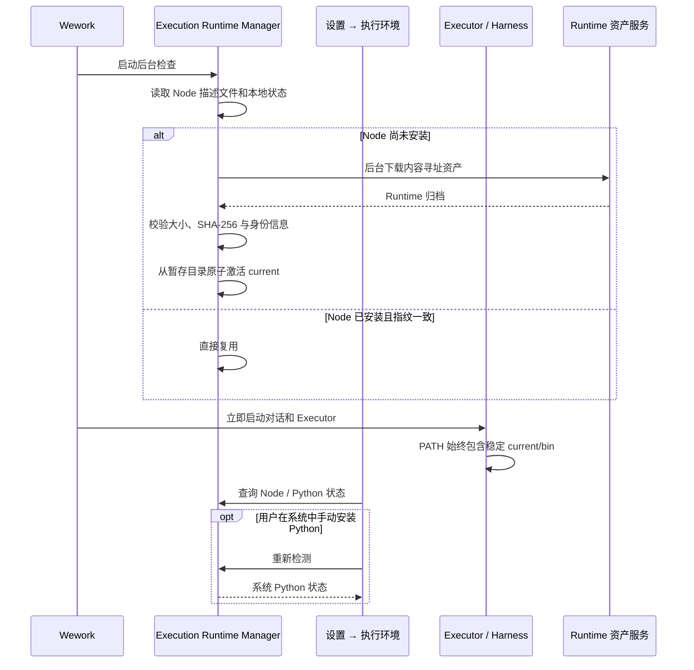

# Wework 执行环境

范围：Wework 独立管理供 Codex、Claude Code、Skills、MCP 与智能应用调用的脚本执行环境，不修改系统 PATH，也不让环境安装阻塞对话启动。

| 连线                              | 代码归属                                                                                                                   |
| --------------------------------- | -------------------------------------------------------------------------------------------------------------------------- |
| Runtime 描述文件与发布资产生成    | `wework/scripts/prepare-execution-runtime.mjs`、`.github/workflows/wework-app.yml`                                         |
| 下载、校验、缓存、激活与状态命令  | `wework/src-tauri/src/execution_environments.rs`                                                                           |
| Executor 与本地 Harness PATH 注入 | `wework/src-tauri/src/local_executor.rs`、`wework/src-tauri/src/local_terminal.rs`                                         |
| DeepSeek Harness 共享 Node        | `wework/src-tauri/src/harness_apps.rs`、`wework/scripts/prepare-harness-runtime.mjs`                                       |
| 设置入口与管理界面                | `wework/src/plugin-runtime/core-settings-data.tsx`、`wework/src/components/settings/ExecutionEnvironmentsSettingsPage.tsx` |

不变量：托管的 Node 环境属于 Wework 私有应用数据，不修改系统 PATH、系统 Node.js 或系统 Python；对话和 Executor 启动不得等待 Runtime 下载；所有托管 Node 子进程使用稳定的 `current/bin` 路径，Runtime 下载成功并完整校验后才能从暂存目录原子激活；失败、截断或校验不一致的下载不得污染当前可用版本；Wework 升级时内容指纹未变化的 Runtime 必须复用，不得重复下载；Node.js 默认后台安装，Python 默认不下载，只检测用户在系统中手动安装的 Python；DeepSeek Harness Runtime 不得再携带独立 Node，必须与 Codex、Claude Code 和 Skills 共享 Wework Node；更新激活失败时必须保留此前可用版本；实际调用尚未就绪的环境时必须返回可诊断错误，但不能阻塞普通对话或其他工具。
