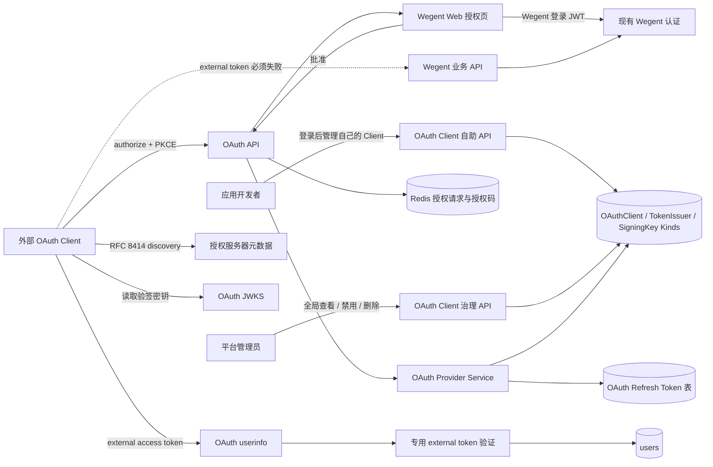
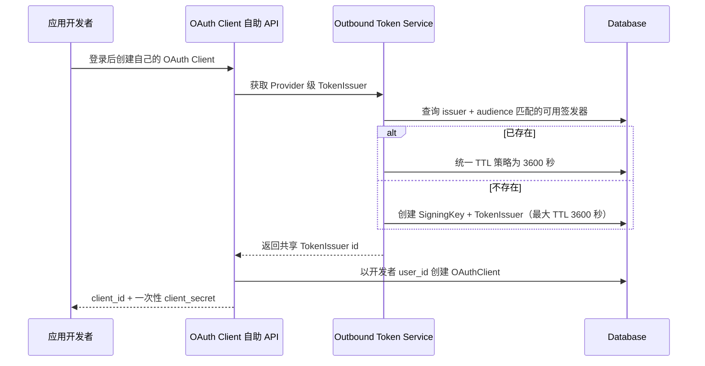
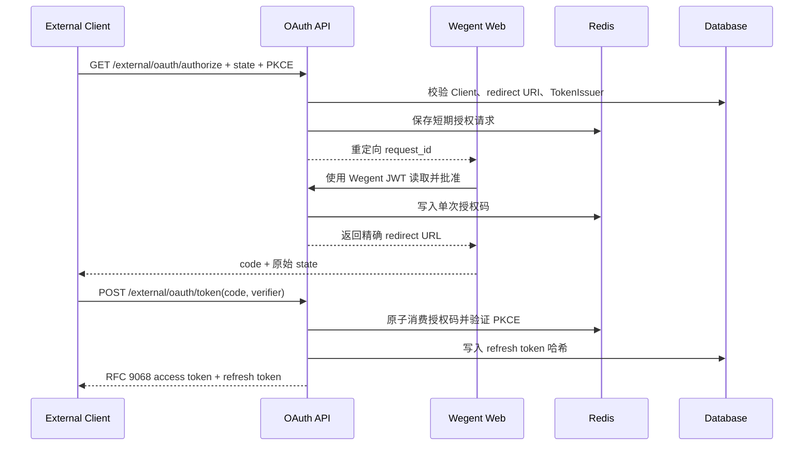
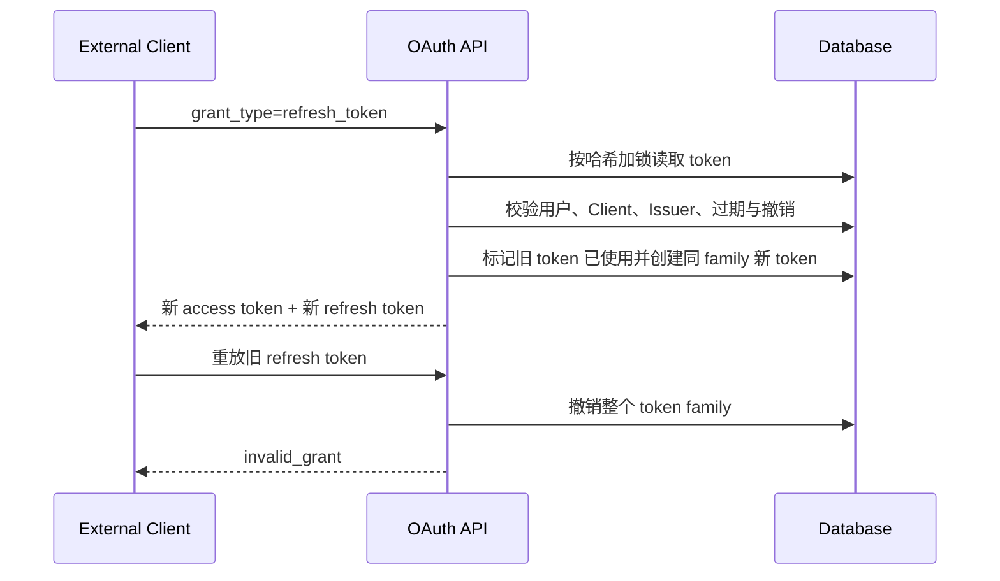

# 外部 OAuth 身份令牌

## 范围

Wegent 作为受限 OAuth 2 授权服务器，只向已登记的外部 Client 证明当前用户身份。外部 access token 只能读取专用 userinfo，不授予 Wegent API 或外部业务权限。

外部应用的注册、PKCE、换取 token、刷新与撤销步骤见[外部 OAuth 2.0 接入指南](../wegent/developer-guide/external-oauth-integration.md)。

## 连线图

## Provider 初始化时序

## 授权码时序

## 刷新时序

## 代码归属

| 责任                                                | 归属                                                                        |
| --------------------------------------------------- | --------------------------------------------------------------------------- |
| OAuth 协议端点与错误响应                            | `backend/app/api/endpoints/oauth_provider.py`                               |
| Client、授权码、JWT 与 refresh 轮换                 | `backend/app/services/auth/oauth_provider.py`                               |
| OAuth 请求、响应和 Kind 结构                        | `backend/app/schemas/oauth_provider.py`                                     |
| Refresh token 持久化                                | `backend/app/models/oauth_refresh_token.py`                                 |
| 开发者 Client 自助管理 API                          | `backend/app/api/endpoints/oauth_clients.py`                                |
| 管理员 Client 治理 API                              | `backend/app/api/endpoints/admin/oauth_clients.py`                          |
| OAuth Provider 级 SigningKey / TokenIssuer 自动准备 | `backend/app/services/auth/outbound_token_service.py`                       |
| Client 管理与用户授权 UI                            | `frontend/src/features/settings/`、`frontend/src/app/auth/oauth/authorize/` |

## 必要不变量

- external access token 只允许访问 OAuth userinfo；现有 Wegent JWT、API Key、Task Token 认证不得接受它。
- userinfo 只返回 `id`、`user_name`、`email`，不返回角色、认证来源、偏好、Git 信息或资源权限。
- audience 固定为 `wegent-userinfo`，scope 固定为 `userinfo.read`，Client 不能请求扩大。
- 授权服务器元数据按 RFC 8414 从 issuer 派生的 `/.well-known/oauth-authorization-server` 地址发布，并公开 OAuth 专用 JWKS。
- 外部 OAuth Provider 的 API 统一使用 `/external/oauth` 前缀，不与 Wegent 登录认证或内部 TokenIssuer API 共用命名空间。
- SigningKey 和 TokenIssuer 是 OAuth Provider 级配置，不属于单个 OAuth Client。后端必须复用同一套可用签发配置，首次缺失时在同一事务内自动创建；TokenIssuer 的最大 access token TTL 固定为 3600 秒，不得由 Client 参数决定。
- OAuth Client 归属于创建它的开发者，使用 `Kind.user_id` 保存所有权；普通用户只能列出、更新、轮换和删除自己的 Client，Client 名称只需在同一所有者下唯一。
- 管理员负责全局查看、禁用和删除 Client，不代替开发者创建应用或持有 Client Secret。
- Provider 按公开 `client_id` 解析所有已启用的 OAuth Client，不得把协议运行路径限制为系统用户创建的 Client。
- OAuth Client 创建和更新接口不得接受 TokenIssuer 或 Token TTL；每个 Client 只管理自身的 client id、secret、redirect URI 和启停状态。
- JWT access token 遵循 RFC 9068：使用 `typ=at+jwt`，包含并校验 `iss`、`sub`、`aud`、`exp`、`iat`、`jti`、`client_id` 和 `scope`。
- redirect URI 必须与 Client 登记值完全匹配；授权码必须使用格式合法的 PKCE S256、短期且只能消费一次。
- Token 与撤销端点只允许一种 Client 认证方式；同时提交 HTTP Basic 和请求体凭据必须拒绝。
- Client 的 access token TTL 不得超过 TokenIssuer 上限；被 Client 引用的 TokenIssuer 不得删除或改成其他 audience。
- 只有 Client 和 redirect URI 均已验证时，授权错误才可携带原始 `state` 重定向；否则必须返回本地错误，避免开放重定向。
- refresh token 只存哈希并每次轮换；已使用 token 被重放时撤销整个 family。
- RFC 7009 撤销端点接受 `token_type_hint`，未知 token 仍返回成功，避免泄露 token 状态。
- Client 被禁用、删除、轮换 secret、切换类型或更换 TokenIssuer 时，必须撤销其现存 refresh token。
- 用户、Client、TokenIssuer 或 SigningKey 失效后，不得签发或刷新 token。
- 授权页必须禁止被嵌入、禁止 Referer 泄露并禁止缓存。
- 日志不得记录 access token、refresh token、授权码、client secret 或 Authorization header。
