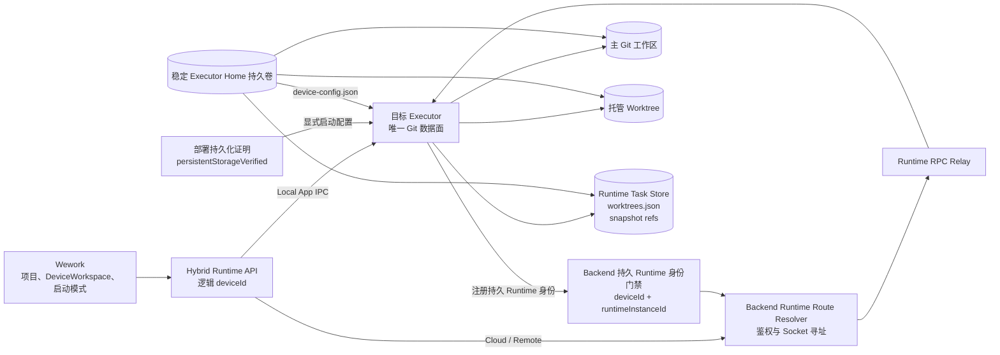
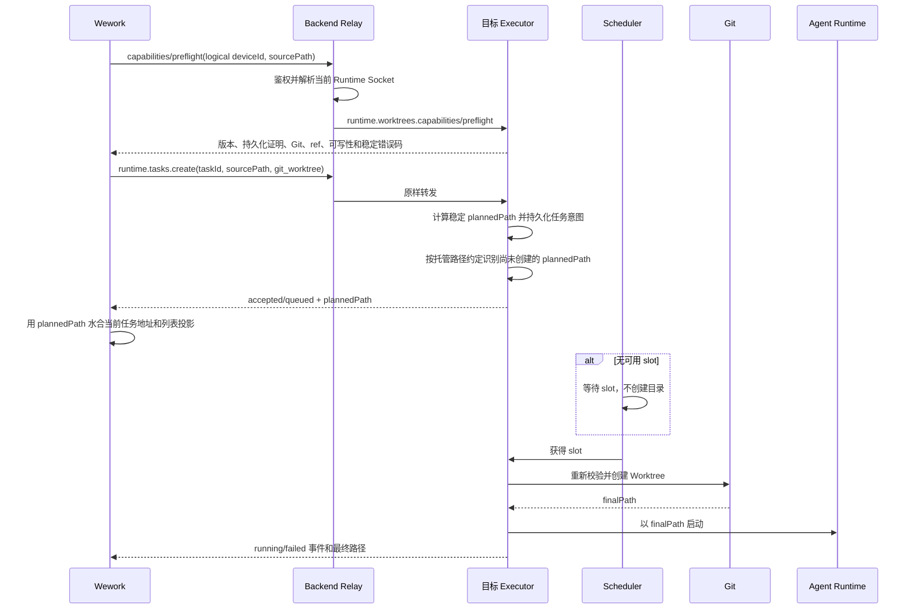
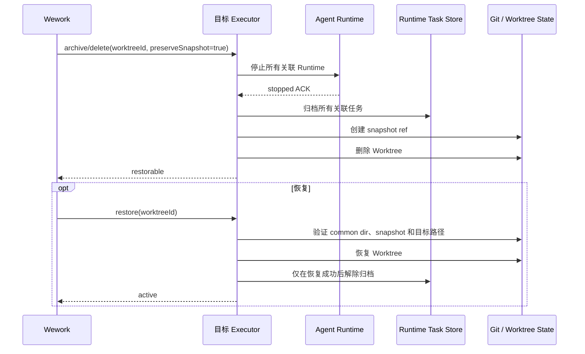

# Git Worktree 执行

范围：Local、Cloud 和 Remote DeviceWorkspace 的 Worktree 能力发现、任务创建、排队、运行、归档、恢复、清理、设备路由和 UI 投影。

| 边                                                 | 代码归属                                                                                                                                |
| -------------------------------------------------- | --------------------------------------------------------------------------------------------------------------------------------------- |
| DeviceWorkspace 选择、可用性、偏好和 UI            | `wework/src/features/workbench/`、`wework/src/components/chat/composer/`                                                                |
| Local/Cloud/Remote Runtime 路由和任务投影          | `wework/src/api/`、`wework/src/features/workbench/useWorkbenchRuntimeMessaging.ts`、`wework/src/features/workbench/workbenchReducer.ts` |
| 逻辑设备鉴权、持久 Runtime 身份和 Socket 解析      | `backend/app/services/device/`、`backend/app/api/ws/`                                                                                   |
| Worktree capability、preflight、Git 生命周期和状态 | `executor/src/runtime_work/`                                                                                                            |
| 云设备持久卷、固定挂载路径和单写实例               | 云设备 Provider、部署配置、`docker/device/`                                                                                             |
| 跨层验收                                           | `wework/e2e/desktop/`、`scripts/acceptance/`、Backend 和 Executor 契约测试                                                              |

必要不变量：

1. Backend 不执行 Git；Worktree 文件、Git common dir、快照和生命周期真值只属于目标 Executor。
2. 外部请求使用逻辑 `deviceId`；Backend 解析当前 Runtime Socket ID，并验证逻辑 ID 和 Runtime ID 都属于当前用户。
3. Worktree 能力使用独立 `runtime.worktrees.capabilities`；可选在线投影使用 `runtime_features.worktrees`，不得复用 Skills、Plugins、MCP `capabilities`。无法解析的 `runtime_features` 必须按缺失能力处理，不能阻断设备心跳。Cloud 和 Remote 必须同时返回 `persistentStorageVerified=true`，该值只能由已经验证稳定卷、固定规范绝对挂载路径和单写约束的部署显式注入；缺失或为 `false` 时 Wework 必须以 `worktree_persistent_storage_unverified` 关闭 Worktree。
4. `runtime.worktrees.preflight` 无任务 Worktree 副作用；所有任务创建入口必须经过同一 Worktree preflight 门禁，`runtime.tasks.create` 在真正创建前再次执行关键校验。
5. Worktree 身份包含 `deviceId` 和稳定 `taskId/worktreeId`，不得跨设备回退、恢复或删除。
6. 请求 `workspacePath` 是源工作区；响应 `workspacePath` 是稳定计划路径或最终 Worktree 路径。`git_worktree` 响应缺少该独立路径或返回源路径时必须结构化失败，Backend 和 UI 都不得回退源目录，也不得在返回计划路径前把源目录投影成 Worktree。
7. 排队任务不创建目录；Worktree prepare 占用 Runtime slot；创建失败不启动 Runtime，也不回退主工作区。
8. 已存在目标路径只有在验证为同一源仓库、同一 Worktree ID 的合法 Git Worktree 后才能幂等接管。
9. 阻塞 Git 和目录扫描不得运行在异步 RPC 主线程。
10. 删除前必须获得所有关联 Runtime 的停止确认；Runtime 退出或 panic 都必须由作用域退出守卫发送停止确认。归档、快照和删除按顺序执行，任一步失败都保留可诊断数据；批量归档必须有界并发，不能按故障任务数线性累积停止超时。
11. Executor 重启对账可以恢复 Worktree 的可管理状态，但不得自动续跑中断的 Agent；持续失败的对账必须按固定间隔限流，同时保留后续重试能力。
12. 一个 Executor Home 同一时刻只能有一个写入 Executor；Cloud 和 Remote 的 Executor Home、主仓库、Worktree、Runtime Store 和绝对挂载路径必须稳定持久化。
13. 启动模式和分支偏好按 DeviceWorkspace 隔离；运行位置不是启动模式。
14. 离线、路由缺失、超时、断开、不支持、非 Git、路径冲突和存储不持久使用稳定可区分错误；超时和断开必须标记为可重试，但有副作用的 RPC 不自动重试。
15. Terminal、IDE、文件树、Git、归档、恢复和设置始终使用任务所属设备及最终 Worktree 路径。远端文件命令缺少 Backend 认证出的工作区根时必须关闭访问，不能把空根集合解释为无限制。
16. 重启对账已将中断任务标记为失败或取消后，任务列表不得因过期的 Provider 线程元数据把它重新投影为运行中；只有本地完成时间之后出现的新 Provider Turn 才能表示一次新的执行。
17. Cloud 和 Remote 的 `runtimeInstanceId` 保存在 Executor Home，并在 Backend 首次登记后固定；容器或实例替换必须复用该值。相同逻辑设备携带新的 Runtime Instance ID 时必须拒绝注册并报告持久存储身份不匹配，不能覆盖既有值或创建旁路设备记录。
18. 延迟创建必须持久化计划阶段的源仓库 fingerprint，并在获得 slot 后与创建前重新计算的 fingerprint 比较；源目录被替换为另一个仓库时必须以 `worktree_source_changed` 失败。
19. 停止超时是未知结果，不得清除 Runtime 取消控制或把任务当作已停止；重试归档/删除前仍必须获得同一 Runtime 的停止 ACK。
20. `preserveSnapshot=false` 表示终态清理：Executor 必须删除已有快照引用并从 `worktrees.json` 移除记录；后续 `runtime.worktrees.list` 不得返回已清理的墓碑条目。
21. 已存在工作区的类型判定优先使用自身真实 Git 元数据；尚未创建的托管计划路径必须先按 `worktrees/<id>/<project>` 约定识别，不能被更高层 Executor 源码仓库的 `.git` 否定。已有候选根自身包含普通仓库 `.git` 时仍判定为普通工作区，不能仅因任一父目录名为 `worktrees` 被投影成 Worktree。
22. Runtime 接受任务后，列表刷新失败只能降级为稍后对账，不能撤销已接受任务的本地可见状态或报告发送失败。
23. Worktree 乐观导航可以在计划路径返回前只携带任务身份；创建响应或任务列表首次提供计划/最终路径后，Wework 必须将该路径回填到当前任务地址。当前任务、列表投影和后续 Terminal、IDE、文件操作不得长期保留无路径的乐观地址。

详细开发波次、子 Agent 写入范围和验收矩阵见 [云端 Git Worktree 目标模式与并行开发计划](../wework/developer-guide/wework-cloud-git-worktree-parallel-development-plan.md)。
