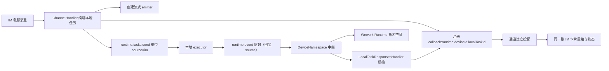
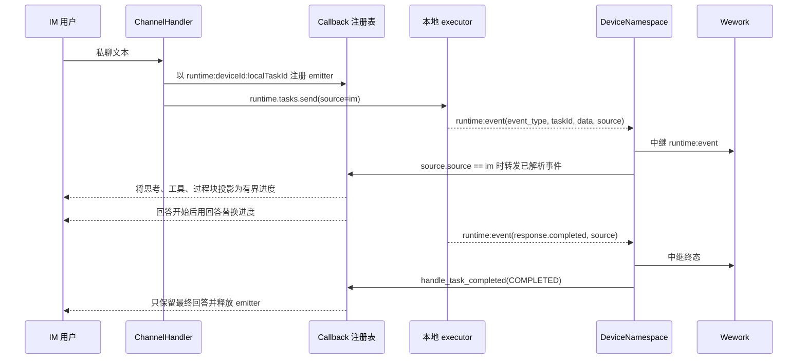

# IM 私聊续聊本地 Runtime 的流式回传

范围：IM 私聊消息进入本地 Runtime 任务后，模型输出和紧凑执行进度如何回到同一张 IM 卡片。不含 IM 绑定、`/switch` 选任务和云端 Shell 执行链路。

| 边界                    | 代码归属                                                                     |
| ----------------------- | ---------------------------------------------------------------------------- |
| IM 续聊与 emitter 注册  | `backend/app/services/channels/handler.py`                                   |
| callback key 与转发     | `backend/app/services/channels/callback.py`                                  |
| 钉钉进度投影与卡片重绘   | `backend/app/services/channels/dingtalk/emitter.py`                          |
| `runtime:event` 信封    | `executor/src/runtime_work/events.rs`、`executor/src/local/backend.rs`        |
| 中继与 IM 桥接          | `backend/app/api/ws/device_namespace.py`                                     |
| 信封归一化与终态方言翻译 | `backend/app/api/ws/local_task_responses.py`                                 |

不变量：本地 Runtime 只通过 `runtime:event` 信封回传流式输出，扁平 `response.*` 设备事件不覆盖该场景，因此中继路径必须自行转发 IM callback；callback key 恒为 `runtime:<device_id>:<local_task_id>`，`device_id` 取设备会话身份，必须与 IM 侧注册时使用的 `address.device_id` 相同；信封使用 camelCase（`taskId`、`subtaskId`），桥接前必须归一化再交给事件解析器；本地 Runtime 的终态方言与 Responses API 不同——最终答案在 `data.value`，失败原因在 `data.error.message`，共享解析器读的是 `data.response.output[].content[].text` 且不识别 `response.failed`，因此终态必须先在桥接层翻译成 `ExecutionEvent`，否则卡片只会拿到空内容或永远停在处理中；缺少 `source` 或 `source.source != "im"` 的信封不得进入 IM 转发；Wework 中继先于 IM 转发执行，IM 通道失败只能按通道隔离，不得阻断中继或持久化；钉钉只投影用户可读过程文本、工具名称和状态，不得展示模型内部推理原文、工具参数或工具输出；进度使用固定大小窗口并跨 Worker 持久化，卡片更新限流不得丢失状态；回答开始后必须从进度模式切换到回答模式，终态只保留最终回答；终态事件必须走 `handle_task_completed` 以写入最终内容、清理进度状态并释放 emitter，不得只发增量。
