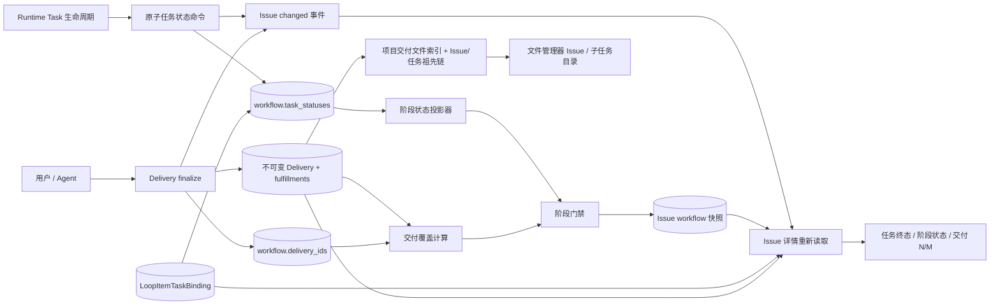
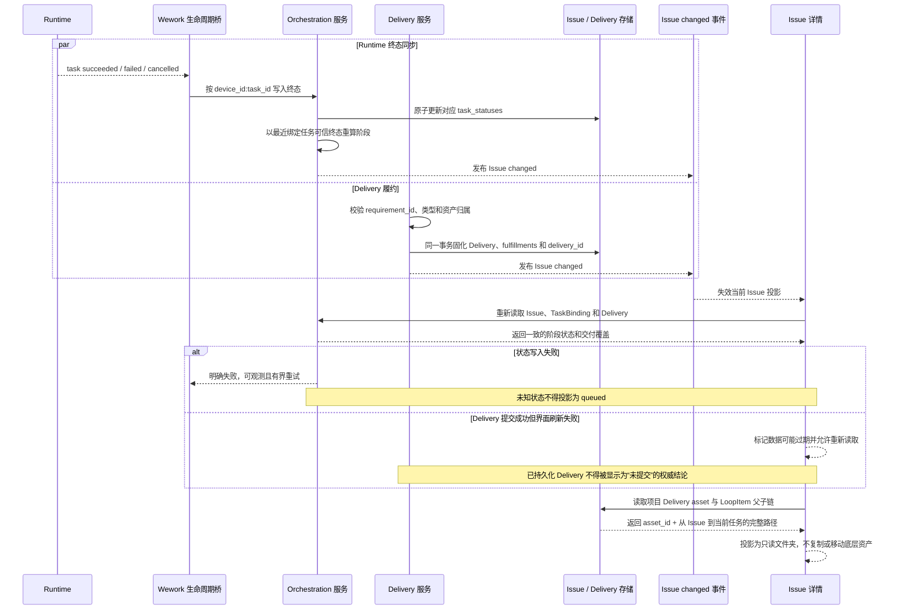

# Issue Runtime 状态、交付与界面投影

范围：Runtime Task 终态进入 Issue workflow、Delivery fulfillment 进入阶段门禁，以及 Issue 详情对任务、阶段和交付状态的一致投影。

| 边                                            | 代码归属                                                                        |
| --------------------------------------------- | ------------------------------------------------------------------------------- |
| Runtime 生命周期 → Issue 状态同步             | Wework `deliveries` API、Backend `project_workflow_projection` 原子任务状态命令 |
| TaskBinding + task status → 阶段状态          | Wework `issueWorkflow`、Backend workflow projection                             |
| Delivery finalize → fulfillment 与节点绑定    | Backend Delivery service、`wework-space` MCP                                    |
| fulfillment → N/M 覆盖与审批门禁              | Backend deliverable projection、workflow decision service                       |
| Issue changed → 详情刷新                      | Backend `loop_item_events`、Wework `projectChatSocket` 与 `CloudTodoWorkspace`  |
| Issue、TaskBinding、Delivery → UI             | Wework `TodoEditor`、`IssueWorkflowDag`                                         |
| Delivery asset + LoopItem 父子链 → 文件管理器 | Backend `cloud_files` service 与 cloud-project API、Wework `CloudFilesView`     |

必要不变量：

- Runtime Task 状态以稳定的 `device_id:task_id` 为键，由后端原子更新；客户端不得读取并回写整个 workflow JSON 来修改一个任务状态。
- 人工任务只有 Runtime 明确报告 queued 时才能显示排队中。新绑定任务状态未知时必须保留后端阶段状态或显示“同步中”，不得推导 queued。
- 阶段状态由 TaskBinding 顺序和持久化终态确定：任一 running 优先，否则使用最近绑定任务的可信终态；人工阶段成功后进入 `awaiting_approval`。
- Delivery finalize 必须在同一事务内固化 Delivery、typed fulfillments 和节点 `delivery_id`；只有 `fulfillments[].requirement_id` 计入 N/M。
- Runtime 状态更新和 Delivery finalize 都必须使 Issue 详情投影失效。刷新后必须同时读取 Issue、TaskBinding 和 Delivery，禁止混合不同版本的缓存。
- 状态写入失败必须返回结构化错误并执行有界重试，不得形成无上限 PATCH 循环；失败不得改变 UI 语义。
- 人工审批必须使用服务端实时重算的阶段状态和交付覆盖，不得信任客户端缓存或可能滞后的节点快照。
- 项目交付文件索引必须返回从根 Issue 到交付所属任务的完整、持久化父子链；前端不得通过标题、编号或文件路径猜测任务层级。
- LoopItem 根节点的 `parent_id` 数据边界同时包含 `NULL` 与历史空字符串；两者都必须终止祖先遍历。
- 文件管理器目录是 Delivery 的只读投影。展开目录、预览或下载不得复制、移动或修改底层资产，文件身份始终是原始 `asset_id`。
