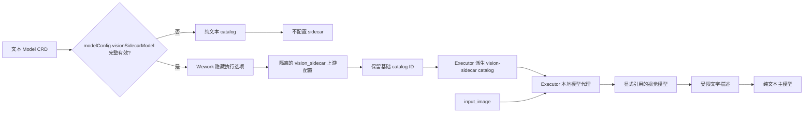
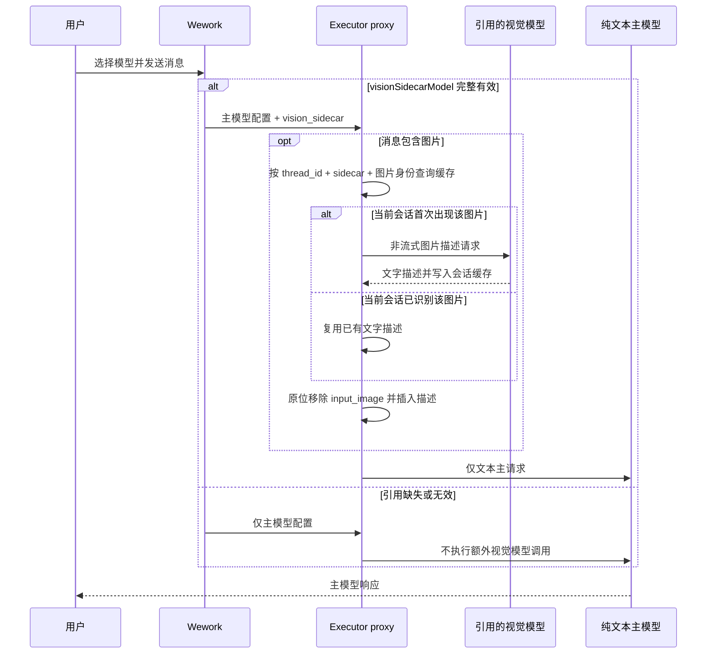

# 文本模型视觉委托

范围：Wework 使用纯文本模型执行带图片的 Codex 请求时，依据 Model CRD 中显式配置的视觉模型引用构造 sidecar，并在主请求前把图片替换为文字描述。视觉能力通过基础 catalog 的通用派生项表达，不为具体模型维护 sidecar 专用映射。

| 边                                     | 代码归属                                                 |
| -------------------------------------- | -------------------------------------------------------- |
| 云端显式引用的编辑与能力约束           | `frontend/src/features/settings/`                        |
| Model CRD 安全配置聚合                 | `backend/app/services/model_aggregation_service.py`      |
| 云端引用校验与隐藏执行选项             | `wework/src/features/workbench/runtimeModelSelection.ts` |
| 本地/云端 sidecar 上游配置             | `wework/src/api/local/localServices.ts`                  |
| 基础 catalog 与上游模型身份元数据      | `shared/assets/codex-models/`                            |
| 通用视觉 catalog 派生与 catalog 选择   | `executor/src/server/codex_model_catalog.rs`             |
| 用户消息及工具输出图片的描述、会话缓存、限制和原位替换 | `executor/src/server/local_model_proxy/vision.rs` |
| 代理注册与主请求转发                   | `executor/src/server/local_model_proxy/mod.rs`           |
| 云端 Model 到 Codex catalog 的身份映射 | Wework 运行时选择与 Backend 触发链路                     |

不变量：视觉模型只能来自 `modelConfig.visionSidecarModel` 的显式引用，不按登录态、模型名称或默认模型自动选择；引用缺失、结构无效、过期、不可访问、未启用、不支持图片或 `apiFormat` 不匹配时，不得配置 sidecar、提升图片能力、预处理图片或发起额外模型调用；显式引用必须包含模型名称、类型、命名空间、资源所有者和 `apiFormat`，但不携带供应商凭据；运行时配置只携带适用的网关凭据或绑定在 executor 内的本地凭据，二者都不会暴露给 Codex 或日志；配置 sidecar 时，Executor 必须从实际生效的基础 catalog 通用派生隐藏的视觉 catalog，只修改 catalog 身份、展示元数据、可见性和输入模态，保留推理、工具、上下文和压缩等全部基础能力；未配置时必须继续使用基础 catalog；新增基础模型不得要求增加 sidecar 专用常量、映射或复制 catalog；用户消息和 `view_image` 等工具的 `function_call_output.output` 中的 `input_image` 都必须在主协议转换前被识别并原位替换；同一 Codex `thread_id` 中，同一 sidecar、图片源和 detail 组合只能成功识别一次，后续轮次必须复用描述，缓存身份不得包含会随轮次变化的提示文本，且不得跨会话复用；原始图片只发送给引用的视觉模型，主模型只能收到文字；sidecar 超时、无效图片或上游失败必须移除原图并插入明确失败描述；日志不得包含图片、密钥或提示词正文。

详细配置和限制见 [Wework 设置](../wework/settings.md)。
