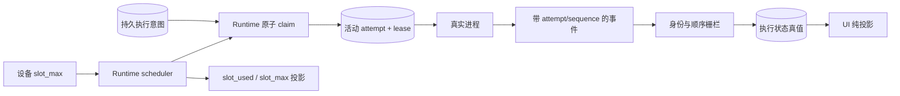
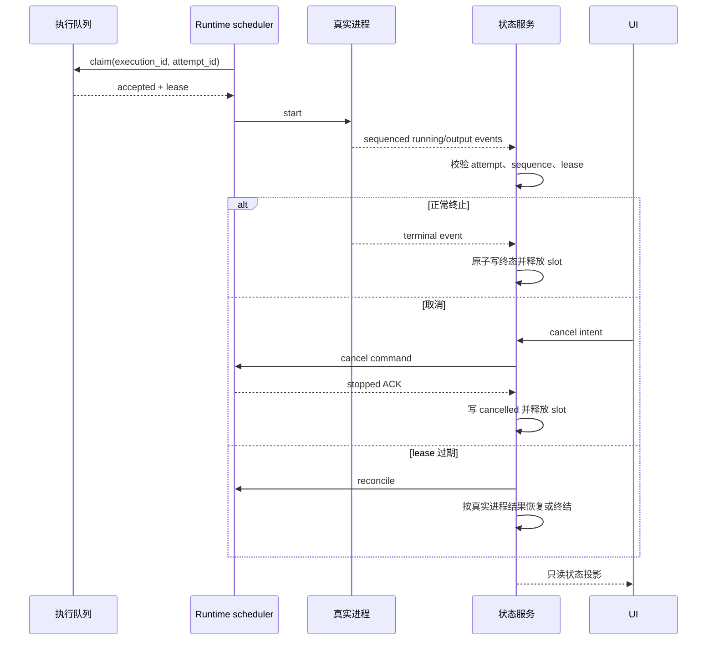

# 项目执行状态与 Runtime 容量

范围：执行领取、事件顺序、取消、迟到事件、lease 对账、设备并发容量与 UI 投影。

| 边                         | 代码归属                                                        |
| -------------------------- | --------------------------------------------------------------- |
| claim、attempt 与状态转换  | `backend/app/services/loop_item_executions/service.py`          |
| scheduler、slot 与真实进程 | `executor/src/runner/`、`executor/src/runtime_work/`            |
| 本地 IPC 和 Runtime RPC    | `executor/src/local/app_ipc.rs`、Backend device runtime service |
| UI 投影                    | Wework workbench stores 与 board queries                        |

不变量：attempt 身份和事件序列必须匹配；迟到事件不能覆盖新 attempt；终态与 slot 释放原子发生；取消发送不等于取消成功；容量属于各设备 Runtime scheduler，聚合容量不是执行真值；UI 不推导或回写运行状态。

详细状态矩阵与验收见 [项目执行状态真实性重构](../wework/developer-guide/wework-project-execution-state-truth-refactoring.md)。
