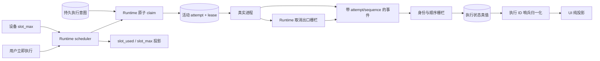
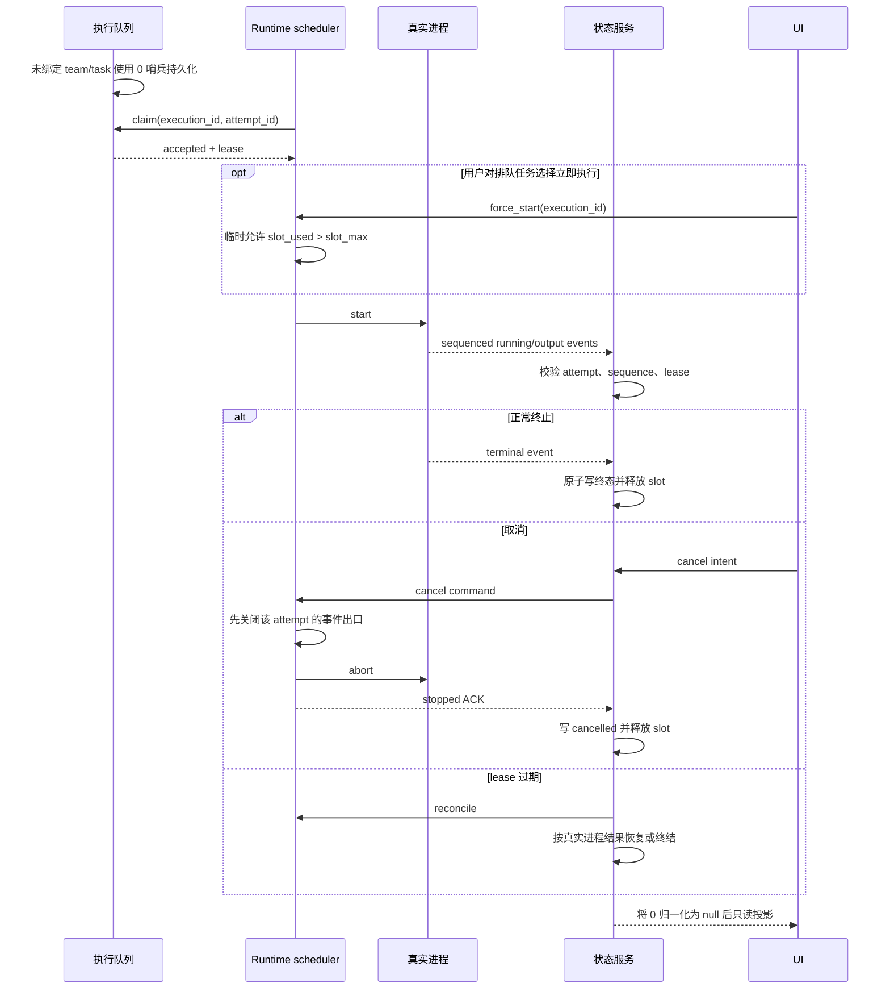

# 项目执行状态与 Runtime 容量

范围：执行领取、事件顺序、取消、迟到事件、lease 对账、设备并发容量与 UI 投影。

| 边                         | 代码归属                                                        |
| -------------------------- | --------------------------------------------------------------- |
| claim、attempt 与状态转换  | `backend/app/services/loop_item_executions/service.py`          |
| 执行 ID 存储与归一化       | `backend/app/models/loop_item_execution.py`、execution API/schema |
| scheduler、slot、真实进程与取消事件栅栏 | `executor/src/runner/`、`executor/src/runtime_work/`、`executor/src/local/backend/tasks.rs` |
| 本地 IPC 和 Runtime RPC    | `executor/src/local/app_ipc.rs`、Backend device runtime service |
| UI 投影                    | Wework workbench stores 与 board queries                        |

不变量：attempt 身份和事件序列必须匹配；迟到事件不能覆盖新 attempt；终态与 slot 释放原子发生；取消发送不等于取消成功，Runtime 必须先原子关闭该 attempt 的事件出口，再中止任务并发送唯一取消终态，已分离的流式回调不得在取消开始后继续投影内容，作用域退出必须保证停止 ACK；`loop_item_executions.team_id/backend_task_id=0` 只表示未绑定，存在性判断必须使用正 ID 语义，API/UI 必须归一化为 `null`；容量属于各设备 Runtime scheduler，聚合容量不是执行真值；队列持久化和排队任务 ID 必须来自同一个 scheduler 快照；“立即执行”允许指定排队任务临时突破 `slot_max`，此时 `slot_used` 必须由活动任务 ID 精确投影，且在活动数重新低于上限前不得自动启动其他排队任务；UI 不推导或回写运行状态。

详细状态矩阵与验收见 [项目执行状态真实性重构](../wework/developer-guide/wework-project-execution-state-truth-refactoring.md)。
