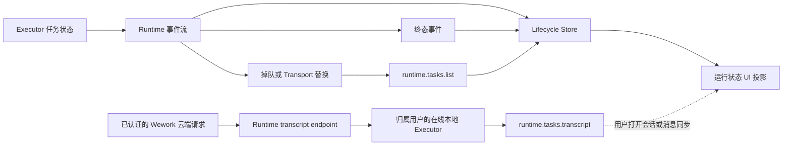
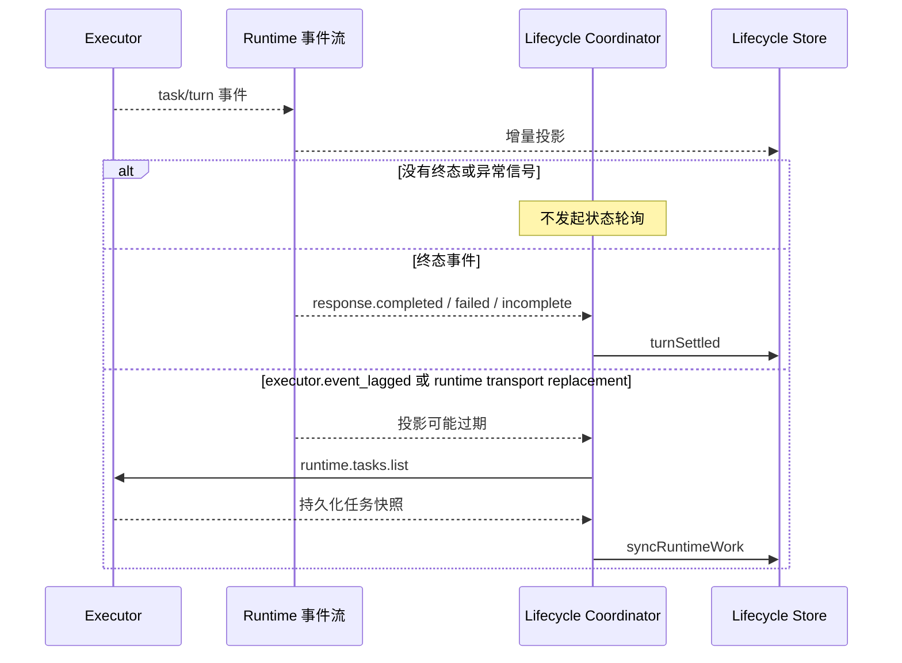

# Runtime 任务生命周期对账

## 范围

约束 Wework 如何消费 Runtime 任务事件、检测本地投影可能过期，并在不轮询 transcript 的前提下恢复权威任务状态。

## 连线图

## 时序图

## 代码归属

| 职责                             | 代码                                                                                           |
| -------------------------------- | ---------------------------------------------------------------------------------------------- |
| 本地 Executor 事件桥与服务复用   | `wework/src/api/local/localServices.ts`、`wework/src/api/runtime/runtimeChatStream.ts`         |
| Hybrid stream handler 路由       | `wework/src/api/hybrid/hybridServices.ts`                                                      |
| 事件驱动对账协调                 | `wework/src/features/workbench/runtimeTaskLifecycle/RuntimeTaskLifecycleStreamCoordinator.tsx` |
| 生命周期真值投影                 | `wework/src/features/workbench/runtimeTaskLifecycle/RuntimeTaskLifecycleStore.ts`              |
| Executor task list 与 transcript | `executor/src/runtime_work/handler/queries.rs`                                                 |

## 必要不变量

- 正常生命周期只消费事件流，不得按时间周期读取 task list 或 transcript。
- 同一底层本地 Executor transport 必须复用同一个 Runtime 事件流；用户偏好或等值身份对象刷新不得重建原生监听，否则会累计监听器并在订阅切换窗口丢失终态事件。
- 终态事件按 `deviceId + taskId` 定位任务，并按 `turnId` 将 `turn.outcome` 独立写入共享 lifecycle store；常驻协调器不得依赖 pane 是否挂载，也不得用事件到达后立即读取或稍后到达的过期 task list 覆盖该 turn outcome，因为 Executor 与 provider 的列表投影可能尚未完成同一轮收尾。
- 明确表示本地投影可能过期的 `executor.event_lagged` 和 runtime transport replacement 同样触发对账。
- 并发异常信号必须共享同一个在途对账请求；在途期间的新信号最多合并成一次串行尾随对账，不得形成并发请求突发或定时重试循环。
- 持久化 `task.status` 由 Executor 状态字段投影，`turn.outcome` 由终态事件独立投影；即使 task snapshot 仍为 `active`，也不得擦除已收敛的 turn outcome。两者都不得从 transcript、turn items 或 rollout JSONL 推导。
- Transcript 读取只服务于用户查看会话或明确的消息同步，不承担生命周期心跳职责。云端读取必须经过已认证的 Runtime transcript endpoint 完成设备归属校验，并委派给该用户归属的在线本地 Executor；不得直接读取或跨 Executor 读取。
