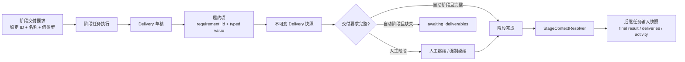
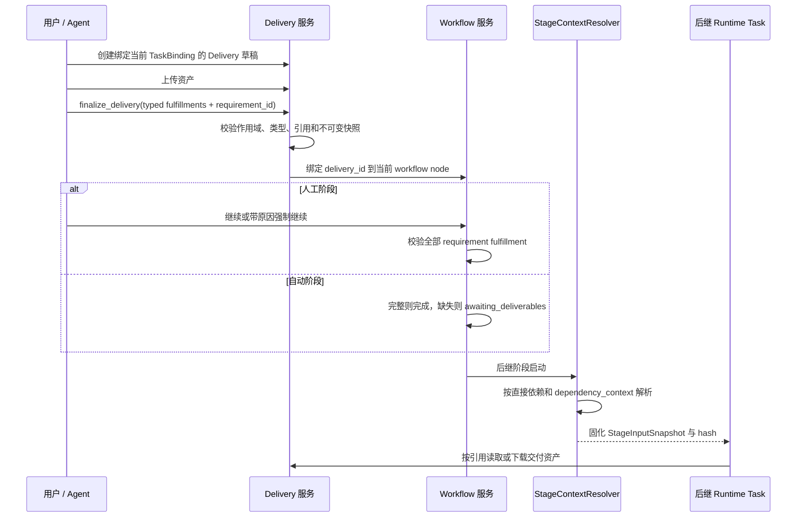

# 工作流阶段交付与依赖上下文

范围：结构化必要交付物、Delivery 履约、人工与自动阶段推进、代码证据，以及前序阶段上下文进入后继任务。

| 边 | 代码归属 |
| --- | --- |
| Workflow 定义 → 结构化要求 | Issue workflow schema、Wework workflow editor |
| TaskBinding → Delivery 履约 | Delivery service、Local ProjectSpace store |
| Delivery → 阶段推进门禁 | Workflow decision/projection service |
| Runtime 终态 → 最终结果与代码证据 | Runtime lifecycle projection、Executor file-change artifacts |
| 前序阶段 → 后继输入快照 | StageContextResolver、人工与自动任务启动入口 |
| 输入快照 → Agent 读取与下载 | `wework-space` MCP、本地与云端 Provider |

不变量：

- 每个交付要求必须有稳定 `requirement_id`、用户可编辑名称和确定的值类型；重命名或排序不得改变 ID。
- 值类型仅定义存储和确定性校验方式。系统不使用额外 AI 判断“图片是否是猫”等语义；人工阶段由继续操作人验收，自动阶段由原执行 Agent 自检。
- Delivery fulfillment 必须引用当前阶段快照中存在的 requirement；文件引用必须属于同一 Delivery 草稿，跨 Issue、跨阶段或伪造引用必须拒绝。
- `finalize_delivery` 的 MCP schema 必须完整暴露 typed fulfillments；存在必要交付物时，空 fulfillment 不得产生 `delivered` 快照。`Delivery.status=delivered` 只表示容器已固化，只有持久化的 `fulfillments[].requirement_id` 才计入阶段履约。
- 人工阶段进入 `awaiting_approval` 后仍可创建新的阶段任务，用于修正结果或补齐缺失 fulfillment；等待审批不得把当前阶段变成不可执行状态。
- Delivery 固化后不可修改。重复履约创建新 Delivery；当前值取最新有效履约，历史不得覆盖或删除。
- 人工阶段普通继续必须满足全部必要交付物；强制继续允许缺失，但必须记录非空原因。自动阶段缺失时进入 `awaiting_deliverables`，补齐后自动完成。
- `git_branch` 和 `pull_request` 要求本身只授权 AI 在其隔离工作区内执行相应远端写入；未声明时不得自动 push 或创建 PR/MR。PR/MR 默认创建 Draft。
- 代码交付必须可复现：优先使用可验证的远端 commit；否则固化 patch、变更清单与校验值；非 Git 工作区只打包变更文件并附删除清单，禁止打包密钥、依赖目录和构建产物。
- 后继任务只读取直接前置阶段。Issue 基础信息始终传递，其他内容严格按边上的 `final_result`、`deliveries`、`activity` 选择。
- 阶段输入在任务启动时固化并带 hash；任务执行期间不得因前序数据变化而漂移。本地、云端、人工和自动入口必须使用同一解析契约。
- Delivery 文件默认按引用传递，不得把二进制内联到 prompt。跨工作区代码恢复依次使用精确远端 commit、patch、非 Git 变更包；恢复失败必须阻止启动。
