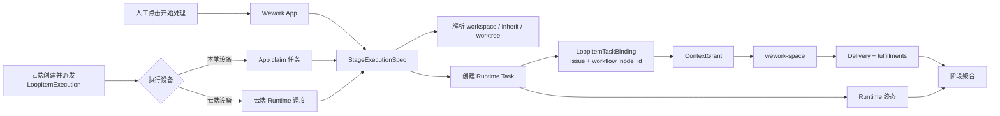
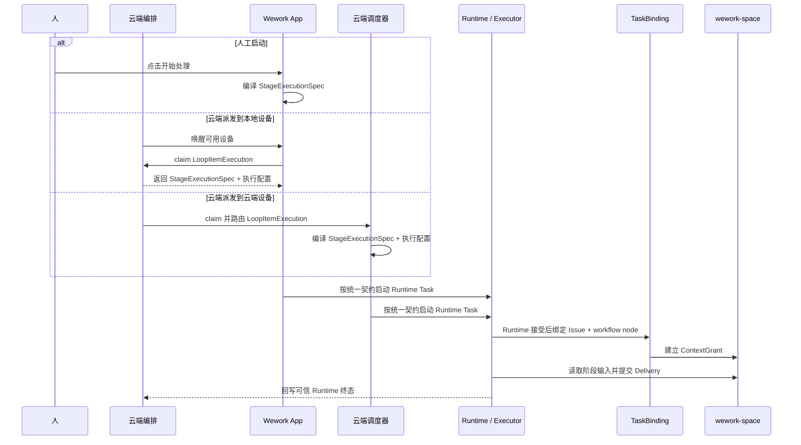

# 工作流阶段执行路由

范围：人工点击、云端自动派发、本地执行设备和云端执行设备如何汇合为同一个阶段任务执行契约。

| 边 | 代码归属 |
| --- | --- |
| Workflow node → `StageExecutionSpec` | Backend `workflow_stage_context.py`、Wework `workItemTaskInput.ts` |
| 云端排队 → 本地设备领取 | Backend `loop_item_executions`、Wework `localRobotQueueDispatcher.ts` |
| 云端排队 → 云端设备启动 | Backend robot queue dispatcher、Runtime execution dispatcher |
| Runtime 接受 → TaskBinding | Backend `loop_item_executions/service.py`、`loop_items/service.py` |
| Workspace policy → Runtime workspace | Wework Runtime work resolver、robot execution profile |
| TaskBinding → ContextGrant / Delivery | Executor project-space gateway、Delivery service |

不变量：

- 人工点击和云端派发只是启动来源；本地设备和云端设备只是执行位置。四种组合必须使用同一个 `StageExecutionSpec`。
- `StageExecutionSpec` 至少包含 Issue、目标 `workflow_node_id`、固化阶段输入及 hash、具体任务指令、必要交付物和 workspace policy。
- 机器人可追加角色提示词，并使用机器人配置的模型、设备、并发和权限；不得改变阶段指令、交付要求、依赖上下文、TaskBinding、ContextGrant 或状态聚合语义。
- Runtime 接受任务后、模型首轮开始前，必须存在绑定当前 Runtime 地址的 `LoopItemTaskBinding`。自动阶段不得绕过绑定。
- 人工和机器人必须使用相同 workspace policy。`inherit` 从明确前驱 TaskBinding 继承；`composer` 对人工使用用户选择，对机器人使用已配置项目；缺少确定来源时阻止启动。
- 阶段提示词和 Delivery 指令必须进入具体用户任务消息；结构化上下文用于确定性读取和校验，不能替代任务指令。
- Delivery 来源阶段只能由 ContextGrant 和 TaskBinding 推导，模型、启动来源和传输方式都不能指定或覆盖。
- 本地领取可以由 WebSocket 唤醒并通过 `claim` 获取载荷；这是云端派发的传输实现，不得形成另一套任务语义。
