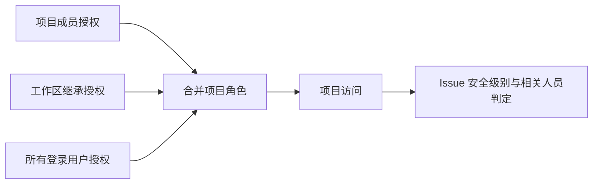

# 项目角色与 Issue 可见性

云端项目使用一套项目角色：Owner、Maintainer、Developer、Viewer。Owner 管理项目及成员；Maintainer 管理项目设置、成员、指派和 Issue 安全级别；Developer 创建和修改可见 Issue；Viewer 只读。创建者保留 Owner 权限。工作区成员通过已有项目关联获得 Viewer 权限；项目直接授权可提高权限。

项目的“私有”或“公开”由 `resource_members` 中的授权决定。公开项目向所有登录用户授予 Viewer 或 Developer；私有项目没有这条授权。项目成员、工作区继承授权和所有登录用户授权取最高角色。待审批、被拒绝或无效的授权不生效。已归档项目不可访问。

Issue 可见性与项目角色分别配置。项目设置提供新 Issue 的默认安全级别，单个 Issue 可设为“项目成员可见”（`open`）或“仅相关人员可见”（`related`）。Owner 和 Maintainer 可查看全部 Issue；其他角色只可查看 `open` Issue，或与自己相关的 `related` Issue。相关人员包括创建者、负责人、协作者、有效任务关联用户，以及被指派机器人的创建者。列表、详情、交付物、执行记录和项目会话使用同一判定；读取无关 Issue 返回 404。

钉钉多维表格记录由钉钉直接提供，其记录权限仍由钉钉控制；Wework 的项目角色控制表格入口和编辑操作，不对这些记录提供 Issue 安全级别。

项目列表和详情复用 `cloud_project_visibility.py`。列表批量读取授权、公开角色和父空间信息，非空列表执行三次查询。响应中的 `workspace_context` 仅包含父空间 ID、公开 ID 和名称；显示父空间名称不会授予空间设置、成员或其他私有项目的访问权限。

已有公开项目的数据迁移只更新现有 `resource_members` 和 Issue 元数据，不新增表或列。旧公开项目的 Issue 默认收紧为 `related`，避免迁移时扩大可见范围。
