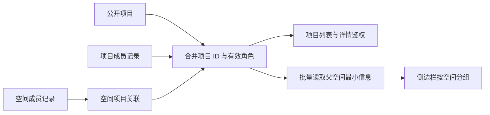

# 项目可见性与空间导航

项目可见性取以下集合的并集，并排除已归档项目：

- 公开项目。
- 当前用户直接参与的项目。
- 当前用户实际加入的有效空间下的项目。

创建者保留 Owner 权限。空间成员身份提供项目的基础 Reporter 角色，不授予项目管理权限；直接项目授权更高时保留该角色。Reporter 的操作权限遵循现有项目权限规则。待审批、被拒绝和非法角色的成员记录不能提供访问权限。

项目列表和单项目鉴权复用 `cloud_project_visibility.py`。项目列表批量计算权限及父空间信息，非空列表固定执行两次查询；单项目鉴权将项目 ID 条件下推到每个授权分支。空间列表批量读取角色和聚合数量，非空列表执行三次查询。

项目响应中的 `workspace_context` 只包含父空间的 ID、公开 ID 和名称。通过项目显示父空间名称，不会创建空间成员关系，也不允许读取空间设置、成员或其他无权访问的项目。自己加入的空空间仍然显示。

侧边栏根据空间成员列表和项目的父空间信息合并分组，以 Map 一次建立项目归属，不对每个空间重复扫描项目列表。打开项目时复用响应中的父空间信息。

本次实现不修改数据库表结构和索引，也不引入授权缓存。公开状态仍位于 JSON 中，公开项目查询的实际扫描成本需在 MySQL 上通过执行计划验证。列表沿用现有全量返回协议，尚未引入导航分页；查询次数固定不代表返回数据量固定。
