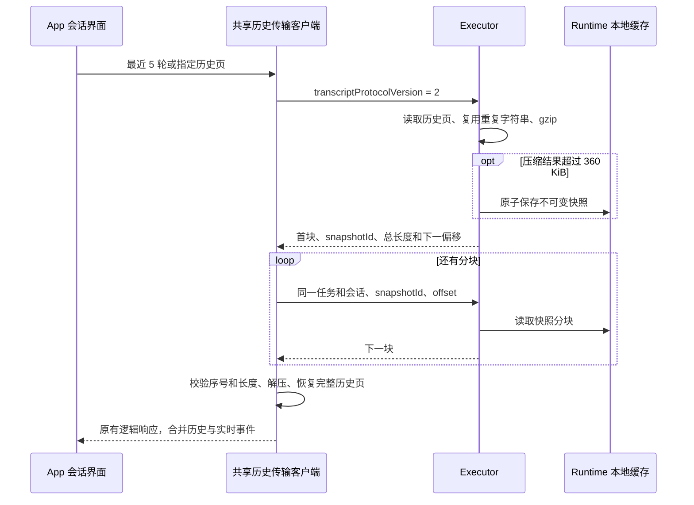

# Runtime 会话历史传输

长会话的历史文件仍在，并不代表历史可以通过单次 RPC 返回。云端 Runtime
响应上限为 980,000 字节；即使先 gzip 再 base64，大段工具输出仍可能超限。
协议 2 在现有 `runtime.tasks.transcript` 上增加无损分块，避免将传输失败显示成空会话。



## 协议和兼容

- 新客户端显式请求 `transcriptProtocolVersion: 2`。新 Executor 对省略版本或版本 1
  的请求保留原响应格式；未知版本明确失败。
- 旧 Executor 忽略新增请求字段时，新客户端接受其原始响应。旧版本的单次传输限制仍然存在；
  升级客户端和 Executor 后才具备完整分块能力。后端继续转发现有 RPC，不增加公共 API。
- 主会话界面默认请求最近 5 轮。Executor 对协议 2 的未指定页大小请求默认使用 5；
  显式 `limit` 仍遵守原有分页规则，保留导航和测试配置的语义。
- Codex 的 turn/item 游标、旧版本读取方式和实时合并逻辑保持原有语义。
  协议 2 对读取到的历史页使用完整工具内容投影；`fullContent: false` 仍表示仅加载了一页。
  导出请求 `includeFullContent: true`，不再静默截断到 500 轮。

每个响应包含 `success: true`、`transcriptProtocolVersion: 2` 和 `transfer`：

| 字段         | 含义                          |
| ------------ | ----------------------------- |
| `snapshotId` | 整个 gzip 快照的 SHA-256 标识 |
| `encoding`   | `gzip+base64+json`            |
| `offset`     | 本块在 gzip 字节流中的偏移    |
| `nextOffset` | 下一块偏移；完成时为 `null`   |
| `totalBytes` | 完整 gzip 快照的字节数        |
| `payload`    | 本块字节的 base64             |

继续读取时，在原请求上增加 `transcriptTransfer: { snapshotId, offset }`。
分块最大 360 KiB，连同 base64 和元信息低于 512 KiB，避免再触发外层 gzip
或达到云端 980,000 字节的限制。分块边界可以跨过 UTF-8 字符；客户端收齐后才解压解析。

gzip 内部为 `{ transcript, strings, references }`。长度至少 1,024 字节的字符串存入
共享字符串表；原字段以 `null` 占位，由 `references` 中的显式路径和索引恢复。
此结构消除同一工具输出在消息、运行事件和轮次中的重复传输，不删减逻辑字段或内容。
客户端校验快照标识一致、偏移连续和最终长度，并由 gzip 校验内容完整性；
不会将尚未收齐的消息提交给会话状态。

## 缓存和失败处理

多块快照位于 Runtime 索引同级的
`runtime-work/transcript-transfers/<任务与会话地址的 SHA-256>/<snapshotId>.gz`。
缓存绑定任务与请求的会话；未显式指定会话时，使用读取完成后的任务关联会话。
快照原子写入，后续读取不依赖进程内状态。Executor 重启后，只要地址未改变且快照未过期，
仍可继续读取。单块结果不写磁盘。

快照有效期为 24 小时，过期快照在后续协议 2 历史读取时清理。
过期、跨会话读取、错误偏移、磁盘读写失败或损坏数据均明确失败，需重新加载历史。
主会话界面展示错误和“重新加载”按钮；已显示的消息保留。
RPC 完成日志在外层响应编码后记录，编码超限不会再被记录为成功。

分块解决传输上限，不保证无限历史的内存和耗时上限：当前 rollout 读取在阻塞工作线程
逐行解析，但仍需扫描文件并保留解析后的轮次再分页；单轮极大输出和完整导出仍可能占用较多内存。
24 小时缓存采用时间清理，没有额外磁盘容量配额。协议没有改写原始历史文件。

## 回归验证

| 场景                                | 预期                                             |
| ----------------------------------- | ------------------------------------------------ |
| 新旧客户端与 Executor 混用          | 旧响应可读，新协议只对显式请求启用，未知版本失败 |
| 高熵大输出、中文、emoji、结构化结果 | 多块传输，逐字段还原，单包低于阈值               |
| 错序、缺块、换快照、gzip 损坏、过期 | 明确失败，不发布半页内容                         |
| 换任务或会话请求已有快照            | 无法读取其他地址的快照                           |
| 超过 500 轮                         | 完整导出不截断，最近页和向前翻页连续             |
| 历史加载失败                        | 主界面显示错误，点击重载可再次读取               |

自动化覆盖在 Rust `transcript_transport` / `codex_transcript_page`、共享 TypeScript
传输客户端、桌面 IPC 和会话组件测试中。已注册的桌面
`running-conversation-history` 检查点加入高熵大工具输出，验证重启恢复、完整工具历史
和多块快照内容，沿用现有 CI 入口。E2E 与 `ai:verify` 仅在明确要求时运行。

### 真实历史文件验证（2026-10-09）

本地使用一份 77,796,060 字节、4,326 行的真实 rollout 验证生产代码链路：
解析出 19 轮、1,173 个完成事件，4 个历史页的轮次与完整读取一致，没有遗漏或重复。
Rust 实际响应构建与分块结果交给共享 TypeScript 客户端还原，全部 6 组响应逐字段一致。

| 请求        | 原单包 gzip/base64 响应大小 | 新协议块数 | 最大分块响应大小 |
| ----------- | --------------------------: | ---------: | ---------------: |
| 最近 5 轮   |                270,575 字节 |          1 |     116,038 字节 |
| 前一页 5 轮 |              3,149,525 字节 |          3 |     491,758 字节 |
| 全部 19 轮  |              4,262,662 字节 |          4 |     491,760 字节 |

大小包含协议响应字段。超过 980,000 字节的原单包说明仅减少轮次数仍不足以避免超限。
这轮离线验证覆盖本地解析、响应投影、磁盘快照续读和跨语言解码。
随后在隔离的真实 Electron App 中导入同一文件，确认历史按 5 → 10 → 15 → 19 轮
加载，共显示 38 条用户/助手消息，没有历史加载错误；刷新窗口后可重新加载全部历史，
重启 Runtime 后可恢复最近 5 轮。未验证真实云端连接，未运行完整 E2E 套件。
私有历史和临时测试入口不加入仓库。

### 在本机 App 中验收真实 JSONL

在仓库根目录运行现有的隔离验证入口：

```bash
pnpm --filter wework ai:verify start --rollout /absolute/path/to/rollout.jsonl --timeout 180000
```

启动命令编译当前 App 和 Executor，把历史复制到独立的测试目录，建立
“Rollout replay”项目和会话映射。仅副本的初始工作区元信息改为隔离目录，历史记录
保持原字节，原文件不变。它不会自动发送对话或执行历史里的命令。
不能与首次迁移测试参数 `--codex-home-initialization true` 或复用目录参数
`--executor-home` 同时使用。

在测试窗口打开 **Rollout replay** 项目中的会话，检查以下行为：

1. 首屏出现最近的历史，不显示新会话空白页或加载错误。
2. 连续向上加载更早历史，尤其检查前一页的大工具结果。此案例应覆盖全部 19 轮。
3. 切换会话或刷新窗口后重新打开，确认历史仍可恢复。
4. 在终端重启隔离 Runtime，再确认历史可读；命令中的路径使用启动输出的 `session`。

```bash
pnpm --filter wework ai:verify reload --session /path/from/start/session.json
pnpm --filter wework ai:verify restart-core-dsh --session /path/from/start/session.json
pnpm --filter wework ai:verify stop --session /path/from/start/session.json
```

最后一条命令用于结束测试。日志在该 `session.json` 同级目录；多块快照位于
`executor-home/runtime-work/transcript-transfers/`。本机验收覆盖界面和真实本地 IPC；
云端 Socket.IO 链路仍需使用测试云设备另行验收。
