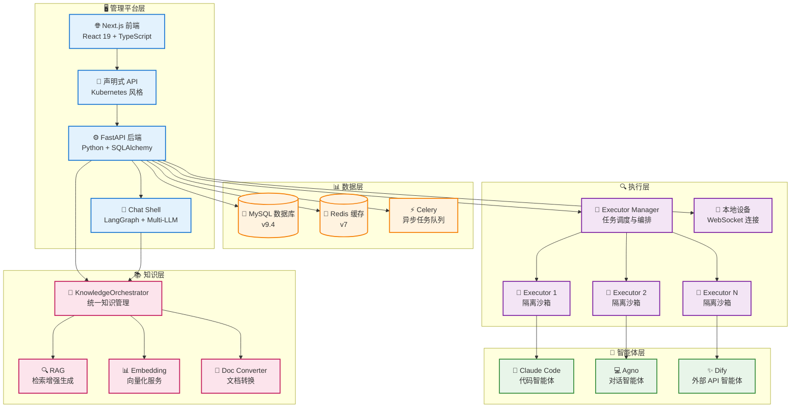
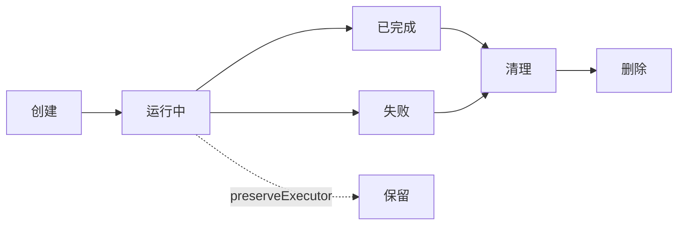
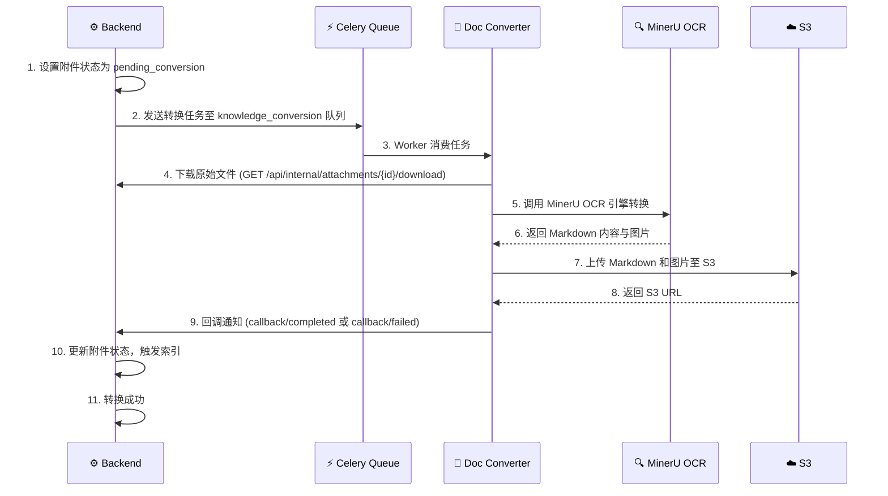
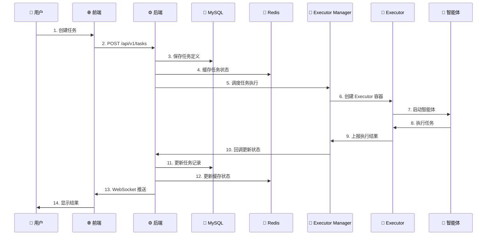
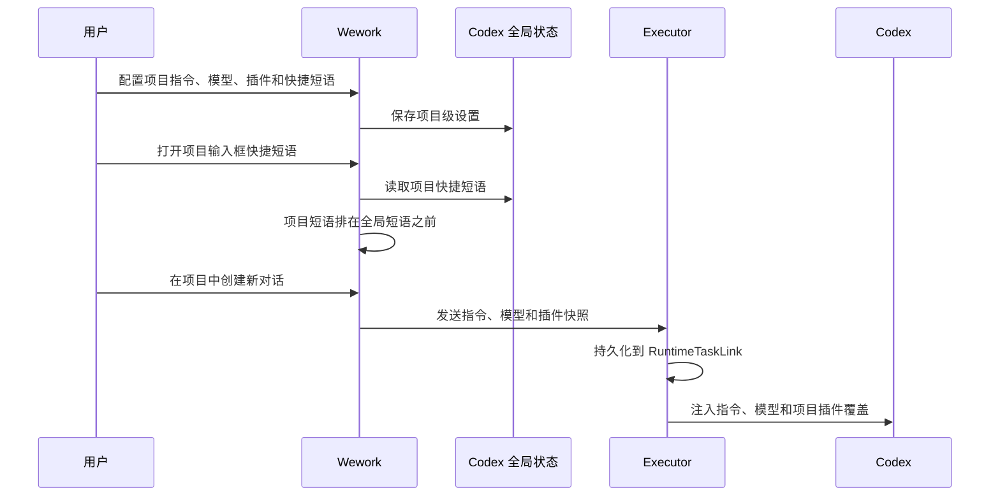

# 🏗️ 系统架构

本文档详细介绍 Wegent 平台的系统架构、组件设计和技术栈。

---

## 📋 目录

- [架构概览](#架构概览)
- [核心组件](#核心组件)
- [数据流与通信模式](#数据流与通信模式)
- [技术栈](#技术栈)
- [设计原则](#设计原则)
- [扩展性与部署](#扩展性与部署)

---

## 🌐 架构概览

Wegent 采用现代化的分层架构设计，基于 Kubernetes 风格的声明式 API 和 CRD (Custom Resource Definition) 设计模式，提供了一套标准化的框架来创建和管理 AI 智能体生态系统。

### 系统架构图



### 架构层次说明

| 层次           | 职责                                           | 核心技术                                        |
| -------------- | ---------------------------------------------- | ----------------------------------------------- |
| **管理平台层** | 用户交互、资源管理、API 服务、对话处理         | Next.js 15, FastAPI, React 19, Chat Shell       |
| **数据层**     | 数据持久化、缓存管理、异步任务调度             | MySQL 9.4, Redis 7, Celery                      |
| **执行层**     | 任务调度、容器编排、资源隔离、本地设备管理     | Docker, Rust Executor, WebSocket, App IPC       |
| **智能体层**   | AI 能力提供、代码执行、对话处理、外部 API 集成 | Claude Code, Agno, Dify                         |
| **知识层**     | 知识库管理、RAG 检索、向量化服务、文档格式转换 | KnowledgeOrchestrator, Embedding, Doc Converter |

---

## 🔧 核心组件

### 1. 🌐 前端 (Frontend)

**职责**：

- 提供用户界面，支持资源定义和管理
- 实现任务创建、监控和结果展示
- 提供实时交互和状态更新
- 管理本地设备和执行器

**技术栈**：

- **框架**: Next.js 15 (App Router)
- **UI 库**: React 19, shadcn/ui
- **样式**: Tailwind CSS 3.4
- **状态管理**: React Context + Hooks
- **国际化**: i18next 25.5
- **图标**: Heroicons, Tabler Icons, Lucide React

**核心特性**：

- 🎨 配置驱动的 UI，支持 YAML 可视化编辑
- 🔄 实时任务状态更新（WebSocket）
- 🌍 多语言支持（中文/英文）
- 📱 响应式设计（移动端/桌面端组件分离）
- 📱 本地设备管理界面
- 💭 思考过程可视化

**关键文件结构**：

```
frontend/src/
├── app/              # Next.js App Router
│   ├── (tasks)/     # 任务相关页面
│   ├── (settings)/  # 设置相关页面
│   └── admin/       # 管理员页面
├── features/        # 功能模块
│   ├── admin/       # 管理后台
│   ├── devices/     # 设备管理（新）
│   ├── feed/        # 发现与订阅
│   ├── knowledge/   # 知识库管理
│   ├── settings/    # 代理配置
│   └── tasks/       # 任务核心功能
├── components/      # 通用组件
│   ├── ui/          # shadcn/ui 基础组件
│   └── common/      # 业务通用组件
└── hooks/           # 自定义 Hooks
```

**功能模块**：

| 模块          | 用途                          |
| ------------- | ----------------------------- |
| **tasks**     | 任务创建、聊天、群聊、工作台  |
| **devices**   | 本地设备管理、执行器指南      |
| **knowledge** | 知识库、文档、权限管理        |
| **settings**  | 智能体、模型、Shell、技能配置 |
| **feed**      | 订阅市场、触发器管理          |

---

### 2. ⚙️ 后端 (Backend)

**职责**：

- 实现声明式 API，处理资源 CRUD 操作
- 管理用户认证和授权
- 协调执行层进行任务调度
- 提供 WebSocket 支持实时聊天通信（Socket.IO）
- 统一知识管理（KnowledgeOrchestrator）
- 管理本地设备连接

**技术栈**：

- **框架**: FastAPI 0.68+
- **ORM**: SQLAlchemy 2.0
- **数据库驱动**: PyMySQL
- **认证**: JWT (PyJWT), OAuth (Authlib), OIDC
- **异步支持**: asyncio, aiohttp
- **缓存**: Redis 客户端
- **实时通信**: Socket.IO (python-socketio) 配合 Redis 适配器
- **异步任务**: Celery

**核心特性**：

- 🚀 高性能异步 API
- 🔒 基于 JWT 的认证机制
- 📝 完整的 CRUD 操作支持
- 🔄 实时状态同步
- 🛡️ 数据加密（AES-256-CBC）
- 👥 基于角色的访问控制（管理员/普通用户）
- 🎼 统一知识管理（KnowledgeOrchestrator）
- 📱 本地设备管理（Device Provider）

**API 设计**：

```
/api/v1/
├── /ghosts          # Ghost 资源管理
├── /models          # Model 资源管理
├── /shells          # Shell 资源管理
├── /bots            # Bot 资源管理
├── /teams           # Team 资源管理
├── /workspaces      # Workspace 资源管理
├── /tasks           # Task 资源管理
├── /devices         # Device 设备管理（新）
├── /knowledge       # 知识库管理
├── /groups          # 组织/组管理
├── /share           # 分享链接管理
└── /admin           # 管理员操作（用户管理、公共模型）
```

**服务层架构**：

| 服务                      | 职责                                    |
| ------------------------- | --------------------------------------- |
| **KindService**           | CRD 资源统一管理                        |
| **KnowledgeOrchestrator** | 知识管理统一入口（REST API + MCP 工具） |
| **DeviceService**         | 本地设备管理                            |
| **ChatService**           | 聊天处理和 RAG                          |
| **SubtaskService**        | 子任务管理                              |
| **GroupService**          | 多租户分组管理                          |
| **UserService**           | 用户管理                                |

**关键依赖**：

```python
FastAPI >= 0.68.0      # Web 框架
SQLAlchemy >= 2.0.28   # ORM
PyJWT >= 2.8.0         # JWT 认证
Redis >= 4.5.0         # 缓存
httpx >= 0.19.0        # HTTP 客户端
python-socketio >= 5.0 # Socket.IO 服务端
celery >= 5.0          # 异步任务
```

---

### 3. 💬 Chat Shell（对话引擎）

**职责**：

- 提供轻量级 AI 对话引擎
- 支持多种 LLM 模型（Anthropic、OpenAI、Google）
- 管理对话上下文和会话存储
- 集成 MCP 工具和技能系统
- 支持知识库检索增强（RAG）

**技术栈**：

- **框架**: FastAPI
- **代理框架**: LangGraph + LangChain
- **LLM**: Anthropic, OpenAI, Google Gemini
- **存储**: SQLite, Remote API
- **可观测性**: OpenTelemetry

**三种部署模式**：

| 模式        | 描述                          | 使用场景 |
| ----------- | ----------------------------- | -------- |
| **HTTP**    | 独立 HTTP 服务 `/v1/response` | 生产环境 |
| **Package** | Python 包，被 Backend 导入    | 单体部署 |
| **CLI**     | 命令行交互界面                | 开发测试 |

**核心特性**：

- 🤖 多 LLM 支持（Anthropic、OpenAI、Google）
- 🛠️ MCP 工具集成（Model Context Protocol）
- 📚 技能动态加载
- 💾 多存储后端（SQLite、Remote）
- 📊 消息压缩（超出上下文限制时自动压缩）
- 📈 OpenTelemetry 集成

**模块结构**：

```
chat_shell/chat_shell/
├── main.py           # FastAPI 应用入口
├── agent.py          # ChatAgent 代理创建
├── interface.py      # 统一接口定义
├── agents/           # LangGraph 代理构建
├── api/              # REST API 端点
│   └── v1/          # V1 版本 API
├── services/         # 业务逻辑层
│   ├── chat_service.py
│   └── streaming/   # 流式响应
├── tools/            # 工具系统
│   ├── builtin/     # 内置工具（WebSearch 等）
│   ├── mcp/         # MCP 工具集成
│   └── sandbox/     # 沙箱执行环境
├── storage/          # 会话存储
│   ├── sqlite/      # SQLite 存储
│   └── remote/      # 远程存储
├── models/           # LLM 模型工厂
├── messages/         # 消息处理
├── compression/      # 上下文压缩
└── skills/           # 技能加载
```

---

### 4. 💯 Executor Manager (执行管理器)

**职责**：

- 管理 Executor 生命周期
- 任务队列和调度
- 资源分配和限流
- 回调处理
- 支持多种部署模式

**技术栈**：

- **语言**: Python
- **容器管理**: Docker SDK
- **网络**: Docker 网络桥接
- **调度**: APScheduler

**部署模式**：

| 模式             | 描述                         | 使用场景 |
| ---------------- | ---------------------------- | -------- |
| **Docker**       | 使用 Docker SDK 管理本地容器 | 标准部署 |
| **Local Device** | 连接本地设备执行             | 开发环境 |

**核心特性**：

- 🎯 最大并发任务数控制（默认 5）
- 🔧 动态端口分配（10001-10100）
- 🐳 Docker 容器编排
- 📊 任务状态追踪
- 📱 本地设备支持

**配置参数**：

```yaml
MAX_CONCURRENT_TASKS: 5 # 最大并发任务数
EXECUTOR_PORT_RANGE_MIN: 10001 # 端口范围起始
EXECUTOR_PORT_RANGE_MAX: 10100 # 端口范围结束
NETWORK: wegent-network # Docker 网络
EXECUTOR_IMAGE: wegent-executor:latest # 执行器镜像
```

---

### 5. 🚀 Executor (执行器)

**职责**：

- 提供隔离的沙箱环境
- 执行智能体任务
- 管理工作空间和代码仓库
- 上报执行结果

**技术栈**：

- **容器**: Docker
- **执行器**: Rust (`executor/`)
- **运行时**: Claude Code, Agno, Dify
- **版本控制**: Git

**Agent 类型**：

| Agent              | 类型         | 说明                                 |
| ------------------ | ------------ | ------------------------------------ |
| **ClaudeCode**     | local_engine | Claude Code SDK，支持 Git、MCP、技能 |
| **Agno**           | local_engine | 多代理协作，SQLite 会话管理          |
| **Dify**           | external_api | 代理到 Dify 平台                     |
| **ImageValidator** | validator    | 自定义基础镜像验证                   |

Rust executor 是唯一的 executor 运行时实现。Backend 的 Chat shell 仍可走进程内路径，其他任务由 standalone/local executor 执行；Wework 打包 App 的 local-first 模式不启动本地 Backend，而是通过 Electron IPC 直接调用 executor。Codex 运行时通过 `codex app-server --stdio` 的 JSON-RPC 协议创建、继续、读取、归档和重命名线程，executor 只保存必要的本地任务索引和 `localTaskId -> threadId` 关联。

Executor 准备 Git 工作区时会禁用交互式凭据提示，并同时使用总超时和 Git HTTP low-speed 限制。`WEGENT_GIT_CLONE_TIMEOUT_SECONDS` 控制总超时，默认 600 秒并限制在 1-3600 秒；`WEGENT_GIT_HTTP_LOW_SPEED_LIMIT` 和 `WEGENT_GIT_HTTP_LOW_SPEED_TIME_SECONDS` 默认分别为 1024 字节/秒和 60 秒。总超时后会终止 Git 所在的整个进程组、清理本次 clone 的半成品目录，并向任务返回终态错误；已有工作区也必须通过本地 `HEAD` 校验，避免把中断 clone 留下的 `.git` 目录误判为可用仓库。该流程不会自动重试。

Claude Code 恢复交互表单会话时，executor 只把与本次已回答表单具有相同 `tool_use_id`、且工具类型仍为交互表单的 defer 视为恢复阶段残留结果。模型随后返回不同 `tool_use_id` 的表单表示新的用户澄清，即使同一响应还包含文本，也必须继续代理到交互 MCP 并等待用户输入，不能按旧 defer 丢弃。

附件在进入 Codex 前由 executor 按类型转换：图片作为本地图片输入，文本附件附带受限预览和完整本地路径，ZIP、PDF 等二进制附件则附带文件名、MIME 类型、大小和本地路径。即使用户只发送附件而正文为空，Codex 仍能从输入上下文定位该文件；不同类型的上下文互斥生成，避免图片或文本附件被重复注入。

图片转换可能生成仅供模型读取的临时 `*.model-input.*` 文件，但该路径不能作为 Wework 消息附件的持久化地址。renderer 创建的 `blob:` URL 也只在当前页面生命周期内有效；只要附件已有 `local_path`，executor 写入本地 runtime handle 和恢复 transcript 时都必须用该路径规范化 `local_preview_url`，不能持久化 `blob:` URL。executor 从 Codex transcript 恢复用户消息时，优先使用文件提及上下文或本地 runtime handle 中保留的原始附件路径；临时模型输入仅用于推理阶段。这样临时文件清理、页面刷新后，历史消息、任务切换和重开任务仍能显示原始图片预览。

Codex transcript 分页必须保持严格的页边界。本地 runtime handle 中用于补齐附件、引用或 supervisor 输入的用户消息 presentation，只有在 client message ID 已命中当前页，或其 turn ID / 创建时间属于当前页范围时，才能合入该页；不能因为 `ensureVisible` 就把新页消息重复注入旧页。Wework 在请求更早页或补齐中间缺口前记录当前 `scrollHeight` 和距底部距离，临时关闭浏览器原生滚动锚定，并在分页内容完成布局后恢复同一距底部位置。这样旧消息 prepend、虚拟列表重测量和底部 sticky composer 共享一个确定的滚动事务，不会产生消息重复或输入框随内容漂移。

Codex 运行时在 `executor/src/agents/codex/` 下按职责拆分：`home` 管理隔离的 Codex Home、认证链接和配置归一化，`interaction` 路由用户输入与 MCP 交互响应，`run_state` 将 app-server 事件归约为轮次结果，`diagnostics` 负责日志裁剪与敏感输出摘要，`tests` 保存模块级回归测试。`codex.rs` 保留对外 API、共享 app-server 生命周期和轮次编排。新增行为应进入对应职责模块，避免把配置、协议状态和诊断逻辑重新耦合到编排层。

Codex agent message 的实时文本必须按显式 phase 分类：只有 `final` 或 `final_answer` 才能进入最终回答，`analysis`、`commentary` 以及缺失 phase 的文本都先进入 processing。缺失 phase 的文本可能出现在工具调用前后，不能因为默认值而触发 Wework 的 final-processing 折叠；轮次结束时，executor 使用明确的 final 文本，若模型始终没有发送 phase，则使用最后一段未标 phase 的文本作为终态回答。转录恢复沿用同一规则，并根据后续是否存在工具或其他过程项判断未标文本属于 processing 还是 final。

Wework 的内置浏览器 MCP 由 Rust executor 的 `browser-mcp-server` 子命令提供，并通过每个 Electron 实例独立分配的本地桥接地址控制右侧浏览器。打包 App 无需安装 Node.js 或单独部署 browser MCP server，多实例也不会共享固定端口。

项目空间的 `wework_space` MCP 由 Wework 启动的 Rust executor 通过动态 loopback 端口常驻提供。Codex 只接收该实例的 URL、实例凭证和可选 ContextGrant，不再启动 `space-mcp-server` stdio 子进程。普通会话保持未绑定；项目或 Issue 会话通过 ContextGrant 获得默认 `space_id/item_id` 与越界保护。

Wework 的 Codex 自定义指令配置只持久化用户输入；内置浏览器路由规则不写入该字段。executor 在每次创建、继续或 fork Codex 线程前，将用户自定义指令、任务级系统指令和内置浏览器规则组合为该线程的 `developerInstructions` 请求参数。配置归一化会移除历史版本遗留的全部浏览器规则，避免设置页显示重复内容，同时新线程仍始终获得浏览器工具的使用约束。

Codex 使用共享 app-server 线程时，取消活动轮次必须先等待 `turn/interrupt` 的确认，再向调用方报告已取消。`turn/start` 返回后到首个轮次进度事件到达前，app-server 的活动轮次索引可能尚未完成注册；executor 在这个启动窗口必须发送空 `turnId` 的线程级启动中断，收到首个进度事件后再使用具体 turn ID。这样停止操作不会遗漏刚启动的轮次，重试也只会在前一轮真正停止后创建，避免上一轮的中断和新轮请求交错，从而恢复已取消的输入或丢失重试消息。

Codex 失败轮次不保证在线程 transcript 中生成 assistant item。executor 因此会在轮次失败时，将带稳定消息 ID、错误类型和原始错误文本的 failed assistant message 写入本地 runtime handle；读取失败任务时，如果 Codex transcript 缺少该消息，再按稳定 ID 合并本地记录。Wework 重开或切回任务后仍能恢复错误卡片及重试入口，同时避免重复展示 Codex 已经持久化的失败消息。

Wework 的本地模型调用统一以 Codex Responses 协议进入 executor。executor 为自定义模型生成显式 model catalog，并按 `custom`、`function`、`shell` 工具模式决定是否发布 freeform `apply_patch`。原生 Responses 接口由本地模型代理直接转发；OpenAI Chat Completions 和 Anthropic Messages 接口由独立协议模块转换请求、流式事件、推理内容、工具调用、工具结果和用量信息，custom tool 的 grammar 会保存在 function wrapper 中。Anthropic Messages 的总输入用量必须包含 `input_tokens`、`cache_read_input_tokens` 和 `cache_creation_input_tokens`；缓存读取量同时映射为 Responses 的 cached token 明细，确保 Codex 的上下文余量和自动压缩判断使用完整输入量。代理使用有界历史恢复跨请求工具调用，透传非 2xx，并把非 SSE 成功响应转换为标准 Responses SSE；传输截断或上游错误流会产生失败终态，上游明确返回输出长度限制时则产生 `response.incomplete`。云端 Model 的 `context_window` 和 `max_output_tokens` 会沿 Wework 执行请求传入 Codex 与本地模型代理；请求中的显式输出限制优先于模型配置，模型配置优先于默认值。原生 Responses 直通只会在显式配置时转发 `max_output_tokens`；Chat Completions 和 Anthropic Messages 转换在未配置限制时使用 96000 tokens 的代理默认值。未配置时，Codex 上下文窗口仍默认为 256K（262144 tokens）。代理只转发固定白名单内的 Codex 请求头，包括 `originator`、`session-id`、`thread-id` 和轮次元数据，绝不转发 authorization、cookie 或 attestation 头。API Key、附加请求头和出站代理配置只保留在 executor 的本地代理边界，不传入 Codex 进程。代理注册按完整上游配置生成稳定 token、引用计数并在空闲超时后清理，避免 persistent Codex 会话在追问时命中已释放 token。

Codex model catalog 中的 `supports_search_tool` 表示模型可以参与 App 延迟发现流程，不等同于上游接口原生支持 `tool_search` 或 namespace tool。Wework 对官方和自定义模型启用该 catalog 能力，使 Codex 在首轮请求中仅提供轻量 `tool_search`，而不是注入全部 Remote App Schema；搜索命中后才加载对应 App namespace。executor 在协议边界单独维护 `native_tool_search` 和 `native_namespace_tools`：支持原生工具搜索的 GPT 5.4+ Responses 云模型会直接透传。模型配置可以通过 `native_tool_search` 或 `nativeToolSearch` 以及 `native_namespace_tools` 或 `nativeNamespaceTools` 覆盖推断结果；显式配置 `false` 会关闭对应的自动推断。其他 Responses、Chat Completions 和 Anthropic Messages 上游会把 `tool_search` 与 namespace tool 转为普通 function 调用，并在返回 Codex 前恢复原始语义。第三方 Responses 兼容桥接在转换 tool-search 调用和输出 item 时，会移除其类型专属的 `id`，仅使用 `call_id` 关联调用与结果；原生 Responses 直通会保留原始 item 字段。因此 DeepSeek、Kimi 等第三方模型无需原生实现 Codex 专用工具，也能按需使用 App，同时普通消息不会承担完整 App 工具目录的上下文成本。

文本模型可显式引用一个声明图片输入能力的视觉 sidecar。对于本地模型，该引用来自 Wework 本机模型配置；对于云端 Model CRD，该引用由 Wegent Web 写入 `modelConfig.visionSidecarModel`，Wework 只解析 Backend 聚合模型中携带的模型身份和协议，不编辑云端配置，也不会按登录态或模型名称自动选择默认值。Codex 仍按带图片的 Responses 请求工作，但 executor 会在协议转换和发送主请求前调用 sidecar，把每个 `input_image` 原位替换为受限长度的文字描述。配置 sidecar 后，executor 从当前基础 catalog 通用派生一个只增加图片输入能力的隐藏 catalog，完整保留原模型的推理、工具、上下文和压缩能力；新增模型无需再增加 sidecar 专用映射或复制 catalog。未配置 sidecar 的模型保持原始纯文本 catalog，不执行额外视觉调用。原始图片不会发送给文本主模型。sidecar 支持 Responses、Chat Completions 和 Anthropic Messages，上游密钥仍只保留在 executor 中。实现使用有界 LRU 描述缓存、进程级并发限制、单轮图片数量和内嵌数据大小限制；超时、非法图片或上游失败会生成明确的失败描述并移除原始图片，同时日志只记录协议、计数、缓存命中和耗时等聚合诊断字段。

#### 任务监督与运行时就绪

Wework 允许用户在发送首条消息前配置任务监督。该配置作为 `RuntimeTaskCreateRequest.initialSupervisor` 随任务创建请求传入 executor，并在创建任务、写入 runtime 索引之前原子保存；不要在任务地址尚未生成时调用独立的监督设置接口，否则会产生 `thread_id=none` 或 `session_id=none` 的无效状态，并可能被后续任务写入覆盖。

监督评估器只能在 runtime session 已经建立后启动。任务创建和 Codex session 建立之间的窗口属于正常初始化状态，executor 应等待 session 就绪，而不是将其报告为监督异常。任务创建完成后，Wework 清除输入区的待生效提示，并从任务状态与右侧信息面板展示已启用的监督状态。

监督评估是无状态模型判断，不是 Codex 编码任务。Wework 只允许为监督器选择 Backend 可解析完整资源身份的云端 Model，并把 `modelSelection` 持久化到本地任务状态；executor 通过认证后的 `/api/model-runtime/responses` 调用模型，Backend 负责解析 Model CRD 与上游凭据。该路径不得创建 Codex thread、启动临时 app-server turn，或加载 MCP、skill 与工具。评估失败时，executor 按监督间隔重试；调度器不得因缺少成功内容哈希而每个 tick 立即重试，否则上游异常会被放大为进程与请求风暴。

监督状态的下次巡检时间由 `lastEvaluatedAt + intervalSeconds` 推导，不额外持久化可漂移的派生字段。用户通过 `runtime.tasks.supervisor.run_now` 请求立即巡检时，executor 必须复用同一并发互斥机制，并强制重新评估当前可见进展，即使内容哈希与上次相同也不能按定时巡检的去重规则跳过。监督模型列表仍只包含具备完整资源身份的云端 Model，但不得使用当前编码任务的 runtime 兼容性标记隐藏这些独立评估模型。

Wework 的任务运行态按 turn 身份结算，而不是仅按 task 粗粒度结算。流式开始事件使用的临时 subtask ID 可能在终态事件中被 provider 替换为 canonical turn ID；事件适配层必须把两者关联后，将原始开始 ID 传给生命周期状态机。executor 在 execution 所有权切换时同步内存运行态，旧 execution 完成时不得覆盖替代它的新 execution。App IPC、本地后端与监督调度器必须在启动后台任务前注入同一个 runtime handler；禁止先启动带调度器的默认 handler 再替换，否则孤儿调度器发起的自动纠正对任务列表不可见。重复或迟到的旧 turn 终态必须幂等忽略，不能清除已经开始的新 turn，否则侧栏会在监督自动纠正仍在运行时错误显示为空闲。

Codex provider 的 turn 终态是执行事实，也是本地运行态收敛的权威依据。停止或“立即发送”发现 provider 已终态时，executor 必须先结算对应的本地 execution，再继续用户操作；本地停止确认超时只表示清理确认未及时返回，不能向用户返回失败或永久保留 `running`。executor 会强制把当前 execution 结算为已取消，并通过 `cleanupPending` 保留后台清理诊断。所有 Codex 通知、转录写入和终态事件都必须携带并校验 execution generation；旧 generation 的迟到结果不得写入任务、发送终态事件或触发队列继续执行。

Worktree 的 `executionLease` 是多实例之间共享的执行证据，不是任务运行状态本身。另一个实例或启动重协调可能先清除同一 execution 的 lease，因此当前 generation 完成时发现 lease 已不存在必须视为幂等成功；只有 lease 明确属于不同 execution 时才是所有权冲突。内存中的 active execution、provider turn 事实和共享 lease 必须按上述规则共同收敛，不能因为共享文件中已经没有 lease 就让原实例永久保持运行中。

Codex fork 会重建父线程的历史请求。`reasoning`、`compaction`、`compaction_summary`、`context_compaction` 和 `agent_message` 中的 `encrypted_content` 是绑定实际上游加密上下文的非便携状态；即使逻辑模型和路由名称不变，模型网关背后的凭据或项目上下文也可能无法验证父线程生成的密文。executor 通过 Codex 的 fork 元数据识别这类请求，仅在 fork 边界递归移除上述历史条目中的 `encrypted_content`，同时保留消息、工具调用、工具结果和 reasoning summary。普通继续对话不会执行该清理，也不会通过重试、fallback 或模型切换掩盖上游错误。

云端模型执行会把 Model spec 中的 `modelConfig.env.model_id` 作为独立的 Codex catalog model id 传给 executor。若该 id 与 Codex 官方 catalog 中的模型匹配，Codex 会继承其完整能力元数据和基础指令；模型网关仍使用资源名定位云端 Model CRD，因此 catalog 映射不会改变上游路由。

`apply_patch` 不是模型服务或系统 shell 自动提供的命令。只有 `custom` 或 `function` 工具模式生成的 Codex model catalog 才会让 Codex 在模型请求中发布该工具；直接调用 Responses API 时，调用方也必须在 `tools` 中提供相应的 custom tool 定义和 grammar。`shell` 模式不会发布它。补丁执行失败后，本地模型代理保留原始校验错误，并按错误类型补充 grammar 解释、正确的 Update/Add File 示例和重新调用要求；原生 Responses、Chat Completions 与 Anthropic Messages 转换必须保持同一纠错语义，成功结果不得追加提示。

**核心特性**：

- 🔒 完全隔离的执行环境
- 💼 独立的工作空间
- 🔄 自动清理机制（可通过 `preserveExecutor` 保留）
- 📝 实时日志输出
- 🛠️ MCP 工具支持
- 📚 技能动态加载
- 🪝 [预执行钩子](./pre-execute-hooks.md) 支持任务启动前自定义初始化

**生命周期**：



---

### 6. 💾 数据库 (MySQL)

**职责**：

- 持久化存储所有资源定义
- 管理用户数据和认证信息
- 记录任务执行历史

**版本**: MySQL 9.4

**核心表结构**：

```
wegent_db/
├── kinds            # CRD 资源（Ghost, Model, Shell, Bot, Team, Skill, Device）
├── tasks            # Task 和 Workspace 资源（独立表）
├── skill_binaries   # 技能二进制包
├── users            # 用户信息（含角色字段）
├── groups           # 组织/组
├── namespace_members # 命名空间成员
├── knowledge_bases  # 知识库
├── documents        # 文档
└── public_models    # 系统级公共模型
```

**数据模型特点**：

- 使用 SQLAlchemy ORM
- 支持事务和关联查询
- 自动时间戳管理
- 软删除支持
- CRD 资源通过 (namespace, name, user_id) 三元组唯一标识

---

### 7. 🔴 缓存 (Redis)

**职责**：

- 任务状态缓存
- 会话管理
- 实时数据临时存储
- 任务过期管理
- Socket.IO 多实例适配器

**版本**: Redis 7

**使用场景**：

- 🔄 对话任务上下文缓存（2小时过期）
- 💻 代码任务状态缓存（2小时过期）
- 🎯 执行器删除延迟控制
- 📊 实时状态更新
- 🔌 Socket.IO Redis 适配器（多实例通信）

---

### 8. ⚡ Celery（异步任务）

**职责**：

- 知识库文档索引（异步）
- 文档摘要生成
- 文档格式转换（PDF/PPTX → Markdown）
- 长时间运行任务处理

**核心任务**：

| 任务                             | 用途                               |
| -------------------------------- | ---------------------------------- |
| `index_document_task`            | 文档向量化索引                     |
| `generate_document_summary_task` | 文档摘要生成                       |
| `convert_document_task`          | 文档格式转换（知识文档转换器消费） |

**任务队列**：

| 队列                   | 用途                         | 消费者                  |
| ---------------------- | ---------------------------- | ----------------------- |
| `celery` (默认)        | 文档索引、摘要生成           | Backend Worker          |
| `knowledge_conversion` | PDF/PPTX 文档转换为 Markdown | Knowledge Doc Converter |

---

### 9. 🎼 KnowledgeOrchestrator（知识编排器）

**职责**：

- 统一 REST API 和 MCP 工具的知识管理
- 自动选择 retriever、embedding model、summary model
- 协调 Celery 异步任务

**架构**：

```
Entry Layer (REST/MCP)
    ↓
KnowledgeOrchestrator
    ↓
Service Layer (knowledge_service.py)
    ↓
Celery Tasks (异步处理)
```

**核心特性**：

- 🔗 统一入口：REST API 和 MCP 工具共享相同的业务逻辑
- 🤖 自动模型选择：Task → Team → Bot → Model 链式解析
- 📚 多作用域支持：个人、组、组织三级知识库
- ⚡ 异步索引：通过 Celery 处理大文档

---

### 10. 📄 知识文档转换器 (Knowledge Doc Converter)

**职责**：

- 将 PDF/PPTX 文档通过 MinerU OCR 转换为 Markdown
- 上传转换结果至 S3 存储
- 通过回调接口通知 Backend 转换状态

**技术栈**：

- **任务队列**: Celery + Redis
- **OCR 引擎**: MinerU
- **对象存储**: S3
- **监控**: Prometheus（端口 9090，multiprocess 模式）

**核心特性**：

- 🔧 独立 Celery Worker，监听 `knowledge_conversion` 队列
- 📊 Prometheus 指标暴露（multiprocess 模式）
- 🔄 回调驱动的异步转换流程

**内部 API**：

| 端点                                               | 用途         |
| -------------------------------------------------- | ------------ |
| `POST /api/internal/conversion/callback/status`    | 转换状态回调 |
| `POST /api/internal/conversion/callback/completed` | 转换完成回调 |
| `POST /api/internal/conversion/callback/failed`    | 转换失败回调 |
| `GET /api/internal/attachments/{id}/download`      | 附件下载     |

**文档转换流程**：



---

## 🔄 数据流与通信模式

### 任务执行流程



### Wework 本地项目设置流

Wework 的本地项目可以保存项目指令、默认模型、项目插件关系和项目快捷短语。
项目记录保存在 Codex 全局状态中。创建新对话时，前端只把执行相关设置写入任务
请求，Executor 再把这份快照持久化到 `RuntimeTaskLink` 并注入 Codex；快捷短语
由 Wework Composer 直接按当前项目读取，不进入任务执行请求。



核心不变量：

- 项目指令、默认模型和插件只影响新对话；已有对话继续使用创建时的快照。
- 项目快捷短语是 Composer 预设，不进入 Executor。当前项目的短语排在设备全局短语之前，设备暂存区仍保持全局。
- 项目插件表示项目安装关系。插件包可以复用全局缓存，但保持全局禁用时仍可在所属项目任务中启用。
- Codex 的有效插件集合是“全局启用插件”和“当前任务的项目插件”的并集。
- 项目不拥有独立插件市场；安装来源仍是全局市场及其权限策略。

### 通信协议

| 通信类型                        | 协议                              | 用途                       |
| ------------------------------- | --------------------------------- | -------------------------- |
| **前端 ↔ 后端**                 | HTTP/HTTPS, WebSocket (Socket.IO) | API 调用、实时聊天流式传输 |
| **后端 ↔ 数据库**               | MySQL 协议                        | 数据持久化                 |
| **后端 ↔ Redis**                | Redis 协议                        | 缓存操作、Socket.IO 适配器 |
| **后端 ↔ Executor Manager**     | HTTP                              | 任务调度                   |
| **Executor Manager ↔ Executor** | Docker API                        | 容器管理                   |
| **Executor ↔ 智能体**           | 进程调用                          | 任务执行                   |

### WebSocket 架构（Socket.IO）

聊天系统使用 Socket.IO 进行双向实时通信：

**命名空间**: `/chat`
**路径**: `/socket.io`

**客户端 → 服务器事件**:
| 事件 | 用途 |
|------|------|
| `chat:send` | 发送聊天消息 |
| `chat:cancel` | 取消正在进行的流式响应 |
| `chat:resume` | 重连后恢复流式响应 |
| `task:join` | 加入任务房间 |
| `task:leave` | 离开任务房间 |
| `history:sync` | 同步消息历史 |

**服务器 → 客户端事件**:
| 事件 | 用途 |
|------|------|
| `chat:start` | AI 开始生成响应 |
| `chat:chunk` | 流式内容片段 |
| `chat:done` | AI 响应完成 |
| `chat:error` | 发生错误 |
| `chat:cancelled` | 流式响应被取消 |
| `chat:message` | 非流式消息（群聊） |
| `task:created` | 新任务创建 |
| `task:status` | 任务状态更新 |

**基于房间的消息路由**:

- 用户房间: `user:{user_id}` - 用于个人通知
- 任务房间: `task:{task_id}` - 用于聊天流式传输和群聊

**Redis 适配器**: 支持多工作进程水平扩展

---

## 🛠️ 技术栈

### 前端技术栈

```typescript
{
  "framework": "Next.js 15",
  "runtime": "React 19",
  "language": "TypeScript 5.7",
  "ui": [
    "shadcn/ui",
    "Tailwind CSS 3.4",
    "Lucide React",
    "Heroicons 2.2"
  ],
  "i18n": "i18next 25.5",
  "markdown": "react-markdown",
  "realtime": "socket.io-client",
  "devTools": [
    "ESLint 9.17",
    "Prettier 3.4",
    "Husky 9.1"
  ]
}
```

### 后端技术栈

```python
{
    "framework": "FastAPI >= 0.68.0",
    "language": "Python 3.10+",
    "orm": "SQLAlchemy >= 2.0.28",
    "database": "PyMySQL 1.1.0",
    "auth": [
        "PyJWT >= 2.8.0",
        "python-jose 3.3.0",
        "passlib 1.7.4",
        "authlib"  # OIDC 支持
    ],
    "async": [
        "asyncio >= 3.4.3",
        "aiohttp >= 3.8.0",
        "httpx >= 0.19.0"
    ],
    "cache": "redis >= 4.5.0",
    "realtime": "python-socketio >= 5.0",
    "tasks": "celery >= 5.0",
    "security": [
        "cryptography >= 41.0.5",
        "pycryptodome >= 3.20.0"
    ],
    "telemetry": "opentelemetry-*",
    "testing": [
        "pytest >= 7.4.0",
        "pytest-asyncio >= 0.21.0"
    ]
}
```

### Chat Shell 技术栈

```python
{
    "framework": "FastAPI",
    "agent": "LangGraph + LangChain",
    "llm": [
        "langchain-anthropic",
        "langchain-openai",
        "langchain-google-genai"
    ],
    "storage": "SQLite / Remote API",
    "telemetry": "opentelemetry-*"
}
```

### 基础设施

```yaml
database:
  mysql: "9.4"

cache:
  redis: "7"

container:
  docker: "latest"
  docker-compose: "latest"

task_queue:
  celery: "5.0+"
  broker: "redis"

executor_engines:
  - "Claude Code (Anthropic)"
  - "Agno"
  - "Dify"
```

---

## 🎯 设计原则

### 1. 声明式 API 设计

遵循 Kubernetes CRD 设计模式：

- ✅ 资源以 YAML 声明式定义
- ✅ 清晰的资源层次关系
- ✅ 统一的 API 版本管理
- ✅ 状态与期望分离

**示例**：

```yaml
apiVersion: agent.wecode.io/v1
kind: Bot
metadata:
  name: developer-bot
  namespace: default
spec:
  # 期望状态
  ghostRef:
    name: developer-ghost
status:
  # 实际状态
  state: "Available"
```

### 2. 关注点分离

- 🎨 **前端**：专注于用户交互和展示
- ⚙️ **后端**：专注于业务逻辑和数据管理
- 🚀 **执行层**：专注于任务调度和资源隔离
- 🤖 **智能体层**：专注于 AI 能力提供

### 3. 微服务架构

- 🔧 每个组件独立部署
- 📦 容器化打包
- 🔄 服务间松耦合
- 📊 独立扩展能力

### 4. 安全优先

- 🔒 JWT 认证机制
- 🛡️ AES-256-CBC 加密敏感数据
- 🔐 沙箱环境隔离
- 🚫 最小权限原则
- 👥 基于角色的访问控制（管理员/普通用户）
- 🔑 OIDC 企业单点登录支持

### 5. 可观测性

- 📝 结构化日志（structlog）
- 📊 状态追踪和监控
- 🔍 详细的错误信息
- 📈 性能指标收集
- 🔭 OpenTelemetry 集成（分布式追踪）

---

## 📈 扩展性与部署

### 水平扩展

#### 前端扩展

```yaml
# 多实例部署
frontend:
  replicas: 3
  load_balancer: nginx
```

#### 后端扩展

```yaml
# 无状态设计，支持多实例
backend:
  replicas: 5
  session: redis
  socket_adapter: redis # Socket.IO 多实例支持
```

#### Chat Shell 扩展

```yaml
# 独立服务，支持多实例
chat_shell:
  replicas: 2
  storage: remote # 远程存储支持多实例
```

#### 执行器扩展

```yaml
# 动态创建和销毁
executor_manager:
  max_concurrent_tasks: 20
  auto_scaling: true
```

### 垂直扩展

#### 数据库优化

- 读写分离
- 索引优化
- 查询缓存

#### Redis 优化

- 内存优化
- 持久化策略
- 集群模式

### 部署模式

#### 1. 单机部署（开发/测试）

```bash
docker-compose up -d
```

**适用场景**：

- 本地开发
- 功能测试
- 小规模使用

#### 2. 分布式部署（生产）

```yaml
architecture:
  frontend: "多实例 + Nginx 负载均衡"
  backend: "多实例 + API 网关"
  mysql: "主从复制 + 读写分离"
  redis: "Redis Cluster"
  executor: "动态扩展"
```

**适用场景**：

- 生产环境
- 高并发需求
- 大规模团队

```yaml
architecture:
  frontend: "多实例 + Nginx 负载均衡"
  backend: "多实例 + API 网关 + Redis Socket.IO 适配器"
  chat_shell: "多实例 + 远程存储"
  mysql: "主从复制 + 读写分离"
  redis: "Redis Cluster"
  celery: "多 Worker"
  executor: "动态扩展"
```

#### 3. 云原生部署（Kubernetes）

```yaml
apiVersion: apps/v1
kind: Deployment
metadata:
  name: wegent-backend
spec:
  replicas: 3
  template:
    spec:
      containers:
        - name: backend
          image: wegent-backend:latest
```

**适用场景**：

- 云环境
- 自动扩展
- 高可用需求

### 性能指标

| 指标               | 目标值  | 说明         |
| ------------------ | ------- | ------------ |
| **API 响应时间**   | < 200ms | P95 延迟     |
| **任务启动时间**   | < 5s    | 从创建到执行 |
| **并发任务数**     | 5-100   | 可配置       |
| **数据库连接池**   | 20      | 默认配置     |
| **WebSocket 连接** | 1000+   | 同时在线     |

### 监控与告警

#### 关键指标

- 📊 任务成功率
- ⏱️ 任务执行时间
- 💾 数据库性能
- 🔴 Redis 缓存命中率
- 🐳 容器资源使用

#### 日志收集

```python
import structlog

logger = structlog.get_logger()
logger.info("task.created",
    task_id=task.id,
    team=task.team_ref.name)
```

---

## 🔗 相关资源

- [核心概念](../concepts/core-concepts.md) - 理解 Wegent 的核心概念
- [协作模式详解](../concepts/collaboration-models.md) - 深入了解协作模式
- [YAML 配置规范](../reference/yaml-specification.md) - 完整的配置说明
- [CRD 架构](./crd-architecture.md) - CRD 设计详情
- [技能系统](../concepts/skill-system.md) - 技能开发和集成
- [本地设备架构](./local-device-architecture.md) - 本地设备支持
- [预执行钩子](./pre-execute-hooks.md) - Executor 任务启动前自定义初始化

---

<p align="center">了解架构是深入使用 Wegent 的关键! 🚀</p>
