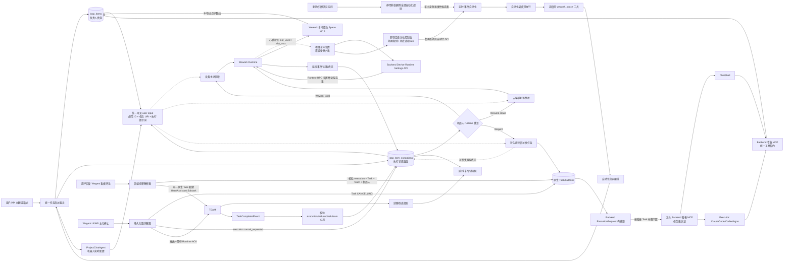
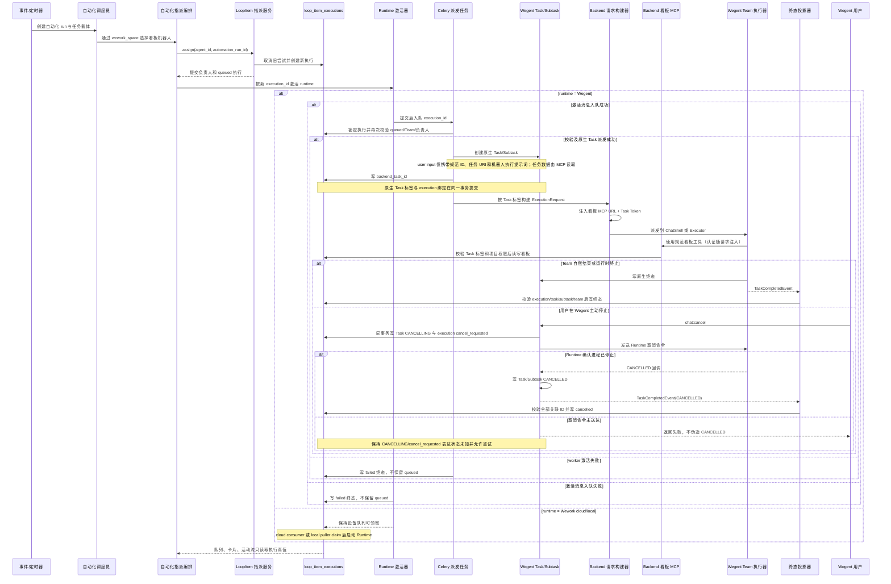
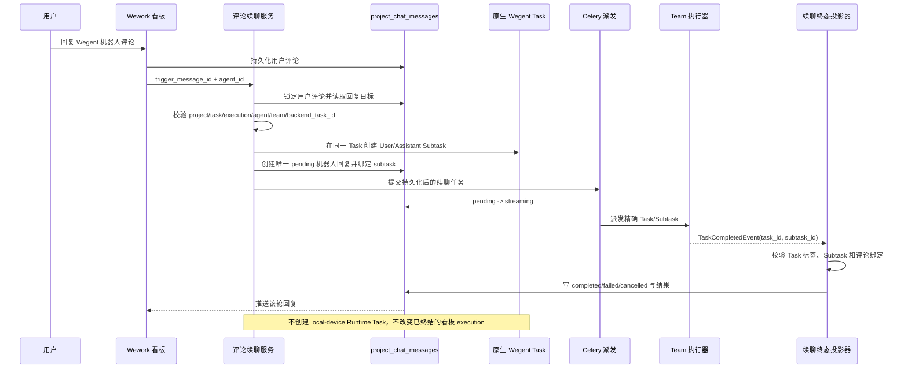
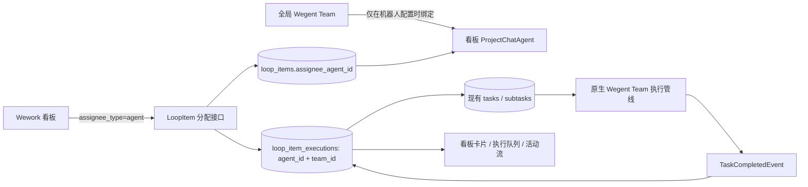
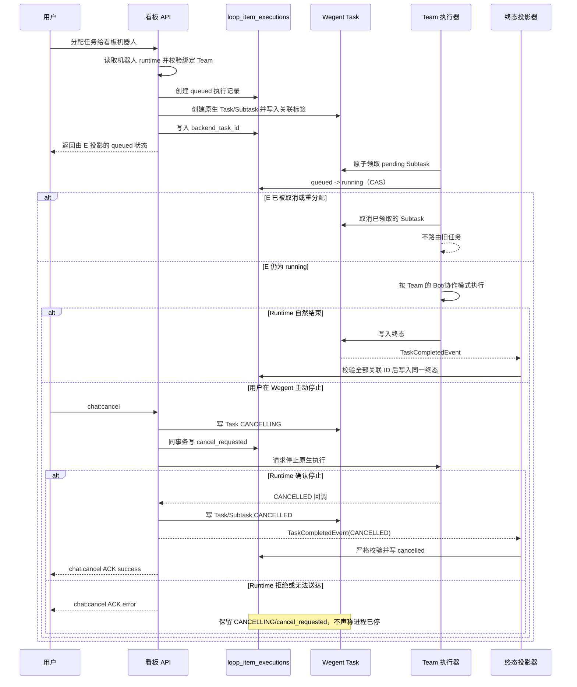

# 云项目协作架构

看板自动化与 Wegent 执行的架构评审以 [独立架构文件](../../architecture/board-automation.md) 为准；本文保留云项目领域、API 和交付说明。

> UI 与交互实现以 `/Users/hongyu9/Downloads/wework-delivery-v4-TODO.pen` 为当前 V4 设计源，不根据本文重新推导页面布局。

## 目标

云项目是多人共享的协作与存储边界。成员可以在自己的本地项目中选择默认云项目，在 Wework 中执行任务，并把选定的聊天记录、文件和 Markdown 说明作为不可变交付快照提交到云端。

云项目不等同于现有 `Project`：

- `Project` 是单个用户拥有的本地执行工作区，保存设备、路径、Git 和执行配置。
- `CloudProject` 是多人共享的协作聚合根，拥有成员权限、TODO、共享文件和 MinIO 空间。
- 多个成员的本地项目可以分别把同一个云项目保存为默认目标；云项目不保存反向关联。
- 一个 TODO 可以关联多个 Wework Task，但一个 Task 同时最多处理一个活跃 TODO。

## 领域关系

```text
CloudProject
├── ResourceMember(resource_type=CloudProject)
├── ShareLink(resource_type=CloudProject)
└── LoopItem
    ├── LoopItemTaskBinding
    │   └── TaskResource
    │       └── Project (local execution workspace)
    └── Delivery
        └── DeliveryAsset
```

## 数据归属

| 数据                                            | 事实来源             |
| ----------------------------------------------- | -------------------- |
| 云项目、成员、TODO、任务关联、交付元数据        | Backend MySQL        |
| 本地路径、设备、Git、执行配置和默认项目空间引用 | 本地 Codex 项目状态  |
| 共享文件、Markdown、聊天记录、交付快照          | MinIO/S3             |
| AI 对云空间的访问                               | Backend 鉴权后的 MCP |

MinIO 对象使用云项目公开 ID 隔离：

```text
projects/{cloud-project-public-id}/
  shared/
  loop-items/{loop-item-id}/
    deliveries/{delivery-id}/
      markdown.md
      chat.json
      manifest.json
      files/
```

交付完成后，其对象前缀不可覆盖。后续任务只能读取或复制交付物。

## 数据模型

### CloudProject

`cloud_projects` 保存共享项目本身，不保存任何本地执行配置。

```text
id, public_id, project_key, name, description
created_by_user_id, storage_prefix, next_item_number
status, version, created_at, updated_at
```

### 本地项目默认空间

本地 Codex 项目可以保存一个 `{ projectStore, projectId }` 默认项目空间引用。该引用属于设备上的本地项目状态，不进入 Backend，也不向项目空间建立反向索引。新对话发送前可以覆盖或清除这个默认值。

### LoopItem

现有 `loop_items` 作为云 TODO 使用。它通过 `cloud_project_id` 指向 `cloud_projects`，并使用 `sequence_number` 生成 `WEG-18` 形式的展示编号。

固定状态如下：

```text
inbox → pending → in_progress → in_review → completed
```

已完成 TODO 可以重新进入 `in_progress`。更新操作必须携带 `version`，服务端使用乐观锁拒绝静默覆盖。

### 看板任务的机器人与智能体执行

看板负责人只允许项目成员或项目机器人（`ProjectChatAgent`）。Wegent 智能体（`Kind(kind=Team)`）是机器人的 runtime 配置，不是负责人：用户先在当前看板创建机器人，再把执行环境设为 Wegent 并绑定一个可运行的 Team。绑定保存在机器人现有 `metadata_json` 中，不新建表。

#### 自动化执行连线图



连线的代码归属必须逐条保持一致：

| 连线                        | 唯一职责                                                                                                                                               | 当前代码归属                                                      |
| --------------------------- | ------------------------------------------------------------------------------------------------------------------------------------------------------ | ----------------------------------------------------------------- |
| 入口 → 指派                 | 校验成员/机器人并写负责人                                                                                                                              | `loop_items/service.py`、`external_provider.py`                   |
| 指派 → 执行真值             | 取消旧尝试并创建新尝试                                                                                                                                 | `loop_item_executions/service.py`                                 |
| 自动化 → runtime 激活       | 在指派事务提交后激活新执行                                                                                                                             | `project_automation_execution.py`                                 |
| 项目空间归档 → 自动化清理   | 在项目归档的同一事务内停用并软删除全部规则，清空下次触发时间                                                                                           | `cloud_projects/service.py`、`project_automations.py`             |
| Wework 激活                 | 本地设备领取或云消费者 claim                                                                                                                           | `robot_queue_tasks.py`、Wework 本地 puller                        |
| 设置 → 设备总并发           | 按设备通过已认证 Runtime RPC 持久化并立即应用 scheduler 上限；`slot_used/slot_max` 只做容量投影                                                        | `devices.py`、`runtime_rpc_service.py`、Rust `runtime.settings.*` |
| Wegent 激活                 | 按 execution ID 创建 Task/Subtask 并入 Team 管线                                                                                                       | `board_team_execution.py`、`project_automation_tasks.py`          |
| Wegent 看板 MCP 注入        | Backend 从原生 Task 标签识别看板执行，为 ChatShell 与 Executor 的同一 `ExecutionRequest` 注入 Backend MCP URL 和任务级认证；不得依赖调用方临时布尔参数 | `execution/request_builder.py`、`mcp_server/server.py`            |
| Backend 看板 MCP → 领域服务 | 使用与本地 Space MCP 一致的规范工具名，通过 Backend 现有 CloudProject、LoopItem、文件、附件、交付和指派服务操作；不得转调 Wework 本地 stdio MCP        | `mcp_server/tools/wework_space.py` 及对应领域服务                 |
| Wework 本地 MCP             | 仅由 Wework Runtime 原生启动，负责本地项目空间和本地文件路径能力；不得覆盖 Backend 为 Wegent Runtime 注入的远程看板 MCP                                | `executor/src/task_runtime/mcp.rs`                                |
| 看板执行 → 三端输入         | 本地、云端和 Wegent 共用可见 user input：规范 ID、任务 URI、机器人执行提示词；任务正文由 runtime 通过 MCP 读取                                         | `loop_item_executions/profile.py`、`board_team_execution.py`      |
| Wegent 终态 → 执行真值      | 严格校验全部关联 ID 后投影终态                                                                                                                         | `board_team_completion.py`                                        |
| Wegent 评论 → 原生续聊      | 从回复目标解析精确 `backend_task_id`，在同一 Task 新建 Subtask；续聊结果只投影到对应评论，不重写已终结的 execution                                     | `board_team_continuation.py`、`project_automation_tasks.py`       |
| Wegent 主动停止 → 取消意图  | 原生 Task 写 `CANCELLING`，看板 execution 写 `cancel_requested`，再发送 Runtime 取消命令                                                               | `chat_namespace.py`、`board_team_completion.py`                   |
| Runtime 取消 ACK → 两侧终态 | Runtime 确认进程停止后写 Task/Subtask `CANCELLED` 并通过统一终态投影器写看板 `cancelled`                                                               | Rust executor、`status_updating.py`、`board_team_completion.py`   |

Backend 看板 MCP 必须完整暴露 Backend 云看板已有的领域能力：`get_current_context`，空间的 `list/create/update`，看板任务的 `list/search/create/get/update/reorder`，指派候选与 `assign`，provider 评论，空间文件的 `list/read`，任务附件的 `list/upload/read/delete`，以及交付的 `list/read`。远程 MCP 的文件内容使用内联文本或 Base64 传输，不接受 Runtime 本地文件路径。钉钉 AI 表格的动态字段/记录工具属于 Wework 本地 provider 路由，不得在没有 Backend provider 服务时伪造同名实现。

2026-08-15 的排队缺陷来自一条缺失连线：HTTP 指派会调用 Wegent 激活器，但自动化调度员通过内部服务指派后只创建了 `queued` 执行记录，没有激活 runtime。结果是 `claimed_at`、`backend_task_id` 永远为空，设备消费者也不会领取 `execution_environment=wegent` 的记录。修复必须补上“自动化 → runtime 激活”这条边，不能把 Wegent 记录交给 Wework 设备消费者，也不能从队列 UI 推断执行已启动。

#### 自动化指派与执行时序图



该时序必须满足以下不变量，评审时按顺序反查：

1. `LoopItem.assignee_agent_id` 始终是看板机器人，Wegent Team 只存在于机器人配置和执行的 `team_id`。
2. runtime 激活只能发生在负责人和执行记录提交之后，避免消费者读不到执行。
3. Wegent 派发按精确 `execution_id` 加锁并幂等检查 `backend_task_id`；原生 Task 标签和 execution 绑定必须在持锁事务中一起提交，不能用“最新任务”猜测，也不能在绑定前释放锁。
4. `queued` 只代表执行意图已持久化；写入 `backend_task_id` 或 Runtime 接受事件前不能展示成运行中。
5. 自动化 run、机器人执行、原生 Wegent Task 各有状态边界，终态只能通过校验完整关联标签的统一投影器写入看板执行；运行时事件和主动停止都必须调用该投影器。
6. 人工指派、API 指派、定时自动化和 AI 调度员指派最终必须进入同一个 runtime 激活器；新增入口不得直接复制派发逻辑。
7. 激活消息无法入队或 worker 激活失败时必须写明确的 `failed` 终态；没有消费者会继续处理的 execution 不得保留为 `queued`。
8. Wegent 前端/API 主动停止只能先写 `CANCELLING/cancel_requested`；只有 Runtime ACK 或可信 `CANCELLED` 回调才能写两侧 `CANCELLED/cancelled`。取消发送失败不得伪造终态，前端必须等待并显示服务端 ACK。
9. 三种 runtime 必须使用同一份可见 user input：规范 `project_id`、`task_id`、`execution_id`、任务 `cloud://` URI，以及用户配置的机器人执行提示词。执行提示词不得进入 Team/Ghost/Bot system prompt，也不得藏入 application context；任务标题、描述和状态由 MCP 读取最新值。
10. Wegent 评论续聊必须从回复目标携带的 `execution_id` 和 `backend_task_id` 精确解析原生 Task，并再次校验当前看板机器人和 Team；不得从“最新执行”、设备运行列表或前端内存猜测会话。每轮续聊在同一 Task 新建 Subtask，execution 保持原终态，回复评论是该轮展示投影。同一原生 Task 同一时刻最多允许一个 `pending` 或 `streaming` 续聊，防止并发请求覆盖活动 Subtask 标签或串写投影。
11. 只要原生 Wegent Task 的标签表明它来自看板执行或看板自动化，Backend 就必须在每一轮构建请求时注入看板 MCP；ChatShell 与 Executor 共用同一注入结果，续聊不得依赖上一轮容器内的 MCP 配置。
12. Backend 看板 MCP 与 Wework 本地原生 Space MCP 是两个 runtime 边界。前者由 Backend 托管并使用 Task Token，后者由 Wework Runtime 本地启动；二者复用规范工具名和领域语义，但不得互相 fallback 或覆盖。
13. Task Token 的 `task_id/subtask_id` 和原生 Task 标签共同限定当前看板空间。模型可以操作该空间内的其他任务，但当前任务、自动化 run 和 execution 身份必须由服务端解析，不能要求模型猜 ID，也不能用 Task Token 越过当前空间。
14. 项目空间归档前不得存在活动自动化 run；设置页提供跨项目停止入口。归档与规则清理必须在同一事务提交；所有规则都要停用、软删除并清空下次触发时间，调度扫描也只能选择父项目仍为 `active` 的规则。历史终态 run 作为审计记录保留，不得再产生新执行。
15. 设备总并发属于各自 Runtime scheduler，不是机器人并发。设置页必须按设备调用已认证 Runtime RPC；离线设备不可伪造已保存结果，所有设备的 `slot_max` 之和只用于容量展示，不能成为新的执行状态真值。

#### Wegent 看板评论续聊时序图





`loop_item_executions` 是看板执行状态的唯一事实来源；原生 `tasks/subtasks` 是 Team 内部执行事实。两者通过 `backend_task_id` 和带执行 ID、Subtask ID、Team ID 的标签严格关联。消息和活动记录只做展示投影，不能反向覆盖执行状态。



从看板发起的重分配和停止，先推进看板执行记录到 `cancel_requested`（尚可能存在真实进程）或 `cancelled`（确认尚未启动），再把取消路由到对应的设备 Runtime 或原生 Team Task。从 Wegent 原生任务发起停止时，原生 Task 的 `CANCELLING` 与看板 execution 的 `cancel_requested` 在同一事务提交；Runtime 真正停止并回调后，原生 Task/Subtask 才能写 `CANCELLED`，统一终态事件再把看板 execution 推进为 `cancelled`。事件是终态证据的传递机制，不能用前端按钮点击或 HTTP 请求送达替代 Runtime ACK。旧工作线程即使稍后领取到消息，也必须重新检查执行记录，不能启动已经取消的运行。

同一任务的执行域始终按看板机器人归属。`agent_id` 决定队列列、分配历史和并发身份，`team_id` 只记录 Wegent runtime 的实际目标；不同任务进入原生 Team 管线后，Team 的协作配置仍决定内部并行度。

### LoopItemTaskBinding

`loop_item_task_bindings` 表达 TODO 与实际 Wework Task 的多对多历史关系。运行时 Task 使用 `task_user_id + device_id + task_id` 标识，因为本地执行 Task 不一定存在于 Backend `tasks` 表；`backend_task_id` 仅作为可选索引。解绑使用 `unlinked_at` 软删除，以保留执行来源审计。

### Delivery

`deliveries` 和 `delivery_assets` 保存不可变快照元数据。`Delivery.source_task_binding_id` 是可空外键：云端直接完成 TODO 时为空，本地任务交付时指向已经验证的 TODO/Task 关联。

## 权限

复用 `resource_members` 和 `share_links`，新增 `CloudProject` 资源类型。

| 角色       | 读取 | 编辑 TODO/文件 | 管理成员 | 归档项目 |
| ---------- | ---- | -------------- | -------- | -------- |
| Reporter   | 是   | 否             | 否       | 否       |
| Developer  | 是   | 是             | 否       | 否       |
| Maintainer | 是   | 是             | 是       | 否       |
| Owner      | 是   | 是             | 是       | 是       |

所有 TODO、交付、文件和 MCP 请求都必须先解析云项目角色。无权限资源统一返回 404，避免泄露资源是否存在。

## 服务边界

```text
cloud_projects/  项目和成员
loop_items/      TODO、状态机和 Task 关联
delivery/        不可变交付快照
cloud_files/     可变共享文件
mcp_server/tools/delivery.py  AI 按权限读取云空间与交付引用
```

Delivery 服务不负责 TODO CRUD；LoopItem 服务不直接访问 MinIO；MCP 不持有或返回 S3 凭证。

## 交付事务

1. 创建 `draft` Delivery 并写入 Markdown/聊天对象。
2. 分批上传文件，记录 SHA-256 和大小。
3. `finalize` 锁定 Delivery 与 LoopItem，验证来源 Task 仍关联当前 TODO。
4. 写入 `manifest.json`。
5. 在一个数据库事务中将 Delivery 置为 `delivered`、TODO 置为 `completed`，并更新 `current_delivery_id`。
6. 数据库提交失败时删除新写入的 manifest，草稿仍可重试。

## API

```text
/v1/cloud-projects
/v1/cloud-projects/{id}/members
/v1/cloud-projects/{id}/members/{user_id}
/v1/cloud-projects/{id}/files
/v1/cloud-projects/{id}/folders
/v1/cloud-projects/files/{file_id}
/v1/cloud-projects/{id}/loop-items
/v1/loop-items/{id}
/v1/loop-items/{id}/tasks
/v1/loop-items/{id}/start-task
/v1/loop-items/{id}/deliveries
/v1/deliveries/{id}
/v1/cloud-work-items/my-work
/v1/runtime-tasks/loop-item
```

### 通过个人 API Key 创建看板和任务

用户可以在保持原有权限和状态规则不变的前提下，通过个人 API Key 调用两个创建接口。支持 `X-API-Key: wg-...`，也支持 `Authorization: Bearer wg-...`；网页登录使用的 JWT 仍然有效。Service Key 不能以用户身份创建看板或任务。

创建看板：

```bash
curl -X POST 'https://<host>/api/v1/cloud-projects' \
  -H 'Content-Type: application/json' \
  -H 'X-API-Key: wg-<personal-api-key>' \
  -d '{
    "project_key": "OPS",
    "name": "运维看板",
    "description": "通过 API 创建"
  }'
```

创建任务时使用上一步响应中的看板 `id`：

```bash
curl -X POST 'https://<host>/api/v1/cloud-projects/<project-id>/loop-items' \
  -H 'Content-Type: application/json' \
  -H 'Authorization: Bearer wg-<personal-api-key>' \
  -d '{
    "title": "检查云端运行状态",
    "description": "保持看板状态为真实状态源",
    "priority": "high",
    "tags": ["api"]
  }'
```

任务创建仍经过看板成员权限、状态定义、Provider 路由和自动化规则校验。未指定 `status` 时进入看板的 `inbox` 状态；指定不存在的状态会返回 `422`，无权访问的私有看板按资源不可见规则返回 `404`。这两个接口是创建语义，不提供 PUT upsert；调用方重试 POST 前应确认前一次请求结果，避免重复资源。

创建与更新使用不同端点，不提供 PUT upsert。共享文件支持创建目录、上传、重命名/移动、短期授权访问和递归删除；移动对象时先复制 MinIO 对象、提交元数据，再删除旧对象，失败时清理新对象。

Wework 把新运行任务加入云项目空间时，使用已有的基础能力组合完成：先创建 `LoopItem`，再绑定运行任务；运行状态变化时先读取任务上下文，再更新对应 TODO。Backend 不提供仅为这条编排流程设计的聚合追踪接口，因此桌面端和 Backend 可以独立发布，同时仍由 TODO 创建、任务绑定和乐观锁更新这三类稳定 API 保证行为一致。桌面端会对同一运行任务的并发关联请求去重；如果绑定临时失败，会复用已创建的 TODO 后重试，避免产生重复卡片。

Wework Composer 把云项目、目录、文件、TODO 和交付编码为 `cloud://` 原子引用。任务携带云项目上下文时注入 Delivery MCP；`resolve_cloud_reference` 在 Backend 再次鉴权并解析引用，客户端和 AI 均不接触 S3 凭证。TODO 看板在窗口可见时周期刷新，写操作仍依赖 `version` 乐观锁处理多人并发。

## 实施顺序

1. CloudProject、成员权限与本地项目关联。
2. LoopItem 迁移到 CloudProject，并补充状态机和乐观锁。
3. Task 关联与从 TODO 开启任务。
4. Delivery 的权限、来源任务和 MinIO 路径迁移。
5. 共享文件与云空间 MCP。
