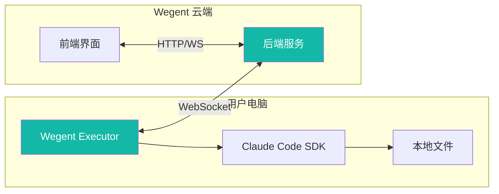
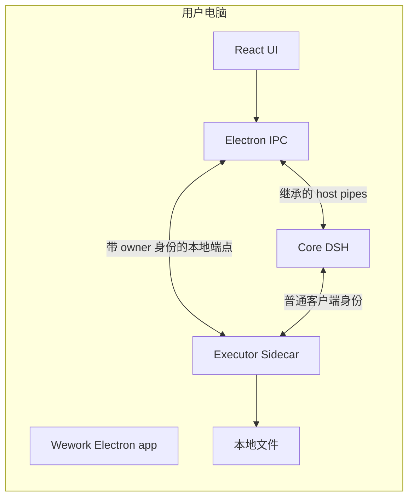
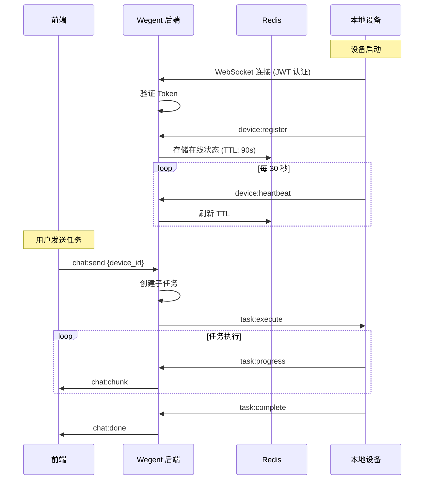
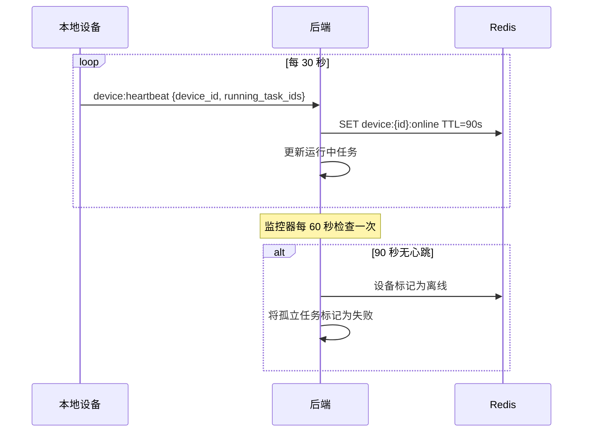
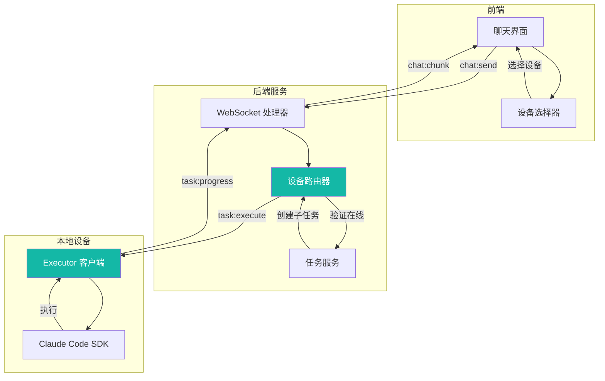
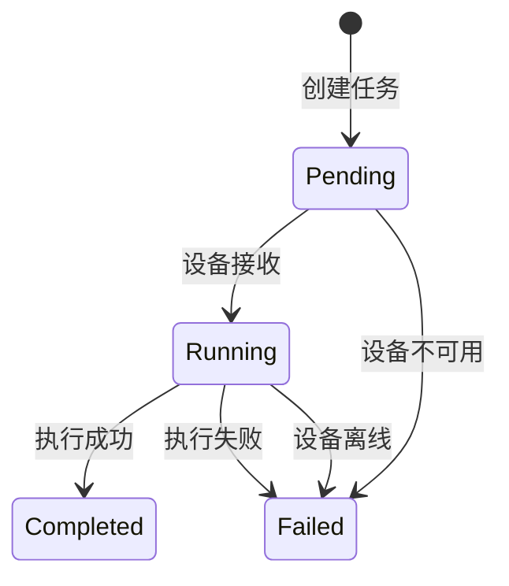
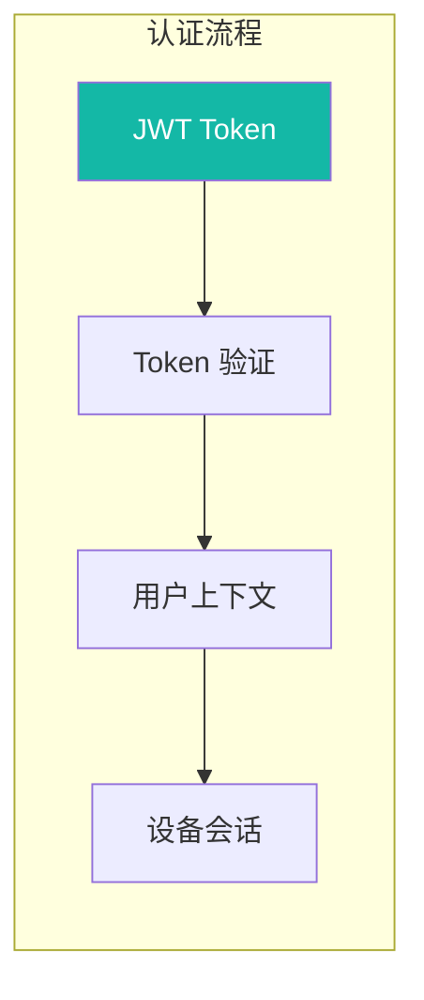
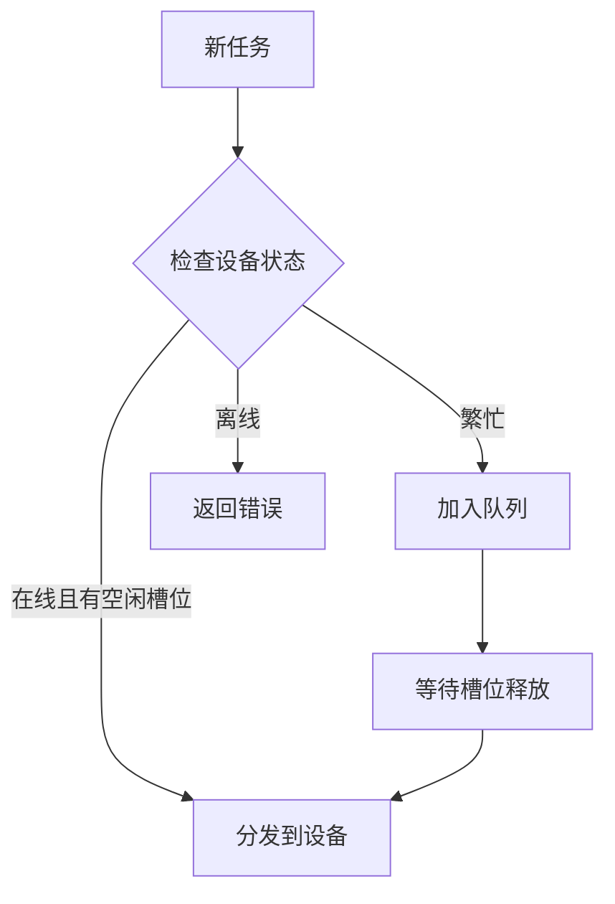

# 本地设备架构

本文档介绍本地设备支持的技术架构，包括通信协议、心跳机制和安全设计。

---

## 🏗 架构概述

### 系统组件



### Wework 打包 App 本地优先通道

打包后的 Wework Electron app 默认走本地优先模式。该模式不启动前端 Node dev server，也不在本机额外启动一个 HTTP Backend 服务；React 界面运行在 Electron renderer 内，Electron 主进程提供 app 内部命令层。

本地优先模式包含 Electron 主进程、executor sidecar 和 core DSH 三个本机运行时角色：



Electron 无参数启动 executor sidecar，并通过每次 App 启动独有的 Unix socket 或 Windows named pipe 交换换行分隔 JSON。普通客户端使用 app IPC token；Electron 另用独立 owner token 建立一个贯穿该代 executor 生命周期的长连接。普通客户端（包括 core DSH）断开只结束自己的连接，owner 连接 EOF 则关闭本地端点并退出 executor。因此即使 Electron 被 `SIGKILL`、崩溃或 Force Quit，无法执行 JavaScript 清理，executor 仍会从 owner socket 断开检测到所有者死亡。

Core DSH 通过 Electron 创建的继承 pipe 调用受限 host command。pipe 的 `end` 或 `close` 表示 Electron host 已不存在，DSH 必须调用 launcher 提供的 `appExit` 服务退出；正常释放客户端时会先移除这些断开监听，避免把有序停机误判为所有者死亡。

App 自己启动的 executor 和 DSH 归 Electron 主进程管理：macOS/Linux 下各自位于独立进程组。正常关闭或重启时先发送 `SIGTERM`；即使进程组 leader 已退出，也要继续等待整个进程组，超时后对仍存活的成员发送 `SIGKILL`。开发模式中的 reload supervisor 和它拉起的 executor 也在同一清理范围内。owner socket 和 host pipe 是强退路径的进程内自终止机制，进程组清理是正常停机路径的兜底，两者不能相互替代。

本地端点的写入失败、EOF 或子进程退出表示对应 IPC 连接失效。普通请求超时只结束该请求，不销毁通道，因此系统休眠或调度延迟不会触发端点重连或误切换到其他 executor。executor 意外退出并由 supervisor 拉起后，Electron 必须在新进程进入 ready 前重新完成 owner 握手。

Executor 启动的设备命令必须关闭 stdin，不能继承承载 App JSONL 协议的进程 stdin，否则子命令读取标准输入时会窃取请求字节并破坏后续协议帧。Executor 按字节读取并以换行符划分 App IPC 帧，再单独验证每一帧的 UTF-8；非法帧只记录长度和错误偏移后丢弃，不能终止整个 executor 或中断其他正在运行的任务。检测到 executor runtime instance 变化后，Wework 会重新获取受影响任务的列表和 transcript；已被 transcript 确认接收的排队消息会从队列移除，断线时尚未确认的发送会恢复为可重试的排队状态。

本地 runtime 事件通道和 App IPC 写入队列使用有界缓冲，容量均为 8192。IPC 写入将 Responses 文本、终态、错误和 RPC 响应放入高优先级队列，将工具块、诊断、计划和文件变化事件放入低优先级队列。高优先级队列满时发送方显式等待并记录背压；低优先级队列满时丢弃当前可恢复事件、记录背压并发送 `executor.event_lagged`，避免直到 broadcast 覆盖旧事件后才发现消息缺失。

工具输出事件最多携带 64 KiB，文件变化事件中的 diff 预览最多携带 128 KiB；完整 patch 仍保存在可读取的 artifact 中。Wework 收到 `executor.event_lagged` 后会重新拉取当前任务和全部运行中任务的 transcript，并使用稳定的客户端消息 ID 将 transcript 与尚未落盘的乐观用户消息合并。因此任务切换或事件积压后，运行状态、用户输入和 AI 输出会从同一份恢复结果重新收敛。

Wework 的 DSH 通道通过独立的本地 endpoint 连接订阅 executor 事件。事件序号、断线重放和历史丢失检测全部由 executor 负责：executor 为事件分配单调递增的 `sequence`，并维护同时受 4096 条事件和 8 MiB 限制的内存日志；客户端重连时携带最后已消费的序号，executor 原子地返回其后的日志快照并继续发送实时事件，避免快照与订阅之间的竞态。请求序号已经落后于日志窗口或超出当前最新序号时，executor 发送带 `event_history_lost` 原因的 `executor.event_lagged`，由 Wework 通过 transcript 重新收敛。

Electron 层不保存事件日志、不生成序号，也不实现重放或合并策略。它只把 executor 的专用事件 socket 桥接为 renderer 使用的 SSE；如果 `res.write()` 表示浏览器端产生 HTTP 背压，Electron 会关闭上游 socket 和当前 SSE，让 renderer 使用最后已消费的 executor 序号重新连接。这样锁屏、系统休眠或 renderer reload 不会让未消费事件在 Electron 中无界增长，也不会把流正确性绑定到 Electron 的调度状态。

Backend 是可选能力，而不是本地 app 的必需依赖。需要登录、模型/能力同步、云端项目或网页版控制本机时，executor 可以使用 Backend Socket.IO 通道注册为本地设备；同一个 executor sidecar 会复用同一个 command handler 和 runtime work handler，一边通过本地 app IPC 端点服务 Wework App 和 core DSH，一边通过 Socket.IO 服务 Backend。这个设计不引入本机 HTTP gateway，也不要求 Wework App 自己启动 Backend。

### 跨组件请求日志关联

Wework 在请求进入跨进程或跨服务边界时生成 request ID，并在同一次请求的后续日志中复用它。该字段只用于诊断单次请求，不替代任务 ID、设备 ID、线程 ID 或 OpenTelemetry trace ID，也不能用于推断业务状态。

- Renderer 发往 Backend 的 HTTP 请求使用 `wework-http-<uuid>`，通过 `X-Request-ID` 传递。Backend 复用该值写入请求上下文，并在响应中返回 `X-Request-ID`；CORS 配置显式暴露该响应头。
- Renderer 通过 core DSH 调用本地 executor 时使用 `wework-local-<uuid>`。同一个 `request_id` 同时写入 DSH 的请求开始、完成或失败日志，以及 executor 的 `runtime:rpc` 接收与响应日志。
- Wework 通过 Backend Socket.IO 调用远程 executor 时使用 `cloud-runtime-<uuid>`。Backend 在处理 `runtime:request` 时把该值绑定到请求上下文，并原样放入下游 `runtime:rpc` 信封；远程 executor 的对应日志继续使用同一个值。

调用方没有 request ID 时，协议层不发送空的 `request_id` 字段；各组件日志使用自身的无上下文占位符。请求 ID 必须是有界、可打印的诊断标识，日志不得同时记录请求正文、认证信息、模型密钥或本地凭据。

排查一条请求时，先从用户可见失败附近的 Wework frontend、DSH 或 Backend 日志取得 `request_id`，再在同一诊断目录或集中式日志系统中按精确值搜索。开始和结束日志还会记录方法名、结果与耗时，因此缺失的边界可以直接定位请求停留在哪个组件，而不需要按相近时间或任务名称猜测。

### Executor 启动环境与 Codex Home 初始化

Unix executor 在创建异步运行时和启动 Agent 子进程之前，通过运行当前用户的交互式登录 shell 读取完整环境。shell 优先使用系统用户数据库中的登录 shell，并依次回退到 `$SHELL`、`zsh`、`bash` 和 `sh`。采集过程有固定超时；失败时 executor 保留父进程环境，并继续补充 Homebrew、`/usr/local` 等标准开发目录。最终环境由 executor 统一传递给 Codex、Claude Code、插件、技能、Hooks、PTY 和设备命令，因此 Wework 本地 sidecar、独立本地设备以及 Linux 云端或远程设备使用同一套 PATH 解析逻辑。

Windows 没有可采集的登录 shell，executor 改为在启动时合并注册表中的机器与当前用户 PATH。这样即使桌面应用早于 PATH 修改启动，设备命令仍能看到新开 pwsh 可解析的工具。Git diff 与代码托管 CLI 状态等设备命令直接原生调用 git、`gh` 或 `glab`，不再依赖 Windows PATH 上不保证存在的 `bash` 或 `python3`。

Wework 使用独立 Codex Home 隔离本地运行时配置。首次初始化时，用户可以把原生 Codex Home 中的配置、插件、技能和插件市场复制到该目录。初始化完成后，Wework 默认在 `[features]` 中写入 `apps = true`，使迁移后的插件 Apps 能力立即可用；用户之后在设置中明确关闭 Apps 时，后续普通启动不会覆盖该选择。

Wework 的本地可用状态以真实 Codex app-server 完成 `initialize` 为边界，而不是以 executor stdio 通道建立为边界。 Electron 启动 executor 后，先把当前本地代理配置写入运行时，再通过 `runtime.codex.ensure_started` 启动并初始化共享 Codex app-server；只有该调用成功后，renderer 才继续进入可交互工作台。Codex 初始化路径不得同步等待插件市场刷新、Git 拉取、更新检查或其他外部网络请求；这些后台请求即使因断网或代理无响应而挂起，也不能延迟 `initialize` 响应。启动 E2E 必须使用真实 Codex 和阻塞网络代理验证这一约束，同时确认初始化期间不会发送 Agent 模型请求。

### 运行时任务与目标状态

运行时任务的 `running` 字段只表示当前是否存在正在执行的模型回合。回合完成、失败或取消后，executor 必须把该字段收敛为 `false`，供 Wework 决定是否显示停止按钮、运行中图标，以及新消息能否直接发送。

`running` 由两类实时信号共同确定：executor 当前进程维护的活跃任务集合，以及 Codex thread 中明确标记为 `inProgress` 的 turn。后者覆盖 Goal 自动续轮等场景：本地执行包装可能已经返回，但 provider 仍在运行后续 turn。Codex thread 自身的 `active` 状态、已持久化的任务摘要和 Wework 本地提醒都不能单独推断任务仍在运行。任务列表、transcript、详情面板、系统托盘和阻止休眠逻辑必须消费同一份 executor `running` 值；executor 或 Wework 重启后，如果 `thread/read` 或 `thread/list` 仍返回活跃 turn，界面必须恢复运行态，只有不存在活跃 turn 时才收敛为空闲。

在单个 executor 进程内，发送、引导和取消操作只使用一份本地执行记录作为生命周期权威来源。Codex 的 `threadId` 和 `turnId` 是该执行记录的附属上下文，只在 execution ID 仍匹配时有效，不能存放在独立注册表中继续维持任务运行。执行结束时，executor 会原子删除本地执行及其 Codex turn 上下文，再发送终态响应；与完成事件并发但稍后返回的 `turn/steer` 等 provider 回调必须被忽略，不能把已经结束的任务重新标记为运行中。`thread/read` 或 `thread/list` 返回的活跃 turn 仍可用于任务列表投影和重启恢复，但不能创建第二套进程内执行生命周期。

任务摘要同时透传 Codex 的 `threadStatus`（`notLoaded`、`idle`、`systemError`、`active`）和 `turnStatus`（`inProgress`、`completed`、`interrupted`、`failed`）。`continuable` 单独表示会话未归档、仍可继续发送消息；它不能用于推断当前回合正在运行。Wework 只使用明确的 `running` 和真实回合状态显示运行反馈，不把线程或消息的 `active` 状态转换为 streaming。

线程元数据刷新也不能覆盖已经持久化的任务终态。当 Codex 线程进入 `idle` 时，executor 保留本地 `done`、`cancelled` 或 `failed`；只有真实活跃回合才能把任务重新设置为 `running`。因此，一个正常完成且可继续的会话会同时表现为 `status=done`、`running=false`、`continuable=true`、`threadStatus=idle` 和 `turnStatus=completed`。

目标（goal）有独立的生命周期。目标为 `active` 表示其目标仍可在后续回合继续推进，不表示当前存在模型回合。因此，任务空闲时保留 active goal 不会将任务重新标记为运行中；用户发送下一条消息会直接创建新回合，而不是把消息作为对运行中回合的引导。

如果用户在普通回合仍运行时创建目标，Wework 会保留该目标请求，等待当前回合明确结束后以 `initialGoal` 启动新的目标回合。active goal 会让任务继续显示为运行中，但不能阻止这次已排队的目标接力；普通排队消息仍然只能在任务真正空闲时发送。executor 只在目标已经于回合开始前处于 active 状态时等待 Codex 自动续轮；若目标是在普通回合中途创建，当前执行必须先正常收敛，让 Wework 能够启动排队的目标回合。该边界避免前端等待任务空闲、executor 同时等待并不存在的自动续轮所形成的死锁。

Wework 前端通过一个用户级 `RuntimeTaskLifecycleStore` 管理所有任务生命周期；Store 为每个任务维护一个状态机并负责事件路由，状态机是执行状态、回合状态、Goal 状态和未读状态的聚合根，reducer 仅作为状态机内部的状态转换实现。React Provider 只把同一个 Store 适配为订阅，不保存或推断运行状态。任务列表、输入框、消息思考态、系统托盘、关闭保护和完成提醒都读取该 Store 的同一份快照。

前端的权威运行状态只保存在内存中，不写入本地文件或浏览器存储。用户发送消息时的乐观 `starting` 也由同一个状态机维护，并在 executor 明确返回 `running=true` 或 `running=false` 后收敛。Active Goal 自动续轮时，只要本地执行仍活跃或 provider 仍返回 `inProgress` turn，两轮之间和页面重载后都保持任务运行中；回合没有流式内容时可以为 `idle`，因此不显示“正在思考”也不产生未读。为支持应用重启后的未读边沿判断，Wework 仅持久化已经产生的未读任务键和上一次观察到仍在运行的任务键；后者不是运行状态来源，不能覆盖 executor 的当前快照。

普通持久线程续聊在调用 `turn/start` 前必须通过 `thread/read` 确认当前没有活跃 turn。ephemeral 临时线程不支持 `thread/read(includeTurns)`，因此必须在按任务串行化的发送临界区内检查 executor 本地活跃执行；新 turn 必须先登记为本地运行中，后一个并发发送才能离开临界区。若 provider 拒绝重叠发送，Wework 将任务状态立即恢复为运行中、刷新任务列表，并把用户输入保留在队列；provider 收敛为空闲后复用同一个客户端消息 ID 自动发送，避免丢消息或重复消息。完成或中断事件会清除活跃 turn 并使界面恢复为空闲。“打断并发送”只有在旧 turn 已确认中断后才创建新 turn；持久线程还要确认 provider turn 已停止，ephemeral 临时线程则以本地执行中断为准。

ephemeral 临时线程的连续续聊依赖其在共享 Codex app-server 中保持已加载状态。成功回合结束后，executor 不得对这类线程发送 `thread/unsubscribe`，否则后续直接调用 `turn/start` 可能停留在已经卸载的线程上。临时线程也不支持分页 transcript RPC，因此 transcript 查询必须读取 executor 的本地运行时缓存，不能调用 `thread/turns/list`。持久线程仍在每个终态回合后取消订阅，并继续使用 provider transcript 作为历史记录来源。

Codex 引导通过共享 app-server 的活跃回合发送。若回合恰好在发送期间结束或切换，executor 会将该竞态报告为 `no_active_turn`；Wework 随后把同一内容作为普通后续消息发送，避免丢失用户输入或显示误导性的发送失败。

同一对话可在回合之间切换模型和 provider。Wework 为每次续聊传递所选模型及其 provider 配置，Codex app-server 在 `thread/resume` 时应用新的 `modelProvider`。executor 为每个经 Wework router 运行的 task 分配一个稳定的本地模型代理地址，并在每轮开始时原子更新该 task 的上游配置。代理在 thread 创建后绑定根 thread ID，只接受该 thread 及其子 thread 的请求；executor 当前轮传入的上游和模型是实际路由的唯一权威来源。

OpenAI 返回的推理和远程压缩条目可能包含只对原 provider 有效的 `encrypted_content`。runtime work 在续聊前比较任务摘要中的旧 `modelSelection` 与本次选择；发生模型或模型类型切换时，会将切换标记传入 executor。目标请求第一次经过 Wework router 时，代理会移除旧 provider 专属的加密推理/压缩条目以及 `previous_response_id`，并在请求成功后消费该标记。该清理也覆盖切换后先发生 compaction、请求中暂时没有 `<model_switch>` 标记的情况，避免把旧密文发送给 OpenAI Responses、Chat Completions 或 Anthropic Messages 上游。

收到明确错误后，用户通过“切换模型并重试”发起的是一个新的回合：它复用原 task 和 thread 的可移植上下文，并只向新选择的上游发送一次请求。executor 同时把本轮 `modelSelection` 写回任务摘要，保证刷新后界面展示的模型与实际请求一致。运行中发送的引导仍属于当前回合，不切换模型；新模型只用于新的普通回合或“打断并发送”创建的回合。

本地模型代理以 Codex Responses 协议作为内部统一表示，并在 OpenAI Responses、OpenAI Chat Completions 和 Anthropic Messages 三种上游协议之间双向转换。切换协议时，历史中的工具调用 ID 和工具结果引用必须在请求边界统一规范化为只包含字母、数字、下划线或短横线的稳定 ID，并在同一历史内保持一一对应；不得把 provider 原始 ID 直接透传给另一个协议。流式响应返回的工具调用 ID 也执行同样的规范化，确保后续工具结果能够关联到原调用，并使 `item/started` 与 `item/completed` 收敛到同一个 Wework 工具块。

Wework 在发送用户消息前生成稳定的 `clientUserMessageId`，并在本地先渲染乐观消息。该 ID 通过 runtime create/send 请求原样传入 Codex app-server 的 `turn/start.clientUserMessageId`。Codex transcript 返回用户消息时，executor 保留同一个 `clientUserMessageId`；Wework 使用它与本地乐观消息对账。Codex 内部 item ID 仍用于 provider 事件身份，但不能替代客户端 ID，否则 transcript 分页或刷新可能把同一次发送识别成两条消息。

实时发送响应中的回合 ID 可能是 executor 在 provider 回合出现前分配的临时 ID，而随后 transcript 会返回 Codex 的规范回合 ID。Wework 合并实时会话和 transcript 时必须先按规范回合 ID 对账；两者不同时，再按稳定的 `clientUserMessageId` 合并为同一个回合，并采用 transcript 的规范回合 ID。不能因为本地回合已经有非空 ID 就跳过客户端消息 ID 对账，否则 Goal 自动续轮等竞态会把同一轮用户消息和后续输出重复渲染。

终态事件与 transcript 刷新并发时，同一个 provider assistant item 也可能短暂出现在临时回合和规范回合中。provider item ID 在该场景中是跨回合别名的稳定身份：当一个 assistant item ID 在快照中只属于一个规范回合时，Wework 必须把携带该 item 的本地别名回合并入规范回合，同时保留别名回合中尚未进入快照的工具块等实时内容。不能仅按回合 ID 保留两份表示，也不能按文本内容跨回合去重；后者会误删模型使用不同 item ID 真实输出的重复文本。

Codex Goal 协议返回的 `createdAt` 和 `updatedAt` 使用 Unix 秒，而 Wework 的 `RuntimeGoal` 契约使用 Unix 毫秒。executor 必须在 `thread/goal/get`、`thread/goal/set` 和 `thread/goal/updated` 的 provider 边界统一转换为毫秒，再交给前端按 `updatedAt` 对账；否则乐观 Goal 的毫秒时间戳会始终大于规范完成态的秒时间戳，导致已完成 Goal 继续显示为活动状态。

Wework 创建 Codex thread 时显式设置 `historyMode=paginated`。恢复 transcript 时，executor 先用 `thread/read(includeTurns=false)` 读取线程元数据，再用 `thread/turns/list` 按时间倒序读取回合，并对每个回合调用 `thread/items/list` 按正序加载完整 item。分页游标是 Codex 生成的不透明值，前后端不得解析或改写为本地 offset；普通页面只读取一页，搜索、Supervisor 和其他完整历史消费者会沿 `nextCursor` 读取到末尾。executor 会拒绝重复游标、缺失回合 ID、跨回合 item 等无效响应，避免静默产生缺失或错序的历史。

分页 transcript 响应不再伪造全局 `rangeStart`、`rangeEnd` 或 provider 级完整导航索引。Wework 使用当前已加载消息构建回合导航；用户请求更早历史时，将 `beforeCursor` 原样传回 executor，加载结果再合并到现有会话。真实 Codex 桌面 E2E 必须创建超过单页大小的会话，重启应用后验证首屏只恢复最新页、加载更早历史使用不透明游标，并确认虚拟滚动中的导航状态仍由当前可见用户消息决定。

工具状态以 app-server 的生命周期事件为准：`item/started` 创建运行中的工具块，`item/completed` 必须将对应工具块收敛为 `done`（显式失败除外）。部分独立工具条目（如图片查看、等待和网页搜索）不携带 `status` 字段；executor 在实时事件映射和 transcript 恢复时都将这类终态条目规范化为 `done`，避免 Wework 在工具已经完成后继续显示运行状态或递增计时。

手动上下文压缩以 Codex thread 中新的 `contextCompaction` 条目持久化为成功边界，而不是以 `thread/compact/start` 接受请求为成功。executor 在发起压缩前记录最新 turn，随后轮询近期 transcript；只有发现新 turn 中的压缩条目后，才向 Wework 返回 `turnId` 和 `compactionItemId`，超时或读取失败则返回明确错误。压缩期间 Wework 先显示单一的“正在自动压缩上下文”处理块，完成后将同一处理块收敛为“上下文已自动压缩”，失败时收敛为错误态。

压缩事件路由保留 `${taskId}-context-compact` 这一合成 subtask 身份，避免真实 Codex turn ID 把前端乐观处理块拆成另一条消息。executor 同时兼容 `item/completed` 和 `context/compaction` 两种通知形式：相同压缩项按 item ID 去重，不同压缩项必须分别发出。Wework 会按 subtask 对账乐观块和运行时块，避免同一次压缩显示两条指示器。桌面 E2E 通过受控的 mock 模型端点接收并阻塞 Wework 发出的压缩请求，验证确认、运行中、完成和后续消息四个阶段，并确认后续模型请求实际包含 mock 返回的压缩摘要，而不是只验证界面标记；Codex transcript 持久化完成边界由 executor 回归测试覆盖。

Codex 同一回合可以交错产生推理、助手文本和工具调用。executor 必须按 provider item ID 跟踪每一段助手文本的流式偏移和完成快照：同一 item 的 `delta` 与 `completed` 是同一内容的增量和快照，应去重；不同 item 的完成文本即使位于同一回合，也必须作为后续文本继续发送，不能因为前一个 item 已产生 delta 而丢弃。Wework 在把当前助手文本移动到工具或处理块之前会清空该文本流的偏移状态，使工具后的下一段助手文本从 offset 0 开始，并保持 transcript 的事件顺序。

助手文本在流式阶段始终先作为过程文本进入 Wework。`item/started` 携带的 phase 只是暂定状态：Codex 可能先把 item 标为 `final_answer`，再在继续调用工具后以 commentary 完成同一 item。executor 因此必须等待 item 完成和回合成功结束后才提交 final content，避免界面把已经可见的最终内容降级回过程块。已完成的明确 `final` 或 `final_answer` item 优先；若该回合没有明确 final item，则最后一段已完成的助手文本成为兜底最终结果。

Codex 提供的推理摘要会作为 `thinking` processing block 进入 Wework。流式摘要以单行“正在思考 · 摘要”显示，只用于反馈当前正在生效的思考进度；回合完成、失败或取消后，Wework 会移除该思考块，不在消息历史中保留摘要占位或详情。executor 必须同时映射 reasoning delta 和只携带完整 summary 的 `item/completed`，否则模型长时间推理时界面会退化成没有进展内容的统一等待状态。未包含在 provider 摘要中的内部推理内容不会展示。

### 后端设备对话任务 REST 入口

网页版设备对话页仍然通过 WebSocket 发送消息。对于需要从外部系统或 curl 创建同类任务的场景，Backend 提供 REST 入口：

```text
POST /api/device-chat/tasks
```

该入口写入中心库 `TaskResource` 和 `Subtask`，并复用与设备对话页相同的 `create_chat_task`、设备解析和 `trigger_ai_response_unified` 链路。请求不包含 `workspacePath` 或 `localTaskId`：普通设备对话任务没有项目工作区概念；如果传入 `projectId`，Backend 根据项目配置解析目标设备；如果不传 `projectId`，Backend 按显式 `deviceId`、已有任务设备、Wework 默认设备或用户默认本地设备解析目标。

新建任务时只需要传 `teamId` 和 `message`，可选传 `deviceId`、`projectId`、模型和上下文参数。续聊时传 `taskId`，Backend 会校验当前用户是否有任务访问权限，并沿用已有任务的 `client_origin`。响应返回中心库任务和消息 id：

```json
{
  "taskId": 2267,
  "userSubtaskId": 3332,
  "assistantSubtaskId": 3333,
  "messageId": 5,
  "aiTriggered": true,
  "deviceId": "device-de8f474294621dd5acfd1287",
  "chatUrl": "/devices/chat?taskId=2267"
}
```

OpenAPI schema 由 FastAPI 根据 `DeviceChatTaskRequest` 和 `DeviceChatTaskResponse` 自动生成，不需要维护静态 `docs/api` 文件。

### 通信架构

下图展示了本地设备如何与 Wegent 系统通信：



### 设备类型

设备 CRD 使用 `spec.deviceType` 区分生命周期归属和前端能力入口：

| 类型     | 生命周期归属                   | 连接方式  | 典型入口                            |
| -------- | ------------------------------ | --------- | ----------------------------------- |
| `local`  | 用户本机 executor              | WebSocket | 本地安装脚本或手动启动 executor     |
| `cloud`  | Wegent 云设备服务              | WebSocket | 云设备创建、重启、释放流程          |
| `remote` | 用户自管 Docker 容器或远端主机 | WebSocket | Wework 连接设置中的远程 Docker 命令 |

`remote` 设备复用本地 executor 的 WebSocket 注册、心跳、任务执行和 command RPC 通道，但由 `RemoteDeviceProvider` 独立列出和返回 `remoteConfig`。Backend 不保存生成命令中的 `WEGENT_AUTH_TOKEN`；Device CRD 只保存 provider、image、deviceId、deviceName、backendUrl、publicBaseUrl 和 createdAt 等非敏感元数据。

远程 Docker 设备启动后会发送 `device:register`，payload 中的 `device_type=remote` 会更新同名 Device CRD。在线状态仍存储在 Redis 的设备在线键中，因此任务调度、slot 统计、terminal/code-server session RPC 与本地设备保持同一套协议。前端不会对 `remote` 设备展示云设备生命周期操作；停止、重启、删除容器由用户在 Docker 主机上完成。

---

## 📡 WebSocket 协议

### 事件类型

| 事件               | 方向        | 描述     |
| ------------------ | ----------- | -------- |
| `device:register`  | 设备 → 后端 | 设备注册 |
| `device:heartbeat` | 设备 → 后端 | 心跳保活 |
| `task:execute`     | 后端 → 设备 | 下发任务 |
| `task:progress`    | 设备 → 后端 | 任务进度 |
| `task:complete`    | 设备 → 后端 | 任务完成 |

### Rust executor 本地事件覆盖

Rust executor 的本地 Backend 通道需要与旧 Python 本地设备 runner 保持事件级兼容。除任务执行和心跳外，当前本地设备还注册并处理：

- `task:cancel`、`task:close-session`
- `chat:message`
- `device:execute_command`
- `device:sync_capabilities`
- `device:start_terminal_session`、`device:start_code_server_session`
- `terminal:input`、`terminal:resize`、`terminal:close`
- `runtime:rpc`
- `device:upgrade`
- `device:run_extension`

`device:run_extension` 的 `extension_scope` 可设为 `task` 或 `global`，省略时默认为
`task`。任务级扩展从当前任务的 `.claude/skills/<extension>` 目录运行；全局扩展从
executor 运行用户的 `~/.claude/skills/<extension>` 目录运行。脚本路径必须保留在所选
扩展目录内，其他作用域值会被拒绝。

迁移覆盖关系记录在 `executor/docs/LOCAL_DEVICE_PYTHON_MIGRATION_TESTS.md`。新增本地设备事件时，应先补 `executor/tests/local_backend_device_migration_contract.rs`，再更新该迁移矩阵。

### 消息格式

```json
// device:register
{
  "event": "device:register",
  "data": {
    "device_id": "uuid-xxx",
    "name": "Darwin - MacBook-Pro.local",
    "max_slots": 5
  }
}

// device:heartbeat
{
  "event": "device:heartbeat",
  "data": {
    "device_id": "uuid-xxx",
    "running_task_ids": ["task-1", "task-2"]
  }
}

// task:execute
{
  "event": "task:execute",
  "data": {
    "subtask_id": "subtask-xxx",
    "prompt": "用户消息",
    "context": {}
  }
}
```

---

## 💓 心跳机制

### 时序图



### 时间参数

| 参数         | 值           | 描述             |
| ------------ | ------------ | ---------------- |
| **心跳间隔** | 30 秒        | 设备发送心跳     |
| **在线 TTL** | 90 秒        | Redis 键过期时间 |
| **监控间隔** | 60 秒        | 后端检查过期设备 |
| **离线阈值** | 3 次心跳缺失 | 设备标记为离线   |

如果一次 `device:heartbeat` ACK 超时、被后端拒绝或 Socket.IO 传输出错，executor 会在 10 秒后快速重试下一次心跳，而不是等待完整 30 秒心跳周期。连续两次心跳失败后，executor 会主动断开当前连接并进入重连注册流程。这样可以容忍一次瞬时抖动，同时在短暂网络问题恢复后，通常仍能让设备在 90 秒在线 TTL 过期前重新注册并刷新在线状态。

### 运行任务追踪

每次心跳包含当前运行的任务 ID，用于：

- 实时槽位使用追踪
- 孤立任务检测
- 断开连接时自动清理

### 全局能力状态上报

本地设备还会通过心跳上报 Claude Code 全局能力状态。完整上报包含：

- `capabilities.revision`：本地 Wegent 管理清单版本
- `capabilities.digest`：`skills`、`plugins`、`mcps` 的内容摘要
- `capabilities.skills`：`~/.claude/skills` 中可用的 Skill
- `capabilities.plugins`：`~/.claude/plugins/installed_plugins.json` 中已安装的 Plugin
- `capabilities.mcps`：Wegent 管理的全局 MCP 配置

Plugin 上报必须包含其内部 Skill 列表。Executor 会扫描每个 Plugin 安装目录下的 `SKILL.md`，并在 `plugins[].skills[]` 中返回：

```json
{
  "name": "context7",
  "marketplace": "claude-plugins-official",
  "version": "1057d02c5307",
  "source": "wegent",
  "installed_plugin_id": 301,
  "skills": [
    {
      "name": "context7",
      "description": "Look up version-specific documentation.",
      "path": "skills/context7"
    }
  ]
}
```

后端只在 `capabilities.full = true` 时保存完整能力状态；后续心跳如果只有相同 `digest`，只刷新在线状态，不重复写入完整列表。

### 全局能力同步

后端可以通过 `device:sync_capabilities` 向在线本地设备下发全局能力期望状态。当前同步内容包括：

- `skills`：通过 backend 解析后的 `InstalledSkill` / `Skill`，由 executor 下载到 `~/.claude/skills`
- `plugins`：通过 backend 解析后的 `InstalledPlugin`，由 executor 写入 `~/.claude/plugins/installed_plugins.json`
- `mcps`：通过 backend 解析后的 `InstalledMCP`，由 executor 写入 Wegent 管理清单

`replace` 模式只会清理由 Wegent manifest 标记为 `managed` 且不在期望状态中的能力。用户直接在本机安装的 plugin 不会因为一次 Wegent 同步被删除。

能力包下载被限制在当前配置的 Backend 同源地址内。executor 会将相对下载路径解析到 `connection.backend_url`，拒绝其它 origin 的包地址，并且只对同源 Backend 请求附加设备 bearer token。Skill 下载 URL 使用编码后的 query 参数构造，包解压会先写入单次同步唯一的 staging 目录，再替换 Wegent 管理的 skill 目录。

项目任务使用本地 executor 执行时，任务级 `CLAUDE_CONFIG_DIR` 会同时暴露全局 `skills` 和 `plugins` 目录，并从本机 `~/.claude/settings.json` 继承 `enabledPlugins`、`extraKnownMarketplaces` 等非敏感插件配置，使 Claude Code 能加载全局 Skill 以及 Plugin 内部提供的 Skill。模型、Token 等敏感配置仍通过运行时环境变量注入，不会从全局 settings 写入任务目录。

Claude Code、Agno 运行时和 Codex 任务 shell 都会收到一组任务身份环境变量。`WEGENT_TASK_ID` 标识当前 Task，`WEWORK_PARENT_TITLE` 提供当前任务标题，`AUTH_TOKEN` 提供本轮任务访问 Backend API 的 bearer token，`WEGENT_RUNTIME_AUTH_TOKEN` 提供本地 Skill 访问 Wegent runtime API 的 bearer token，`WEGENT_SKILL_IDENTITY_TOKEN` 和 `WEGENT_SKILL_USER_NAME` 用于任务内 Skill 操作的身份校验与展示。Claude Code 和 Agno 通过子进程环境注入；Codex 通过 thread 级 `shell_environment_policy.set.*` 注入，身份值不会进入共享 app-server 进程环境，避免跨任务泄漏。Wework 连接云端后会通过 `POST /api/users/me/wegent-runtime-token` 获取 runtime token，并按响应的 `expires_in` 提前刷新；断开云端时会移除本地 Codex 配置中的 `WEGENT_RUNTIME_AUTH_TOKEN`。executor 不向这些子运行时注入 `WEGENT_SUBTASK_ID`。

项目模式下访问 Claude 或 Codex 模型 API 时，executor 会在直接启动的运行时上下文中加入 `wecode-project: <project_id>` 请求头，并补齐 `wecode-action: wegent`、`wecode-source: wegent-local`、`wecode-executor: <runtime>` 来源标识，其中 Claude Code 使用 `claudecode`，Codex 使用 `codex`。Claude Code 本地模式会先合并 executor 启动进程环境和运行时环境里已有的 `ANTHROPIC_CUSTOM_HEADERS`，再追加 project 标识，并同时写入 `ANTHROPIC_CUSTOM_HEADERS` 与 `DEFAULT_HEADERS`/`default_headers` 环境变量，保证直接 Claude Code 子进程和下游模型网关读取到一致的 header 集合；Codex 在 Wegent 管理 provider 配置时写入 provider 的 `http_headers`，使用个人 Codex 配置且显式指定 provider 时也会对该 provider 注入同一 project 请求头。

### 聊天任务设备解析与 Claude Code 启动上下文

普通聊天 Task 通过本地 executor 执行时，Backend 在创建或继续任务前解析真实派发设备，优先级如下：

1. 本轮请求显式传入的 `device_id`。
2. 当前 Project 的本地执行配置，例如 `config.execution.targetType = local` 和 `config.execution.deviceId`。
3. 已存在 Task spec 中保存的 `deviceId`。

前端 App IPC 使用的 `appDeviceId` 只是本机进程侧身份；Backend 会将它映射到 Device CRD 的 executor Socket.IO `name` 后再派发。如果解析出的本地设备已经离线，但当前用户只有一台在线本地 executor，Backend 会把该任务切到这台在线设备，避免旧设备 id 阻塞本地执行。未知设备 id 不会被静默改写。

Claude Code 子进程启动前，executor 会完成以下准备：

- 下载本轮附件到任务目录；Project 工作区下的附件放入 `.wegent/attachments/<taskId>/<subtaskId>/`，非 Project 任务放入 executor 任务目录下的附件子目录。
- 恢复 `~/.claude/plugins/cache` 中仍被 `enabledPlugins` 启用但安装目录缺失的插件包，并修复插件 hook 权限。
- 根据 Bot/Task 选择的 Skills，把需要的 task skills 部署到 `SKILLS_DIR`。普通 Project 任务使用全局 `~/.claude/skills`；独立 `project_id = 0` 且带 task skills 的本地工作使用任务级 `.claude/skills`，避免污染全局目录。
- 如果配置了 `WEGENT_FILE_EDIT_HOOK_COMMAND`，在 Claude `settings.json` 中写入 `Write|Edit|MultiEdit|NotebookEdit` 的 `PreToolUse` 和 `PostToolUse` hook，使文件变更记录能进入本轮 artifact。Wework macapp 启动本地 sidecar 时会默认生成该命令；可以用 `WEGENT_FILE_EDIT_HOOK_COMMAND` 覆盖完整命令，或用 `WEWORK_FILE_EDIT_LOG_ENDPOINT` 调整默认上报地址。

本地 executor 对 Claude stdout 的 NDJSON 输出会即时转换为 Responses API 事件：可见文本产生 `response.output_text.delta`，reasoning 摘要产生 `response.reasoning_summary_text.delta`，进程结束后仍发送最终 `response.completed` 或错误事件。Backend 和前端不能假设 `response.created` 之后紧跟终态事件。

---

## 🔄 任务执行流程



### 任务状态流转



---

## 🔐 安全机制

### 认证流程



### 安全特性

| 特性             | 描述                         |
| ---------------- | ---------------------------- |
| **JWT 认证**     | WebSocket 连接需要有效 token |
| **Token 有效期** | 7 天过期，需定期刷新         |
| **用户隔离**     | 设备只能执行其所有者的任务   |
| **硬件绑定**     | 设备 ID 基于硬件标识生成     |

后端触发的 terminal 与 code-server session 会把相对路径解析到配置中的本地 workspace root 下。后端触发的升级必须在重启 executor 前停止运行中的本地任务：未设置 `force_stop_tasks` 时升级会以 busy 状态拒绝；如果强制停止任一任务失败，升级会立即中止并上报 error 状态，不会继续进入重启流程。

### 本地执行器连接配置

本地执行器启动时按“环境变量、`~/.wegent-executor/device-config.json`、默认值”的顺序解析配置。未设置 `WEGENT_EXECUTOR_HOME` 时默认使用 `~/.wegent-executor`。executor 启动时始终提供 HTTP server。Wework 启动子进程时会设置 `WEGENT_APP_IPC_DEVICE_ID`，由此明确启用当前进程 stdin/stdout 上的本机 App JSONL IPC；如果同时设置 `connection.backend_url` 或 `WEGENT_BACKEND_URL`，同一进程还会连接 Backend，`connection.auth_token` 或 `WEGENT_AUTH_TOKEN` 用于设备认证。独立启动且只提供 Backend 连接信息的 Local Executor 不启用 stdio 控制面，继续沿用原有 Socket.IO 远端设备链路。Wework App 只管理并连接自己直接启动的 executor 子进程，不会发现或附着 App 外手动启动的 executor；完整退出 App 时也只终止自己持有的子进程。

macOS 开发模式通过 Node 监听器监控源码：启动时只编译并运行一次实际 executor，源码变化后重新编译并重启。Windows 开发模式继续使用 `wegent-executor-dev`。监听器必须同时监控启动它的 Wework 父进程：Unix 上一旦父 PID 变化，就停止当前 executor 并退出，不能在 Wework 已退出后被系统接管并继续重启 executor。

`EXECUTOR_MODE` 覆盖 `mode`。`docker` 表示只启动 HTTP server；其他值启动 loopback HTTP server，并根据上述显式身份选择 Wework stdio 控制面或独立 Local Executor 的远端 Backend 控制面，不再创建本机 IPC socket。`WEGENT_BACKEND_URL` 覆盖 `connection.backend_url`，`WEGENT_SOCKET_URL` 覆盖 `connection.socket_url`，`WEGENT_AUTH_TOKEN` 覆盖 `connection.auth_token`。Socket 地址为空时默认复用 Backend 地址；地址分离时，HTTP API 使用 Backend 地址，executor 的 Socket.IO transport 使用独立 Socket 地址。因此常规独立启动脚本不需要传入 `WEGENT_APP_IPC_DEVICE_ID`，远端功能和连接方式保持不变。

### 云设备启动身份变量

云设备通过 user data 启动脚本自动安装并运行 executor。启动脚本会注入以下身份相关环境变量：

| 变量                    | 来源                                  | 用途                                               |
| ----------------------- | ------------------------------------- | -------------------------------------------------- |
| `WEGENT_AUTH_TOKEN`     | 后端为云设备自动生成的 API Key        | executor 连接后端并注册设备                        |
| `WEGENT_USER_JWT_TOKEN` | 创建云设备请求中的当前用户 Bearer JWT | 云设备内需要以当前用户身份访问后端能力的脚本或集成 |
| `WEGENT_USER_NAME`      | 当前登录用户名                        | 云设备内需要识别当前用户的脚本或集成               |

`WEGENT_AUTH_TOKEN` 与 `WEGENT_USER_JWT_TOKEN` 不能混用：前者代表设备认证身份，后者代表创建云设备时的用户身份。

### 云设备启动系统配置

创建云设备时，后端会生成 `ubuntu` 用户的初始化登录密码，并存储在 Device CRD 的 `spec.cloudConfig.ubuntuInitialPassword` 字段中。user data 启动脚本会使用该密码执行 `chpasswd`，完成 `ubuntu` 用户密码初始化。

同一个 user data 启动脚本还会创建 `/etc/systemd/system/fstrim.timer.d/override.conf`，将 `fstrim.timer` 配置为每天运行，并重新加载、重启、启用该 timer。

### 用户隔离

每个设备会话绑定到用户：

- 设备只能接收其注册所有者的任务
- 防止跨用户任务执行
- 子任务根据用户命名空间进行验证

### 数据隐私

使用本地设备时：

- **代码留在本地**：源代码不会上传到云端
- **本地执行**：所有处理在用户机器上进行
- **结果流式传输**：只有输出文本被传输
- **无持久存储**：云端不存储本地文件

---

## 🔧 设备 ID 生成

Executor 自动生成稳定的设备 ID，基于以下优先级：

1. **缓存 ID**：存储在 `~/.wegent-executor/device_id`（如存在）
2. **硬件 UUID**：
   - macOS：系统硬件 UUID
   - Linux：`/etc/machine-id`
   - Windows：注册表中的 `MachineGuid`
3. **后备方案**：MAC 地址或随机 UUID

这确保设备在重启后保持一致的身份标识。

---

## 📊 并发控制

### 槽位管理

每个设备支持最多 **5 个并发任务**：

- 槽位使用通过心跳实时追踪
- 所有槽位被占用时设备显示"繁忙"
- 如果选择繁忙设备，任务会排队等待

### 负载均衡



---

## 🔗 相关文档

- [本地设备使用指南](../user-guide/ai-devices/local-device-support.md) - 用户操作指南
- [系统架构](./architecture.md) - 整体架构设计
- [WebSocket API](../reference/websocket-api.md) - API 参考

---

## 💬 获取帮助

需要帮助？

- 📖 查看 [常见问题](../faq.md)
- 🐛 提交 [GitHub Issue](https://github.com/wecode-ai/wegent/issues)
- 💬 加入社区讨论
