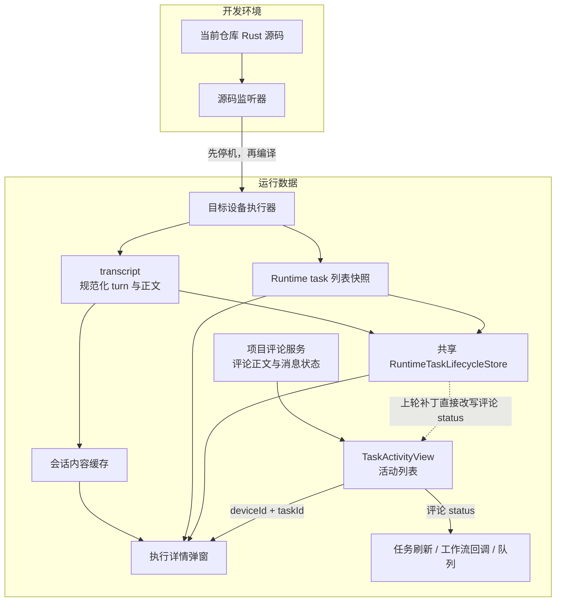
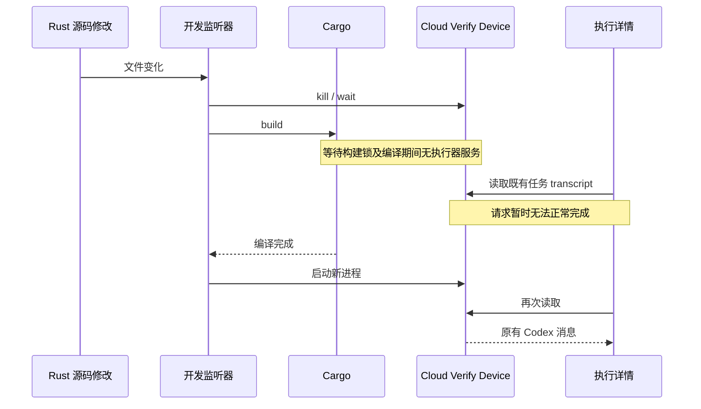
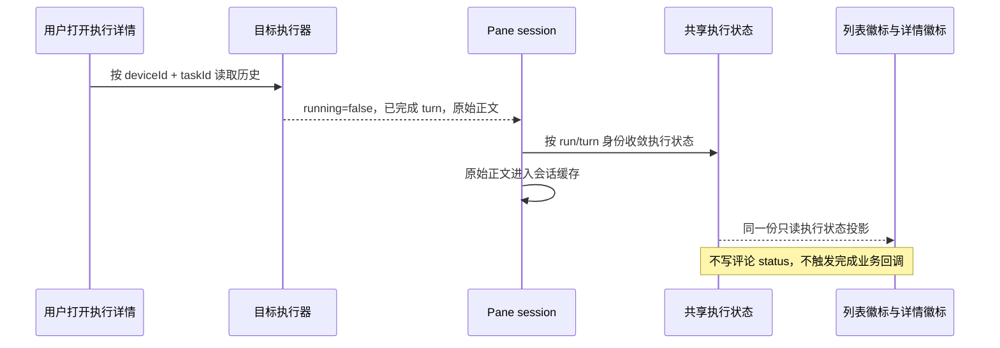
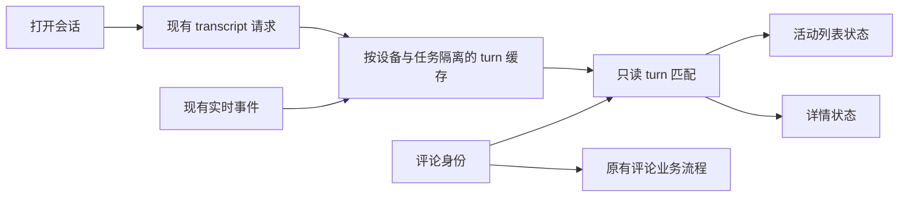
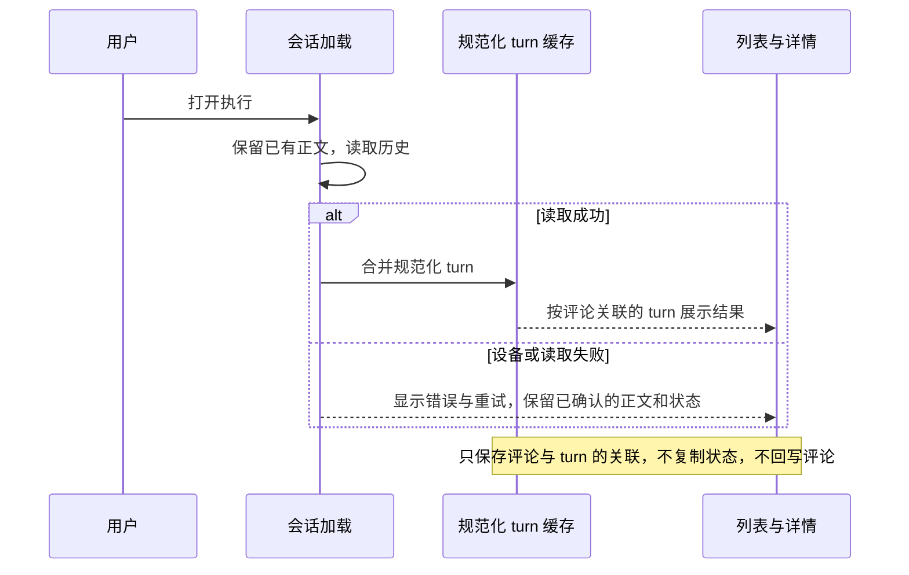
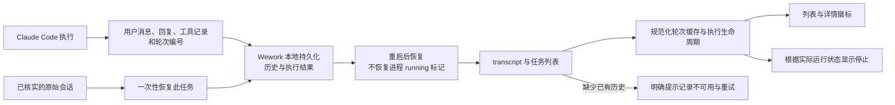
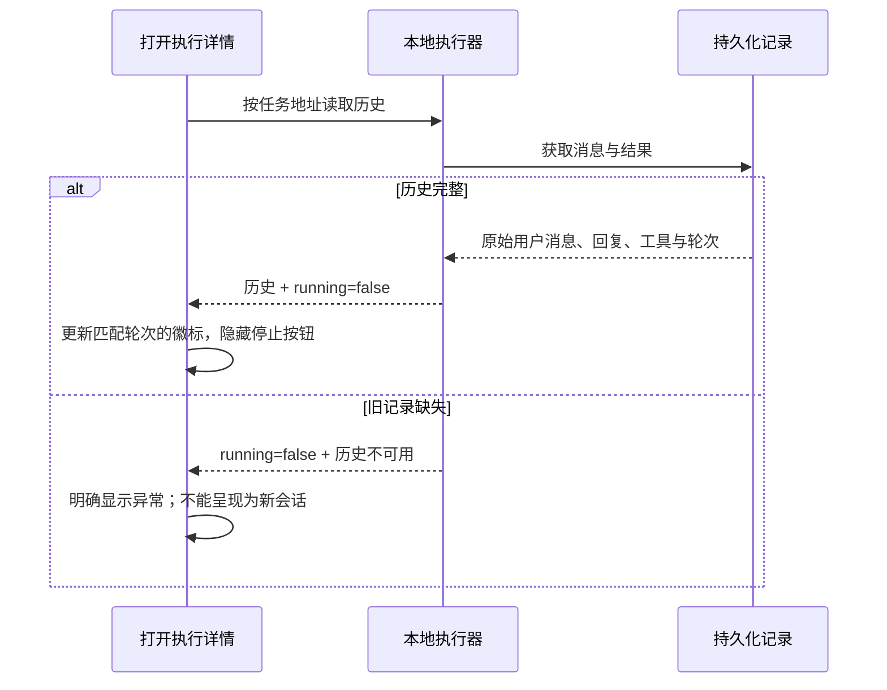
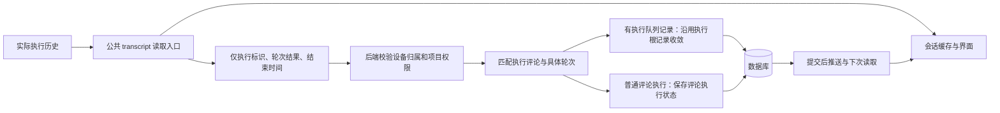
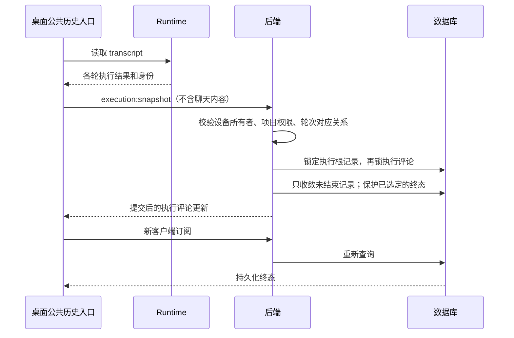

# Wework 执行状态与历史展示：2026-09-17 调查

下文先记录修复前的调查：只读取运行数据并做隔离对照，当时产品代码保持回滚后的状态；未恢复历史数据、未替换执行器、未重启用户进程。下文区分已证实的原因和仍待验证的界面表现。

## 结论与证据

1. **正常 Codex 任务也暂时无法读取的直接原因：开发源码与正在服务的设备共用进程。** `Cloud Verify Device` 由 `wegent-executor-dev` 启动，监听当前仓库的 `executor/src`。修改 Rust 源码会先杀掉子进程，再等待 Cargo 编译，完成后重新启动。上一轮修改触发了这条路径；“没有手动重启”不代表没有中断设备。
2. **原状态不一致：列表和详情没有消费同一个执行状态投影。** 活动列表用评论 `status`、`metadata.run_status`、Issue `ai_state`；详情结合 pane 的 running 和另一份任务列表状态。读取 transcript 已经更新共享生命周期，但活动列表没有读取它，详情也可能继续采用旧任务列表的 status。
3. **上一轮状态补丁越过了数据职责边界。** 它把执行状态回写到评论 `status`。该字段还驱动任务刷新、工作流完成回调和队列发送，不能作为仅供徽标展示的缓存。A/B 对照证实：相同历史读取，旧补丁额外触发一次项目任务刷新。
4. **最初空白的本地评论执行与正常 Codex 调度任务不是同一个运行实例。** 前者的 Claude 历史持久化问题仍有独立证据，但不能用它解释所有 Codex 历史暂时不可读。

日志：`~/.wegent-executor-cloud-device/executor.log.4`。

| 观察窗口（北京时间） | 证据 |
| --- | --- |
| 23:59:12–00:07:25 附近 | 连续源码重启与 3m03s、2m50s、1m40s 的编译记录；部分时间戳为 UTC，不能将原始文本顺序直接当作统一时区 |
| 00:10:20–00:20:48 | 两次 `executor source changed; restarting`；编译分别 7m17s、2m42s；旧执行器日志中断后新执行器恢复 |
| 00:21:02–00:22:56 | 回滚附近再次触发自动重启和编译 |
| 00:30:35、00:30:37 | `codex-queue-638` 从 Codex thread pagination 返回 6 条消息 |
| 00:30:59 | 正常截图中的 `codex-queue-628` 返回 2 条消息 |

重启实现见 `executor/src/bin/wegent-executor-dev.rs`：主循环先调用 `stop_child`，再调用 `rebuild_and_spawn`；`stop_child` 直接 kill 并 wait。Node 开发启动器 `wework/scripts/dev-executor-reload.mjs` 也先 `stopChild` 再 `runBuild`。

## 运行实例与身份

同一个 Issue 可以关联多个 Runtime task；机器人显示名不等于执行引擎。

| 界面记录 | Runtime task | 设备 | 实际引擎 |
| --- | --- | --- | --- |
| `PRJ3EB7D2-9` 的“执行pwd” | `codex-queue-638` | Cloud Verify Device | Codex |
| 同一 Issue 的“将上面的评论内容添加到issue描述里面去” | `runtime-280737517` | 本地应用执行器 | ClaudeCode |
| 正常截图“自定义 AI 调度员”，执行编号 `3118762067395402890` | `codex-queue-628` | Cloud Verify Device | Codex |

后两个任务分别属于不同 Issue、不同设备和不同执行器。不能从一个任务的 `messages=0` 推断另一个任务也丢了历史。

## 当前架构及错误耦合

两个职责越界：开发文件修改改变了正在服务的设备可用性；执行状态展示修改了评论业务状态。

## 源码修改影响正常历史读取的时序

这条链路已由代码、进程配置和日志证实。中断时具体显示“空会话”、加载中还是加载失败，尚未保留到当时的前端响应；不能把执行器离线直接等同于一个成功的空 transcript。

## 状态同步应走的时序

执行器是事实来源；共享状态是 UI 读取的投影；正文缓存、评论服务和执行状态各有职责。多次续聊时必须匹配具体 run/turn，不能仅凭同一个 taskId 或时间戳把最新任务状态覆盖到历史运行。

## 隔离对照验证

在 `wework/test-results/status-ab/` 中复制当前代码与回滚前备份，使用真实 `WorkbenchProvider`、pane 会话加载和生命周期 store；模拟外部 API 返回相同的完整 Codex 历史。未对正在运行的客户端重新应用旧补丁。

| 对照 | 列表徽标 | 详情徽标 | 历史正文 | 项目任务刷新次数 |
| --- | --- | --- | --- | --- |
| 回滚后的当前代码，旧 running 列表快照 | running | 执行中 | 请求和回复均保留 | 0 |
| 回滚前的状态补丁 | succeeded | 执行成功 | 请求和回复均保留 | 1 |

两项对照测试通过。它们证明状态来源分裂和回写副作用；**没有复现正文被该前端补丁直接清空**，因此不能把它当作已证实的清空原因。之前只 mock pane hook 的组件测试没有覆盖真实状态收敛和业务回调，验证范围不足。

## 根本修正边界

- 开发与用户设备隔离：在独立源码目录、构建目录和 executor home 中验证；用户日常设备使用固定构建，不监听开发目录。构建成功后显式、受控地切换版本，不能由保存源码触发停机。
- 状态展示只读取统一执行投影：列表与详情使用同一 selector，并保留 run/turn 身份；评论 status 的写入继续归评论服务和真实执行事件所有。
- 保留三种不同结果：有效空历史、任务不存在、设备/网络不可用。不可用不能被当成新对话，不能覆盖已确认的正文。
- 历史持久化独立验证：按实际 provider 验证完成、重启、重读；本地 Claude 问题单独处理，不能据此重写 Codex 读取路径。

以上调查阶段没有重新应用产品修复。后续前端修正及其验证边界记录如下。

## 2026-09-17：打开会话时同步展示状态

用户选择按打开会话读取的结果更新，不新增轮询。本次实现复用规范化会话缓存：这里已经有按设备、任务和 turn 区分的执行结果；任务级生命周期仍负责会话是否忙碌，不能用当前任务状态覆盖历史轮次。

- 新评论首次启动携带触发评论 ID；续聊携带执行评论 ID，沿用已有 `clientUserMessageId` 传输和持久化路径。自定义调度员续聊也遵循同一规则。
- 列表和详情通过同一 selector 读取对应 turn。成功、失败、取消各自保留；正文中的“完成了”和任务 idle 都不是成功依据。
- 旧数据没有关联 ID 时，仅在完整历史、同一设备任务只有一条执行评论、历史只有一个已识别 turn 时建立唯一关联。关联在当前活动视图内保留，之后出现新 turn 也不会改绑旧记录。
- 旧数据存在多条执行记录或多轮历史、无法唯一匹配时，保持服务端评论状态；本次不猜测历史对应关系，也不宣称已修复这类记录。完整解决这类旧数据需要恢复真实的 run/turn 关联。
- 不修改 Rust、执行器进程、持久化历史或评论状态。没有新增轮询。原始后端完成事件为何漏同步仍是独立待查事项。

验证使用真实 `WorkbenchProvider`、pane session、会话缓存及列表/详情组件，模拟外部 API。覆盖打开后的双处更新、关闭后保留、另一轮启动、失败重试和不完整历史拒绝推断。另有身份匹配单测和评论启动关联标识测试。真实设备 E2E 补充到现有 `collaboration-shared-core` 场景调用的 `board-reply-model.mjs`；本次未执行 E2E 或 `ai:verify`。

最终验证：6 个测试文件、88 项测试通过；Wework 类型检查、修改文件 ESLint 与格式检查通过。E2E 模块语法检查通过，其所属场景已在桌面 CI 中注册，未实际运行。jsdom 报告缺少 canvas 实现，这是本轮测试环境提示，不能代替真实客户端渲染验证。

## 2026-09-17：确认本地任务并修复历史保存

截图对应 `runtime-280737517`（Issue `PRJ3EB7D2-9`），实际引擎是 `claude_code`，不是机器人显示名所暗示的 Codex。原始会话 `1373eac3-c6fc-4e61-9bd7-915f18e561ae` 的工作目录、唯一用户请求与 Wework 记录匹配；原始回复在北京时间 2026-09-16 23:21:24.984 以 `end_turn` 结束，共 7 次工具调用。执行结束不等于业务目标全部完成，恢复保留原回复里的限制说明。

修复前直接读取正在运行的本地执行器：列表返回 `running=false/status=done`，历史接口成功但返回 `messages=[]/turns=[]`。落盘索引没有消息、结束状态和原始会话关联。这是历史记录异常，不是新会话，也不是有进程无法停止。

### 修正后的职责

- 本地 Claude 历史和执行结果可靠落盘；Codex 继续使用自身的原始历史读取路径。
- 缺失的请求任务编号与轮次编号在记录用户消息前分配；后续请求保留原始会话关联，避免多个空轮次编号混在一起。
- 完成回复携带的结果可在执行控制清理前持久化；重启时不会把旧进程的 running 状态当作仍在运行。未记录结果的中断会明确显示失败。
- 已结束任务的停止请求保持幂等，不再改写更新时间、结束时间或结果；界面停止后重新读取执行事实。
- 打开会话收到空闲结果后收敛状态；只有读取期间发生更新的实时事件时才保护新状态。找不到对应轮次时不推断业务成功。
- 已有执行返回空历史时显示异常与重试，执行器确认空闲时隐藏停止按钮；读取失败时保留已确认的历史。

### 验证和恢复证据

| 验证 | 实际结果 |
| --- | --- |
| Rust `runtime_work::` 单元测试 | 498 项通过，覆盖保存/重读、结束结果、取消、排队与历史投影 |
| Rust Claude 相关测试 | 40 项通过，包含两个轮次完成/取消后重启重读；同时修正一处测试服务器单次 TCP read 和 HTTP 头大小写假设 |
| 真实 WorkbenchProvider、pane、缓存的界面集成 | 空历史明确异常、空闲隐藏停止、停止后重读、重试恢复及已有状态同步通过 |
| 共享会话与弹窗测试 | 状态收敛、未知状态、空闲异常展示通过 |
| TypeScript、ESLint 与构建 | Wework 与两个共享包类型检查、针对性 ESLint/Prettier 通过；桌面前端产物构建通过并包含新增异常提示 |
| 原始任务隔离 IPC 验证 | 2 条消息、1 个轮次、7 个工具块，回复和工具内容与原始记录一致；空闲取消不修改结束时间 |
| 用户本地执行器 IPC 验证 | 已恢复上述内容，`done/running=false`，结束时间恢复为原始时间 |

恢复前已备份索引、原执行器和恢复清单至本机 `~/.wework/recovery/runtime-280737517-20260917-verified/`。恢复只修改目标任务的历史、原始会话关联和执行结果，不重新执行任务，不修改 Issue 或评论业务数据。完整备份与日志包含本地运行数据，不提交仓库。

Rust 修改先在隔离源码和构建目录验证；合回前检查云设备空闲，暂停源码监听、保持服务进程运行，预先完成构建后恢复监听，避免编译期间主动中断服务。前端沿用已有构建监听。

按项目要求，本轮没有运行 E2E 或 `ai:verify`，也没有驱动用户个人 Electron 窗口。现有 CI 覆盖的 `board-reply-model` 场景增加了已结束执行不得显示停止按钮的断言，尚未执行该 E2E。

源码已合回原工作目录并构建成功；用户本地执行器切换到合回后的构建后，再次经 IPC 确认原任务的 2 条消息、1 个轮次、7 个工具块和原始结束时间仍然保留。源码监听器已恢复运行。

## 2026-09-17：补齐云端执行状态持久化

以上分阶段修复中，“不回写评论”只解决了展示副作用，没有解决重开后的旧状态。本次直接查询确认：`runtime-280737517` 的本地历史已结束，但云端 `project_chat_messages` 中执行评论 `9f2f7db6-b289-4ec6-afc9-37b9d861b085` 仍是 `streaming`，`metadata.run_status` 仍是 `running`；没有对应的 `loop_item_executions` 行。此前修复了本地历史和界面缓存，缺少从历史读取结果到云端数据库的同步链路。

当前设计补齐该链路，不新增轮询：

匹配优先使用已保存的 turn ID、执行评论 ID、触发评论 ID。旧数据只有在完整历史、单条执行评论、单轮、已空闲且结束时间不早于评论创建时间时才允许关联。MySQL 的无时区时间按项目既定 `+08:00` 规则转换，SQLite 按 UTC。空历史、未知状态、分页不完整的模糊关联、设备不属于当前用户都不能推断成功。

普通评论执行只保存 `status`、`run_status`、`runtime_turn_id` 和 `runtime_completed_at`；仅当 Issue 的 `ai_state` 仍明确指向这一执行时更新该摘要。不调用推进业务任务到 review 的逻辑，不重新执行任务。队列执行沿用 `LoopItemExecution` 既有终态转换，不能越过执行根记录单独改评论。实时事件与历史同步遵循相同的锁顺序，重复上报不会重复修改，已保存的终态不会被相反结果覆盖。云端同步失败会明确记入日志，保留本地历史读取，并在下次读取时重新同步。

验证记录：

- 后端新增及原项目评论测试共 89 项通过；包括三种终态、再次订阅、幂等、新旧轮次隔离、归属校验、模糊历史、MySQL 时区和执行根记录冲突。
- 历史结果转换测试 12 项通过；不把未知状态默认当成功，不上传聊天正文。
- 桌面 hybrid 服务测试 56 项通过；覆盖读取后写回、断网不阻塞本地历史、下次读取重试。类型检查、针对性 lint 和前端构建通过。
- 实际任务通过本地 IPC 确认 `running=false`、原轮次 `done` 和原结束时间，再调用相同后端收敛服务。独立数据库连接确认评论与 `run_status` 均为 `completed`，`ai_state` 为 `completed`，业务任务状态保持不变。修改前的数据库投影备份保存在原本机恢复目录，未提交仓库。
- 既有 CI `board-reply-model` 场景增加独立 Socket.IO 客户端重新订阅、验证数据库终态的断言。本轮未运行 E2E 或 `ai:verify`。

最后通过正在运行的后端 Socket.IO 接口再次上报同一结果，返回修改行数 0；另建客户端订阅后读取到 `completed` 和对应原始轮次，确认线上接口幂等及重新读取的持久性。该检查使用原有认证、只重复已核实的结果，没有启动新的执行或操作个人 Electron 窗口。
