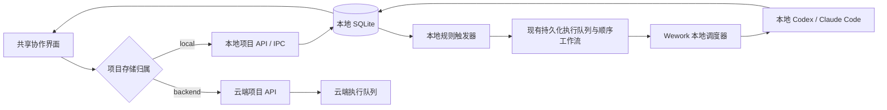
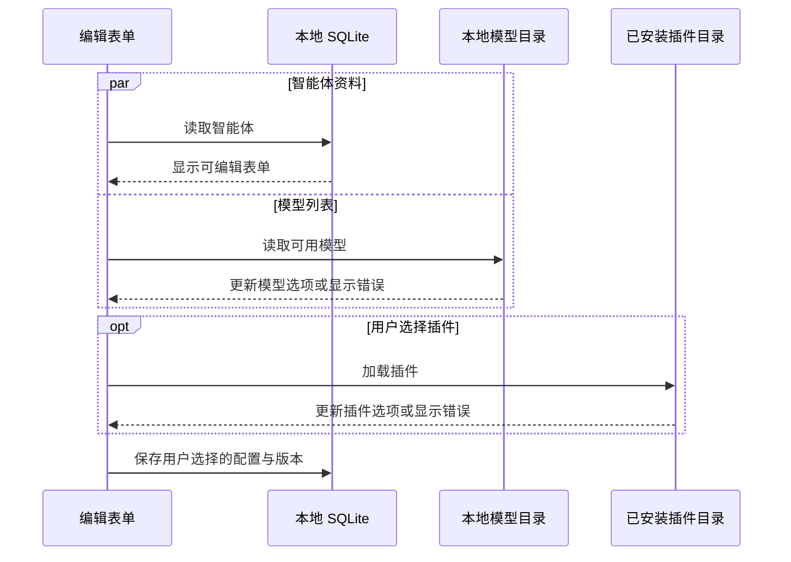
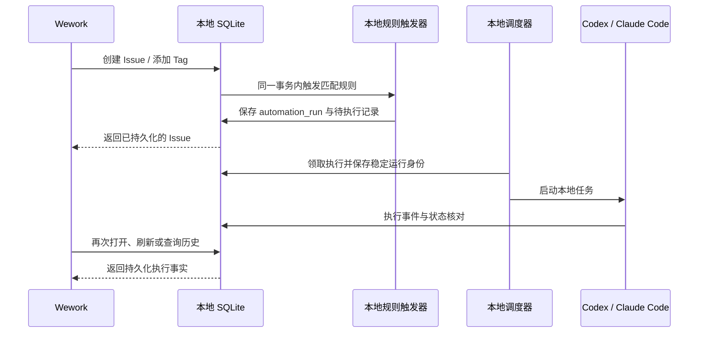
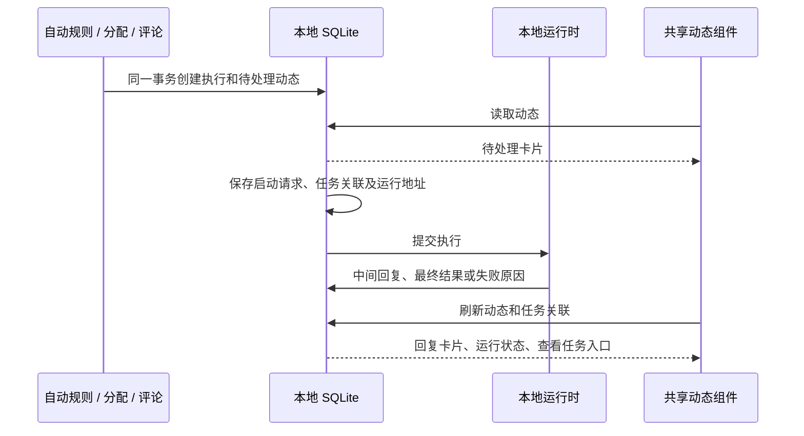

# Wework 本地项目与智能体执行

本地项目由 Wework 存储和驱动，不依赖 Wegent Backend。项目、Issue、评论、
智能体配置、协作组、自动处理规则、执行记录都保存在当前设备。模型请求使用
本地配置的供应商或运行时登录；不连接 Backend 不等于模型推理不需要网络。

## 所有权与入口

| 对象                      | 本地项目                                 | 云端项目               |
| ------------------------- | ---------------------------------------- | ---------------------- |
| 项目、Issue、评论         | Executor 的 SQLite                       | Backend                |
| 智能体                    | 本地 ProjectChatAgent                    | 云端资源与项目绑定     |
| 模型、Skills、MCP、Plugin | Wework 本地配置与安装资源                | 云端定义及所选执行环境 |
| 自动处理规则与执行记录    | 本地项目元数据、automation_run、执行队列 | Backend                |
| 执行器                    | 当前 Wework 的本地运行时                 | 所选云端或本地执行环境 |

界面复用 `packages/collaboration`。Wework 按项目的 `project_store` 选择数据接口，
不能根据 API 请求是否成功猜测项目属于哪里。本地智能体创建和编辑直接调用本地
IPC，不需要先在云端创建 Team，也不保存或解析云端 Team 绑定。

## 复用的实现

- `localDelivery.ts`：本地项目、Issue、智能体和执行 API。
- `localWorkspaceApi.ts`：共享协作界面的本地适配，包括每次看板刷新时加载智能体。
- `LocalProjectAgentForm.tsx`：编辑本地运行时、模型、代码工作区、指令、审批、
  Skills、MCP 和 Plugin。
- `LocalTaskStore`：SQLite、版本冲突检查、执行身份、领取租约、停止、状态回写。
- `local_automation.rs`：将本地自动处理规则转成已有队列记录或顺序工作流。
- `localRobotQueueDispatcher.ts`：领取任务并提交给现有 Runtime API；本地与云端
  领取循环互相独立，云端请求失败或挂起不会卡住本地任务。

本地项目使用不带 `cloudModelGateway` 和云端 Team 物化器的服务实例。执行请求
携带 `origin.projectStore = local`；执行器据此移除 Backend 凭据并禁止自动注入。
会话历史响应携带已保存的 origin，读取本地任务历史不会向 Backend 回写状态。

## 编辑智能体的加载边界

编辑表单仅等待本地智能体记录。模型列表独立加载，插件目录由用户点击后读取，
都不阻塞名称、指令、工作区等字段。目录失败明确显示错误，重试目录不会重置草稿。
旧配置的模型若不在可用列表中，显示原值并阻止保存；只有用户明确选择其他模型
或运行时默认值后才更新，不静默替换模型。模型目录仍在加载时可保存默认模型。

已安装插件选择只读取安装清单，不为了显示名称请求在线应用目录。

## 自动处理与状态

当前支持 Issue 创建、添加指定 Tag、通过 Issue 更新接口改变状态，以及定时触发。
人工目标更新本地负责人；智能体目标进入执行队列；协作组的阶段按顺序转成现有
工作流。运行状态根据持久化执行记录及尚未完成的工作流阶段计算，等待人工阶段
不能误报成功。规则无效或智能体已归档时，保留 Issue，并记录失败及原因。

定时任务复用现有 Cron 与时区解析，下一次触发时间保存在项目元数据。应用重启
后不会重复投递同一个已消费时间点；离线期间错过的周期在恢复后合并处理一次。
调度由 Wework 驱动，完全退出应用后不会启动新执行。

停止先保存工作流停止标记，再取消关联执行。尚未启动的任务直接取消；已经提交
运行时的任务保持取消请求状态，直到运行时确认结果。停止后即使收到迟到的完成
事件，也不能继续启动下一阶段。重试创建新的运行记录，保留旧失败或取消记录。

外部 Webhook 接入和云端成员管理仍属于云端能力。本地自动处理不展示未接入的
外部事件入口；旧云端工作流迁移接口不在本地模拟成功。

## 本地执行动态

执行入队时，在同一事务中创建动态卡片；自动规则、手动分配、评论和协作组阶段
共用这个入口。请求运行前保存任务关联与动态中的运行地址，短任务即使早于启动
确认完成，也不会丢失“查看任务”入口。Codex 的中间回复写入动态，最终结果和
失败原因随执行状态落库；迟到的中间回复不能覆盖终态。

## 数据升级与验证

SQLite schema v8 为旧版 `loop_item_executions` 补齐 `execution_payload`。升级只
增加缺失字段，不清空已有项目、Issue、会话或执行记录；已有 payload 保持不变。
更新后的执行器启动时应用迁移，不需要手动修改个人数据库。

SQLite schema v9 根据已有执行事实补齐缺失的动态和任务关联，保留已存储的回复、
失败原因与手动解除的关联，不重新执行任务。升级和重复打开不能制造重复卡片。

针对性验证覆盖本地智能体创建/编辑和错误恢复、云端阻塞隔离、Codex/Claude
执行、规则触发、重启持久化、协作组阶段推进与停止/重试、v7 数据迁移。
离线桌面场景位于已有 CI 桌面测试套件，并检查本地操作没有调用云端项目接口。
E2E 和真实 Electron 验证按仓库策略，仅在明确要求时运行。
