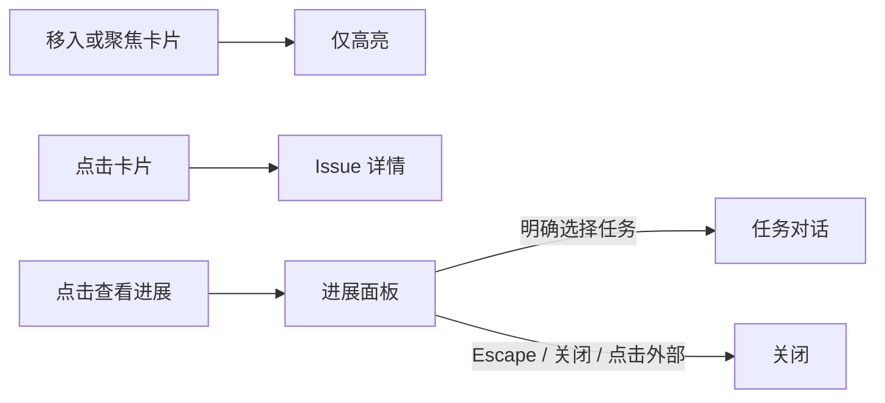

# 看板卡片与进展面板交互

## 规范依据

- [WAI-ARIA APG Tooltip](https://www.w3.org/WAI/ARIA/apg/patterns/tooltip/)：
  Tooltip 不接收焦点；包含可聚焦控件的悬浮内容应使用非模态对话框。
  APG 是交互指导，且该 Tooltip 模式仍标注为开发中，不是强制要求点击展开的标准。
- [WCAG 2.2，1.4.13：悬浮或聚焦时出现的内容](https://www.w3.org/WAI/WCAG22/Understanding/content-on-hover-or-focus.html)：
  额外内容必须满足可关闭、可移入、持续可读的适用条件。说明文档明确指出，
  无意触发和遮挡原任务是此类交互的常见问题。
- 项目 `wework/DESIGN.md`：Tooltip 只补充标签，不承载必要操作；
  交互面板使用 Popover；次要操作不能夺取主操作点击，关键功能不能仅依赖悬浮。

以上规范没有统一规定所有看板必须采用某个悬浮延迟。
本产品选择**明确点击查看进展**，因为面板包含完整对话、输入框和执行操作，
与卡片的“打开 Issue”属于不同意图。

## 交互契约

| 操作 | 结果 |
| --- | --- |
| 移入、停留、聚焦卡片 | 仅高亮，不自动挂载进展面板 |
| 点击卡片主区域 | 打开 Issue 详情 |
| 点击“查看进展”，或聚焦按钮后按 Enter / Space | 打开进展面板，焦点移入面板，不自动聚焦输入框 |
| 移开鼠标、阅读或操作面板 | 面板保持打开 |
| 点击另一任务按钮 | 切换该任务对话；悬浮和聚焦不切换 |
| Escape、关闭按钮 | 关闭面板，焦点返回触发按钮，不重新打开 |
| 点击面板外的 Issue | 关闭面板，同时正常打开 Issue，无须再点一次 |
| 禁用预览、拖动卡片、失去可展示的执行 | 关闭面板；恢复后仍需明确点击打开 |

主区域包含标题、元数据、进展摘要、边缘和留白，统一使用箭头光标并打开同一个 Issue。
卡片内的按钮和链接也使用箭头，避免在卡片内移动时反复切换光标；点击行为保持不变。
整个看板页面统一禁止手形，包括导航、工具栏、筛选、卡片及挂载到 body 的弹层。
此规则由当前可见看板启用；隐藏的工作区标签不会影响其他页面。输入光标、拖拽和调整尺寸光标保留。
点击摘要或留白与详情按钮执行相同的打开动作，焦点落在详情按钮，不增加重复键盘焦点。
独立按钮、链接和输入控件只执行自己的操作，不能顺带打开 Issue；无查看权限时主体不响应。
悬浮不得改变卡片位置、尺寸或按钮命中区域。
“查看进展”是独立的原生按钮，与进展摘要内的修复、审查等操作互不嵌套。
面板复用 Radix Popover 的定位、碰撞处理和焦点管理，保留现有任务对话能力。

## 录屏证据与验证边界

2026-09-16 录屏长 11.9 秒，共 434 个编码帧；时间戳并非始终以 60fps 均匀分布。
全片时序缩略图显示进展面板在鼠标停留期间出现、退出后消失。
对 5.7–9.5 秒关键区间逐帧裁剪检查可见：卡片边界基本稳定，
箭头与手形光标在卡片内部反复切换。因此不能把主观“抖动”直接等同于卡片位移。
录屏不能单独证明具体浏览器命中测试或系统光标机制。

旧实现把整卡悬浮（450ms）、整卡焦点立即展开和打开 Issue 的点击放在同一区域；
点击的 pointerdown 关闭后，focus 又能立即打开。面板还通过鼠标进入任务块改变内容集合。
新实现移除这些竞争路径，并始终保留卡片外层结构，避免进展可用性变化时替换卡片祖先。

自动化回归覆盖：悬浮/聚焦/普通点击不弹出、不标已读；明确打开后才计时标已读；
提前关闭取消计时；键盘打开、Escape 和关闭恢复焦点；外部点击只需一次；
移开鼠标保持打开；任务切换必须点击；禁用预览不提供入口。
现有 `board-focus-view` 桌面 CI 场景同步检查停留后不自动打开及明确点击打开。
按项目执行策略，本次只运行针对性单元测试、类型检查和静态检查；
真实 Electron 下的光标稳定性仍需实机验证，不以单元测试冒充逐帧修复验证。
