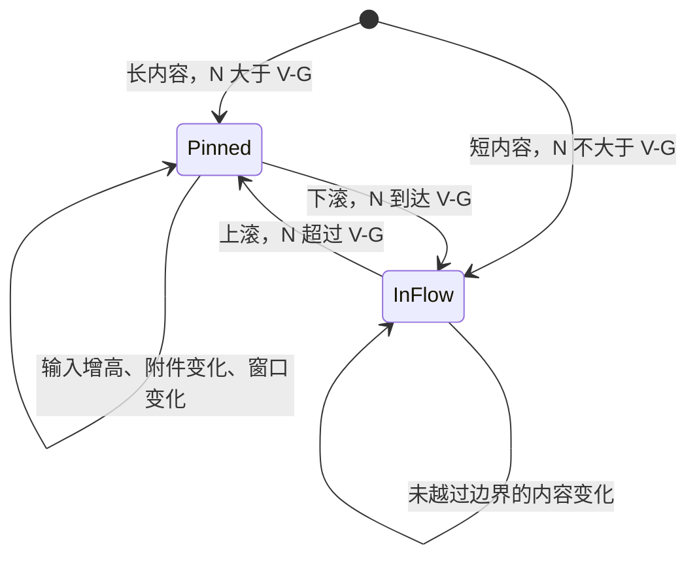

# 任务动态评论框交互规范

本规范约束任务详情动态区的大评论框。卡片内的小回复框始终随卡片滚动。
“逐帧”指每个浏览器绘制帧满足几何不变量，不是按固定毫秒播放动画。
下列数值使用 CSS 像素；截图物理像素需除以设备缩放比后比较。

## 坐标与状态

- `V`：详情面板实际滚动容器的可视底边，不是窗口或某张卡片的底边。
- `G = max(16px, safe-area-inset-bottom)`：吸底时的底部安全间距。
- `N`：评论框在正常文档流中的底边位置，使用可视区域坐标。
- `B`：评论框实际底边。动态区域进入可视范围且容得下评论框时，每帧满足 `B = min(N, V - G)`，误差不超过 `1px`。
- 内容列与评论框左右边缘对齐，误差不超过 `1px`；切换状态不得改变宽度。
- 评论框使用同一个 DOM 实例。不得通过切换两份输入框实现吸底，避免焦点、草稿、附件和输入法状态丢失。

## 逐帧行为

| 情境                 | 每帧位置与内容行为                                               | 禁止行为                                   |
| -------------------- | ---------------------------------------------------------------- | ------------------------------------------ |
| 首次进入动态区       | 长内容吸底；短内容留在动态后方，不制造大块空白                   | 先出现在正文中间再跳到底部                 |
| 滚动中段             | `B = V-G`；只有正文随滚动位移，评论框底边与宽度不动              | 在吸底框下方继续露出正文、随卡片移动       |
| 接近末尾             | 从 `N > V-G` 连续过渡到相等，不运行位移动画                      | 切换定位方式产生一帧跳跃、抖动或重复输入框 |
| 滚到末尾             | `B = N`；最后一条动态距框顶至少 `12px`，面板底部正常留白 `32px`  | 最后一条内容永久被遮挡、额外叠加占位留白   |
| 反向上滚             | 原路连续回到吸底，不改变滚动位置、草稿或焦点                     | 吸底时自动滚回最下方                       |
| 输入换行             | 从两行起向上自动增高；文本区最多 `240px`，超过后仅文本区内部滚动 | 原生拖拽缩放角标、框底随高度下降           |
| 附件、设置、错误展开 | 整体向上增高，吸底基准不变；矮面板上限制框高并允许内部滚动       | 控件挤出面板、弹层被输入框裁切             |
| 新消息或图片迟加载   | 重排后仍满足公式；用户阅读中段时不主动拉到底部                   | 用延时或反复 scrollTo 掩盖定位错误         |
| 面板尺寸、安全区变化 | 下一布局帧重新使用实际 `V` 和 `G`，水平对齐不变                  | 缓存打开时的窗口高度、使用固定屏幕坐标     |

吸底层到面板底边之间必须有不透明的面板背景，正文可以从框后滚过，但不能从框下的小缝里露出来。
正常流中的评论框自身占据空间；不要再补一份固定高度占位。执行设置菜单保持独立弹层层级。
矮面板时评论框最大高度为可视高度减去安全间距和 `16px` 顶部余量，工具栏和输入区仍可访问。

## 实现约束

1. 详情面板是唯一的正文纵向滚动容器；动态列表不得形成另一个滚动区域。
2. 吸底间距只能有一个来源。滚动容器的底部 padding 不能与 sticky 的 bottom 重复叠加；末尾留白放在内容列内。
3. 使用浏览器布局实现连续定位，不在 scroll 回调里逐帧写 top、transform 或重挂载输入框。
4. 输入、附件、展开设置带来的高度变化必须参加布局；禁止用只在初次挂载时测得的框高定位。
5. 键盘发送遵守用户配置；Shift+Enter 换行，输入法确认不得发送；失败保留草稿和附件。
6. Web 和桌面共用主评论框、附件卡片和图片预览组件；文件存储与下载由宿主提供。图片上传时先显示缩略图，完成后使用同一个图片预览界面，支持放大、缩放、下载和退出。
7. 主评论框工具栏固定为执行设置、附件和发送。输入 `@` 后显示可用成员或智能体候选；提及只修改评论正文，不隐式重新分配 Issue。
8. 执行设置作用于本次评论的执行上下文；不得用修改项目全局配置的入口替代。发送期间保留草稿，成功后才清空，切换 Issue 后不得将旧请求的结果写入新评论框。

## 验收与证据

单条动态正文默认最多展示 `240px`，窄屏（不超过 `767px`）为 `192px`，约 8–10 行普通正文。
按实际渲染高度判断溢出，短内容不显示控制；长内容显示“展开全文 / 收起”，不按字符截断 Markdown。
只折叠正文，不折叠作者、时间、回复入口和运行状态。展开保留完整表格、代码与链接，不新增正文内部纵向滚动区。
窗口变窄、流式内容增长及图片加载后重新测量；用户已展开时不得自动收起。
收起导致当前动态移出面板上方时，将该动态顶部带回可视区；不要跳到整个列表的底部。

测试数据必须包含短列表、多屏长 Markdown、代码块、最后一条运行动态、附件与发送错误。
在桌面和窄面板分别检查初始、中段、距边界前后 `1px`、末尾和反向滚动；覆盖两行与多行输入、设置展开、面板缩放。
采集每帧 `scrollTop`、滚动容器 rect、评论框 rect 和正常流底边，按上式断言，并留中段与末尾截图。
在用户阅读中段时追加内容，确认没有强制跳到底部；末尾必须能读到最后一条完整动态。

CSS 隔离验证只证明布局机制。单元测试、类型检查和静态截图均不能替代真实 Electron 的滚动验收。
遵守仓库执行政策：E2E 和 AI verify 只在用户明确要求时运行；未运行必须标为未验证。

Web 和 PC 的动态正文统一使用 PC 的 Markdown 渲染：标题、编号列表、代码高亮、表格复制与展开、图表预览使用同一套组件。宿主只提供剪贴板、链接打开、主题和鉴权附件读取；本地文件与本地 HTML 预览由桌面适配层提供。禁止再给 Web 单独实现一套正文样式或渲染入口。

