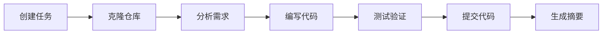

# 管理代码任务

本指南详细介绍如何在 Wegent 中创建、执行和管理代码类型的任务。

---

## 目录

- [什么是代码任务](#什么是代码任务)
- [创建代码任务](#创建代码任务)
- [任务执行流程](#任务执行流程)
- [任务状态管理](#任务状态管理)
- [运行中发送后续指令](#运行中发送后续指令)
- [高级功能](#高级功能)
- [查看 Codex 生成的可视化](#查看-codex-生成的可视化)
- [清理过期运行时](#清理过期运行时)
- [常见问题](#常见问题)

---

## 什么是代码任务

代码任务是 Wegent 中专门用于软件开发的任务类型。与普通聊天任务不同，代码任务会连接到 Git 仓库，AI 智能体可以直接在仓库中进行代码修改。

**核心概念**：

```
代码任务 = 用户提示词 + 代码智能体 + Git 仓库 + 分支
```

### 代码任务 vs 聊天任务

| 特性         | 代码任务               | 聊天任务         |
| ------------ | ---------------------- | ---------------- |
| **Git 仓库** | 必需                   | 可选             |
| **代码执行** | 在 Docker 容器中执行   | 无代码执行       |
| **工作台**   | 显示文件变更、提交历史 | 不显示           |
| **分支管理** | 自动创建功能分支       | 无               |
| **适用场景** | 代码开发、重构、修复   | 问答、分析、文档 |

---

## 创建代码任务

### 步骤 1：进入编码入口

1. 点击左侧导航栏的 **"Code"**，进入 `/chat?agent=code` 编码模式
2. 系统显示代码任务列表和输入区域

### 步骤 2：选择代码智能体

在输入区域上方，点击智能体选择器：

1. **点击智能体下拉菜单** - 显示可用的智能体列表
2. **选择代码类型智能体** - 选择配置了 ClaudeCode Shell 的智能体

> ⚠️ 只有配置了代码类型 Shell 的智能体才能执行代码任务

### 步骤 3：选择代码仓库

1. **点击仓库选择器** - 显示您有权访问的仓库列表
2. **选择目标仓库** - 选择要进行代码修改的仓库
3. **选择分支** - 选择基础分支（AI 会基于此分支创建新分支）

### 步骤 4：配置任务选项（可选）

#### 模型选择

点击模型选择器可以覆盖智能体的默认模型：

- **选择模型**：从下拉列表中选择
- **强制覆盖**：启用后，即使智能体已配置模型也使用您选择的模型

在 Wework 的已有对话中切换到不同模型时，系统会先提示确认。不同模型对已有上下文的理解、工具支持、回复风格和任务连续性可能存在差异。确认后，新模型从下一条消息开始使用；如果当前回复仍在进行，它会继续使用原模型。新对话首次选择模型，或重复选择已经选中的模型时，不会显示该提示。

#### 友好标题

在 **设置 > 通用 > 运行** 中可以打开“使用友好标题”。该功能默认关闭；打开时必须指定标题生成模型：

- **与任务相同**：默认选项。每次创建任务时，使用该任务实际选择的模型生成标题。
- **指定模型**：只用于异步生成标题，不会改变任务本身使用的模型。

标题生成不会阻止任务发送。若指定的标题模型已经不可用，Wework 会跳过标题生成，任务仍会正常创建。

#### 知识库上下文

点击上下文按钮添加知识库：

1. **点击 "#" 按钮** - 打开上下文选择器
2. **选择知识库** - 勾选要添加的知识库
3. **确认选择** - 知识库显示为标签

#### 技能选择

如果智能体支持技能：

1. **点击技能按钮** - 打开技能选择器
2. **选择技能** - 勾选需要的技能
3. **或使用 "/" 命令** - 在输入框中输入 `/` 触发技能选择

### 步骤 5：输入任务描述并发送

1. **在输入框中输入任务描述** - 清晰描述您的需求
2. **添加附件（可选）** - 点击附件按钮选择文件，或将 Finder 中的文件直接拖入 Wework 输入框
3. **按 Enter 发送** - 或点击发送按钮
4. **等待响应** - 智能体开始处理并流式返回结果

---

## 任务执行流程

### 执行阶段



### 1. 任务初始化

- 系统创建任务记录
- 分配执行容器
- 克隆目标仓库到容器中

### 2. 代码分析

- AI 分析仓库结构
- 理解现有代码模式
- 规划实现方案

### 3. 代码实现

- AI 使用工具读取、编辑、创建文件
- 执行必要的命令（如安装依赖、运行测试）
- 实时在工作台显示进度

### 4. 代码提交

- AI 创建功能分支
- 提交代码变更
- 生成提交信息

### 5. 任务完成

- 生成任务摘要
- 显示文件变更统计
- 提供创建 PR 的选项

---

## 任务状态管理

### 任务状态

| 状态          | 描述     | 操作                |
| ------------- | -------- | ------------------- |
| **PENDING**   | 等待执行 | 可取消              |
| **RUNNING**   | 正在执行 | 可停止              |
| **COMPLETED** | 执行完成 | 可查看结果、创建 PR |
| **FAILED**    | 执行失败 | 可重试              |
| **CANCELLED** | 已取消   | 可重新创建          |

### 停止任务

如果需要停止正在运行的任务：

1. **点击停止按钮** - 在输入区域或任务详情中
2. **确认停止** - 任务将被标记为已取消
3. **查看部分结果** - 已完成的代码变更会保留

### 重试任务

如果任务失败：

1. **查看错误信息** - 了解失败原因
2. **点击重试按钮** - 重新执行任务
3. **或修改后重试** - 调整任务描述后重新发送

重试请求被接受后，失败消息对应的 turn 会从对话中移除。重试成功时，对话只保留原始用户消息和新的成功回复，不会继续显示旧的失败卡片，也不会留下空的回复 turn。重新打开任务时，Wework 会按相同规则恢复对话。

## 运行中发送后续指令

在 Wework 中，任务仍在运行时可以选择三种发送方式：

- **当前回复结束后发送**：把消息加入队列，等待当前 turn 完成后发送。直接按 `Enter`。
- **引导当前回复**：不停止当前 turn，由 Codex 在可接受新输入的边界应用指令。按 `Command/Ctrl + Enter`。
- **打断并立即发送**：停止当前 turn，并立即把消息作为同一会话中的新 turn 发送。按 `Command/Ctrl + Shift + Enter`。

输入内容后，点击发送按钮右侧的向下箭头可以展开菜单。菜单中的时钟表示等待当前回复结束，转向箭头表示引导当前回复，闪电表示打断当前回复并立即发送。打断不会回滚已经产生的文件修改或其他工具副作用；普通待发送消息会继续保留在队列中。

队列按从上到下的顺序串行发送。当前 turn 的终态事件不会单独触发发送；只有本地 Executor 的任务快照确认执行已空闲后，Wework 才会发送队首消息。发送后还会等待该消息对应的新 turn 确认启动；在此之前不会发送下一条，避免多个待发送消息并发提交。队列中有多条消息时，可以拖动每条消息左侧的抓手实时调整顺序。停止当前回复会同时暂停队列，不会立即发送下一条消息。点击“继续发送”会恢复引导状态，并直接发送队首消息。

如果队列暂停后在输入框中发送新消息，Wework 会询问如何处理原队列：

- **保留并继续**：先发送输入框中的新消息，再继续发送保留的队列；输入框会在提交后清空。
- **清空队列**：移除原队列，只发送输入框中的新消息。
- **取消**：不发送消息，并保留输入框和队列。

侧边栏临时对话支持与主对话一致的运行中发送方式。当前回复执行时，直接发送的新消息会进入待发送队列，并在当前回复完成后自动发送；选择“引导当前回复”则会把消息应用到临时对话正在进行的同一个 turn，而不是创建普通后续 turn。排队期间不会将“任务正在运行”作为发送失败展示；可以在队列卡片中取消、编辑待发送消息，或将其改为引导当前回复。

---

## 高级功能

### 继续对话

任务完成后，您可以继续与智能体对话：

1. **在同一任务中发送新消息** - 智能体会基于之前的上下文继续工作
2. **请求修改** - 如 "请把函数名改成 createUser"
3. **请求补充** - 如 "请添加单元测试"

### 查看执行详情

在工作台中查看详细的执行信息：

- **执行时间线**：查看 AI 使用的工具和执行顺序
- **工具耗时**：每个命令或工具行显示自身的精确耗时；工具分组标题不把整轮思考和等待时间误算为工具耗时
- **思考摘要**：运行时显示模型提供的最新推理摘要，完成后可展开查看
- **提交历史**：查看所有代码提交
- **文件变更**：查看每个文件的具体修改

### 创建 Pull Request

任务完成后，可以直接创建 PR：

1. **点击 "创建 PR" 按钮** - 在工作台或任务菜单中
2. **填写 PR 信息** - 标题、描述等
3. **提交 PR** - 系统会在 GitHub/GitLab 中创建 PR

### 导出任务

导出任务的对话历史和代码变更：

1. **点击导出按钮** - 在任务菜单中
2. **选择格式** - Markdown 或 JSON
3. **下载文件** - 保存到本地

---

## 查看 Codex 生成的可视化

当 Codex 在任务工作区中生成 HTML 可视化文件并在回复中引用它时，Wework 会在该回复内直接显示图表或交互页面，无需复制文件路径或另开浏览器。

- Wework 支持最新的 visualize 内容引用，例如 `visualize{"path":"/绝对路径/output/chart.html"}`。该绝对路径无需出现在当前回复的文件变更摘要中，也不限定文件所在目录，因此工作区输出和 Wework 附件草稿中的 HTML 都可以直接显示。
- 旧版 `::codex-inline-vis{file="chart.html"}` 指令仍然可用。旧版指令只会从当前回复创建或修改的文件中解析相对路径或唯一同名文件，包括 `.codex/visualizations/` 下按日期和会话组织的片段。
- 可视化在脚本隔离的 iframe 中运行，无法访问 Wework 页面。
- HTML 由 Wework 桌面后端读取，再交给隔离的 iframe 渲染。只接受不超过 5 MB 的 UTF-8 `.html`、`.htm` 或 `.xhtml` 普通文件；符号链接、格式错误、包含父目录跳转的路径，以及位于代码块内的指令按普通文本显示或不会加载。
- Wework 使用 UTF-8 的可视化宿主包装 HTML 片段，提供 Codex 可视化主题变量，并根据片段内容自动调整 iframe 高度。

### Mermaid 和 PlantUML 图表

当模型在回复中输出 `mermaid`、`mmd`、`plantuml` 或 `puml` 代码块时，Wework 会在流式输出过程中直接渲染图表，不需要先创建 HTML 文件。图表跟随当前明暗主题，并自动适应会话宽度。

图表右下角提供两个操作：

- **复制图片**：把当前图表以 PNG 格式写入系统剪贴板。
- **保存图片**：打开系统保存窗口，将 PNG 保存到本地。

工作区文件面板也可以直接预览 `.mermaid`、`.mmd`、`.plantuml` 和 `.puml` 文件，并提供相同的复制和保存操作。

## 清理过期运行时

管理员可以手动清理长时间无更新的代码任务运行时，释放执行容器资源。清理只会删除运行时 Pod/容器，不会删除任务记录、对话历史或代码变更。

适用场景：

- 任务已经停止或结束，但执行环境仍占用资源
- 运行时长时间没有活动，需要按 Task ID 定向回收
- 先使用 dry run 确认将要清理的对象，再执行实际清理

清理规则：

- 只能按单个 Task ID 清理，不支持从用户界面发起全量清理
- 未达到配置的未活动时长时不会删除
- 开启 `preserveExecutor` 的任务不会被清理
- device executor 不会通过该清理入口删除
- 清理后仍可查看任务历史，但需要重新执行时会分配新的运行时

详细接口说明请参阅开发者文档中的 [运行时清理](../../developer-guide/runtime-cleanup.md)。

---

## 常见问题

### Q1：任务一直处于 PENDING 状态？

**可能原因**：

1. 没有可用的执行容器
2. 仓库访问权限问题
3. Git 令牌过期

**解决方案**：

- 检查系统资源是否充足
- 验证 Git 令牌是否有效
- 检查仓库访问权限

### Q2：代码提交失败？

**可能原因**：

1. 分支保护规则
2. 权限不足
3. 网络问题

**解决方案**：

- 检查目标分支的保护规则
- 确认 Git 令牌有写入权限
- 重试任务

### Q3：AI 修改了错误的文件？

**解决方案**：

1. 在任务中明确指定要修改的文件路径
2. 提供更详细的上下文信息
3. 使用知识库提供项目结构说明

### Q4：如何让 AI 遵循项目的编码规范？

**解决方案**：

1. 在仓库根目录添加 `.cursorrules` 或 `.windsurfrules` 文件
2. 在任务描述中明确说明编码规范
3. 使用知识库提供编码规范文档

### Q5：任务执行时间过长？

**可能原因**：

1. 任务范围过大
2. 需要安装大量依赖
3. 网络延迟

**解决方案**：

- 将大任务拆分成小任务
- 使用预配置的基础镜像
- 检查网络连接

---

## 相关资源

- [概述](./README.md) - AI 编码功能概述
- [需求澄清模式](./spec-clarification-guide.md) - 需求澄清功能
- [智能体设置](../settings/agent-settings.md) - 配置代码智能体

---

<p align="center">高效管理您的代码任务，让 AI 成为您的编程助手！🚀</p>
