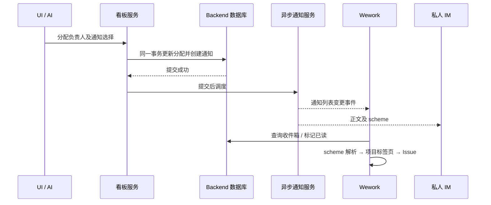

# Wework 通知与跳转

右上角反馈按钮旁的铃铛是统一通知入口。铃铛角标和 macOS Dock 角标显示所有来源的未读总数：当前设备可见的任务完成提醒、协作通知（任务指派、评论提及、运行状态和人工协作），以及其他云端通知。托盘是否显示未读任务，不影响这个总数。

点击铃铛打开分类弹窗，分别进入“任务动态”“协作通知”“其他通知”。分类入口显示最新摘要、时间和各自的未读数，不把不同来源的消息混在一个列表中。打开一条通知才会标为已读；有关联地址时打开对应目标，没有地址时保留当前页面及通知内容。仅打开弹窗不会清除未读，“全部已读”会处理当前可用来源的未读项。

点击通知弹窗右上角的设置按钮，可以按“任务动态”“协作通知”“其他通知”分别开关应用内、系统和 IM 通知。本地离线时仍可修改任务动态的应用内和系统通知；连接 Backend 后，当前账号保存的设置接管。协作通知的 IM 开关同时控制任务指派、评论 @、运行状态和人工协作发送到钉钉等已连接私人 IM 会话的推送；其他通知的 IM 开关控制通用通知推送。关闭应用内通知会把该分类已有未读项标为已读，历史记录仍保留，之后的新通知不再写入应用内收件箱。云端设置跟随 Wework 账号跨设备生效；任务动态的 IM 开关继续使用当前运行时任务通知设置。

任务提醒的已读状态属于当前设备的本地任务生命周期；云端通知保存在 Backend，重新登录或切换设备后仍可查看。离线时仍能查看和处理本地任务提醒，云端分类显示不可用；重新连接后恢复云端通知。云端刷新失败时，已加载的通知不会被清空。

人工分配负责人时可以选择“通知对方”或“不通知”；保存分配后生效。按负责人分组拖动 Issue、新建 Issue 时指定负责人也使用此选择。重复分配给同一人不会重复通知。普通自分配不通知；AI 将任务交回当前用户时会通知。

通知会同时尝试推送到收件人已连接的私人 IM 会话。IM 不可用不影响已经保存的应用内通知。通知不会改变 IM 当前正在继续的任务。

## 评论 @ 成员

在 Issue 评论里输入 `@` 可以选取项目成员并插入 `@成员名`。只有项目成员能被 @；@ 非成员会被拒绝。被 @ 的成员会收到应用内通知，归入“协作通知”分类，同时尝试推送钉钉；两条消息都可以点回该 Issue。@ 智能体不受影响，仍按原有逻辑触发执行。

应用内通知标题写明发起人，第二行给出看板、Issue 编号和当前看板列，正文是评论摘要，回复别人时另外标出被回复的那句。钉钉推送没有摘要行，就把收件人需要的信息摊成若干「标签：值」：任务标题、任务编号、任务状态、当前负责人、看板，末尾接上评论内容。评论和分配通知的「任务状态」是 Issue 所在看板列，执行通知则是这次运行的运行状态。行与行之间留一个空行，因为钉钉会把 markdown 里的单个换行折成一行。

推送末尾给出两个入口：「在 Wework 中打开」指向 Wework 桌面应用，评论通知还会定位并高亮对应评论；「查看任务」打开网页看板。自定义钉钉卡片的桌面入口会先打开 Wegent 网页中转页，由用户点击按钮唤起 Wework，中转页也保留网页入口。Markdown 通知和内置卡片仍直接使用 `wework://` 链接。应用内通知本身就在 Wework 里打开，只保留原深链地址。

## 任务执行通知

Issue 自己的机器人任务在进入执行、需要人工处理、结束时会各发一条通知，应用内通知同样归入“协作通知”分类。需要人工处理包括：等待人工审批、等待选择运行设备、以及 AI 需要你补充输入。收件人是任务负责人；任务没有负责人时通知创建者。点击通知会打开对应 Issue，推送标题概括这次变化（已开始执行、等待你审批、已完成、执行未成功、已取消等），正文里的「任务结果」「失败原因」「取消原因」取自这次运行真正记录的结论文本。

通知是 Wework 用户级能力，不依赖项目或看板。连接 Backend 后，在普通对话中说“给我发个通知，说你好”即可通过内置 `wework-notifications` 技能调用 `wework_space.send_notification`，将“你好”保存到自己的收件箱。省略收件人表示通知当前认证用户，无须提供项目或 Issue。项目和 Issue 仅作为可选来源；有关联来源时校验项目权限并生成跳转地址。给其他用户发通知仍需指定双方所属的 Backend 项目，以校验收件权限。例如：“如果验收失败，就通过内置通知我”。AI 分配负责人默认通知，无须再单独发送一遍；明确要求不通知时使用 `notify_assignee: false`。

通知点击目标通过可选 `url` 指定，与项目来源独立。例如“给我发个你好的通知，然后点击打开看板页面”使用 `{ "title": "你好", "body": "你好", "url": "wework://boards" }`。收到通知时页面不变，点击后打开看板首页；不需要指定项目。显式地址优先于来源生成的地址。

## Scheme 地址

| 地址                                                               | 目标                             |
| ------------------------------------------------------------------ | -------------------------------- |
| `wework://boards`                                                  | 看板首页（无需绑定项目）         |
| `wework://boards/{projectId}`                                      | Backend 看板                     |
| `wework://boards/{projectId}/issues/{itemId}`                      | 看板 Issue                       |
| `wework://boards/{projectId}/issues/{itemId}/comments/{commentId}` | Issue 内的单条评论（打开并高亮） |
| `wework://tasks/{deviceId}/{taskId}`                               | 指定设备上的任务                 |

每个地址段使用 URL 编码。应用内 Markdown 链接、通知入口和 Electron 外部唤起共用相同的目标解析。安装包注册 `wework` 协议；应用未启动时保留地址，待登录及工作台就绪后处理。访问目标仍需正常项目权限，链接不会执行命令、切换服务器或授予访问权限。

原生地址在 Electron 进程中排队，导航后才确认移除。界面重挂载或等待登录不会提前消费地址。

Issue 跳转在详情实际打开后才标记为已处理。等待项目数据期间或父组件重新渲染取消了待执行操作时，跳转请求会保留，避免点击通知后只显示看板而未打开详情。

## 实现边界

通知读取和已读操作按收件人隔离。版本冲突回滚分配及通知，回滚事务不调度发送。WebSocket 和 IM 是提交后的独立投递；应用会在重新连接、打开通知及周期刷新时重新查询数据库。

收件箱接口支持按 `category=collaboration` 或 `category=general` 查询。各分类的未读数与分页由 Backend 在筛选后的结果上计算；任务动态来自当前设备的本地任务状态。

## 数据库存储

通知表所有字段均非空，字段带注释，索引采用 `idx_` 前缀。无跳转地址在数据库中保存为空字符串；`is_read` 表示已读状态，`read_status_changed_at` 记录状态变更时间。接口仍以 `url: null` 表示无跳转，以 `read_at: null` 表示未读。迁移保留已有通知、跳转地址和实际已读时间；重复标记已读不会覆盖首次已读时间。
