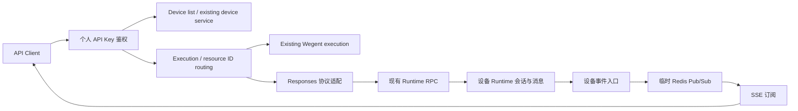

# Wework API Client

通过 HTTP 操作 Wework 会话，包括独立对话、项目目录和 worktree 任务。API Client 与 Wework 共用设备 Runtime 的会话、消息发送和状态，不新增数据库表，不复制会话数据。

## 鉴权与地址

在 Wegent 中创建**个人 API Key**，请求携带：

```http
Authorization: Bearer wg-...
```

API 前缀为 `/api/v1`，与线上 Wegent Responses 共用入口。反向代理需要将这个前缀转发到 backend，并关闭 SSE 响应缓冲。API Key 过期、撤销或所属用户停用后，后续请求返回 401；不接受登录 JWT 或服务密钥。

## 与线上 Wegent API 的关系

已有 Wegent 请求保持不变：`model: "namespace#team_name"`，不传 `execution` 即走原有智能体链路，原有工具、鉴权和数字 response ID 行为保持不变。新建 Wework 会话显式传 `execution: {"type": "wework", "device_id": "..."}`，此时 `model` 使用 Wework 模型目录返回的 ID。

Wework 支持 `X-API-Key` 和 `Authorization: Bearer`，都要求个人 API Key。会话及模型发现接口目前提供 Wework 数据，支持 `execution=wework`；其他值会被拒绝。会话列表支持 `device_id` 筛选。原有 `/api/tasks`、`/api/models` 等接口保持不变。`DELETE /responses/{id}` 保留线上行为，Wework 暂不提供删除操作。

OpenAI SDK 的 `base_url` 设置为 `https://example.com/api/v1`，通过 `extra_body={"execution": {"type": "wework", "device_id": "..."}}` 传执行目标。标准 `model`、`input`、`stream`、`background` 参数正常传入。仅支持 Responses 的文本子集，不接受智能体专用工具、附件或生成参数，非法组合返回 422。

## 接口

| 方法与路径（省略前缀） | 用途 |
| --- | --- |
| `GET /devices` | 当前用户的设备列表（含离线设备） |
| `GET /conversations?limit=20&after=...` | 当前在线设备上的会话列表，包含项目工作区任务 |
| `GET /conversations/{id}?limit=20&before=...` | 分页消息历史及 `latest_response` |
| `POST /responses` | 创建新对话或继续已有对话 |
| `GET /responses/{id}` | 从 Runtime 查询指定轮次的状态与输出 |
| `GET /responses/{id}?stream=true` | 订阅该轮次的新输出 |
| `POST /responses/{id}/cancel` | 请求停止该轮次 |
| `GET /models` | 当前用户可用于创建 Codex 对话的模型 |

每次用户提问是一轮 response。response ID 包含 Runtime 地址和原生用户消息身份，不依赖 backend 的映射表；它不是授权凭证。每次查询、续写、停止都会重新校验用户可访问的设备和会话。

PC、手机版创建的会话也可查询。会话详情中的 `latest_response.id` 可直接用于查询、订阅和停止。`is_latest` 表示是否为当前会话最后一轮；`status` 表示该轮执行状态。

## 模型可见的当前会话信息

PC、手机版和 API 启动的 Codex 会话，每轮都会通过 `additionalContext` 的 `wework.session.current` 注入当前信息，模型可直接读取，无需用户手动复制 ID：

| 字段 | 含义 |
| --- | --- |
| `base_url` | 包含 `/api/v1` 的 HTTP API 地址；未配置后端时为 `null` |
| `api_conversation_supported` | 当前会话是否支持 API；Codex 的独立对话、项目目录和 worktree 任务均支持，不代表设备在线或鉴权已通过 |
| `conversation_id` | 当前会话的 `conv_...` ID，用于查询会话和追问 |
| `response_id` | 当前用户轮次的 `resp_...` ID，用于查询、订阅和停止 |
| `execution` | 新建请求所需的 `type: "wework"` 和当前 `device_id` |
| `model` | 云端模型的完整 API ID，例如 `public:default:0:my-model` |
| `model_name`、`model_type` | 当前选中的模型名称和来源 |

这些是 HTTP API 的路由 ID，不是底层 Codex thread/turn ID。`conversation_id` 编码设备 ID 和 Runtime 本地任务 ID，项目目录和 worktree 任务可以直接使用这些 ID 查询和续聊。同一会话追问时 `conversation_id` 不变，`response_id` 随用户轮次更新，模型信息也随选择刷新。本地模型或缺少云端目录身份的模型，其 `model` 为 `null`；调用 API 时需从 `GET /models?execution=wework` 选择可用模型。

每轮上下文仅包含上述字段和简短使用说明；完整接口用法保留在本文，避免重复占用上下文。继续当前会话需要等待当前轮次结束，传 `conversation` 或 `previous_response_id` 二选一，不再传设备和标题。上下文不包含个人 API Key、登录令牌或模型密钥；实际 HTTP 调用仍需单独提供个人 API Key。

## 创建任务

先调用 `/devices` 选择设备，再调用 `/models` 获取模型 `id`。设备列表使用相同的个人 API Key，返回格式如下：

```json
{
  "object": "list",
  "data": [
    {
      "device_id": "your-device-id",
      "name": "My Wework",
      "status": "online",
      "device_type": "local",
      "is_default": true
    }
  ]
}
```

`status` 为 `online`、`offline` 或 `busy`；无设备时 `data` 为空数组。新建会话将选中的 `device_id` 放入 `execution.device_id`。`is_default` 仅供参考，不会自动选择设备。设备在线不代表一定能接受任务，执行时仍会校验远程控制权限和 Runtime 能力。

```bash
curl -N 'https://example.com/api/v1/responses' \
  -H "Authorization: Bearer $WEGENT_API_KEY" \
  -H 'Content-Type: application/json' \
  -d '{
    "model": "public:default:0:my-model",
    "input": "检查工作区并介绍当前项目",
    "stream": true,
    "execution": {
      "type": "wework",
      "device_id": "your-device-id",
      "title": "API 独立对话"
    }
  }'
```

- `stream: true`：返回 Responses SSE 事件，包含 `response.created`、`response.output_text.delta` 和终态事件。
- `background: true, stream: false`：等待 Runtime 接受任务后立即返回 response ID，使用 GET 查询结果。
- 两者均为 false：等待该轮结束后返回 response 对象。
- `input` 支持字符串或 `role: "user"` 的文本消息数组；内容块类型为 `input_text`。
- 创建和续写目前使用 Codex Runtime。工具执行由 Runtime 自身配置；本接口不接受客户端 function tool 定义或 tool output 回传，不支持客户端注入 assistant 历史。
- `execution.model_type` 可消除模型来源歧义；推荐直接使用 `/models` 返回的完整 ID。`model_options` 传递现有 Runtime 的模型选项，资源身份始终由服务端模型目录决定。

云模型的上游协议由 backend 的 Model 配置决定，不由 `model_options` 覆盖。Runtime 按该配置转换 OpenAI Responses、Chat Completions 或 Anthropic Messages 请求及流式响应；对外仍统一使用 Responses 协议。模型服务的 API Key 只保留在 backend。

`GET /models` 使用与 Wework 桌面相同的云模型目录和权限、可用性筛选，不按原生 Codex Shell 的协议限制排除内网模型。“我的CodeX”等设备本地模型目录不属于这个云模型列表。请求中的 `model` 请直接使用返回的完整 `id`，其格式为 `type:namespace:resourceUserId:name`，例如公共模型的 `public:default:0:my-model`。

继续对话时传 `conversation`，不再传设备和标题：

```json
{
  "model": "public:default:0:my-model",
  "conversation": "conv_...",
  "input": "继续检查测试覆盖率",
  "background": true
}
```

也可用 `previous_response_id` 代替 `conversation`。它必须是会话最近一个已结束的轮次；不支持从历史轮次创建分支。正在运行的会话返回 409，由调用方等待或先停止。

续聊按 ID 调用 `runtime.tasks.get`，定点读取原任务的目录、智能体绑定和模型选项，再复用 Wework 执行配置构建和 `runtime.tasks.send`。不会调用任务列表或扫描其他工作区；`previous_response_id` 校验复用同一次任务读取。原任务目录和绑定保持不变，显式提供的模型选项覆盖原选项。

backend 和 Executor 需要同时更新到支持 `runtime.tasks.get` 的版本。旧 Executor 会明确返回不支持该 RPC 的错误，不回退到全量列表扫描。

## 状态、实时输出与停止

状态包括 `queued`、`in_progress`、`completed`、`failed`、`cancelled` 和 `incomplete`。GET 从原生消息历史构造当前快照；模型信息来自 Runtime 当前的会话配置。

重新订阅正在运行的 response 时，SSE 从订阅时刻的新事件开始，`response.created.output` 为空；已有内容通过普通 GET 查询。已完成 response 的流式查询会返回结果快照及终态事件。`sequence_number` 只在当前连接内有效，不支持 `starting_after` 或历史事件重放。

断开 SSE 不会取消任务。停止请求返回 `cancellation_requested: true` 表示 Runtime 已接受停止请求，最终状态继续通过 GET 查询。已结束的旧轮次不会停止会话中的新任务；无法安全定位原生轮次时返回 409。

设备必须在线且允许远程控制。设备离线时，API 无法读取或执行其会话。RPC 提交超时不代表任务未执行：错误响应中的 `response_id` 和 `conversation_id` 可用于检查结果，避免盲目重复提交。

设备离线返回 503 `device_offline`；设备无权访问或不存在返回 404 `device_not_found`；在线设备上找不到任务返回 404 `task_not_found`；Runtime 查询失败返回 502。任务缺失不会被解释为设备离线。

## 实现结构



Redis 仅转发在线订阅事件，不写入键、事件日志或 response 状态；异步任务由 Runtime 执行，backend 不启动独立任务执行器。

设备定向操作在 RPC 前校验归属和在线路由：离线返回 HTTP 503，`detail.code` 为 `device_offline`；无权访问或设备不存在返回 404。查询单个会话或 response 只请求目标设备。断网尚未被心跳检测到时，RPC 仍可能等待超时。
