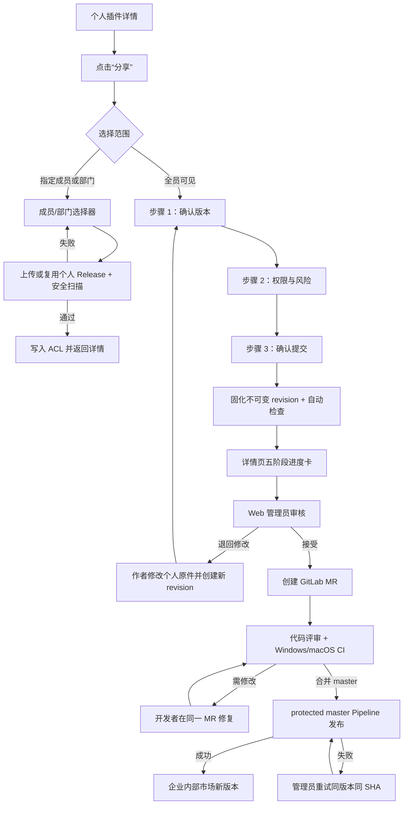

# Feature：Wework 插件分享与企业全员发布交互设计

## 0. 文档状态与设计依据

本文是 Wework 插件分享、企业全员投稿、Web 管理员审核和企业市场发布的开发级交互规范。实现时以本文定义的页面顺序、状态、文案、权限和不可变边界为准；技术合同见[插件市场 V2 技术设计](./plugin-marketplace-v2.md)。

- 设计基线：用户确认的 `1536 × 1024` 总体流程图“Wework 插件分享与全员发布 · 完整交互流程”。
- 视觉基线：现有 Wework 插件详情页和 [`wework/DESIGN.md`](../../../../wework/DESIGN.md) 的 Codex 桌面设计规范。
- 本期范围：个人插件定向分享、企业全员发布申请、管理员审核、GitLab 状态回传、个人版与企业版共存。
- 非本期范围：GitHub 上 Wework 官方公开插件的投稿、同步和审核；普通用户不能选择 `public`。
- 非回归原则：本文只改造“分享/发布”路径，不重做现有插件详情页的信息架构。

## 1. 产品目标与冻结决策

### 1.1 用户目标

插件作者在同一个 Wework 详情页完成两种分发意图：

1. 分享给指定成员或部门，扫描通过后立即生效。
2. 申请全员可见，进入企业代码资产与审核发布流程。

普通用户不需要理解 Git、MR 或 Pipeline；管理员不需要在 Wework 客户端处理审核；技术投稿与非技术投稿从 GitLab MR 起复用同一条质量门禁。

### 1.2 冻结决策

1. 详情页入口按钮名称固定为「分享」，不使用「发布」或「分享与发布」；打开后的范围选择弹窗标题固定为「分享与发布」。
2. 范围只提供「指定成员或部门」和「全员可见」两个选择。“组织”是根部门，不是第三个范围。
3. 任意已登录且拥有个人插件的用户都可提交全员发布申请，不使用投稿白名单。
4. 定向分享无需人工审核；全员发布必须经过自动检查、管理员审核、GitLab 代码审核和受保护分支发布。
5. 管理员“接受”只创建 MR，不直接发布。
6. 提交后锁定 snapshot、revision、版本和 SHA256。个人原件仍可编辑、对话、定向分享和生成新版本。
7. 个人原件和企业版是两个 Plugin 身份，允许个人 `v1.3.0` 与企业 `v1.2.0` 同时存在。
8. 企业发布失败不得影响当前在线企业版本；重复发布同一版本/同一 SHA 必须幂等。

## 2. 信息架构与权限

### 2.1 详情页保留内容

现有详情页继续保留：

- 立即对话；
- 试试这些任务；
- 可用范围；
- 自动更新设置；
- 应用授权与退出登录；
- 包含能力及能力启停；
- 插件信息、开发者和版本；
- 个人所有者的继续编辑、卸载、删除插件。

### 2.2 角色与动作矩阵

| 角色                 | 分享                 | 查看申请              | 撤回申请       | 审核       | 安装/卸载 | 删除个人原件         |
| -------------------- | -------------------- | --------------------- | -------------- | ---------- | --------- | -------------------- |
| 个人插件所有者       | 可见                 | 可见                  | 合并前可用     | 不可用     | 可用      | 可用，受申请清理约束 |
| 定向分享接收者       | 不可见               | 不可见                | 不可用         | 不可用     | 可用      | 不可用               |
| 企业版普通用户       | 不可见               | 只看企业版本信息      | 不可用         | 不可用     | 可用      | 不可用               |
| 企业管理员           | 仅管理自己的个人插件 | 可查看全部            | 不替作者撤回   | 退回或接受 | 可用      | 仅按原所有权         |
| GitLab 开发/评审人员 | 不经客户端分享       | 通过 MR/Pipeline 查看 | 按 GitLab 权限 | 代码评审   | 不适用    | 不适用               |

## 3. 完整交互顺序



用户侧固定展示五个阶段：

```text
提交申请 → 自动检查 → 管理员审核 → 代码审核 → 发布
```

后台子状态可以更细，但不得把 GitLab 创建 MR、CI 运行或发布失败压缩成一个模糊的“审核中”。

## 4. Wework 客户端页面规范

### S0. 个人插件详情页（现有页面，局部改造）

**进入方式**：插件列表或「个人创建」进入详情。

旧 `/plugins/manage` 页面中的所有者「分享/发布」入口只负责跳转到本页的个人插件详情，不再打开旧投稿对话框，也不得调用旧 `/plugins/submissions` 投稿接口。所有非技术作者必须进入本文 S1–S8 定义的唯一新流程。

**标题区动作顺序**：

```text
[分享图标 分享]  […]  [立即对话]
```

- 「分享」是带 `Share2` 图标的紧凑次要按钮，仅个人插件所有者可见。
- 「…」继续承载「继续编辑」「卸载」「删除插件」；不再放「发布新版本」。
- 「立即对话」保持唯一黑色主按钮。
- 审核期间不禁用「立即对话」「继续编辑」「定向分享」或能力开关。
- 有申请时，在「可用范围」之后新增企业发布进度卡；不覆盖原有信息。

**测试标识**：

- `plugin-detail-share-{pluginId}`
- `plugin-detail-actions-{pluginId}`（保留）
- `plugin-detail-toggle-{pluginId}`（保留）
- `plugin-publication-card-{requestId}`
- `plugin-publication-view-progress-{requestId}`

### S1. 分享范围选择对话框

**触发**：点击 S0「分享」。

打开对话框前必须先加载该个人插件现有的成员/部门 ACL 和最近一次全员申请（包括已发布等终态）。加载期间保持入口的忙碌状态；加载失败时显示可重试错误且不展示可提交的空表单，避免把既有 ACL 误保存为空。只有 ACL 加载完成后才可展示 S1 并允许继续。

**形态**：桌面为 `520px` 居中 Dialog；移动端为底部 Sheet。关闭后焦点回到「分享」。

**标题**：「分享与发布」；副标题显示插件名和当前个人版本。标题描述弹窗内的两种分发意图，不改变详情页入口按钮「分享」的命名。

**选择项**：纵向两张单选行，每行整行可点击。

1. 「指定成员或部门」
   - 说明：「选择后扫描并立即生效，无需审核」
   - 已有授权时显示「已分享给 2 个部门、5 位成员」摘要。
2. 「全员可见」
   - 说明：「提交企业发布申请，通过检查与审核后向全员发布」
   - 有活动申请时显示状态和版本，点击改为「查看申请进度」。

**动作**：

- 次要按钮：「取消」。
- 主按钮随选择变化：
  - 「选择成员或部门」；
  - 「继续填写发布申请」；
  - 已有活动申请时「查看申请进度」。

**规则**：同一个人源插件只能有一个活动中的全员申请 Request；即使个人版本已经变化，也必须先处理现有活动 Request，不能并行创建第二个。已发布版本为终态，更高个人版本再次投稿时创建新的 Request。

**测试标识**：

- `plugin-share-intent-dialog`
- `plugin-share-intent-restricted`
- `plugin-share-intent-enterprise`
- `plugin-share-intent-continue`

### S2. 指定成员或部门

**形态**：复用成员/部门选择 Dialog，不再出现“仅自己 / 指定成员 / 组织”三段范围。

**内容**：

- 搜索框：「搜索成员或部门」；
- 搜索结果区分「成员」「部门」；
- 组织根节点以根部门项目展示；
- 已选对象以可删除标签展示；
- 可选项「允许复制为个人插件」，默认关闭；
- 当前授权摘要和清空范围入口。

**动作**：

- 「取消」返回 S1，不丢失已选内容；
- 「保存分享范围」开始上传/复用个人 Release、扫描和 ACL 原子更新；
- 清空全部对象时明确显示将恢复为「仅自己可用」。

**提交状态**：主按钮保留宽度并显示「正在扫描…」；禁止重复提交。扫描失败保留选择和 `allowCopy`，在表单内显示错误码、原因和重试。

**测试标识**：沿用 `plugin-share-*`，新增 `plugin-share-save-scope` 和 `plugin-share-scan-status`。

### S3. 定向分享结果

成功后关闭 Dialog，返回 S0：

- 可用范围显示「已分享给 X 个部门、Y 位成员」；
- 提供「管理成员与部门」；
- 使用非阻塞 Toast：「分享范围已更新」；
- 不出现审核进度卡。

若 ACL 写入失败，不能显示扫描成功即分享成功；保留 Dialog 并允许对同一 Release 幂等重试。

### S4. 企业全员申请 Drawer：步骤 1「确认版本」

**触发**：S1 选择「全员可见」。

**形态**：桌面右侧 `480px` Drawer，覆盖主内容但不替换详情路由；移动端占满宽度。顶部固定标题、三步 Stepper 和关闭按钮，底部固定动作区，中间独立滚动。

**内容**：

- 插件图标、名称和「个人创建」标签；
- 待提交版本；
- 源码最后更新时间；
- 版本说明/变更说明，去除首尾空白后必填，最多 `2000` 字符；
- 不可变提示：「提交后将生成独立快照，后续编辑不会更新本次申请」。

**版本规则**：默认选当前可打包版本；如果企业目录已有同版本且 SHA 不同，阻断并要求先升级语义版本；不得允许手工覆盖线上版本。

**动作**：「取消」「下一步：权限与风险」。

**测试标识**：

- `plugin-publication-drawer`
- `plugin-publication-step-version`
- `plugin-publication-release-notes`
- `plugin-publication-next-risk`

### S5. 企业全员申请 Drawer：步骤 2「权限与风险」

**内容分组**：

1. 外部网络访问：是否访问外部服务、域名列表。
2. 命令与脚本：系统命令、Shell、Node、Python、Hook、bin。
3. 本地文件：读、写范围与用途。
4. 凭据使用：API Key、Token、账号密码；明确禁止凭据进入包或日志。
5. 应用授权：连接器、OAuth、本地二维码等。
6. MCP 与扩展能力：MCP、Agent、Command、LSP、Monitor 等。
7. 测试说明：已验证平台、场景和结果，去除首尾空白后必填，最多 `1000` 字符。

本步骤填写的是作者声明，不在进入表单前上传或扫描源码。最终提交后，服务端再从不可变快照解析 Manifest 与包内容，把自动检查结果与作者声明交叉校验；发现未声明风险时阻断后续审核并在申请进度中给出可操作原因。这样与最新交互中的「提交后先安全扫描，再由管理员初审」保持一致，也避免用户在尚未确认提交时产生远端源码快照。

**动作**：「上一步」「查看并提交」。有阻断项时主按钮禁用，并在顶部给出可操作的错误摘要。

**测试标识**：

- `plugin-publication-step-risk`
- `plugin-publication-risk-network`
- `plugin-publication-risk-command`
- `plugin-publication-risk-files`
- `plugin-publication-risk-credentials`
- `plugin-publication-test-notes`
- `plugin-publication-next-confirm`

### S6. 企业全员申请 Drawer：步骤 3「确认提交」

**内容**：只读展示插件、版本、变更说明、完整风险声明、应用授权、测试说明、企业全员范围，以及待生成的 revision。点击最终提交后才上传并由服务端生成不可变快照；服务端响应必须返回并持久化 revision、包 SHA256 与源码树 SHA256，后续所有检查、审核与发布都绑定这些服务端计算的值。

**声明**：

- 我确认声明与插件行为一致；
- 我理解提交后该 revision 不可修改；
- 我理解通过管理员审核后仍需 GitLab 代码评审和跨平台检查。

**动作**：「上一步」「提交全员发布申请」。提交中显示「正在创建快照…」，关闭拦截重复点击。

**失败处理**：上传、传输或自动检查基础设施失败时保留表单/当前 revision，并允许使用同一幂等键重试原 revision 或撤回，不能制造“已提交”假状态。若自动检查已确定包内容、Manifest、SHA 或风险声明不合格，则旧 revision 保持不可变，作者修复个人原件后在原 Request 中创建新 revision，不允许把修改后的内容覆盖到旧 revision。

**测试标识**：

- `plugin-publication-step-confirm`
- `plugin-publication-declaration`
- `plugin-publication-submit`

### S7. 详情页企业发布进度卡

提交成功后 Drawer 关闭，S0 增加进度卡：

```text
企业全员发布 · v1.2.0
管理员审核中
提交申请  ✓  自动检查  ✓  管理员审核  ●  代码审核  ○  发布  ○
[查看进度] [撤回]
```

- 卡片永远显示申请版本，避免与继续编辑后的个人版本混淆。
- 当前阶段使用蓝色窄强调和文字；等待使用中性灰；失败/退回使用红色图标和原因；发布成功使用绿色成功图标。
- 「撤回」仅在尚未合并时可用；进入合并/发布后解释为什么不可撤回。
- 管理员退回时主动作改为「修复并重新提交」，它从当前个人版本新建 revision，不覆盖旧证据。

### S8. 申请进度详情 Drawer

**触发**：S7「查看进度」或 S1 已有活动申请。

**内容**：

- request 编号、当前 revision、版本和 SHA256；
- 五阶段纵向时间线；
- 每个阶段的时间、操作者、检查项、证据和稳定错误码；
- 管理员退回原因；
- MR、Pipeline、Windows/macOS Job 链接和状态；
- 发布结果和企业版本链接；
- 完整申请历史和历史 revision 切换，只读查看；客户端重启后也必须可从服务端恢复已退回、已撤回、失败和已发布记录；
- 当前个人原件与企业版的双向来源链接；链接使用服务端持久化的来源 Plugin ID，不以名称或本地内存状态猜测。

**动作**按状态出现：「撤回申请」「创建新 revision」「打开 MR」「查看企业版本」。退回修改或确定性自动检查失败时允许在原 Request 创建新 revision；`code_changes_requested` 由开发者在当前 MR 中修复，不向非技术作者提供新 revision 动作。外链激活前必须明确目标是 GitLab。

## 5. Web 管理后台页面规范

### S9. 插件发布审核队列

**入口**：Web 管理后台新增「插件发布审核」Tab，仅管理员可见。

**列表字段**：插件、版本/revision、提交人、风险等级、当前阶段、提交时间、等待时长、GitLab 状态。

**筛选**：状态、风险、提交人、插件名、时间范围；默认显示待处理并按最早提交排序。筛选写入 URL，刷新可恢复。

**状态**：提供加载骨架、空态、错误和分页；整行进入详情，不把接受/退回放在列表上，避免缺少证据时误操作。

**测试标识**：

- `admin-plugin-publications-tab`
- `plugin-publication-review-list`
- `plugin-publication-review-row-{requestId}`
- `plugin-publication-review-filter-status`
- `plugin-publication-review-filter-risk`

### S10. 审核详情

**布局**：桌面双栏。左侧为不可变 revision、Manifest、权限声明、变更说明和历史；右侧为自动检查、风险证据、GitLab 状态和固定审核动作。窄屏改为单栏，动作区置底。

管理员审核的是明确的 `request / revision / version / SHA256`。页面必须显示：

- 自动检查总览及全部阻断/警告；
- 作者声明与扫描证据的差异；
- 包目录、Manifest 和关键能力；
- Windows/macOS 状态；未运行不得显示通过；
- 既往退回原因和 revision 历史；
- 并发状态变化提示，防止审核旧 revision。

**动作**：

- 「退回修改」为次要危险动作；
- 「接受并创建 MR」为唯一主动作；
- 存在阻断项或警告未逐项确认时，主动作禁用并解释原因；
- 页面没有「发布」按钮。

### S11. 退回修改

打开确认 Dialog：

- 退回原因必填；
- 待修改项至少一项，可从检查项勾选并补充；
- 明确说明旧 revision 保留且不可编辑；
- 提交后状态更新为「已退回修改」，作者在 Wework 查看并新建 revision。

### S12. 接受并创建 MR

确认 Dialog 展示插件、revision、SHA256、目标仓库和目标目录。管理员确认后：

1. 后端以 request/revision 幂等键物化受控分支；
2. 创建或复用 MR；
3. 回写 branch、commit SHA、MR IID/URL；
4. 状态进入「代码审核」。

GitLab 失败时详情页保留管理员已接受事实，显示错误和「重试创建 MR」；重试不能产生第二个 MR。

## 6. GitLab、发布与企业使用页面状态

### S13. 代码审核

Wework 与 Web 使用相同状态投影：MR、评审中、需修改、CI 运行、合并就绪、已合并。每个 MR 只允许一个插件的一个版本。

- MR Pipeline 必须包含确定性打包、风险检查、测试、原生 Windows、原生 macOS。
- 缺少 Runner 显示「阻断/未运行」，不能显示通过。
- MR 修改后必须更新记录的 commit SHA；发布只接受最终合并 SHA 对应的 artifact。
- `code_changes_requested` 后由开发者在同一个受控分支和 MR 中修复并重新运行 Pipeline，不回到 Wework 创建新 revision；若必须更换已接受的不可变投稿快照，应先结束当前代码审核流程，再按新的 Request/Revision 流程重新投稿。

### S14. 发布

受保护的 `master` Pipeline 是唯一自动发布入口。Webhook 只同步状态或触发对账。

- 成功：进度卡显示「已向企业全员发布」，提供「查看企业版本」。
- 基础设施失败：自动重试同一 artifact。
- 业务发布失败：管理员重试同版本/同 SHA；当前企业旧版本继续在线。
- 同版本不同 SHA：永久冲突，必须由作者提交更高版本。

### S15. 企业市场与个人/企业版本关系

- 个人原件仍在「个人创建」，显示个人版本、个人授权和个人操作。
- 企业版出现在「企业内部」，来源标签为「企业内部」。
- 同一来源插件在个人详情提供「查看企业版本」，企业详情对有权限的作者提供「查看个人原件」；两个方向都由服务端保存的 `origin_plugin_id`/企业 Plugin ID 建立，不依赖相同 slug 的模糊匹配。
- 普通员工安装/卸载企业版只改变自己的安装状态，不改变市场可见性。
- 删除个人原件不自动删除已合并或已发布企业版。

### S16. 新版本再次申请

当个人插件从 `v1.2.0` 编辑到 `v1.3.0`：

- 已提交/已发布的 `v1.2.0` revision 和企业版保持不变；
- 「分享」中的全员入口显示当前企业版与个人版差异；
- 用户重新走 S4–S6，创建新的 Request，且该 Request 从 revision 1 开始；已发布 Request 及其全部 revision 保持只读；
- 新版本失败不影响企业 `v1.2.0`。

## 7. 删除、撤回与失败边界

| 场景                       | 必须行为                                                                       |
| -------------------------- | ------------------------------------------------------------------------------ |
| 上传或快照未完成           | 可取消临时 revision，并清理未引用对象                                          |
| 已提交、未创建 MR          | 可撤回申请，保留审计事件；`materializing` 期间禁止撤回                         |
| MR 未合并            | 撤回时先关闭 MR；关闭失败则撤回失败                                            |
| 删除个人原件且有未合并申请 | 同一确认中先撤回/关 MR；任何一步失败均阻止删除                                 |
| 已合并或已发布             | 不允许通过删除个人原件回滚企业版                                               |
| 管理员退回                 | 旧 revision 只读；修复后新建 revision                                          |
| CI/代码评审失败            | 开发者在同一受控分支/MR 修复并生成新 commit，不由非技术作者创建 revision |
| 发布失败                   | 重试相同 version/SHA；保留当前企业 latest release                              |

## 8. 视觉与响应式规范

### 8.1 视觉层级

- 页面保持现有中性灰/白工作台，不增加彩色大卡片或营销式头图。
- 每个动作组最多一个黑色反色主按钮。
- 蓝色只用于焦点、链接和当前步骤；绿色只用于已完成；橙色用于等待/警告；红色用于失败/退回。
- Dialog 使用 `20px` 圆角、轻量遮罩和语义背景；Drawer 使用主背景、左侧细分隔和克制阴影。
- 进度卡通过间距、低对比表面和细线建立层级，不使用粗边框。
- 正文字号、按钮高度、图标和圆角必须复用 Wework 语义组件与 token，不在业务组件散落字面颜色或任意字号。

### 8.2 基准尺寸

| 对象             | 桌面规范                          |
| ---------------- | --------------------------------- |
| 总体设计校验视口 | `1536 × 1024`，light theme        |
| 详情内容         | 保持现有最大宽度和左右留白        |
| 分享范围 Dialog  | `520px`，最大 `92vw`              |
| 申请 Drawer      | `480px`，最大 `100vw`             |
| 普通桌面按钮     | 现有共享 Button 尺寸；同组等高    |
| 图标             | 普通 `16px`，状态微图标 `12–14px` |
| 动效             | `150–220ms`，支持 reduced motion  |

### 8.3 响应式

- `>=1024px`：Dialog 居中，申请 Drawer 从右侧进入，Web 审核详情双栏。
- `768–1023px`：Drawer 可增至视口 `56%`，Web 审核详情单栏。
- `<=767px`：Dialog 变底部 Sheet，申请 Drawer 占满屏；触控目标至少 `44 × 44px`。
- 中英文长文案、`200%` 文本缩放和窄高窗口不得隐藏固定主动作；内容区必须独立滚动。

## 9. 可访问性与文案

- 所有可见文案进入中英文 i18n，不允许用中文显示值作为状态判断。
- Dialog/Drawer 打开时移动焦点，关闭后恢复到原触发按钮；Escape 关闭最上层可取消层。
- Stepper、检查结果和进度变化具有可读状态文本；颜色不是唯一线索。
- 校验失败聚焦第一个错误或错误摘要，保留所有有效输入。
- 图标按钮必须有本地化 `aria-label` 和 Tooltip。
- GitLab 外链、删除、撤回、退回等后果在激活前明确说明。
- 使用单字符省略号「…」表示还会打开下一层，不用三个句点。

## 10. 实现安全合同与上线门禁

### 10.1 身份、不可变数据与幂等

- `Request / Revision / Check / Event` 分层持久化。用户和管理员读取完整 revision 历史；终态记录不得因 `activeOnly` 查询而从个人详情消失。
- 服务端必须校验调用方传入的 `Idempotency-Key` 格式，并重新计算规范化的资源与完整请求载荷指纹；持久化绑定调用主体、操作、资源和载荷指纹。同一主体与操作下，同键同资源/载荷返回原结果，同键不同资源/载荷返回 `409`，不能只把客户端传入值记录为 provenance。
- 以下七个状态修改接口必须携带长度为 `8–200` 字符、且只包含 `[A-Za-z0-9._:-]` 的 `Idempotency-Key`：创建 Request、创建 Revision、完成 Revision、撤回、管理员退回、管理员接受、管理员对账。处于 processing 的重复请求返回 `409`；失败后的同一逻辑操作可复用原键继续执行。
  - `POST /api/plugins/publication-requests`
  - `POST /api/plugins/publication-requests/{requestId}/revisions`
  - `POST /api/plugins/publication-requests/{requestId}/revisions/{revision}/complete`
  - `POST /api/plugins/publication-requests/{requestId}/withdraw`
  - `POST /api/admin/plugins/publication-requests/{requestId}/return`
  - `POST /api/admin/plugins/publication-requests/{requestId}/accept`
  - `POST /api/admin/plugins/publication-requests/{requestId}/reconcile`
- 客户端为每次“逻辑提交”生成 `operationAttemptId`：同一次传输失败后的重试复用该 ID，关闭并重新打开申请或重新发起一次显式对账时生成新 ID；键同时包含完整申请载荷指纹。撤回键必须包含当前 revision，避免后续新 revision 被旧撤回响应命中；GitLab 对账每次显式操作使用新的 attempt，避免同 revision 永久重放旧状态。
- 个人原件和企业版使用不同 namespace/Plugin ID。企业 slug 必须绑定唯一 `origin_plugin_id`；另一个个人来源不得向已有企业 slug 追加版本。历史 `origin_plugin_id = 0` 数据必须显式迁移或拒绝认领，不能静默转移所有权。
- 管理员接受进入 `materializing` 后暂时禁止撤回，直到受控分支/MR 创建或失败已对账；不得出现“申请已撤回但 MR 仍打开”的状态。
- 一旦产生个人/企业 namespace 拆分后、会违反旧全局 slug 唯一约束的数据，数据库 downgrade 必须先执行 preflight 并明确阻止不安全回退，不能在恢复旧唯一索引时中途失败或丢数据。

### 10.2 GitLab 受控分支、MR 与包检查

- Web 投稿的受控分支名固定为 `wework/publication-<requestId>-r<revisionNumber>`。分支内 marker 必须存在并绑定 request、revision、原始快照 SHA256 和规范化 source-tree SHA256；source-tree 同时包含带 version 的 Manifest。不得通过删除或篡改 marker 降级为开发者直提流程。
- GitLab 写入必须使用专用 Materializer 身份。`WEWORK_PLUGIN_PUBLICATION_GITLAB_TOKEN` 只能属于该机器人/服务账号，`WEWORK_PLUGIN_PUBLICATION_GITLAB_MATERIALIZER_USER_ID` 必须配置为该 token 调用 GitLab `GET /user` 返回的数值 ID；服务端同时校验项目、MR 作者、源/目标项目和 HMAC 绑定。已存在但不具备同一绑定的同名分支或 MR 一律拒绝复用，不能把开发者账号或通用运维 token 当作 Materializer。
- 插件发布 MR 只允许修改 `plugins/<slug>/**` 和市场清单中该插件的一条已验证记录；不得混改 `.gitlab-ci.yml`、CI/发布脚本或其他插件。基础设施变更必须使用独立 MR。
- ZIP 必须对所有 entry 做完整校验，只允许一个预期插件根目录；拒绝根目录外文件、多根包、绝对路径、路径穿越和不安全链接，不能只验证或提取命中的子目录。
- Secret scan 必须覆盖 `git ls-files` 返回的全仓所有 tracked 文件，而非只扫描 `plugins/`。扫描日志和 artifact 不得泄露凭据内容。
- MR Pipeline 必须在原生 Windows 和原生 macOS Runner 上执行兼容性检查；Runner 缺失、Job 未运行或可跳过都属于阻断。

### 10.3 发布授权、可信证明与状态同步

- release job 只允许在受保护 `master` 上、且变更包含 `plugins/**` 时运行；普通分支、无插件变更或仅修改 CI/脚本时不得取得 release 凭据或调用发布接口。
- release API 只接受 `Authorization: Bearer <token>`。token 必须是独立的 `plugin_release` 机器凭据，不接受裸 token、普通用户会话或用户身份模拟。
- `plugin_release` 凭据通过管理员 API `POST /api/admin/plugin-release-keys` 创建，通过 `GET /api/admin/plugin-release-keys` 查询，并通过 `POST /api/admin/plugin-release-keys/{id}/toggle-status` 停用或重新启用。创建时只填写名称、可选描述和过期时间；原始 `wg-...` 值只返回一次，轮换时先创建并验证新键，再停用旧键。GitLab project 和目标分支是服务端发布通道配置，不存入凭据。
- protected master Release 请求还必须携带精确的 `Idempotency-Key`：`wework-plugin-v1:&lt;64hex>`，其摘要由 project ID、最终 commit SHA 和 artifact SHA256 共同派生；服务端重新计算并校验该键。
- 服务端不得信任调用方自报的 project/ref/SHA/Pipeline 字符串。必须校验配置允许的 GitLab project、受保护 `master` ref、最终合并 SHA 和 Pipeline；再从该 exact commit 读取 `plugins/<slug>`，对包含 `.wework-publication.json`、`plugin-risk.json` 在内的完整规范化文件树与上传 ZIP 做路径、内容和执行位比对。发布幂等记录同时绑定可信证明和已认证 `plugin_release` key 的数据库 ID；不同调用主体不能复用同一个发布幂等键。
- Webhook 只做单调状态同步和对账：Pipeline 事件必须匹配当前 revision 的受控 commit SHA，较小 Pipeline ID 和同一 Pipeline 已到达终态后的迟到状态不得推进；Webhook 丢失不得成为永久发布阻断，也不能把 Webhook 当作发布授权。
- 企业投稿不使用人员白名单或全局启停开关；Request API 随 Backend 部署即对已登录的个人插件所有者开放，内部 `/plugins/releases` 始终由专用 Release Key、服务端配置的 GitLab project、受保护 `master` 和可信制品校验控制。因此必须先完成真实 GitLab、Runner、审批、TLS 和凭据轮换验证，再协调部署 Backend、Wework 与 Web 管理端。
- GitLab protected environment、Code Owner/审批规则、受保护变量以及原生 Windows/macOS Runner 是生产启用前的外部 P0。未在真实 GitLab 配置并验证之前，即使本地测试和打包全部通过，也只能称为“实现已验证”，不能称为“生产发布已启用”。

### 10.4 凭据迁移边界

- 曾进入文件或 Git 历史的旧发布凭据必须由凭据所有方在外部系统吊销并轮换；从当前工作树删除不能视为失效。
- 新凭据只通过受保护变量/环境注入，不得写入仓库、日志或 artifact。当发布端点仍是未经验证的明文 HTTP 链路时不得注入真实凭据；必须先验证 TLS 或经批准的等价安全传输边界。

### 10.5 客户端与响应 DTO 合同

- 成员/部门选择器调用 `GET /api/groups/search?include_organization=true` 才能显式包含组织级 namespace；该参数默认 `false`。服务端只返回当前用户可访问的组织，管理员也只能获得有效的组织记录。
- 创建 Request/Revision 时，`releaseNotes` 去除首尾空白后长度为 `1–2000`，`testNotes` 为 `1–1000`；客户端限制和 Backend Schema 必须一致，空白字符串和超长值返回 `422`。
- `PluginPublicationEvent` 的对外 DTO 只返回专用安全字段。管理员退回事件通过 `requiredChanges: string[]` 同时提供给申请人与管理员；不得把任意 `payload_json` 原样返回客户端。

## 11. 组件与实现映射

| 现有实现                                                                         | 目标处理                                                                                                                                    |
| -------------------------------------------------------------------------------- | ------------------------------------------------------------------------------------------------------------------------------------------- |
| `PluginDetailView.tsx`                                                           | 保留详情结构；新增分享按钮、申请进度卡和个人/企业互链                                                                                       |
| `PluginPublishDialog.tsx`                                                        | 替换为两意图选择 + 企业三步 Drawer；删除 `public/workspace/personal` 三段选择语义                                                           |
| `PluginShareDialog.tsx`                                                          | 收敛为成员/部门 ACL 编辑器，保留扫描失败恢复和 allowCopy                                                                                    |
| `pluginOwnerActions.ts`                                                          | 收敛为 owner share/publication action；移除白名单与 capability 驱动 UI                                                                      |
| `PluginManagementWorkspace.tsx`                                                  | 旧 `/plugins/manage` 分享/发布入口重定向到个人详情唯一新流程                                                                                |
| `PluginsWorkspace.tsx`                                                           | ACL 与申请加载完成后再开表单；统一历史查询、对话框编排和个人/企业身份                                                                       |
| `wework/src/api/plugins.ts`                                                      | 新增 publication request/revision/progress/withdraw API；旧 submission 长期仅用于 `restricted_share + personal` 制品上传/扫描及历史记录清理 |
| `PluginWorkspaceConversationResult.tsx` / `executor/src/plugin_workspace_cli.rs` | Task 工作区入口透传真实版本；定向分享继续走旧 submission，企业全员必须走新 publication request + immutable revision API                     |
| `frontend/src/app/admin/page.tsx`                                                | 新增管理员审核 Tab                                                                                                                          |
| `frontend/src/features/admin/`                                                   | 新增队列、详情、退回与接受组件                                                                                                              |
| Backend publication domain                                                       | 新表、新状态机、自动检查、GitLab 物化、Webhook 对账和专用 release endpoint                                                                   |

新增交互元素必须有稳定 `data-testid`；已有详情页选择器保持不变，除非同一变更同步更新单测和桌面 E2E。

## 12. 验收场景

### 12.1 必须自动化

1. 所有者打开个人详情，顺序看到「分享」「…」「立即对话」，原详情内容完整。
2. 选择成员和根部门，扫描成功后 ACL 生效且无管理员审核。
3. 扫描失败保留选择，重试不会创建重复 Release。
4. 三步申请的必填、风险阻断、返回上一步和关闭恢复均正确；版本说明/测试说明的空白与 `2000/1000` 字符边界在客户端和 API 一致。
5. 提交后个人继续编辑不会改变 revision/SHA。
6. 同一个人源插件只允许一个活动 Request；退回或确定性自动检查失败后在原 Request 创建新 revision；已发布后更高版本创建新 Request 并保留旧 Request。
7. 管理员阻断项不可接受；退回原因必填；接受只创建一个 MR。
8. Windows/macOS 未运行时流程阻断。
9. 合并前撤回关闭 MR；关闭失败阻止撤回和个人删除。
10. 发布失败保留企业旧版本；幂等重试不创建重复 Release。
11. 个人版与企业版可同时展示、安装和独立删除/卸载。
12. 接收者和企业普通用户看不到分享、投稿、编辑或删除入口。
13. `/plugins/manage` 的所有者入口只跳转新详情流程，旧 submission API 不再收到全员投稿。
14. ACL 加载完成前不展示可提交表单；加载失败不能用空 ACL 覆盖已有授权。
15. 客户端重启后仍能查看终态申请、完整 revision 历史和个人/企业双向链接。
16. 受控分支 marker 缺失/不匹配、插件 MR 混改 CI/脚本、ZIP 多根或全仓 Secret scan 失败均阻断。
17. release API 拒绝非 Bearer、错误 key type 和不可信 project/ref/SHA/Pipeline 证明；Webhook 乱序不会回退状态。
18. `materializing` 撤回、企业 slug 跨来源追加和不安全数据库 downgrade 均被显式阻止。
19. 七个 publication mutation 缺少幂等键时返回 `422`；同键同资源/载荷精确重放，同键不同资源/载荷返回 `409`，显式对账使用新 attempt。
20. 根部门仅在 `include_organization=true` 时返回且遵循访问权限；申请人和管理员都能通过专用 `requiredChanges` 查看退回修改项，响应不泄露任意事件 payload。
21. 自动检查的传输/基础设施失败可对原 revision 幂等重试；确定性内容失败只能修复后新建 revision；`code_changes_requested` 在同一 MR 修复。

### 12.2 真实桌面与设计 QA

使用 `wework/AGENTS.md` 的隔离 Electron `ai:verify` 流程至少捕获：

1. S0 个人详情正常态；
2. S1 范围选择；
3. S2 已选择成员/部门；
4. S4、S5、S6 三步 Drawer；
5. S7 管理员审核中与 S8 退回/CI/发布状态；
6. 企业版详情与个人/企业互链。

实现截图必须与总体流程图和对应页面设计稿在相同视口、主题和状态下合并比对。存在 P0/P1/P2 差异时继续修复并复拍；把本功能的证据和结论作为标题明确的独立章节追加到仓库根目录 `design-qa.md`，不得另建 QA 文件或路径，不得覆盖其他功能已有的 QA 记录，也不得在章节内写独立总结果。整个文件只能在末尾保留一个最终 `final result: passed` 或 `final result: blocked`，并且该结果必须综合文件内全部仍有效的阻断项。
