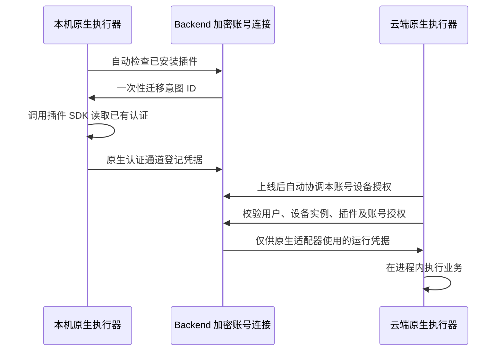

# 插件账号认证改造

## 当前交付状态

当前实现包含 Backend、原生 Executor、后台账号连接服务、Python SDK 0.7.1，
以及邮箱和 DWS 原生适配器。隔离的真实后端、Electron 与远端执行器端到端测试
覆盖 20 项断言，包括运行缓存副本执行、密码更新同步、离线 OAuth 刷新、
DWS 可恢复交接、权限撤销，以及原登录入口的托管状态、退出和重新登录。
邮箱 0.2.3 已在本地测试环境的模拟远端完成真实账号读取验收。
五平台适配器打包、公共仓库构建 CI 与内部声明式插件构建已接通；
生产发布、真实服务方 OAuth 和 Windows 实机验收仍需分别确认。
`accountAuth` 继续作为协议草案，不应宣称所有带 Connector 的插件都已自动兼容。

公共业务入口根据宿主清单中的 `store_path`、`runtime.codex_link` 和
`runtime.claude_link` 识别安装身份，支持复制到 Codex/Claude 缓存后的执行路径。
原生执行器仍从托管安装仓库校验并执行适配器。设备权限绑定唯一的执行路由和
Runtime 实例，避免桌面重启遗留的同名设备别名影响认证复用。

## 认证如何复用

默认开启账号级自动连接。原生执行器上线后每 15 秒检查已安装插件；安装后尚未登录的
插件，会在读取失败后等待至少 60 秒再检查，因此后续本机登录也可自动登记。
此过程不要求打开插件详情或点击迁移、设备授权；系统首次读取钥匙串仍可能要求许可。
原生执行器验证已安装插件来源、包校验值和
适配器声明，然后调用插件提供方回调读取该插件的已有认证。凭据通过原生设备
认证通道交给 Backend，以 AES-256-GCM 加密存储在该用户的账号连接中。

受授权的云端设备运行插件时，由原生代理领取运行所需凭据，仅在适配器进程内
使用。不会复制整套 macOS 钥匙串，也不把密码写入云端钥匙串。Renderer、模型工具、
任务参数和公开业务代理 API 均不接收提供方凭据。迁移密码不删除原来的本机认证。
独占交接不同：迁移成功后会移除该账号的原本机授权。Wework 内的受支持 CLI 自动改用账号代理；原有外部工具需要自己的登录。



账号连接保存到已有 `kinds` 表，kind 为 `ConnectorConnection`，namespace 为
`plugin-auth`。查询包含 owner、namespace、kind 和 name；账号身份绑定插件来源、
connector 与外部账号。当前无新增物理表或 DDL 迁移。

首次登记使用用户行锁，后续更新检查 `revision`；冲突返回 409。设备授权绑定逻辑
设备 ID、设备数据库行、runtime ID 和 runtime instance ID。删除重建设备不能继承
旧授权。插件禁用、卸载、来源或适配器变化会阻止继续使用。普通设备注册、任务启动、
心跳和本地离线任务不以凭据服务可用为前提。MySQL 的锁内决策使用当前锁定读取，
避免请求早期建立的 `REPEATABLE READ` 快照遗漏并发登记或交接状态；用户锁同时
刷新 ORM 中已加载的启用状态。真实 MySQL 8.0 的相关竞态验收已通过。

## 自动连接与退出

页面不展示账号迁移、设备授权或自动连接开关，只保留插件原有的本机登录流程。
后台默认自动连接；管理 API 停用自动连接后会停止新登记和新增设备授权，
不删除已有连接，已开始的独占交接保留恢复能力。
手动撤销设备或断开账号会保存禁用记录，后台不会重新授权或重新导入；需要用户主动恢复。
同账号新云端设备上线后会自动获得有效连接的使用权；其他账号、已撤销设备、
旧授权绑定的替换设备实例以及来源或定义已变化的插件不会自动继承授权。

自动化只读取已有认证，不自动打开 OAuth 登录页或发起扫码。首次登录仍由插件的
本机连接流程完成。本机授权更新后会自动同步到账号连接，云端后续调用使用新认证，无需点击更新。
平台按源设备保存不可逆的加密密钥 HMAC 指纹；本机认证未变化时不覆盖云端凭据，
避免把云端已刷新的 OAuth 令牌回退成旧值。已断开的连接仍保持停用。
声明 `accountAuth` 并实现 SDK 的已有认证导出与业务回调即可参与自动流程，无需新增
插件安装钩子或设备相关代码。导出回调应只读取已有状态，缺少认证时返回错误，不主动登录。
DWS 独占交接后，Wework 内的 DWS 命令通过持久化交接记录转到账号代理；原外部 CLI 的
本机原授权会被移除，Wework 内的这类托管调用需要能够连接后端。

### 原本机登录入口与托管连接

同时声明 `localAuth` 和 `accountAuth` 的托管插件沿用原登录入口。状态检查先检查
仍由本机持有的认证，保证这类本机调用在未连接云端时仍可使用；本机认证已移除或
不可用时，原生执行器读取账号连接及当前设备授权状态。`localAuth` 子进程也会收到
已有业务代理的运行环境，可通过 SDK 在本机调用托管认证。

原入口的退出操作先停止该插件来源、该 connector 的账号同步，断开对应账号连接，
使云端后续调用立即失去授权，再执行插件的本机清理命令。OAuth 服务方撤销继续使用
已有后台队列；本机清理失败可以重试，不能把它当成云端连接仍可使用的理由。
若独占交接仍在暂存阶段，退出返回 `plugin_auth_transfer_pending`，保留原有恢复路径，
待交接完成后再退出。插件的退出命令应幂等清理本机状态，不应仅因令牌失效就跳过清理。

用户通过原入口重新登录成功后，平台记录绑定该源设备实例的同步意图，允许新认证
恢复已断开的连接；普通后台检查不能代替这个操作。意图过期可重新生成，成功登记后
清除待同步标记，退出会使已有意图失效。该衔接沿用现有导出、独占交接、刷新和撤销协议，
不新增插件认证协议，也不向业务代理开放登录或退出管理接口。

## 平台配置

Backend 从环境或 `.env` 读取：

- `WEWORK_PLUGIN_CREDENTIAL_KEYS`：JSON 对象，将 key ID 映射到随机 32 字节密钥的 Base64。
- `WEWORK_PLUGIN_CREDENTIAL_ACTIVE_KEY_ID`：新写入采用的 key ID。

没有默认密钥；配置缺失只影响凭据读写。关联数据绑定 owner、插件来源、账号、
凭据类型及适配器。轮换时先加入新密钥并切换 active ID，仍被密文引用的旧密钥
必须保留。当前未提供批量重加密命令。不要把这些密钥配置到客户端或提交到代码库。

## 插件开发约定

Python 插件使用[公共 SDK 与模板](../../../../sdk/plugin-auth/README.md)，无需手写
管道、消息长度和 envelope 解析。源码随插件发布，可用 `vendor --check` 验证一致性。
新插件按约定接入后不需要修改设备调度逻辑；已有插件需要按其认证提供方适配。
没有 `accountAuth` 的插件保持原有行为。

```json
{
  "accountAuth": {
    "protocolVersion": 1,
    "credentialType": "password",
    "adapter": "scripts/account-auth.py"
  }
}
```

| 插件类型      | 插件开发者负责                                                             | 平台 / SDK 负责                                        |
| ------------- | -------------------------------------------------------------------------- | ------------------------------------------------------ |
| 密码、API Key | 读取已有认证、稳定账号 ID、允许的业务命令、凭据使用回调                    | 校验、私有传输、加密存储、设备授权、执行生命周期       |
| OAuth         | 提供方 authorize / refresh / revoke 回调、浏览器 state 与 PKCE、授权管理权 | 一次性授权意图、独占刷新租约、轮换结果提交、持久化撤销 |
| 第三方 CLI    | 受支持的凭据导出、注入及单一刷新机制                                       | 使用同一套账号连接与原生代理                           |

业务 CLI 在读取本机认证前调用 `delegate_cloud_command`。云端必须经过代理，失败
不触发云端登录；本机普通命令仍可离线运行。多账号由显式公开 `account_id` 选择，
本机也可用此参数选择平台账号。JavaScript / PowerShell SDK 尚未提供；`.ps1`
原生适配器当前明确返回不支持，不会暗中改用其他执行方式。

## OAuth 生命周期

通过 `accountAuth.oauth2` 声明 `authorize`、`refresh`、`revoke`。授权在本机原生
进程中执行，控制通道只传迁移意图 ID。回调返回绝对 Unix 秒 `expires_at`；刷新可返回
轮换后的 `refresh_token`，SDK 保留未变化的账号字段及未轮换的 Refresh Token。

刷新由 Backend 签发 90 秒独占租约，一次仅一台原生设备操作；业务回调只收到
Access Token，不能自行刷新。不确定的刷新请求不得重放旧 Token，而是要求恢复
授权。此租约只能协调 Wegent 内部设备；原 CLI 必须提供转移刷新管理权的能力，
否则需使用独立的 Wegent 授权，不能复制后让两个客户端独立轮换同一个 Refresh Token。

支持迁移的外部 CLI 声明 `exportMode: "exclusive"`。平台先将凭据存入不可执行的
加密暂存区，再由源设备 `detach` 回调持久化交接记录并移除旧刷新权，确认后才
事务性激活账号连接。确认丢失可幂等恢复；自动连接开启时源运行时重启后可继续协调未完成交接，
仅同一设备记录可重新绑定。暂存期间禁止其他登记覆盖该账号。额外提供方秘密
放入 `provider_private`，与 Refresh Token 一起从业务凭据中移除。

断开连接立即清空业务凭据和设备使用权。支持撤销的 OAuth 凭据暂时保留在加密的
撤销任务中，只允许匹配设备实例的原生执行器领取。在线执行器每 15 秒检查任务；
回调失败采用退避，五次失败进入需处理状态。确认撤销成功后擦除保留凭据。
提供方撤销回调必须幂等，能够安全处理网络中断及确认丢失后的重试。

断开期间完成的刷新只更新撤销任务中的 Token，不会恢复业务访问。丢失轮换结果
会要求用户到服务方撤销授权。管理 API 区分待撤销、服务方已撤销、需处理、不支持自动
撤销，以及用户确认已自行撤销。未完成撤销前禁止覆盖同一连接；用户自行撤销
的确认不冒充提供方回执。普通密码的上游失效仍依赖改密，平台撤销不能使已经被
复制的密码立即失效。

## 原生通道与进程边界

原生执行器使用 `127.0.0.1` 随机端口和 32 字节一次性能力令牌。令牌只从子进程
stdin 交接；提供方凭据走认证后的私有 Socket，不走环境变量、参数或 stdout。
帧为 4 字节大端长度加 UTF-8 JSON，上限 65536 字节。SDK 也支持显式私有 FD，
拒绝标准流、普通文件、重复字段、非有限数值和模糊的双通道配置。

原生适配器有期限及输出上限，认证异常仅返回固定错误码。Unix 取消终止进程组；
Windows 复用 Executor 的进程树终止器，先终止后代再结束根进程，并隐藏控制台。
原生跨平台测试已加入 CI；本机仅验证 macOS。通道不隔离同一 OS 用户的恶意代码，
不能把本机子进程能力令牌当作完整的插件安全沙箱。

## DWS 与下载

[DWS v1.0.58 官方可移植存储接口](https://github.com/DingTalk-Real-AI/dingtalk-workspace-cli/blob/v1.0.58/internal/auth/portable_store.go)没有支持 Windows DPAPI / Registry 无损导出，
macOS 默认 Keychain 模式也不能直接走该接口。不得 reset、重新登录或复制部分
文件来冒充认证迁移。[DWS companion](../../../../sdk/dws-auth/README.md) 现通过固定
官方源码与扩展编译，复用官方认证存储、刷新锁、精确账号删除、OAuth 和业务命令。
Go SDK 隐藏通道实现。合成测试覆盖源删除后的恢复与其他账号保留；公开 CLI 与
24 个 Python 辅助脚本已使用公共 SDK。打包器生成的五平台安装包启用 `accountAuth`，
包内原生入口通过健康检查、身份拒绝和业务凭据隔离测试，且通过后端解析与安全扫描。
源码已声明新协议，发布时自动构建完整安装包；刷新竞争通过持久化作废记录、取消旧暂存和新 ID 重试恢复。

钉钉两个平台安装器已支持 `DWS_DOWNLOAD_BASE_URL`：
`<base>/v1.0.58/<archive>`，保留固定版本、HTTPS 和 SHA-256 校验。实际受控加速
制品源尚未部署；不能把可配置 URL 宣称为已解决默认下载速度。Wework 桌面构建
已从 npm 包内制品准备 DWS sidecar，这与插件独立安装器是两条不同的分发路径。

## 验证与待交付项

当前本地验证包含：

- Backend 账号连接、自动同步、凭据加密、独占交接、OAuth 生命周期和管理接口共 143 项通过。
- MySQL 8 / InnoDB 的真实事务竞态 12 项通过，包括旧快照不能覆盖撤销或停用自动同步。
- 插件详情和市场界面 123 项通过；原生适配器集成 17 项、原生模块 8 项通过。
- 独立真实 Electron 使用隔离的 DWS 官方加密存储，在未打开插件详情前自动登记；
  详情页无新增账号授权控件，源授权完成交接，其他账号不变，重载后连接保留。
- DWS 五平台制品重新构建并完成包校验；公共包装器的本机托管与云端委派 10 项通过。

完整桌面回归由已有 CI 检查点执行：

```bash
pnpm --filter wework e2e:desktop --cloud-only --segment plugin-account-auth
```

检查点验证安装时尚未登录、稍后本机登录、认证更新自动同步、云端无需源认证执行业务、
源令牌变化时安全取消、独占交接中断后自动恢复、本机离线时云端 OAuth 刷新、提供方
撤销、DWS 官方源存储自动交接，以及撤销不会被后台恢复。页面检查明确禁止新增
账号迁移、设备授权或同步开关。

手工验收只需在本机正常安装并登录插件，再在同账号的云端设备安装、使用该插件。
本机认证更新后，等待后台检查周期，再确认云端下一次业务调用使用新认证。首次读取
系统钥匙串可能要求系统访问许可；这是系统权限，不是云端二次登录。

测试使用合成凭据，不读取个人钥匙串。真实邮箱、真实钉钉 OAuth、Windows 原生环境、
远程 CI、正式插件发布和服务部署仍需对应环境验收；本次未提交、推送或部署。

## 发布流程补齐

钉钉 0.3.1 将构建声明、编译器准备与 SDK 输入收进插件目录。原有 GitHub 同步、
内网 MR、打包、测试与发布任务继续复用；本地官方发布命令也自动构建。
源码身份与生成产物分别校验，Backend 向 GitLab 核对构建制品和实际测试的哈希回执。
不能将只有源码、缺少原生适配器的包作为完整版本发布。

本地构建与模拟 GitLab API 的回归验证不等于远程流水线已运行；真实 MR 合并后的
市场发布仍需待代码推送、服务部署与发布环境验证。
