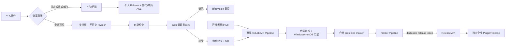
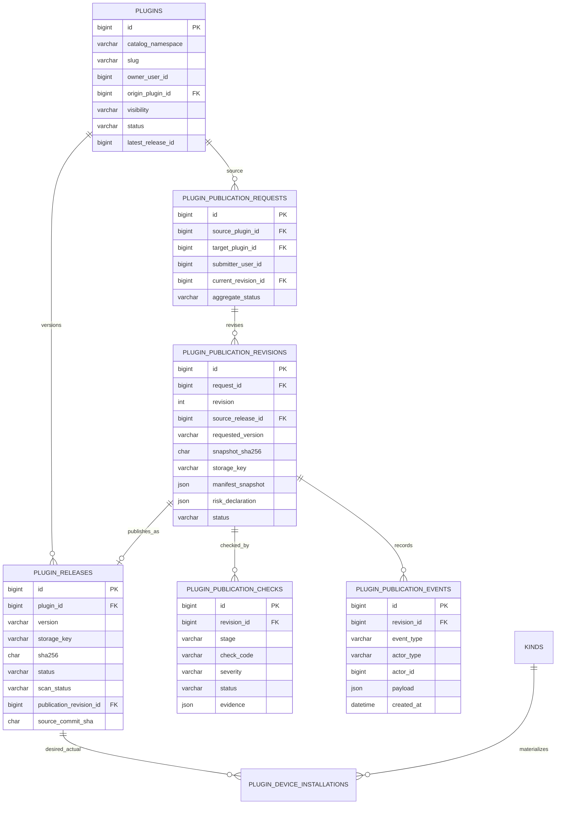
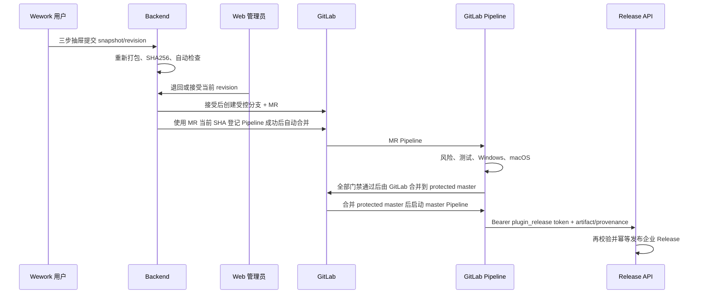

# Wework 插件市场 V2 技术设计

面向插件开发、开源迁移和本地联调，请先阅读[插件市场开发指南](./wework-plugin-marketplace-dev.md)。本文定义 Wework 插件分享、企业全员发布、GitLab 审核和市场 Release 的**实现与验收合同**。

> 实现状态（2026-08-29）：当前实现已落地双范围交互、ACL 与发布状态加载、Request/Revision/Check/Event 领域、Web 审核队列、MR 物化、受限 Release API 及本地测试。**这不等于已获准或已部署生产**：旧 Token 吊销与轮换、HTTPS、protected master/environment、Code Owner 审批、project-locked 原生 Windows/macOS Runner 和新 Release 凭据均需在真实 GitLab/生产环境完成 P0 配置与验证。第 10 节记录已实现边界和上线门禁。

## 1. 冻结的产品与技术决策

以下规则已冻结，变更必须同时更新本文、接口合同、交互稿和验收用例：

1. 个人插件详情页只有一个分发入口：标题区使用紧凑的分享图标按钮「分享」，其后依次为「…」和主按钮「立即对话」。不再出现「发布」或「分享与发布」。
2. 「分享」只包含两个用户意图：
   - **指定成员或部门**：安全扫描通过后立即生效，无人工审核。
   - **全员可见**：提交企业发布申请，完成管理员审核、GitLab 代码审核和发布门禁后才生效。
3. “组织”不是第三种范围。组织根节点按一个部门 ACL 处理，选择根部门与选择其他部门走同一套 `resource_members` 授权逻辑。
4. 普通用户的「全员可见」只映射企业内部目录 `visibility=workspace`。`visibility=public` 不向普通投稿人开放，仅保留给未来 Wework 官方公开插件。
5. 任意已登录的个人插件所有者都可以提交企业全员发布申请，不使用用户白名单授予投稿资格。服务端仍执行所有权、活动申请数、包大小和安全策略校验。
6. 全员发布使用三步右侧抽屉：**确认版本 → 权限与风险 → 确认提交**。提交后固化不可变 snapshot、revision 和 SHA256；继续编辑个人插件不会改变已提交内容。
7. 用户侧统一展示五个阶段：**提交申请 → 自动检查 → 管理员审核 → 代码审核 → 发布**。
8. Web 管理后台是人工审核入口。管理员可以退回或接受；“接受”只把当前 revision 物化为 GitLab 分支并创建 MR，绝不直接生成市场 Release。
9. 非技术用户从 Wework 投稿，技术用户可直接提交 GitLab MR；两条路径从 MR 开始复用同一套检查、合并和发布流水线。
10. 个人原件与企业版是两个独立 Plugin 身份。审核期间个人原件仍可编辑、立即对话、定向分享和安装；发布企业版不会改变、转移或删除个人原件。
11. **受保护的 master Pipeline 是唯一自动发布触发者。** GitLab Webhook 只同步 MR/Pipeline 状态和触发丢失事件的对账，不直接发布。
12. GitHub 上 Wework 官方公开插件的来源、审核和同步策略仍属 P1 待定，不阻塞本期企业内部发布，也不得由本期流程擅自推导。

## 2. 页面与交互合同

### 2.1 插件详情页

改版不得破坏现有详情能力：

- 「立即对话」和「试试这些任务」；
- 可用范围、插件信息和版本信息；
- 自动更新设置；
- 应用授权与退出登录；
- 包含能力及各能力启停；
- 个人所有者按权限看到的继续编辑、卸载和删除插件。

标题区动作顺序固定为：

```text
[分享图标 分享]  […]  [立即对话]
```

「分享」只对可管理该个人插件的所有者显示。插件接收者、企业版普通使用者和无管理权限用户不能看到投稿或范围管理操作。

### 2.2 指定成员或部门

选择「指定成员或部门」后打开成员/部门选择器：

- 可同时选择成员和部门；
- 组织根节点作为部门项出现，不新增“组织内可见”范围；
- 首次分享需要生成个人云端 Release，复用上传、对象存储和安全扫描；
- 已有个人云端 Release 时，后续范围变更通过 ACL 接口原子替换；
- 扫描通过且 ACL 写入成功后立即生效，不进入 Web 管理后台；
- 可选 `allowCopy`；切回仅自己时清空 ACL 并关闭复制。

### 2.3 全员可见三步抽屉

| 步骤          | 页面内容                                                                                           | 提交约束                                               |
| ------------- | -------------------------------------------------------------------------------------------------- | ------------------------------------------------------ |
| 1. 确认版本   | 插件名、个人来源、待提交版本、变更说明、当前源码时间                                               | 明确提示“本次提交形成独立快照，后续编辑不会更新该申请” |
| 2. 权限与风险 | 外部网络及域名、系统命令/脚本、本地文件读写、凭据使用、应用授权、MCP/Hook/bin 等执行能力、测试说明 | 远端源码快照生成前先收集作者声明                       |
| 3. 确认提交   | 待生成 revision、版本、完整声明摘要、发布范围、规范声明                                            | 二次确认后生成不可变快照，并在管理员审核前运行自动检查 |

上传失败或自动检查尚未开始时可以取消本次 revision；提交进入审核后使用“撤回申请”。退回修改必须保留原 revision 和审核证据，用户修改个人插件后创建新的 revision 重投，不能覆盖旧 snapshot。

### 2.4 进度与操作

详情页的企业发布卡片展示五阶段进度和具体子状态：

```text
提交申请 → 自动检查 → 管理员审核 → 代码审核 → 发布
```

- 审核前：可撤回；个人插件仍可正常使用和分享。
- 自动检查失败：展示稳定错误码、证据文件和修复建议。
- 管理员退回：展示退回原因和待修改项，允许从新 snapshot 创建下一 revision。
- 代码审核：展示 MR、Pipeline 和 Windows/macOS 检查状态；有权限时可跳转 GitLab。
- 发布失败：企业旧版本继续可用，允许管理员/发布人员重试同一幂等发布；不得要求用户覆盖旧 revision。
- 发布成功：个人原件继续位于「个人创建」，独立企业版出现在「企业内部」。

删除个人原件时，尚未合并的申请必须在同一确认流程中先撤回；撤回或 MR 关闭失败时阻止删除。已经合并或发布后，删除只影响个人原件，不删除企业版、GitLab 记录、申请 revision 或历史 Release。

### 2.5 Web 管理后台

普通用户无需离开 Wework 完成分享和投稿。Web 只承载管理员审核，至少包含：

- 列表：状态、风险、提交人、插件、时间筛选和分页；
- 详情：不可变 revision、SHA256、权限声明、自动检查证据、变更历史和 GitLab 状态；
- 「退回修改」：原因和待修改项必填；
- 「接受并创建 MR」：无阻断检查、警告已逐项确认时可用；操作必须幂等；
- GitLab 物化失败后的重试和状态对账入口；
- 完整的操作人、时间和状态事件审计。

后台不提供“直接发布”按钮，也不调用官方发布 CLI。

## 3. 架构与流程边界

插件市场继续采用“Wework 云端控制面 + 本地 Codex 运行面”。云端决定目录身份、可见范围、不可变 Release、账号期望版本和发布流程状态；Codex App Server 决定当前设备是否真正安装成功。市场包进入私有对象存储，数据库只保存元数据和不可变对象引用。



四条边界必须分开：

1. **个人定向分享**：云端扫描 + ACL，无人工审核，无 GitLab。
2. **非技术用户企业投稿**：Wework snapshot → Web 初审 → 自动创建 MR。
3. **开发者企业投稿**：直接创建 MR；从 MR 检查开始与非技术路径完全一致。
4. **Wework 官方公开插件**：`public` 目录的 P1 独立流程，本期不实现。

## 4. 数据归属与身份

| 数据                                   | 位置                                               | 事实语义                   |
| -------------------------------------- | -------------------------------------------------- | -------------------------- |
| Plugin、Release、Publication Request   | MySQL                                              | 云端控制面和发布状态       |
| Publication Revision、Check、Event     | MySQL                                              | 不可变投稿证据、检查和审计 |
| GitLab project/MR/commit/pipeline 映射 | MySQL                                              | 代码审核与发布 provenance  |
| ZIP、图标、截图、检查报告              | MinIO/S3 私有 Bucket                               | 内容寻址的不可变发布物     |
| 账号安装意图                           | `kinds/InstalledPlugin`                            | 期望状态                   |
| 人员/部门可见范围                      | `resource_members` + `ResourceType.PLUGIN`         | 个人分享授权状态           |
| 设备安装结果                           | `plugin_device_installations`                      | 每设备物化状态             |
| 本地创建插件                           | Wework Codex Home / `wework-personal`              | 当前设备私有内容           |
| 本地安装注册表                         | Codex App Server                                   | 当前设备运行事实           |
| 个人副本来源                           | `wework-personal/.wegent/plugin-copy-sources.json` | 仅本机来源映射             |
| Token、MCP 密钥                        | 系统安全存储                                       | 永不进入插件包和日志       |

### 4.1 目录命名空间

`plugins` 的稳定唯一键从全局 `slug` 改为 `(catalog_namespace, slug)`：

| `catalog_namespace`        | 所有者/可见性                          | 用途                     |
| -------------------------- | -------------------------------------- | ------------------------ |
| `personal/<owner_user_id>` | 个人所有者，`visibility=personal`      | 个人原件和定向分享       |
| `enterprise`               | 系统目录所有者，`visibility=workspace` | 企业内部插件             |
| `wework-official`          | 系统目录所有者，`visibility=public`    | 未来 Wework 官方公开插件 |

`catalog_namespace` 由服务端生成，客户端不可任意传入。展示 slug 可以相同，因此 `personal/42:foo` 与 `enterprise:foo` 可以同时存在。企业 Plugin 通过 `origin_plugin_id` 和发布 revision 追溯个人来源，但不继承个人 ACL、所有权或可变状态。

运行时市场映射保持：`personal -> wework-personal`、`workspace -> wegent`、`public -> wework`。该映射只用于受管安装记录；不能用展示名或 slug 跨命名空间合并身份。

### 4.2 ER 模型



### 4.3 表职责和不可变约束

| 表                             | 关键约束                                                                                   |
| ------------------------------ | ------------------------------------------------------------------------------------------ |
| `plugins`                      | `(catalog_namespace, slug)` 唯一；个人和企业身份不得原地互转                               |
| `plugin_releases`              | `(plugin_id, version)` 唯一；进入 `ready` 后包、版本、Manifest、SHA 和 provenance 不可修改 |
| `plugin_publication_requests`  | 一个业务申请可包含多个 revision；保存源个人 Plugin 和最终企业 Plugin 的关系                |
| `plugin_publication_revisions` | `(request_id, revision)` 唯一；提交后内容不可修改；退回后只能新增 revision                 |
| `plugin_publication_checks`    | 使用稳定 `check_code`；保存级别、证据、执行环境和外部 job URL，不能只保存一段扫描 JSON     |
| `plugin_publication_events`    | 追加写审计；记录用户、管理员、GitLab、Pipeline 和发布机器人动作                            |
| `plugin_device_installations`  | `(installed_kind_id, device_id)` 唯一；区分账号期望状态和设备事实                          |
| `resource_members`             | 只用于个人插件 ACL；成员与部门原子替换，组织根节点也是部门 principal                       |

Revision 还必须保存提交说明、测试说明、风险声明、创建人和时间，以及 GitLab project、source branch、MR IID/URL、commit SHA、Pipeline ID/URL、artifact SHA256 和发布结果。可拆为关联表，但不能把全部工作流状态塞进可变的 `scan_report_json`。

## 5. 状态机

用户看到五个稳定阶段，后端保留可诊断的子状态：

| 用户阶段   | 典型后端状态                                                                                      | 允许动作                                    |
| ---------- | ------------------------------------------------------------------------------------------------- | ------------------------------------------- |
| 提交申请   | `uploading`、`submitted`                                                                          | 上传失败时取消；提交后可撤回                |
| 自动检查   | `automatic_checking`、`automatic_check_failed`、`awaiting_admin`                                  | 查看证据；失败后修改并创建新 revision       |
| 管理员审核 | `admin_review`、`changes_requested`、`admin_accepted`                                             | 管理员退回或接受；用户可撤回                |
| 代码审核   | `materializing`、`draft_mr_open`、`ci_running`、`code_changes_requested`、`merge_ready`、`merged` | GitLab 评审和修复；合并后不可撤回已合并代码 |
| 发布       | `publishing`、`published`、`publish_failed`                                                       | 幂等重试；失败时保留当前企业版              |

终止状态包括 `withdrawn` 和管理员明确关闭的 `closed`。状态转换必须写入事件表并进行乐观锁或条件更新；重复 Webhook、管理员重复点击和 Pipeline 重试不能创建多个 MR 或多个 Release。

检查至少覆盖：

- ZIP 路径穿越、重复路径、符号链接、加密成员、敏感文件、大小、SHA256 和 Manifest；
- 外部网络域名、系统命令/脚本、本地文件读写、凭据、应用授权、MCP/Hook/bin 等风险；
- Manifest/市场登记一致性、版本和目录结构；
- 单元/集成测试；
- 原生 Windows 兼容检查；
- 原生 macOS 兼容检查。

静态跨平台扫描不能冒充 Windows/macOS 原生执行。缺少相应 Runner 时状态必须是 `blocked` 或 `not_run`，不能显示通过。

## 6. 核心流程

### 6.1 定向分享与个人副本

所有者首次选择「指定成员或部门」时，以 `purpose=restricted_share` 复用签名上传、对象存储和统一安全扫描。扫描通过后创建 `visibility=personal` 的云端 Plugin/Release，并原子写入 `resource_members`；该流程不创建 Publication Request，也不进入 GitLab。

接收者只能发现、查看和安装获授权的个人插件。撤权后立即删除接收者对原插件的账号安装意图，在线设备卸载，离线设备等待重连同步。允许复制时，Electron 校验 SHA256、ZIP 路径和 Manifest，以唯一 slug、`0.1.0` 和“我的副本”名称原子导入 `wework-personal`。本地来源映射不写入插件包，撤销原件权限不会删除已复制的独立副本。

### 6.2 非技术用户企业投稿



GitLab 物化服务只把服务端已验证 snapshot 写入约定的 `plugins/<slug>/` 并更新受控清单；分支名、路径、commit message 等不能直接拼接未经校验的用户输入。创建 MR 必须使用 request/revision 幂等键，并写回 project、branch、MR IID 和 commit SHA。受控项目必须开启 `Pipelines must succeed`；Backend 创建或复用 MR 后，以当前 MR head SHA 调用 GitLab merge API 登记 `merge_when_pipeline_succeeds=true`。Webhook 只做状态同步和对账，不负责触发合并。

### 6.3 开发者直接 GitLab 投稿

开发者可以直接在企业插件仓库创建分支和 MR。MR 必须满足相同目录、Manifest、登记、风险、测试和 Windows/macOS 门禁。从 MR Pipeline 开始，它与 Wework 非技术投稿没有特权差异；若无 Publication Request，Pipeline 以仓库元数据创建发布 provenance 和只读审计映射。

### 6.4 GitLab 和发布

企业插件仓库 Pipeline 至少包含：

1. `validate`：每个 MR 只允许一个插件的一个版本，并校验 Manifest、目录、版本、市场清单和确定性打包；
2. `security`：统一包扫描和权限/风险检查；
3. `test`：插件测试和契约测试；
4. `windows`：原生 Windows Runner；
5. `macos`：原生 macOS Runner；
6. `release`：仅 protected master、前序全部通过且使用受保护环境时运行。

MR Pipeline 永远不能读取 Release Token，也不能发布。合并到受保护 master 后，master Pipeline 使用已审核 commit 构建确定性 artifact，调用内部 Release API。Backend 必须再次校验 artifact SHA、Manifest、SemVer、扫描结果和 provenance，不能因为 CI 已通过就盲目信任上传内容。

同一 `catalog_namespace + slug + version + artifact_sha256` 重试返回已有 Release；同版本不同内容返回 `409`，禁止覆盖。新版本发布失败时，已有企业 `latest_release_id` 保持不变。

GitLab Webhook 使用独立的 Webhook Secret，只更新 MR/Pipeline/merge 状态并触发对账。Webhook 丢失时由周期任务按 project/MR/pipeline ID 拉取状态；它不持有 Release Token，也不调用发布服务。

### 6.5 发布服务复用

当前实现把市场 Release 事务收敛到 `PluginMarketplaceService.publish_catalog_release`：

- `OfficialPluginPublisher` 负责从本地目录构建确定性包，然后调用同一市场发布服务；
- Publication Request 在 snapshot 完成时由统一检查服务校验 SHA、Manifest、SemVer、结构和风险；
- CI Release API 对已构建 artifact 再验证后调用同一市场发布事务；
- CLI 只是本地 dry-run/应急适配器；dry-run 不写数据库或对象存储。

HTTP 接口不得启动 `publish_official_plugin.py` 子进程，也不得复制一套发布逻辑。

### 6.6 市场安装与更新

安装、更新和设备同步合同保持不变：`kinds/InstalledPlugin` 表示账号期望版本，`plugin_device_installations` 表示设备实际结果，Codex App Server 是本机安装事实源。新安装取 `latest_release_id`；自动更新只推进到 `ready + scan passed` 的不可变 Release。失败不得覆盖 `actual_release_id`，连续失败三次后暂停自动重试，手动更新或新的目标 Release 重置计数。

正常卸载只删除确认设备的运行入口和安装记录，不直接清空 Codex/Claude `plugins/cache`。离线设备在重连后补执行。当前设备安装失败必须返回明确错误，不能用其他设备成功掩盖。

## 7. API 合同

### 7.1 保留并收敛

| 方法            | 路径                                                                   | 当前用途                                         |
| --------------- | ---------------------------------------------------------------------- | ------------------------------------------------ |
| GET             | `/plugins/marketplace`、`/{id}`、`/{id}/releases`                      | 市场目录、详情和历史 Release                     |
| POST/PUT/DELETE | `/plugins/marketplace/{id}/install`、`/plugins/installed/{id}`         | 安装、更新、启停和卸载                           |
| GET/PUT         | `/plugins/marketplace/{id}/access`                                     | 个人所有者原子管理成员/部门 ACL 与 `allowCopy`   |
| POST            | `/plugins/marketplace/{id}/copy`                                       | 授权接收者复制个人插件                           |
| POST/GET        | `/plugins/submissions/init`、`/{id}/complete`、`/{id}`、`/{id}/cancel` | 迁移后仅用于个人定向分享的制品上传与扫描         |
| GET/POST/PATCH  | `/admin/plugins/upstreams...`                                          | 暂时保留精选上游能力；不等同 Wework 官方公开流程 |

### 7.2 企业发布申请

| 方法 | 路径                                                               | 用途                                                |
| ---- | ------------------------------------------------------------------ | --------------------------------------------------- |
| POST | `/plugins/publication-requests`                                    | 所有者创建申请和 revision，返回需要时的签名上传信息 |
| GET  | `/plugins/publication-requests`                                    | 查询本人申请和状态                                  |
| GET  | `/plugins/publication-requests/{id}`                               | 查询 revision、检查、时间线和 GitLab/发布状态       |
| POST | `/plugins/publication-requests/{id}/revisions`                     | 退回或失败后从新 snapshot 创建下一 revision         |
| POST | `/plugins/publication-requests/{id}/revisions/{revision}/complete` | 固化上传、SHA256 和风险声明并启动自动检查           |
| POST | `/plugins/publication-requests/{id}/withdraw`                      | 在合并前撤回申请；操作幂等                          |
| GET  | `/admin/plugins/publication-requests`                              | 管理员分页、筛选和汇总                              |
| GET  | `/admin/plugins/publication-requests/{id}`                         | 管理员查看完整证据和事件                            |
| POST | `/admin/plugins/publication-requests/{id}/return`                  | 必填原因和修改项，退回当前 revision                 |
| POST | `/admin/plugins/publication-requests/{id}/accept`                  | 幂等物化分支并创建 MR，不发布                 |
| POST | `/admin/plugins/publication-requests/{id}/reconcile`               | 重试物化或主动对账 GitLab 状态                      |

### 7.3 内部接口

| 方法 | 路径                              | 认证与用途                                                          |
| ---- | --------------------------------- | ------------------------------------------------------------------- |
| POST | `/internal/plugins/releases`      | 仅 `plugin_release` machine key；protected master Pipeline 幂等发布 |
| POST | `/internal/plugins/gitlab/events` | 独立 GitLab Webhook Secret；只同步状态和触发对账                    |

所有状态修改接口都需要幂等键和条件状态校验。普通用户接口不能接受 `visibility=public`；服务端必须固定企业申请目标为 `workspace`，不能依赖前端隐藏。

### 7.4 兼容和废弃边界

当前新路径已禁止旧 `/plugins/submissions` 创建 `workspace/public` 投稿，并完成权限配置清理；历史处理入口只为迁移存量记录保留：

- 已删除 `PLUGIN_PUBLISH_USER_IDS`、`PLUGIN_PUBLISH_ENABLED`、`PLUGIN_PUBLICATION_ENABLED`、白名单 `_can_publish/_ensure_publish_allowed`，以及不再承载真实决策的 `/plugins/capabilities` 接口、客户端缓存和旧 capability 响应字段；
- 企业投稿没有应用级全局启停配置。若出现紧急事故，通过网关隔离或回滚服务止损，不能用人员白名单或把活动申请上限设为 `0` 变相关停；
- 继续保持旧 `/plugins/submissions` 只接受 `restricted_share + personal`；
- 废弃 `/admin/plugins/submissions/{id}/review` 的“批准即发布”语义和 `review_plugin_submission.py approve`；
- `/plugins/upload` 保持 `410` 一个兼容观察期，确认无旧客户端调用后删除；
- `/admin/plugins/{id}/visibility` 等无调用接口先审计部署日志和客户端版本，再删除；
- 上游镜像接口暂时保留，直到 P1 官方公开插件方案确定。

## 8. 机器认证和安全边界

`Authorization: Bearer <release-token>` 是服务到服务凭据，不是新用户登录体系。实现复用现有 API Key 的随机生成、只存哈希、原文仅返回一次、到期、禁用、最后使用时间和审计能力，并使用专用 `key_type=plugin_release`：

- 只能访问 `/internal/plugins/releases`；普通 API 明确拒绝该 key type；
- 不允许使用 `wegent-username` 等方式模拟用户；使用固定发布服务主体；
- Release API 固定发布到 `catalog_namespace=enterprise`；GitLab project 与目标分支由服务端配置，并结合 GitLab 实时证明校验，不保存在 API Key 上；
- 必须设置有效期，支持双 Key 轮换和立即吊销；
- 仅保存在 GitLab protected + masked CI variable；只有 protected master release job 可读取；
- 日志只记录 key ID/前缀和发布主体，不记录原文。

Webhook Secret 与 Release Token 是两套凭据。Webhook 接口还必须校验项目白名单、事件类型、目标 ref/commit，并防止重放；通过 Webhook 验证不代表获得发布权限。

## 9. GitHub 官方公开插件（P1 待定）

以下问题尚未冻结：Wework 官方 GitHub 仓库是否作为唯一来源、内部镜像方式、外部贡献审核、许可证与签名、公开目录的升级/下架责任，以及 GitHub CI 与内网发布系统的信任关系。

因此本期规则是：

- 普通用户和企业管理员都不能通过企业投稿把插件发布为 `public`；
- `wework-official` 命名空间和 `visibility=public` 只预留数据能力；
- 现有官方发布 CLI 可作为已评审源码的运维工具，但不是 P1 产品方案；
- 未形成独立 ADR、威胁模型和验收用例前，不启用 GitHub 自动同步或公开发布。

## 10. 当前实现与生产启用边界

### 10.1 当前功能分支已实现

| 领域     | 当前分支实现                                                                                                                         |
| -------- | ------------------------------------------------------------------------------------------------------------------------------------ |
| Wework   | 个人详情双范围、三步申请抽屉、五阶段进度、完整 Request/Revision 历史，以及 ACL 与发布状态都加载完成后才允许提交的 ready gate         |
| Backend  | `catalog_namespace`、个人/企业来源关联、Request/Revision/Check/Event、用户/管理员/内部 API、幂等 MR 物化与只同步状态的 Webhook |
| Web      | 发布申请队列、筛选、revision 证据详情、退回修改、确认后接受并创建 MR、重试与对账                                               |
| Release  | `plugin_release` 专用机器身份、Bearer-only 内部接口、受信 GitLab/master provenance 检查、幂等与企业旧版本保留                    |
| 兼容边界 | 旧 `/plugins/submissions` 只允许 `restricted_share + personal`；旧管理员直接 review 和脚本仅用于处理历史记录，新企业申请不得调用     |

新 Alembic revision 已在当前分支添加命名空间、来源关联和发布领域表，并覆盖 upgrade → downgrade → upgrade 及冲突阻断验证。本地测试只证明代码和迁移实现，不能替代真实生产配置与端到端发布彩排。

### 10.2 生产启用前的外部 P0

1. 立即在外部系统吊销并轮换曾出现在仓库历史中的旧发布 Token；只有当 Release API 使用 HTTPS 或已批准的等价加密传输时，才能注入新凭据。
2. 在真实 GitLab 项目中配置并验证 protected `master`、protected environment、Code Owner 审批规则和受保护/脱敏变量。
3. 配置 project-locked 的原生 Windows 与 macOS Runner；缺失、跳过或只做静态扫描均必须阻断合并。
4. 通过受批准的密钥管理路径创建新 `plugin_release` 凭据，只注入 protected master release job，并验证 MR job 不可读。
5. 在真实环境完成个人分享、新建/重投 revision、管理员退回/接受、MR、双平台 Runner、合并、发布、重放、失败与回滚的端到端彩排。

### 10.3 历史路径收口

- 新 Request API 不包含历史投稿开关或人员白名单；所有已登录的个人插件所有者均可创建申请。
- 旧 `/plugins/submissions` 保留个人定向分享上传，服务端拒绝 `workspace/public` 用途。
- 历史待审记录需清退或迁移；旧“批准即发布”接口和脚本不得被 Web 新审核页调用，待观察确认无历史流量后删除。
- 迁移必须保持个人 ACL、已安装意图、设备实际状态、企业旧版本和对象存储引用；不得把个人 Plugin 原地改为企业 Plugin。

## 11. 验收清单

### 产品和权限

- 详情页只出现统一「分享」入口和两个意图，标题区按钮顺序、既有任务/授权/能力/更新功能不回归。
- 组织根节点按部门 ACL 生效；成员与部门授权可组合、可原子替换、撤权可同步卸载。
- 任意已登录个人插件所有者可申请企业全员发布；普通用户无法构造 `public` 投稿。
- 三步抽屉字段、校验、取消、撤回、退回重投和五阶段状态与交互稿一致。
- 审核期间个人原件可继续编辑、对话和定向分享，提交 revision 的 SHA256 不变。
- 企业发布后个人项和企业项同时存在，来源可追溯但权限、版本和生命周期独立。

### 审核和 GitLab

- Web 管理员退回必须填写原因；接受操作重复调用只得到同一个 MR，且不会产生 Release。
- 非技术投稿与开发者 MR 从 MR Pipeline 开始执行同一套门禁。
- 风险检查输出稳定 code、severity、证据和执行环境；声明与扫描不一致会阻断。
- Windows 与 macOS 检查由对应原生 Runner 执行；未执行不得显示通过。
- MR Pipeline 无 Release Token；只有 protected master release job 可以调用 Release API。
- Webhook 重复、乱序或丢失不会重复发布，周期对账能恢复真实状态。

### Release、安装和迁移

- Release API 使用 `plugin_release` key，不能模拟用户或调用普通 API；轮换、禁用、过期和审计有效。
- 同版本同 SHA 幂等，同版本不同 SHA 返回冲突；发布失败保留上一企业版本。
- Backend 对 CI artifact 做独立校验，Release provenance 能追溯 revision/MR/pipeline/master commit/artifact SHA。
- 发布后的 Release 不可修改；新安装取 latest，更新失败保留 `actual_release_id`，设备状态不虚报。
- 新迁移可升级、回滚和再次升级；历史企业插件、个人 ACL、安装引用和对象可下载性均保持。
- 旧 `/plugins/submissions` 只接受个人定向分享；新企业申请不受白名单授权，也不能进入旧“批准即发布”路径。
- GitHub 官方公开插件保持关闭，直到独立 P1 方案评审通过。
