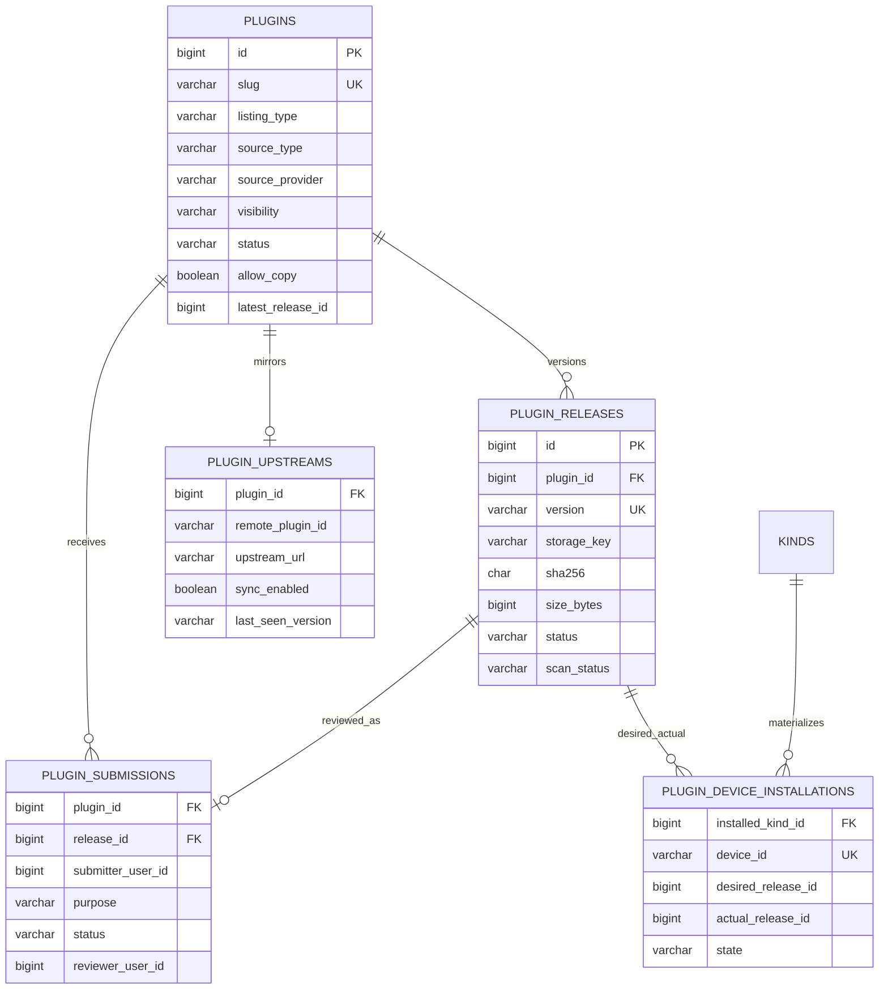
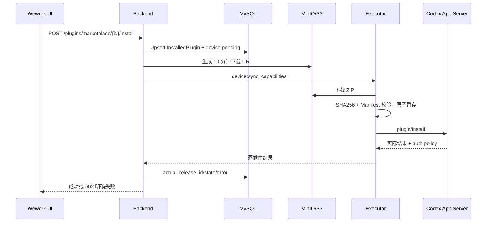
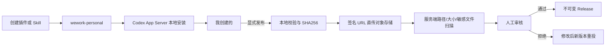

# Wework 插件市场 V2 技术设计

面向插件开发、开源迁移和本地联调，请先阅读 [插件市场开发指南](./wework-plugin-marketplace-dev.md)。本文侧重控制面架构、数据模型和运维约束。

## 1. 决策与边界

插件市场采用“Wework 云端控制面 + 本地 Codex 运行面”。云端决定可见插件、可安装 Release、账号期望版本和审核状态；Codex App Server 决定当前设备是否真正安装成功。市场包统一进入私有对象存储，数据库只保存元数据和不可变 Release 引用。

锁定规则：

- 普通用户只能浏览 Wework 云端市场，不能直接添加任意 GitHub 或 Codex Marketplace。
- Codex 官方插件按管理员白名单选择性镜像，不做全量同步。
- 市场展示最新已发布版本，历史 Release 保留；已安装插件默认手动更新。
- 本地创建内容位于 `wework-personal`，不自动上传；只有“发布到市场”或所有者主动定向分享时才会上传并进入相同安全扫描。
- Skill 是展示类型，安装单位始终是 Codex Plugin；单 Skill 插件包含一个 `SKILL.md`。
- `kinds/InstalledPlugin` 是账号安装意图，`plugin_device_installations` 是设备执行结果，本机 Codex App Server 是运行事实源。

## 2. 数据归属

| 数据                        | 位置                                               | 事实语义                            |
| --------------------------- | -------------------------------------------------- | ----------------------------------- |
| Plugin、Release、上游、投稿 | MySQL                                              | 云端控制面                          |
| ZIP、图标、截图             | MinIO/S3 私有 Bucket                               | 不可变发布物                        |
| 账号安装意图                | `kinds/InstalledPlugin`                            | 期望状态                            |
| 人员/部门可见范围           | `resource_members` + `ResourceType.PLUGIN`         | 授权状态                            |
| 设备安装结果                | `plugin_device_installations`                      | 每设备物化状态                      |
| 本地创建插件                | Wework Codex Home / `wework-personal`              | 当前设备私有内容                    |
| 本地安装注册表              | Codex App Server                                   | 当前设备运行事实                    |
| 个人副本来源映射            | `wework-personal/.wegent/plugin-copy-sources.json` | 仅本机保存的来源与云端 Release 映射 |
| Token、MCP 密钥             | 系统安全存储                                       | 永不进入插件包和日志                |

`skill_binaries` 不再接收 V2 Release。迁移工具把旧 Marketplace ZIP 搬到对象存储，并把旧安装记录改成 `pluginId/releaseId` 引用。

## 3. ER 模型



### 表职责

| 表                            | 新增/复用 | 关键约束                                                                |
| ----------------------------- | --------- | ----------------------------------------------------------------------- |
| `plugins`                     | 新增      | `slug` 唯一；稳定产品身份                                               |
| `plugin_releases`             | 新增      | `(plugin_id, version)` 唯一；进入 `ready` 后包、版本、Manifest 不可修改 |
| `plugin_upstreams`            | 新增      | 每个 Plugin 最多一个选定上游；每 6 小时同步                             |
| `plugin_submissions`          | 新增      | 一个 Release 只有一个投稿；拒绝后创建新版本                             |
| `plugin_device_installations` | 新增      | `(installed_kind_id, device_id)` 唯一                                   |
| `kinds/InstalledPlugin`       | 复用      | 保存账号期望版本，不保存 ZIP                                            |
| `resource_members`            | 复用      | 新增 Plugin 资源类型                                                    |
| `PluginMarketplaceItem` Kind  | 退役      | 迁移完成后不再读写                                                      |

## 4. 来源与身份

| 场景                       | `origin`  | `sourceProvider` | UI 标记                  |
| -------------------------- | --------- | ---------------- | ------------------------ |
| 本机创建                   | `created` | 本地             | 我创建的                 |
| Wegent 自研 / 国内适配镜像 | `market`  | `wegent`         | Wegent 官方              |
| 精选 Codex 镜像            | `market`  | `codex`          | Codex 官方 · Wework 镜像 |
| 用户投稿审核通过           | `market`  | `user`           | 社区插件/作者            |

> OpenAI 上游镜像（含 GitHub）同步时**纯透传**官方包，不再做 connectors /
> 汉化 / 图标改写。品牌 `logo` / `logoDark` 以官方包为准。

“我的已安装”以 `pluginId/releaseId` 合并云端意图和设备状态；本地创建项以 `localId` 标识。禁止用展示名关联，因为同名插件和改名都会造成误合并。

插件运行时身份使用 `plugin://<plugin-name>@<marketplace-name>`。受管市场名由 visibility 统一推导：`personal -> wework-personal`、`workspace -> wegent`、`public -> wework`。前端生成试用 mention、Composer app metadata 和应用创建插件匹配时必须复用同一套映射，并且只在 `providerKey` 为 `wegent-market` 或 `wegent-marketplace` 的受管安装记录上应用该回退规则。普通 `public` 插件仍合法；只有系统所有者 `user_id=0` 的内置应用插件行若仍保存为旧的 `public`，才会在内置安装路径中规范化为当前注册表定义的 `workspace / wegent`。

## 5. 核心流程

### 市场安装与更新



新安装选择 `latest_release_id`。更新必须由用户确认，失败保留旧版本。卸载先把设备行置为 `uninstalling`，只删除已确认设备的安装记录和物化入口，离线设备上线后补执行。正常卸载不直接清空 Codex 或 Claude `plugins/cache`，缓存目录只应由运行时复用或由独立垃圾回收删除未被安装记录引用的版本。

Wework 调用目录、安装、更新和卸载接口时携带本机 Executor 的稳定 `device_id`。目录中的“已安装”只在该设备 `state=installed` 且 `actual_release_id` 等于账号期望 Release 时成立；账号已有安装意图但当前设备为 `pending/failed` 时仍显示可安装和具体设备错误。一次操作只因当前设备失败而返回 `502`，其他设备失败记录在 `plugin_device_installations` 并等待重连补同步。设备 WebSocket 重连完成后会再次回写逐插件结果，清除已完成的卸载或旧失败状态。

### 本地创建与发布



本地创建不会产生云端 Plugin、Release 或包。发布完成后，本地原件仍是“我创建的 · 已发布”，不会被市场副本替换。

发布入口统一为「人 / 组织 / 全部」三个范围：`visibility=personal` 对应定向分享（扫描通过后立即生效，`purpose=restricted_share`）；`workspace` / `public` 进入人工审核（`purpose=marketplace_publish`）。个人范围可在投稿时携带 `targets` 与 `allowCopy`，服务端在 init 阶段校验接收者，并在扫描通过后写入 `resource_members`。

创建任务应写入受管市场 `wework-personal`。若 Plugin Creator 仍落到 Codex 默认 `personal`（`~/plugins` + `~/.agents`），列表刷新与发布打包前会把插件原子迁入 `wework-personal`、同步市场清单并优先以该市场为准，避免重复条目。

Wework 的“发布到市场”不要求用户手工选择 ZIP。Tauri 根据本地 Marketplace 和插件键定位目录，原生打包并校验 `.codex-plugin/plugin.json`、符号链接、越界路径、50 MB 压缩包上限和 200 MB 展开上限；单 Skill Plugin 自动以 `listing_type=skill` 投稿。

### 定向分享与个人副本

所有者首次按「人」发布或后续管理可见成员时，以 `purpose=restricted_share` 复用投稿上传、对象存储和安全扫描。扫描通过后自动生成 `visibility=personal` 的云端 Plugin/Release，不进入公共市场人工审核；授权保存失败时保持仅所有者可见。人员与部门授权原子替换 `resource_members`，切回“仅自己”会清空授权并关闭复制。

接收者只能发现、查看和安装获授权的个人插件。所有者撤权后，服务立即删除接收者对原插件的账号安装意图，在线设备卸载，离线设备等待重连同步。允许复制时，接收者通过短期下载地址取得包；Tauri 校验 SHA256、ZIP 路径和 Manifest 后，以唯一 slug、`0.1.0` 和“我的副本”名称原子导入 `wework-personal`。副本的来源映射只写本地注册表，不写入插件包，撤销原件权限不会删除已经复制的独立副本。

### 精选 Codex 镜像

管理员录入 `marketplace_name + remote_plugin_id + upstream_url + license_info`。定时任务只检查 `sync_enabled=true` 的记录；发现 SemVer 新版本后下载、扫描并写入对象存储。开源镜像默认使用 `auto_after_scan`，扫描通过后单调提升 `latest_release_id`；高风险上游可改为 `review_required`，只生成待审核 Release，管理员批准后才提升 latest。上游返回旧版本时只更新检查信息，不回退 `latest_release_id`；扫描失败或上游删除时保留旧 Release，不影响现有用户。

### WeWork 官方插件发布

官方插件维护在
[wecode-ai/wework-plugins](https://github.com/wecode-ai/wework-plugins)，并以
`--visibility public` 发布到「Wework官方」Tab。

布局对齐 openai/plugins：每个插件位于 `plugins/<slug>/`，必须包含
`.codex-plugin/plugin.json`、能力文件和测试；源码仓只用于开发与 CI，Backend
和 Wework 运行时不得直接读取它。建议与 Wegent 同级检出（例如
`wework-plugins-public`）。

若部署方需要把已评审的本地源码树发布到组织目录，可使用
`--visibility workspace`。共享文档中不要写入私有主机名或内网仓库路径。

发布脚本会按路径排序、固定 ZIP 时间戳和权限，先执行统一安全扫描，再写入
`source_type=native`、`source_provider=wework`、`owner_user_id=NULL` 的 Plugin
和不可变 Release：

```bash
# 本地只构建、扫描并输出 SHA256，不连接 MySQL/S3
uv run python scripts/publish_official_plugin.py \
  ../wework-plugins-public/plugins/<plugin-slug> --dry-run

# Wework官方 Tab（公开仓）
uv run python scripts/publish_official_plugin.py \
  ../wework-plugins-public/plugins/<plugin-slug> \
  --visibility public \
  --commit-sha "$CI_COMMIT_SHA" \
  --build-url "$CI_JOB_URL" \
  --publisher release-bot
```

同一 `slug + version + SHA256` 重试会返回已有 Release；同版本不同内容会返回冲突，禁止覆盖。发布审计保存在 `scan_report_json.provenance`，包括 commit SHA、构建地址、发布身份和可选的 `created_by_user_id`。

CI 凭据只从 Secret 注入。发布身份需要 MySQL 中 Plugin/Release 的写权限，以及 `plugins/{plugin_id}/{release_id}/` 的对象创建权限；安装服务账号只需读取 final 前缀。生产 Bucket 应开启版本控制或 Object Lock，并禁止覆盖 final key。`plugins/staging/` 应配置生命周期规则（建议 1–7 天自动删除）；投稿完成后服务也会尽力删除对应 staging 对象。

回滚不修改旧 Release：修复代码并提升 SemVer 后重新发布。紧急下架应调整 Plugin 的目录状态或 `latest_release_id` 指针，并保留原对象和审计记录；恢复时仍只指向已扫描通过的 `ready` Release。发布中 S3 写入失败会回滚数据库；数据库提交失败会尽力删除本次新建对象。

## 6. API

| 方法   | 路径                                     | 用途                                           |
| ------ | ---------------------------------------- | ---------------------------------------------- |
| GET    | `/plugins/capabilities`                  | 分别返回当前用户是否可发布、是否可分享个人插件 |
| GET    | `/plugins/marketplace`                   | 最新目录、来源、安装和更新状态                 |
| GET    | `/plugins/marketplace/{id}`              | 插件详情                                       |
| GET    | `/plugins/marketplace/{id}/releases`     | 历史 Release                                   |
| POST   | `/plugins/marketplace/{id}/install`      | 安装最新或指定 Release                         |
| PUT    | `/plugins/installed/{id}`                | 启停组件或升级 Release                         |
| DELETE | `/plugins/installed/{id}`                | 账号级卸载并同步设备                           |
| GET    | `/plugins/marketplace/{id}/access`       | 所有者读取个人插件授权                         |
| PUT    | `/plugins/marketplace/{id}/access`       | 原子替换人员/部门授权和 `allowCopy`            |
| POST   | `/plugins/marketplace/{id}/copy`         | 校验访问权和复制许可并返回短期下载信息         |
| POST   | `/plugins/submissions/init`              | 创建投稿并取得签名上传 URL                     |
| POST   | `/plugins/submissions/{id}/complete`     | 完成上传并触发扫描                             |
| POST   | `/plugins/submissions/{id}/cancel`       | 取消未完成上传并释放版本号                     |
| GET    | `/plugins/submissions/{id}`              | 查询投稿状态                                   |
| GET    | `/admin/plugins/upstreams`               | 管理端查看精选镜像源和同步状态                 |
| POST   | `/admin/plugins/upstreams`               | 录入精选 Codex 插件                            |
| PATCH  | `/admin/plugins/upstreams/{id}`          | 切换扫描后自动发布或人工审核策略               |
| POST   | `/admin/plugins/upstreams/{id}/sync`     | 立即镜像                                       |
| GET    | `/admin/plugins/submissions`             | 管理端查看待审和历史投稿                       |
| POST   | `/admin/plugins/submissions/{id}/review` | 审核投稿                                       |

旧 `/plugins/upload` 默认返回 `410`，只可通过显式迁移开关为管理员临时启用。

## 7. 迁移与发布顺序

1. 执行 Alembic，验证 upgrade、downgrade、再 upgrade。
2. 配置私有 `plugins` Bucket 和 10 分钟签名 URL。
3. 先运行 `uv run python scripts/migrate_plugin_marketplace_v2.py` 做可重复迁移核对。
4. 校验 Plugin/Release 数量、SHA256、对象可下载和安装引用。
5. 再加 `--retire-legacy` 关闭旧 Kind 并清理旧市场包副本。
6. 发布 Backend/Executor，再发布 Wework UI，避免新 UI 遇到旧 API。
7. 发布入口保持 Feature Flag 和内部白名单，稳定后再扩大。

迁移 `d4e5f6a7b8c9` 一次性创建插件市场控制面表，并包含 `plugins.allow_copy` 与 `plugin_submissions.purpose`。上线前必须验证升级、回滚一个版本和再次升级；Backend 应先于包含分享入口的 Wework 客户端发布。

发布能力由 `PLUGIN_PUBLISH_ENABLED`、`PLUGIN_PUBLISH_USER_IDS` 和管理员角色共同决定。Wework 先读取 `/plugins/capabilities`，无权限时不渲染发布入口；后端投稿接口仍独立执行相同校验，不能依赖前端隐藏。

## 8. 首批精选插件

| 优先级 | 插件               | 价值                             | 导入前检查                                |
| ------ | ------------------ | -------------------------------- | ----------------------------------------- |
| P0     | GitLab Engineering | MR 审查、Issue、Pipeline/CI 诊断 | GitLab API/CLI 授权、许可证、企业域名配置 |
| P0     | GitHub             | PR/Issue/CI 工作流               | 官方来源、OAuth/CLI 授权                  |
| P0     | Gitee              | 国内代码托管协作                 | 官方 MCP、Token 最小权限                  |
| P0     | Chrome DevTools    | 浏览器调试与性能分析             | 本机权限、命令执行风险                    |
| P1     | 企业微信           | 消息、会议、日程、文档           | 自研包优先，敏感权限分级                  |
| P1     | 腾讯文档           | 文档与表格协作                   | 官方授权和数据范围                        |
| P1     | 飞书、钉钉         | 中国企业协作场景                 | 不重复搬运同能力，先做真实用户验证        |

插件不是“从 Codex 全量搬运”。每个候选都必须先确认产品价值、许可证、维护责任、鉴权方式和安全扫描结果，再由管理员录入上游。

## 10. 实现完成度与验证记录（2026-07-29）

### 本轮收口范围

- **后端控制面**：新增受限分享投稿目的、所有者授权读写、接收者可见性、复制许可和撤权卸载同步，并继续复用统一包扫描流程。
- **Tauri**：新增个人副本 SHA256、重复路径、ZIP 穿越、符号链接和 Manifest 校验；唯一命名、原子导入、App Server 安装失败回滚和本地来源映射。
- **Wework**：市场按国内公开、企业内部、个人分享和 Codex 官方筛选；管理页使用单一已安装列表；详情统一展示最佳实践、授权和包含能力；创建、分享、复制及对话 Mention 复用真实插件状态。

### 自动化验证（本地，2026-07-25）

| 套件                                                   | 结果                                                    |
| ------------------------------------------------------ | ------------------------------------------------------- |
| `backend/tests/services/test_plugin_marketplace_v2.py` | 40 passed                                               |
| `wework` Vitest                                        | 224 files / 2217 passed                                 |
| Tauri `plugin_copy`                                    | 5 passed                                                |
| Alembic upgrade → downgrade → upgrade                  | 通过（隔离数据库）                                      |
| 隔离 `ai:verify` Tauri 会话                            | 市场、详情、管理、斜杠菜单、模板预填和品牌 Mention 通过 |

### 环境阻塞项

- 完整 `wework ai:verify`（云端目录、安装、失败重试、更新失败保留旧版、卸载重连、白名单发布）依赖在线 Backend、MySQL、S3/MinIO 与真实 Tauri 桌面，未在纯 CI 沙箱中执行。
- 插件图标/截图媒体链路（上传 API、UI、验收交互）按首期范围保留后续迭代。
- 双真实账号的完整“分享 → 安装 → 复制 → 撤权”桌面 E2E 仍需要部署环境中的测试账号和对象存储。

### Code Review（缺陷优先）

本轮针对 V2 差异路径审查后，**无 P0/P1** 遗留；P2 仅保留上述环境与媒体能力阻塞项，不作为发布主链路缺陷。

## 9. 验收清单

- 新安装永远取最新 Release，旧安装显示“可更新”且不静默升级。
- 在线设备成功、离线设备 `pending`、失败返回逐插件错误，更新失败保留旧版本。
- 安装和卸载由 Codex App Server 执行；Executor 只负责受管包缓存、校验、事件转发和逐设备结果上报；普通卸载不承诺删除 `plugins/cache`。
- `InstalledPlugin.status.devices` 与 App Server 当前设备结果一致，接口成功不得掩盖本机失败。
- ZIP 穿越、重复路径、符号链接、加密成员、敏感文件、超大展开体积、SHA 错误和缺失 Manifest 均被拒绝。
- 本地创建不触发云端上传；只有显式发布才产生 Submission。
- 定向分享只有所有者可管理；无授权不可见、不可下载，撤权卸载原件但保留独立副本。
- 个人副本导入失败不保留半成品，来源映射不写入上传包。
- 审核前不可搜索，审核后可安装；Release 发布后不可修改。
- 普通用户界面没有添加任意 Marketplace 的入口。
- “我创建的”、Wegent 官方、Codex 镜像和社区来源稳定区分。
- Backend 插件测试、Executor 合约测试、Wework 组件测试和真实 Tauri 验证通过。
