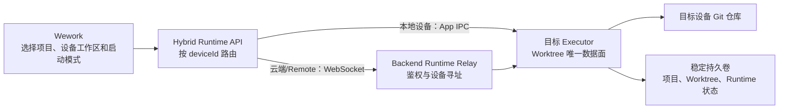
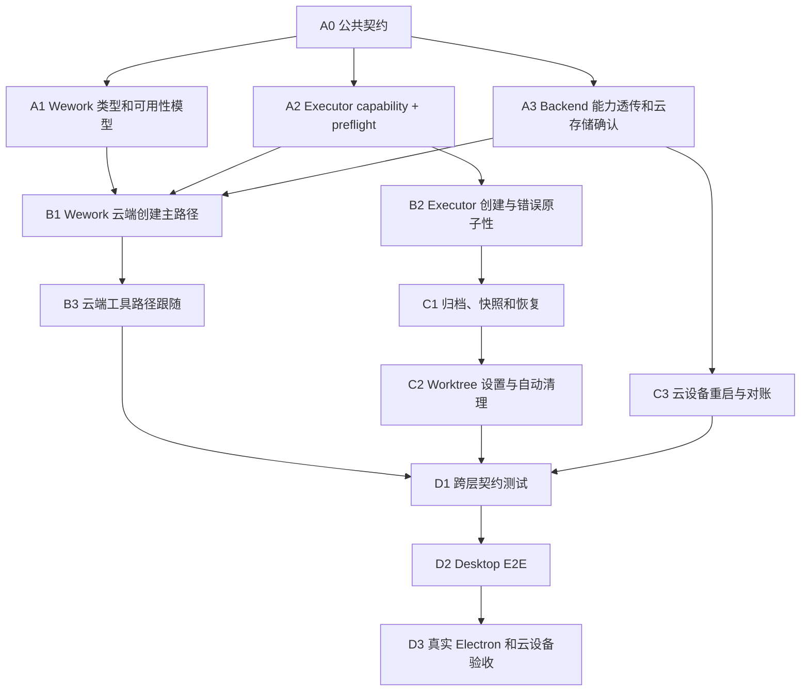

# 云端 Git Worktree 目标模式与并行开发计划

## 1. 文档状态

- 制定日期：2026-08-17
- 状态：核心代码、真实 Electron 云端闭环和 Remote Docker 容器生命周期验收完成；仅托管生产持久卷与实例重建待目标环境验收
- 目标：让 Wework 的本地设备、托管云设备和 Remote Docker 设备共用同一套托管 Git Worktree 能力
- 开发方式：一个主 Agent 负责目标、公共契约和集成；多个子 Agent 在互斥写入范围内并行实现

本文记录实施计划、并行分工和验收状态。

## 2. 目标模式

### 2.1 最终目标

用户在任意支持 Worktree 的在线设备工作区中选择“新工作树”后，Wework 将任务发送到该工作区所属 Executor，由目标 Executor 在自己的持久化文件系统中完成 Worktree 的计划、创建、运行、归档、快照、恢复和清理。



### 2.2 权威边界

| 领域                                | 权威                                                 |
| ----------------------------------- | ---------------------------------------------------- |
| 项目和设备工作区映射                | Backend `DeviceWorkspace`                            |
| 设备在线状态与能力                  | Backend 中的设备在线信息，来源于 Executor            |
| Worktree 创建和文件状态             | 创建它的目标 Executor                                |
| Worktree 元数据和快照               | 目标 Executor 的 `worktrees.json` 与 Git refs        |
| Runtime Task 到 Worktree 路径的绑定 | 目标 Executor Runtime Task Store                     |
| 启动模式和分支偏好                  | 按 `DeviceWorkspace` 隔离的用户偏好                  |
| UI 展示                             | Runtime 列表、事件和短期缓存的投影，不是文件系统真值 |

### 2.3 必要不变量

1. Worktree 只能由持有源仓库的目标 Executor 创建、删除和恢复。
2. `deviceId` 是 Worktree 身份的一部分，不能跨设备回退或迁移。
3. Backend 不执行 Git 命令，不持有 Worktree 文件状态真值。
4. 一个 Runtime Task 最多绑定一个托管 Worktree。
5. Worktree ID 必须由稳定、唯一的任务 ID 派生。
6. 排队任务只计算计划路径，获得物理执行槽位前不能创建目录。
7. Worktree 创建失败时不能回退到项目主目录继续运行。
8. Terminal、IDE、文件树和 Git 操作必须使用任务最终工作区路径。
9. 删除 Worktree 前必须处理所有关联任务；默认删除保留可恢复快照。
10. 自动清理只能处理已归档、非运行且不影响运行中同仓库任务的 Worktree。
11. 设备离线不能触发跨设备恢复、删除或重新创建。
12. 云端设备的 Executor Home、主仓库、Worktree 根目录和绝对挂载路径必须稳定持久化。
13. 对外统一使用逻辑设备 ID；Backend 负责解析当前 Runtime Socket ID，并验证用户所有权。
14. Worktree 能力不能复用现有 Skills、Plugins、MCP `capabilities` 字段。
15. 已存在的目标目录必须验证为同一源仓库、同一 Worktree ID 的合法 Git Worktree。
16. Executor 崩溃恢复不得自动续跑 Agent；有效 Worktree 可以恢复为可管理状态，关联任务标记为中断或失败。
17. 删除 Worktree 必须先收到关联 Runtime 停止确认，再归档任务、创建快照并移除目录。
18. 同一 Executor Home 第一阶段只允许一个 Executor 进程写入。

## 3. 范围

### 3.1 本次范围

- 补齐 Wework 的 `remote`、`cloud` 和 `device_path` 类型语义。
- 将 Worktree 可用性从“是否本机”改为“项目、工作区、设备能力和在线状态”的联合判断。
- 增加 Executor Worktree capability 和目标工作区 preflight。
- 复用 `runtime.tasks.create` 支持云端和 Remote Docker 的延迟 Worktree 创建。
- 复用现有 Runtime WebSocket Relay，不新增 Backend Git 数据面。
- 补齐云端归档、快照、恢复、自动清理和设置。
- 确保 Terminal、code-server、文件树和 Git 操作使用任务 Worktree 路径。
- 明确并验证托管云设备持久卷要求。
- 增加单元、契约、Backend、桌面 E2E 和真实 Electron 验证。

### 3.2 非目标

- 不在 Backend 创建 Git 仓库或 Worktree。
- 不把 Worktree 文件同步到 Backend 数据库。
- 不实现跨设备 Worktree 迁移。
- 不在设备离线时回退到其他设备或 Wework 本机。
- 不为旧 Executor 增加静默兼容或能力猜测。
- 不将临时任务 Worktree 建模成新的 Backend `DeviceWorkspace`。
- 不通过重试掩盖 Worktree 创建、Runtime 启动或远程 RPC 的确定性失败。

## 4. 实施前基线与差距

当前 Executor 已具备：

- `runtime.worktrees.settings.get/update`
- `runtime.worktrees.prepare/list/delete/restore/prune`
- `runtime.tasks.create` 的 `git_worktree` 工作区源
- 根据任务 ID 计算稳定计划路径
- 获得调度槽位后再创建 Worktree
- `git worktree add --detach`
- Worktree 快照、恢复和自动清理
- Worktree 和 Runtime Task 的路径绑定

当前云端传输已具备：

```text
Wework
  -> /wework-runtime runtime:request
  -> Backend WeworkRuntimeNamespace
  -> RuntimeRpcService
  -> /local-executor runtime:rpc
  -> Executor RuntimeWorkRpcHandler
```

实施开始时的主要缺口如下；代码路径现已按本文方案补齐，托管云底层持久卷仍需在实际部署环境中完成验收：

- Wework `supportsGitWorktreeExecution()` 只接受本地 target。
- 选择远程 DeviceWorkspace 后，启动模式菜单被硬禁用。
- Wework TypeScript 类型没有完整表达 Backend 的 `remote` 和 `device_path`。
- 设备能力没有明确声明 Worktree 协议版本。
- 目标工作区没有统一的远程 Git preflight。
- Worktree 模式和分支偏好目前按 Project 保存，可能在多个 DeviceWorkspace 间串值。
- “远程”同时被用作执行位置和启动模式文案，产品语义混在一起。
- 乐观任务可能在 Executor 返回计划路径前，把主工作区路径误标为 Worktree。
- 云设备逻辑 ID 与 Runtime Socket ID 的解析部分落在客户端。
- Runtime Relay 将离线、超时、断开和 Executor 错误折叠为同一类错误。
- 托管云设备的稳定持久卷还需要成为上线门槛。

## 5. 工作流与依赖



`A0` 是唯一不可并行跳过的基础工作。`A1`、`A2`、`A3` 完成公共契约冻结后可以并行；后续按依赖波次推进。

## 6. Agent 拓扑

### 6.1 主 Agent：目标与集成负责人

职责：

- 创建并维护目标状态。
- 先完成公共协议决策。
- 管理任务依赖、Agent 写入范围和合并顺序。
- 处理跨模块公共类型、协议命名和冲突。
- 审查所有子 Agent 变更。
- 运行跨模块测试、真实 Electron 验证和最终验收。
- 在目标真正完成后才将目标标记为完成。

主 Agent 独占写入范围：

- 跨模块共享协议和最终集成文件
- 任何需要同时修改 Wework、Backend 和 Executor 语义的决策

### 6.2 子 Agent A：Wework 类型和可用性模型

建议写入范围：

- `wework/src/types/**`
- `wework/src/lib/projectClassification.ts`
- 新的 Worktree availability 纯函数
- 对应前端单元测试

任务：

- 补齐 `remote`、`cloud`、`device_path` 类型。
- 引入结构化 Worktree availability。
- 统一 Local、Cloud、Remote 的能力、在线状态、Git 和 preflight 判断。
- 为离线、非 Git、版本过旧和工作区不可用提供稳定 reason。

限制：

- 不修改 Hybrid Services 路由。
- 不修改 WorkbenchProvider 或 Composer UI。
- 不设计或修改 Executor RPC payload。
- 不修改 Backend 设备能力。

### 6.3 子 Agent B：Executor Worktree 能力

建议写入范围：

- `executor/src/runtime_work/worktrees.rs`
- `executor/src/runtime_work/handler/system.rs`
- `executor/src/runtime_work/handler/tasks.rs`
- Executor capability 生成模块
- `executor/tests/*worktree*`

任务：

- 增加 Worktree capability 版本。
- 增加 `runtime.worktrees.preflight`。
- 在任务创建时再次校验源仓库、可写目录和 fingerprint。
- 保证创建失败不启动 Runtime。
- 保持排队任务延迟创建。
- 完善错误码、快照、恢复和重启加载测试。
- 将阻塞 Git 和文件系统操作移出异步 RPC 主线程。
- 引入 `preparing` 等明确生命周期状态和启动时对账。
- 验证已有目标目录身份，拒绝复用未知或错误仓库目录。

限制：

- 不修改 Wework UI。
- 不修改 Backend WebSocket Namespace。
- 不改变任务调度容量语义。

### 6.4 子 Agent C：Backend 路由、在线能力和云存储

建议写入范围：

- `backend/app/api/ws/wework_runtime_namespace.py`
- `backend/app/services/device/**`
- `backend/app/schemas/**device**`
- 云设备 provider、部署配置和对应测试
- 设备用户指南中的持久卷说明

任务：

- 建立逻辑设备 ID 到当前 Runtime Socket ID 的统一解析器。
- 透传 Worktree capability/preflight；如需要列表页优化，仅投影独立 `runtime_features`，不污染现有 `capabilities`。
- 确保 Runtime Relay 保留 Worktree preflight/create 请求语义。
- 验证用户只能调用自己的目标设备。
- 区分离线、路由缺失、超时、断开、不支持和无效响应。
- 明确云设备稳定 `deviceId`、Executor Home 和工作区持久卷。
- 增加离线、旧版本、RPC timeout 和设备重启测试。

限制：

- 不在 Backend 实现 Git 命令。
- 不新增 Worktree 数据库表。
- 不修改 Wework 交互组件。

### 6.5 子 Agent D：Hybrid 路由和任务投影

建议写入范围：

- `wework/src/api/hybrid/hybridServices.ts`
- `wework/src/api/local/localServices.ts`
- `wework/src/api/backend/runtimeIpc.ts`
- `wework/src/features/workbench/useWorkbenchRuntimeMessaging.ts`
- `wework/src/features/workbench/remoteRuntimeWorkCache.ts`
- 对应单元和契约测试

任务：

- 保证 Worktree 请求按目标 `deviceId` 路由。
- 将主工作区路径作为创建源路径传给目标 Executor。
- 正确处理计划路径和最终 Worktree 路径。
- 确保未知设备不默认回退到云端或本地。
- 确保远程列表、事件和缓存投影不丢失 `workspaceKind=worktree`。

限制：

- 必须等公共协议冻结后开始写入。
- 不修改 ProjectWorkBar。
- 不修改 Executor Git 实现。

### 6.6 子 Agent E：工具链、归档与设置

建议写入范围：

- `wework/src/features/workbench/useWorkbenchRuntimeTasks.ts`
- `wework/src/components/settings/WorktreesSettingsPage.tsx`
- Terminal、code-server、文件树相关 workspace action
- 对应单元测试

任务：

- 归档后在原设备调用 `deleteWorktree(preserveSnapshot=true)`。
- 恢复和设置请求按设备路由。
- Terminal、IDE、文件树和 Git 操作使用任务最终路径。
- 设备离线时保留真实失败状态，不显示假成功。

限制：

- 必须等云端创建路径可稳定返回最终地址后开始。
- 不修改公共 Worktree RPC schema。

### 6.7 子 Agent F：E2E 与验收

建议写入范围：

- `wework/e2e/desktop/**`
- 共享桌面 E2E runner/checkpoint 注册
- 与测试直接相关的 fixture 和诊断日志

任务：

- 增加本地、云端和 Remote Docker 的完整场景。
- 增加排队取消、归档恢复、设备离线和重启场景。
- 保证所有新增 E2E 由 GitHub CI 调用。
- 输出真实 Electron 验收步骤和证据要求。

限制：

- 不修改生产行为来迎合测试。
- 不增加只在本地运行、CI 不调用的独立 E2E 入口。

### 6.8 子 Agent G：Workbench 状态、偏好和 Composer

建议写入范围：

- `wework/src/features/workbench/WorkbenchProvider.tsx`
- Workbench context、偏好 helper 和对应测试
- `wework/src/components/chat/composer/ProjectWorkBar.tsx`
- `wework/src/components/chat/composer/project-work-bar-utils.ts`
- `PopoutWorkspaceMenu`、对应组件测试和中英文 i18n

任务：

- 将启动模式和分支偏好从 Project 级迁移为 DeviceWorkspace 级。
- 切换工作区时加载并校验对应偏好，防止旧异步结果覆盖新工作区。
- 将“运行位置”和“启动模式”拆开：设备状态单独展示，模式统一为“当前工作区 / 新工作树”。
- 用统一 availability 驱动 UI 和发送门禁，不能在不可用时静默丢弃 `execution` 后继续发送。
- 保持已有任务的启动模式锁定语义。

限制：

- 不修改 Hybrid Services。
- 不修改 Executor 或 Backend 协议。
- 偏好迁移规则由主 Agent 在 Wave 0 冻结。

### 6.9 Executor 内部二级并行

`runtime_work` 核心文件冲突高。Agent B 可以在公共状态模型冻结后拆成互斥子流：

| 子流 | 独占职责                                      |
| ---- | --------------------------------------------- |
| B1   | Worktree 生命周期状态、目标目录身份校验和对账 |
| B2   | `capabilities`、`preflight` 和错误模型        |
| B3   | 调度、延迟创建、任务失败原子性                |
| B4   | 停止确认、归档、快照、恢复和清理              |
| B5   | 测试夹具、崩溃窗口和重启测试                  |

主 Agent 或 Agent B 负责人独占 handler 注册和公共模块 wiring，避免多个子流同时修改同一入口文件。

## 7. 并行波次

### Wave 0：主 Agent 串行冻结架构

交付：

- 架构连接图。
- 创建、排队、归档、恢复时序图。
- 公共请求/响应 schema。
- capability schema。
- 错误码。
- 逻辑设备 ID 到 Runtime Socket ID 的路由规则。
- DeviceWorkspace 级偏好键和旧偏好迁移规则。
- 持久化要求。
- 代码所有权和必要不变量。

退出条件：

- 本地、云端和 Remote Docker 共用同一 Executor 数据面。
- 所有 Agent 的写入范围无重叠。
- 明确哪些公共文件只能由主 Agent 修改。

### Wave 1：三个基础 Agent 并行

并行启动：

- Agent A：Wework 类型和 Worktree availability。
- Agent B：Executor capability 和 preflight。
- Agent C：Backend capability、Relay 验证和云持久化。
- Agent G：偏好 helper 和 Composer 可用性 UI，可先基于 mock availability 开发。

主 Agent同时：

- 审核公共契约。
- 准备 Hybrid 集成测试骨架。
- 跟踪云设备持久卷是否满足上线条件。

合并顺序：

1. Executor capability/preflight。
2. Backend 能力透传。
3. Wework 类型和可用性 UI。

Wave 1 门禁：

- 旧 Executor 明确显示不支持。
- 新 Executor 能返回 preflight。
- 非 Git 或不可写目录不能开放 Worktree。
- 没有解除任务创建主路径的远程门禁。

### Wave 2：创建路径并行

并行启动：

- Agent D：Hybrid 路由、请求构造和任务投影。
- Agent B：Executor 创建原子性和错误码补强。
- Agent G：开放云端/Remote Worktree 交互并完成偏好隔离。

主 Agent负责公共集成：

- 协调 `workspacePath` 在请求阶段表示源路径、响应阶段表示任务最终路径的语义。
- 检查 optimistic workspace 和最终 workspace address 的重命名流程。
- 审查是否存在本机或其他设备 fallback。

Wave 2 门禁：

- 云端任务能够创建 Worktree 并以该路径启动。
- 排队任务不提前创建目录。
- 创建失败不启动 Runtime。
- 两个任务使用不同 Worktree。
- 本地现有流程无回归。

### Wave 3：生命周期和工具链并行

并行启动：

- Agent E：归档、恢复、设置和工具路径。
- Agent C：设备离线、重启、持久卷和能力对账。
- Agent B：快照、恢复、自动清理和重启加载。

Wave 3 门禁：

- 归档和恢复固定在原设备。
- Terminal、IDE 和文件树使用任务路径。
- 设备离线不会显示假成功。
- 云设备重启后任务和 Worktree 元数据恢复。
- 持久卷丢失显示不可恢复，而不是创建同名空目录。

### Wave 4：验证 Agent 与主 Agent集成

- Agent F 编写和运行 CI 覆盖的桌面 E2E。
- 主 Agent运行跨模块测试、真实 Electron 和实际云/Remote 设备验收。
- 主 Agent修复集成缺陷；不得通过跳过、重跑或放宽断言获得通过。

## 8. 公共协议冻结建议

### 8.1 Capability

首期能力真值建议由目标 Executor 的独立 RPC 提供：

```text
runtime.worktrees.capabilities
```

```json
{
  "runtimeWorktrees": {
    "version": 1,
    "managed": true,
    "deferredPrepare": true,
    "snapshots": true,
    "restore": true,
    "persistentStorageVerified": true
  }
}
```

Backend 可以在注册或心跳中投影同一结构为 `runtime_features.worktrees`，供设备列表快速展示，但不得复用现有 Skills、Plugins、MCP `capabilities`。在线投影只能作为当前 Runtime 的缓存；写操作仍由 preflight 和创建时校验决定。`persistentStorageVerified` 不是文件系统当前可写性的推断结果，只能由完成稳定卷、稳定绝对路径和单写验证的 Cloud/Remote 部署显式注入；缺失或为 `false` 时，Wework 必须关闭该设备的 Worktree 并显示基础设施原因。Local/App 不依赖远程部署证明。

### 8.2 Preflight

请求：

```json
{
  "deviceId": "device-id",
  "sourcePath": "/persistent/workspaces/project-a"
}
```

响应：

```json
{
  "supported": true,
  "gitRepository": true,
  "writable": true,
  "repoRoot": "/persistent/workspaces/project-a",
  "repoRootFingerprint": "sha256:...",
  "resolvedWorktreeRoot": "/persistent/executor/workspace/worktrees"
}
```

建议错误码：

- `device_not_found`
- `device_offline`
- `runtime_route_missing`
- `runtime_rpc_timeout`
- `device_disconnected`
- `runtime_feature_unsupported`
- `worktree_unsupported`
- `worktree_source_missing`
- `worktree_source_not_git`
- `worktree_source_changed`
- `worktree_root_unwritable`
- `worktree_persistent_storage_unverified`
- `worktree_ref_not_found`
- `worktree_prepare_failed`
- `worktree_device_offline`

Backend 不自动重试有副作用的 Runtime RPC。超时表示结果未知，客户端用稳定 task ID 和任务列表对账。

### 8.3 任务创建

```json
{
  "deviceId": "cloud-device-id",
  "taskId": "runtime-codex-...",
  "workspacePath": "/persistent/workspaces/project-a",
  "execution": {
    "workspace": {
      "source": "git_worktree",
      "branch": "main"
    }
  }
}
```

约定：

- 请求中的 `workspacePath` 是源工作区。
- Executor 返回的 `workspacePath` 是计划或最终任务工作区。
- 计划路径必须与最终路径相同。
- `git_worktree` 响应缺少独立路径或返回源工作区路径时必须失败，Backend 和 UI 不得回退源路径。
- `queued` 响应可以返回尚不存在的计划路径。
- `running` 前 Worktree 必须真实存在。

## 9. 写入冲突规则

1. 一个文件在同一 Wave 只能归一个 Agent。
2. 公共类型和协议只能由主 Agent 修改。
3. 子 Agent 不得顺手修改其他工作流的文件。
4. 如果实现需要修改不在写入范围内的文件，子 Agent只报告所需改动，由主 Agent处理。
5. 子 Agent完成后必须列出修改文件、测试命令、已知限制和未完成依赖。
6. 主 Agent审查上传变更后再合并下一波，不在子 Agent运行期间重复实现相同任务。
7. 发现工作树中已有用户修改时必须保留；无法安全避让时停止对应写入并报告。
8. `WorkbenchProvider.tsx`、`useWorkbenchRuntimeMessaging.ts`、`hybridServices.ts` 和 Executor handler 入口属于高冲突文件，每个 Wave 必须单 Agent 独占。

## 10. 分支与提交建议

如每个 Agent 使用独立 Git worktree，建议分支：

```text
docs/cloud-worktree-architecture
feature/cloud-worktree-ui
feature/cloud-worktree-executor
feature/cloud-worktree-device-capabilities
feature/cloud-worktree-runtime-routing
feature/cloud-worktree-lifecycle
test/cloud-worktree-e2e
```

建议提交：

```text
docs[wework]: define cloud worktree execution architecture
feat[wework]: expose device worktree availability
feat[executor]: add managed worktree preflight
feat[backend]: relay cloud worktree capabilities
feat[wework]: route cloud worktree task creation
feat[wework]: manage remote worktree lifecycle
test[wework]: cover cloud worktree desktop flows
```

主 Agent合并前必须拉取最新主分支并处理冲突。不得使用 `--no-verify`。

## 11. 验证矩阵

| 场景                     | Local      | Cloud | Remote Docker |
| ------------------------ | ---------- | ----- | ------------- |
| capability 可见          | 必测       | 必测  | 必测          |
| Git preflight            | 必测       | 必测  | 必测          |
| 创建 Worktree            | 必测       | 必测  | 必测          |
| 指定起始 ref             | 必测       | 必测  | 必测          |
| 排队不创建目录           | 必测       | 必测  | 必测          |
| 两任务路径隔离           | 必测       | 必测  | 必测          |
| Runtime cwd 为 Worktree  | 必测       | 必测  | 必测          |
| Terminal cwd 为 Worktree | 必测       | 必测  | 必测          |
| IDE 打开 Worktree        | 按设备能力 | 必测  | 必测          |
| 归档与快照               | 必测       | 必测  | 必测          |
| 恢复                     | 必测       | 必测  | 必测          |
| 自动清理                 | 必测       | 必测  | 必测          |
| 设备离线                 | 不适用     | 必测  | 必测          |
| Executor 重启            | 必测       | 必测  | 必测          |
| 容器/实例重建后持久化    | 不适用     | 必测  | 必测          |
| 旧 Executor              | 必测       | 必测  | 必测          |

## 12. 测试命令

按修改范围运行聚焦测试，再运行风险对应的广泛测试：

```bash
pnpm --filter wework test <focused-test-file>
pnpm --filter wework exec prettier --check <changed-files>
pnpm --filter wework exec eslint <changed-files>

cd backend && uv run pytest <focused-test-file>
cd executor && cargo test <focused-test-name>
```

核心流修改完成后还需要：

```bash
pnpm --filter wework test
cd backend && uv run pytest
cd executor && cargo test
```

Wework UI、Runtime IPC、Electron 或本地运行时行为发生变化时，必须使用隔离的真实 Electron 会话执行完整 QA 计划，并在结束后停止会话。

## 13. E2E Checkpoint

在共享桌面 runner 中注册：

```text
cloud-worktree-capability
cloud-worktree-create
cloud-worktree-queued-cancel
cloud-worktree-tools
cloud-worktree-archive-restore
cloud-worktree-device-restart
```

兼容聚合入口 `cloud-git-worktree` 会展开为上述六个原子 checkpoint；GitHub Desktop E2E 分类器把六个检查点分配到既有云端分片，避免只有本地入口、CI 不执行的死覆盖。

每个 checkpoint 必须自己建立最小前置条件，保证：

- 单 checkpoint 可以独立运行。
- `--from-segment` 从任意 checkpoint 开始仍然有效。
- 不依赖被跳过的前置 checkpoint 创建的任务或 UI 状态。
- 所有 checkpoint 都被 GitHub CI 的既有 desktop E2E 任务调用。

## 14. 风险和阻断条件

### 14.1 云端存储不持久

如果托管云设备不能保证 Executor Home、主仓库、Worktree 根目录和稳定绝对路径，则云端 Worktree 不得正式开放。UI 可以继续保持禁用并展示基础设施原因。

### 14.2 公共协议漂移

如果 Wework、Backend 和 Executor 分别独立修改字段名或错误码，主 Agent应暂停后续 Wave，先恢复公共契约一致性。

### 14.3 创建成功但 Runtime 未启动

这是可恢复失败，不应删除诊断信息。任务应保留失败状态，Worktree 应可归档或手动清理。

### 14.4 Backend Relay 超时

超时不等于 Executor 未执行。必须通过任务列表和稳定 task ID 对账，不能自动用新 task ID 重试并创建第二个 Worktree。

### 14.5 设备重建

相同逻辑设备如果获得新的 `deviceId`，旧 Worktree 不能自动归属新设备。需要明确的设备恢复或数据丢失状态。

### 14.6 Executor 崩溃窗口

`git worktree add` 成功后、状态落盘或 Runtime 启动前可能崩溃。实现必须用 `preparing` 状态和启动对账识别合法孤儿 Worktree；保留诊断和清理能力，但不自动恢复执行 Agent。

### 14.7 删除时 Runtime 仍在运行

删除流程不能只更新任务归档状态。必须确认关联 Runtime 已停止，再归档、快照和删除；停止超时应保留 Worktree 并返回明确失败。

## 15. 完成定义

只有同时满足以下条件，目标才能标记为完成：

- 跨模块公共契约已确认。
- 本地、云端和 Remote Docker 共用相同 Worktree 数据面。
- Wework 不再以设备类型硬编码 Worktree 能力。
- 旧 Executor、离线设备和非 Git 工作区有明确不可用原因。
- 云端任务创建、排队、执行、归档、恢复和自动清理全部通过。
- Terminal、IDE、文件树和 Git 操作使用任务最终工作区路径。
- 云设备持久卷和稳定路径要求已实现并验证。
- 新增 E2E 被 GitHub CI 调用。
- 聚焦测试、完整回归和真实 Electron 验证通过。
- 没有跳过、重试或 fallback 用于掩盖失败。

## 16. 启动执行时的主 Agent Prompt

```text
目标：完成 Wework 云端 Git Worktree 支持。

先读取仓库与 wework/AGENTS.md，再读取本开发计划。

主 Agent负责目标状态、公共契约、Agent 写入范围、合并和最终验证。
按 Wave 启动子 Agent；每个 Agent 必须有互斥写入范围、明确依赖和验收标准。
不得让两个 Agent 同时修改同一文件。
不得由 Backend 执行 Git。
不得在设备离线或创建失败时回退到其他设备或主工作区。
每个 Wave 完成后先审查变更并运行门禁测试，再启动下一 Wave。
只有全部完成定义满足后才能结束目标。
```

## 17. 实施记录与验收结果

截至 2026-08-18，本文规划的核心代码工作已经按目标模式和子 Agent 并行方式完成；Remote Docker 真实容器生命周期已经通过，目标环境验收仅保留托管生产持久卷门槛：

| Wave | 结果                                                                                        |
| ---- | ------------------------------------------------------------------------------------------- |
| A0   | 跨模块协议边界和必要不变量已冻结                                                            |
| A1   | Wework 已补齐 Local、Cloud、Remote 和 `device_path` 类型及统一 Worktree availability        |
| A2   | Executor 已实现版本化 capability、preflight、延迟创建、身份校验、快照、恢复、清理和重启对账 |
| A3   | Backend 已实现逻辑设备路由、所有权校验、结构化 RPC 错误和 `runtime_features` 投影           |
| B    | Hybrid 创建路径、计划/最终路径对账、工具路径跟随和 DeviceWorkspace 偏好已完成               |
| C    | 归档停止确认、快照删除、反归档恢复、设置和自动清理链路已完成                                |
| D    | 跨层契约、CI 分类、六个原子 checkpoint 和真实 Electron 云端闭环已完成；目标环境验收见下文      |

真实 Electron 的 `cloud-git-worktree` 聚合入口已并行展开并验证六个可独立运行的 checkpoint：

1. `cloud-worktree-capability`：在线能力、协议版本、目标工作区 preflight 和不可用原因。
2. `cloud-worktree-create`：选择“新工作树”，由目标 Executor 创建隔离 Worktree，并以最终路径运行任务。
3. `cloud-worktree-queued-cancel`：排队阶段只暴露计划路径，取消前不创建 Worktree 目录。
4. `cloud-worktree-tools`：Terminal、IDE、文件树和 Git 面板使用任务最终 Worktree 路径。
5. `cloud-worktree-archive-restore`：停止确认、归档、快照、删除、反归档恢复、设置回链和最终清理。
6. `cloud-worktree-device-restart`：Executor 重启后恢复可管理状态，中断任务保持失败隔离且不自动续跑，也不会被过期 Provider 元数据重新投影为运行中。

验证证据：

```text
Backend full suite: 5246 passed, 1 skipped
Persistent Runtime identity and acceptance contracts: 20 passed
Wework full suite: 398 files, 4028 tests passed; TypeScript typecheck passed
Executor: cargo fmt --check and cargo test passed
  unit layer: 869 passed, 1 ignored
  app_runtime_work_send_contract: 37 passed in 3.54s
CI desktop classifier contract: passed
Real Electron aggregate:
  node e2e/desktop/run-checkpoints.mjs --parallel-segments cloud-git-worktree
  all six atomic checkpoints passed with three isolated workers
Evidence:
  capability: wework/test-results/desktop-e2e/2026-08-17T19-23-55-812Z-291225
  create: wework/test-results/desktop-e2e/2026-08-17T19-23-55-826Z-291233
  queued-cancel: wework/test-results/desktop-e2e/2026-08-17T19-23-55-845Z-291239
  tools: wework/test-results/desktop-e2e/2026-08-17T19-24-54-569Z-294076
  archive-restore: wework/test-results/desktop-e2e/2026-08-17T19-25-16-480Z-294503
  device-restart: wework/test-results/desktop-e2e/2026-08-17T19-25-17-780Z-294565
Runtime Instance 固定规则合入后的 device-restart 复验:
  wework/test-results/desktop-e2e/2026-08-17T19-59-48-919Z-324677
逻辑设备 IDE endpoint 断言合入后的 tools 复验:
  wework/test-results/desktop-e2e/2026-08-17T20-43-04-527Z-379134
真实 Executor App IPC 本地持久化探针:
  seed(instance-a) -> verify(instance-b) -> verify(instance-c) -> cleanup: passed
Remote Docker 真实容器生命周期:
  image: wegent-device:worktree-acceptance (linux/amd64)
  seed(instance-a) -> verify(instance-b) -> verify(instance-c) -> cleanup: passed
  single-writer conflict and wrong logical-device identity rejection: passed
  probe: git-worktree-20260818102917-529947
```

真实链路和最终回归期间发现并修复了以下跨层问题：

- 远程运行时项目只存在于 Runtime 当前项目中时，Workbench availability 错误返回 `no_project`。
- Executor 归档列表返回毫秒时间戳，而 Backend DTO 只接受字符串。
- Backend 归档投影将既有 `taskId` 改名，并丢弃 `threadId`、`runtimeHandle`，导致 UI 无法寻址反归档任务。
- Backend 远程工作区根目录解析只识别旧字段，未优先读取 Executor 的规范 `tasks` 字段；云端文件和 Git 命令路由也缺少完整 allowlist。
- Executor 重启后，任务列表会被过期 Provider 线程元数据重新投影为 `active`，掩盖本地中断失败状态。
- 聚合 checkpoint 只有单一别名，无法证明六个长流程检查点都能独立运行并被 CI 分片调用。
- 相同 Cloud/Remote 逻辑设备误挂全新空卷时，Executor 会生成新的 Runtime Instance ID，而 Backend 原先会覆盖已登记值，导致存储丢失被静默接纳；现在首次登记后固定该 ID，不同或空的新值都会拒绝注册。
- Runtime Turn Queue 原子写临时文件只使用 PID 和毫秒时间戳，并发写入会碰撞；现在同进程串行化密钥与队列落盘，并给临时文件增加单调序号。
- Runtime Work 测试的通用假 Codex App Server 在预期 Turn 数后主动退出，随后列表或 transcript RPC 可能撞上进程重启并等待启动保护超时；通用夹具现在保持存活，进程退出行为只由专用故障夹具覆盖。
- `preserveSnapshot=false` 删除目录后仍在 `worktrees.json` 留下 `deleted` 墓碑，真实清理探针因此失败；终态清理现在同时删除已有快照 ref 和持久化记录，取消任务的诊断继续由 Runtime Task Store 保留。

2026-08-18 已使用当前工作区构建 `wegent-device:worktree-acceptance` Linux/AMD64 镜像，并通过 `scripts/acceptance/remote-device-worktree-persistence.sh` 的真实 Remote Docker 容器门禁。验收覆盖容器启动、真实 Git Worktree 和 Runtime 状态、单写锁冲突拒绝、容器 A 销毁后容器 B/C 使用同一 Docker Volume 恢复、二进制刷新、错误逻辑设备身份拒绝，以及最终无墓碑清理。Docker daemon 需要通过 `sudo` 访问，但不影响验收结果。

托管生产门禁已固化为 `scripts/acceptance/executor-home-persistence-probe.sh` 的 `seed`、`verify` 和 `cleanup` 三阶段。使用真实 debug Executor App IPC 和同一临时 Executor Home 的本地实例替换模拟已经通过：实例 A 写入 Git Worktree 和 Runtime 状态，实例 B、C 分别验证逻辑设备身份、Runtime Instance ID、Git common dir、内容和索引，实例 C 最终完成无墓碑清理。

云端设备第一次启用 Worktree 时，如果挂载的是新建空卷，本来就没有历史 Worktree 数据；该次启动负责生成并登记首个 Runtime Instance ID，建立后续持久化基线。只有该逻辑设备已经登记过 Runtime Instance ID 后再次挂载空卷，才属于异常的数据丢失或错卷场景，Backend 会拒绝新的空值或不同 ID，避免静默接受历史数据消失。

部署环境仍必须提供真实 Pod UID 或实例 ID，以及 PVC/PV UID 或平台等价卷身份，并在实例替换后把同一持久卷挂回同一绝对路径完成同样门禁。当前机器的本地模拟和 Remote Docker Volume 验收都不等同于实际 PVC/PV 验收；在托管生产持久卷验收通过前，不应把托管云设备的 Worktree 能力标记为全面开放。
