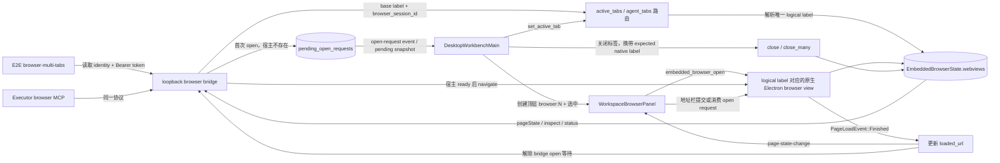
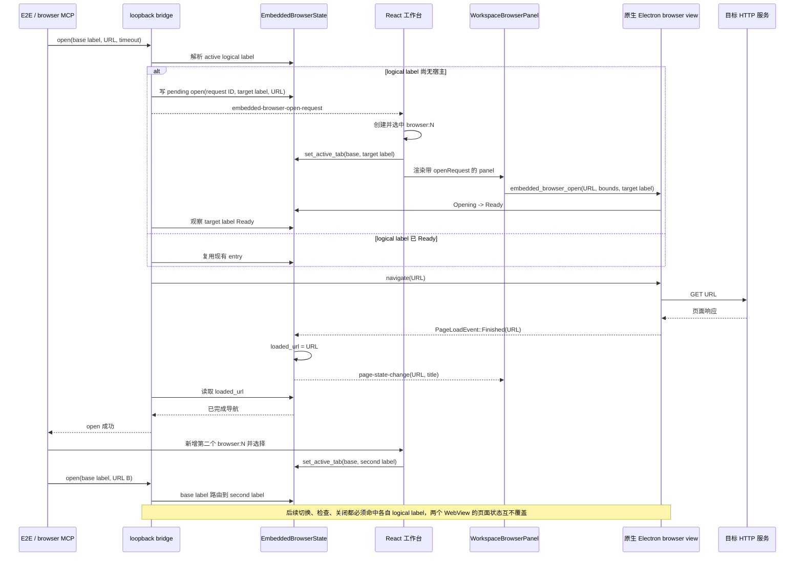

# 内置浏览器

Wework 的内置浏览器用于在桌面工作台右侧面板中展示可交互网页，并让本地运行时通过 Electron browser view bridge 控制同一个页面。它不是截图预览，也不会新开外部 Chrome 窗口。

## 架构

内置浏览器由三层组成：

- Wework Electron 主进程管理嵌入页面的导航、页面状态、截图和逻辑 label；React renderer 创建并定位对应的 `<webview>` 宿主。
- Wework React 工作台负责把浏览器面板挂载到右侧 workspace pane，并维护面板、任务、浮层和批注状态。
- `executor/src/browser_mcp` 暴露给 Codex 的浏览器 MCP 工具，并通过 Wework bridge 操作当前任务绑定的 Electron browser view。

Executor 启动 Codex 时会注入 browser MCP server 配置。模型调用浏览器工具时，MCP server 读取当前 bridge identity，向 Wework 进程内的 loopback bridge 发送受控请求。bridge 再在主线程调度 Electron browser view 的导航、页面检查、DOM 动作、等待和截图。

每个 Wework 进程启动时都会绑定独立的随机本地桥接端口，并把 bridge identity 原子写入当前 Executor home 的 `runtime/embedded-browser-bridge.json`。identity 包含 schema 版本、进程 PID、loopback 地址、认证 token 和启动时间。文件目录权限应限制为当前用户可读写，token 不得写入日志。MCP server 每次请求前读取最新 identity，并只接受 loopback 地址，避免同时运行的多个 Wework 实例把浏览器请求发送到错误窗口。

Electron 启动 bridge 后必须把 runtime 文件路径传给托管 Executor。Executor 生成 Codex browser MCP 配置时只传递该文件路径，不得把当前 bridge URL 或 token 固化到配置中；否则 Electron 使用随机端口或 bridge 重启后，MCP 会继续连接过期地址，并绕过 runtime identity 的刷新机制。

bridge 请求必须携带认证 token。`open` 和 `navigate` 只允许安全的网页 scheme；不要允许 `file:`、`javascript:` 或其它可以读取本机文件或执行任意脚本的地址进入 Agent 导航路径。

bridge 支持有限并发。长时间 `waitFor` 不应阻塞独立的 `click`、`fill` 或 `inspect` 请求；超出并发上限时返回明确的忙碌错误，而不是让调用无限等待。

### 多标签导航连线图



连线职责如下：

| 连线                           | 唯一职责                                                                | 当前代码归属                                                                                                                                 |
| ------------------------------ | ----------------------------------------------------------------------- | -------------------------------------------------------------------------------------------------------------------------------------------- |
| E2E/MCP → bridge               | 读取最新 identity、认证请求并携带基础 label 与可选 session ID           | `e2e/desktop/scenarios/embedded-browser-multi-tabs.scenario.mjs`、`executor/src/browser_mcp`、`electron/src/host/embedded-browser-bridge.ts` |
| bridge → 路由                  | 将基础 label 解析为当前活动的唯一逻辑标签；不得由测试猜测原生 label     | `electron/src/host/embedded-browser-manager.ts`                                                                                              |
| bridge → pending open          | 首次打开先持久化带 ID 的请求，再通知 React 创建宿主                     | `request_browser_open`、`embedded_browser_pending_open_requests`                                                                             |
| React → 顶层标签               | 为每个 `browser:N` 创建独立状态和逻辑 label，并同步活动标签             | `DesktopWorkbenchMain.tsx`、`RightWorkspacePanel.tsx`                                                                                        |
| panel → 原生 WebView           | 宿主有可用 bounds 后创建或复用 logical label 对应的 WebView             | `WorkspaceBrowserPanel.tsx`、`embedded_browser_open`                                                                                         |
| 原生加载 → 执行真值            | 只有 `PageLoadEvent::Finished` 写入 `loaded_url`；`url` 只表示导航意图  | `embedded_browser.rs` 的 `on_page_load`                                                                                                      |
| 加载真值 → bridge              | `open` 等到目标 entry 的 `loaded_url` 后才成功                          | `wait_for_browser_navigation`                                                                                                                |
| 标签选择/关闭 → 路由与生命周期 | 选择更新 base label 路由；关闭只能销毁 expected native label 对应的实例 | `DesktopWorkbenchMain.tsx`、`embedded_browser_set_active_tab`、`embedded_browser_close(_many)`                                               |

### 多标签首次导航时序图



这条链路必须满足以下不变量：

1. base label 只是 Agent 入口；实际状态、生命周期和页面真值都属于解析后的 logical label。
2. `Ready` 只表示原生宿主可操作，不表示目标页面已加载；导航成功必须由该 entry 的 `loaded_url` 证明。
3. 首次 `open` 只能有一个导航所有者。React 负责创建宿主，bridge 负责等待并提交目标导航；消费同一 pending request 不得形成相互覆盖的重复导航。
4. `PageLoadEvent::Finished` 必须更新当前 native label 的 logical owner；标签切换或 relabel 后不得把事件写给旧 owner。
5. E2E fixture 必须实际收到目标 URL 请求，并在 bridge 返回成功后同时断言地址栏和 `inspect` 内容；仅看到标签、地址草稿或 `navigation_requested` 日志不代表成功。
6. 第二个浏览器标签必须拥有不同 logical label 和原生 WebView；`set_active_tab` 只改变 base-label 路由，不复制或交换页面状态。
7. 关闭标签必须携带 expected native label，且关闭后 base label 必须路由到仍存活的活动标签。
8. 超时、重试或扩大等待时间不能替代缺失的 `GET → Finished → loaded_url` 完成边。

## Agent 浏览器能力

Agent 面向模型暴露的是浏览器动作工具，而不是底层 Chromium API。常用能力包括：

- `browser_open` / `browser_navigate`：打开或跳转页面。
- `browser_inspect`：返回结构化页面检查结果。
- `browser_click`、`browser_type`、`browser_fill`、`browser_press_key`、`browser_hover`、`browser_focus`：操作页面元素。
- `browser_scroll`、`browser_scroll_into_view`、`browser_select_option`、`browser_set_checked`：补齐常见表单和滚动动作。
- `browser_wait`：等待页面稳定、URL 条件、文本或元素状态。
- `browser_take_screenshot`：获取真实浏览器截图。
- `browser_capabilities`、`browser_native_input_probe`、`browser_ax_probe`、`browser_present_probe`：报告当前 Electron browser view 能力边界和诊断信息。

组合工具可以把高频链路合并为一次模型调用，例如 `browser_open_and_inspect`、`browser_click_and_inspect` 和 `browser_wait_and_inspect`。组合工具必须在 MCP `tools/list` 中暴露，保持协议自描述。

`inspect` 表示结构化页面检查，`screenshot` 表示真实截图。不要复用 `snapshot` 来表示 DOM 结构化结果，避免和真实截图语义混淆。

结构化 inspect 结果至少应包含页面 URL、标题、viewport、节点列表和纯文本摘要。节点应稳定包含：

- `ref` 和 `index`：供后续动作定位。
- `role`、`name`、`text`、`value`：供模型理解元素语义。
- `rect`、`visible`、`disabled`、`actionable`：供模型判断是否能操作。
- `frameId`、`selector` 或其它调试定位信息：仅用于诊断，不应要求模型依赖脆弱 selector。
- `warnings`：说明遮挡、不可见、敏感输入、跨 frame 限制等风险。

动作工具优先使用 `inspect` 产生的 `ref`。当页面重排导致 `ref` 失效时，应返回可恢复错误，引导模型重新 `inspect`，不要静默猜测 selector。动作结果应描述观测到的效果，例如值变化、DOM 变化、URL 变化或只派发了事件但未观察到效果。

## 任务绑定

浏览器实例以 pane/task label 绑定：

- 未创建运行任务的新对话使用当前 pane key 生成临时浏览器 label。
- 新对话发送后如果创建了 runtime task，Wework 会把临时浏览器 relabel 到新 task label。
- 切换任务时，只显示当前 pane/task 绑定的浏览器；其它任务的页面不会跨 pane 泄漏。
- Executor 为已有 runtime task 注入任务专属 label；临时新对话才使用默认或 pane label，并且只有活跃任务可以接管默认 label。
- 顶层任务标签页失活时必须继续保留 workbench effect，使任务专属 bridge listener 可以处理后台 `open`、`waitFor` 和 `inspect`。React 表面通过 `hidden` 隐藏，原生 WebView 保持不可见；不要让非任务标签页承担这项保活成本。
- 浏览器右侧面板关闭时，原生 WebView 会被隐藏到不可见区域，不应覆盖聊天区、debug panel 或分割线。

这种绑定保证“用户看到的浏览器”和“agent 控制的浏览器”是同一个对象。

当前每个 pane/task label 对应一个浏览器宿主。Wework 顶层可以同时保留多个任务标签页及其独立浏览器，但单个任务内部没有浏览器多标签模型；如果新增浏览器内部多标签，必须同时扩展 bridge 路由标识、生命周期和 Agent 工具协议，不能复用另一个任务的宿主模拟。

程序化首次打开必须把“面板已请求打开”和“原生 WebView 已可导航”视为两个不同阶段。bridge 应保存带 request ID 的待处理导航，等任务对应的浏览器宿主获得非零可见尺寸并进入 ready 状态后再执行；监听器晚于请求注册时，前端必须通过待处理请求快照恢复事件。只有原生 WebView 已导航到请求地址后才能向工具返回成功，不能仅因右侧面板或空白 WebView 已创建就报告成功。

任务切换或组件卸载时，关闭请求必须携带预期的原生 label。过期 pane 只能关闭自己创建的 WebView，不能关闭已经迁移或由新 pane 接管的实例。非活跃任务可以提前创建隐藏且 ready 的浏览器，但不能显示在当前任务上方。

## 主界面浮层与地址栏同步

Electron 的嵌入页面必须由 React renderer 挂载 `<webview>`，并放在共享的浏览器宿主根节点中。主界面的 dialog、menu 和 listbox 通过 portal 与系统级 `z-index` 正常覆盖该宿主；不要为应用标签页或智能工作台重新引入 `BrowserView`、`WebContentsView` 等主进程子视图，否则它们会脱离 renderer 的层叠上下文并遮住顶部标签菜单。

仍使用独立原生 WebView 的桌面实现不能依赖 React `z-index`。当主界面浮层与这类浏览器区域相交时，浏览器面板必须把原生 WebView 设为不可见，并在浮层移除或不再相交后恢复。自定义浮层无法通过语义 role 或共享层级类识别时，应添加 `data-embedded-browser-occlusion`，不要在各业务组件中重复调用原生显示命令。

页面状态轮询维护的是浏览器真实 URL，地址栏维护的是用户输入草稿。地址栏聚焦期间，轮询可以更新页面 URL、标题和图标，但不得覆盖输入草稿；失焦时再恢复真实 URL。新增导航或页面状态同步路径时必须保留这条边界。

## WebView 兼容性

- 内置浏览器子 WebView 只在 debug 构建中启用 DevTools；release 构建通过显式 build cfg 禁用。macOS debug 构建会在 Inspector frontend 首次显示前保存子 WebView frame、执行 detach 并原样恢复 frame，因此 F12 只能打开独立窗口，不能停靠、改变浏览器尺寸或覆盖工作台。主 WebView 的 Inspector 仍只通过 Developer Commands 显式打开。
- 浏览器 WebView 使用固定的独立数据存储标识和应用数据目录，不能与 Wework 主界面的登录存储混用。浏览器设置中的清理操作只作用于这个数据存储。
- Electron 中的 Wegent 智能体应用标签页也使用原生子 WebView，而不是跨源 iframe。所有应用标签共享同一个固定数据存储标识，因此同一来源的完整网站存储（包括全部 `localStorage` key、Cookie 和 IndexedDB）会在标签关闭、重新打开和应用重启后继续可用；标签 label 只标识 WebView 生命周期，不划分存储。macOS 14 及以上由 `data_store_identifier` 选择持久化 `WKWebsiteDataStore`，`data_directory` 主要服务其它平台。不要在 Wework 主界面逐 key 镜像或恢复页面存储。
- Electron 智能工作台复用同一个 renderer-owned `<webview>` 承载链路，并使用稳定的 `smart-app:<installationId>` logical label。renderer 拥有可视宿主；主进程继续管理 Harness runtime 和嵌入式浏览器控制面，但不再创建可视 `WebContentsView`。组件重挂载时必须原子替换旧 guest，并让延迟关闭携带 expected native label，避免旧组件关闭新实例。
- 浏览器 WebView 使用 Chromium 兼容 User-Agent，避免网站把缺少浏览器产品标识的 Chromium User-Agent 识别为不受支持的客户端。
- 弹窗、OAuth、SSO 和支付流程可能通过 `window.open` 或新窗口导航触发。实现应把它们路由到受控浏览器窗口或明确交给外部系统处理，不能让 Agent 不可见地操作隐藏页面。
- 下载处理器从应用偏好读取下载目录和“下载前询问”开关；取消系统保存对话框必须取消本次下载。
- 页面加载事件负责把当前 URL 写入应用状态。不要在 IPC 或自定义协议处理期间同步读取原生 WebView URL；macOS Chromium 在 WebView 创建或销毁期间可能暂时没有 URL。
- 页面动作脚本只能执行与当前工具语义一致的操作。禁止把任意 DOM 修改包装成内部 evaluate 来绕过安全检查。
- macOS App Transport Security 只为嵌入式网页内容允许 HTTP。无效服务器证书必须先经过系统信任校验；仅在校验失败后使用该次 server-trust challenge 继续加载，并向前端发送包含原生 WebView 标识和来源的风险状态。TLS handler 必须在首次导航前完成注册，避免初始页面与异步 `with_webview` 配置竞争。证书提示在同源页面间保留，导航到其他来源或关闭 WebView 时必须清除。

## 可选云桌面扩展

公开版 Wework 只定义云桌面的 UI 插槽、内部页面识别契约和不可用时的默认实现，不包含连接凭据、打开目标、打开流程、具体远程桌面协议、鉴权接口、代理、页面或第三方客户端资源。工作台和设备设置页只能通过 `src/extensions/cloud-desktop-contract.ts` 使用该能力；默认实现的 `available` 为 `false`，因此不会展示桌面入口。

产品发行版可以在构建时为 `@extensions/cloud-desktop` 提供实现。通用契约分别通过 `DeviceAction` 和 `WorkspaceAction` 向设置页及项目工作区提供入口；具体实现自行持有连接类型、打开目标、异步状态和打开流程，并通过 `isCurrent` 忽略项目、设备或连接上下文已经变化的异步请求。公共 Wework 只提供不可用的空实现，不应包含具体远程桌面协议、页面、资源或专用文案。

## 批注流程

右侧浏览器地址栏旁提供批注图标。批注实现分为三层：

- Electron `browser-annotation-controller` 按浏览器 logical label 持有批注、草稿、原网页预览和运行时 revision，是唯一状态真值。
- 独立 preload 在页面 ShadowRoot 中处理元素命中、高亮、编号标记、锚点重绑定、设计样式和紧凑编辑卡，避免批注节点污染宿主页面观察器。
- React 浏览器面板只负责批注模式工具栏、数量和提交到主输入框。

进入批注模式后：

- 鼠标移动只高亮当前 DOM 元素；点击后创建包含 selector、DOM 路径、文本和几何信息的稳定锚点，并打开编辑卡。
- 全页交互层必须保持透明，不能用蓝色或其它颜色遮罩改变网页观感；蓝色只用于当前元素高亮、标记和批注光标。
- 评论卡支持新增、保存、取消和删除。已保存批注在网页上显示编号标记，点击标记可重新编辑。
- `Esc` 采用分层退出：编辑卡打开时先关闭编辑卡并保留批注模式；没有编辑卡时退出批注模式。页面脚本不得抢占这两个快捷键状态。
- 编辑卡因截图状态、锚点或设计状态同步而重建时，必须恢复原编辑控件的焦点和选区，避免首次聚焦后自动失焦。
- 设计卡读取目标元素的计算样式，可调整文字、外观和布局属性。设计变更由 preload 应用，页面节点替换后通过锚点重新绑定。
- 按住“原网页”按钮会用同一条 render/sync 链暂时隐藏全部设计变更并恢复被替换的文本；松开后恢复批注设计。
- 同 URL 重新加载保留批注并重绑定锚点；真实跨 URL 导航退出批注模式并清除草稿，避免旧页面状态泄漏。
- 同一文档内的 SPA 导航必须用 preload 事件携带的最新地址更新批注 scope，保证保存和发布使用同一个 URL key。
- 发布后的批注进入 Wework 主输入框附件区。截图只用于本地预览和定位；发送给模型的运行时 DTO 只包含元素上下文、评论和设计变更，不包含截图、创建时间等 UI 私有字段。

批注用于网页可视区域评论，不等同于代码选择评论。`browser_annotation` 项应被模型理解为对当前可见网页元素的评论。

批注回归拆成三个可独立运行的 checkpoint：

- `browser-annotation-core`：选择元素、创建评论、编号标记、编辑、删除和退出。
- `browser-annotation-anchors`：DOM 重排、同 URL reload 和目标节点替换后的锚点恢复。
- `browser-annotation-design`：计算样式基线、设计应用、原网页预览和设计重绑定。

`browser-annotation` 是以上三个 checkpoint 的组合入口，必须展开并逐个执行，不能只运行通用桌面流程后报告成功。

## 开发检查

修改内置浏览器相关代码后，至少运行：

```bash
pnpm --filter wework typecheck
pnpm --filter wework lint
cargo check --manifest-path executor/Cargo.toml
cargo test --manifest-path executor/Cargo.toml browser_mcp
pnpm --dir wework/electron typecheck
pnpm --dir wework/electron test
pnpm --filter wework e2e:desktop:embedded-browser
pnpm --filter wework e2e:desktop -- --segment browser-toolbar-actions
pnpm --filter wework e2e:desktop -- --segment browser-annotation
```

`e2e:desktop:embedded-browser` 必须在任务 A 创建后切换到任务 B，再使用任务 A 的专属 label 执行第一次 bridge `open`、`waitFor` 和 `inspect`，验证非活跃任务能在工具超时前完成后台导航且不会接管任务 B 的浏览器。切回任务 A 后还要验证同一页面状态可见。仅验证第二次打开、活跃任务打开或手工先展开浏览器面板，不能覆盖首次打开和非活跃任务路由竞态。

浏览器涉及 Electron 命令、原生 WebView、IPC 或 Agent 操作链路时，还应使用 `pnpm --filter wework ai:verify start` 启动隔离真实 Electron 会话，并记录打开页面、inspect、动作和截图的验证证据。完整 E2E 太慢时，合并前至少要说明未运行的原因，并确保 CI 中的 `e2e:desktop:embedded-browser` 会覆盖该场景。

macOS Inspector 变更还必须运行 `browser-toolbar-actions` checkpoint。该场景使用本地 HTTP 模拟页面，连续两次打开和关闭 Inspector，并校验独立原生窗口出现、关闭后不可见且子 WebView frame 完全不变。

涉及 Executor Codex 启动配置时，还应运行对应的 Codex launch config 单元测试，确认 browser MCP server 会被正确注入。
