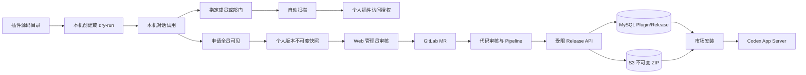

# Wework 插件市场开发指南

面向需要开发、迁移或发布 Wework 插件的同学。架构细节见 [插件市场 V2](./plugin-marketplace-v2.md)；本机 Codex 运行时细节见 [Codex 插件运行时](./wework-codex-plugins.md)；亮色/暗色图标见 [插件图标指南](./wework-plugin-icons.md)。

> 实现状态（2026-08-29）：当前功能分支已实现第 4 章的 Wework 双范围交互、Request/Revision 历史、Web 审核、MR 物化和受限 Release API，新企业申请不再使用人员白名单。旧 Submission 只保留个人定向分享上传和历史记录清退用途。**生产尚未启用**；上线前仍需在外部完成旧 Token 吊销/轮换、HTTPS、protected master/environment、Code Owner 审批、project-locked 原生 Windows/macOS Runner 和新 Release 凭据的 P0 验证。

## 1. 先建立正确心智模型

Wework 同时存在两层相关但不相同的能力：

| 层                 | 职责                                               | 事实源                            |
| ------------------ | -------------------------------------------------- | --------------------------------- |
| 本机 Codex 运行面  | 真正安装、启停、在对话中使用 skill / MCP / command | 本机 Executor + Codex App Server  |
| Wegent 云端市场 V2 | 目录、版本、可见性、审核、设备期望状态             | MySQL 元数据 + 私有 S3 不可变 ZIP |

开发插件时记住三件事：

1. **安装单位始终是 Codex Plugin**。Skill 只是展示类型；单 Skill 插件仍然是一个 Plugin ZIP。
2. **Git 目录不是生产分发源**。源码可以放在仓库或本地目录；上线后只通过云端 `PluginRelease` 分发。
3. **不要把密钥打进包**。Token、MCP 凭据、`.env`、私钥永远不进 ZIP。



### 两种分享意图与两类产物

个人创建或导入的插件在详情页只有一个 **分享** 入口，入口内只有两种意图：

| 意图           | 用户选择                             | 生效规则                                                         | 产物归属                                   |
| -------------- | ------------------------------------ | ---------------------------------------------------------------- | ------------------------------------------ |
| 指定成员或部门 | 成员、部门；组织作为通讯录根部门选择 | 包扫描通过后立即授权，不经人工审核                               | 仍是「个人创建」中的个人插件               |
| 全员可见       | 当前企业全员                         | 提交不可变版本快照，依次经过自动检查、管理员审核、代码审核和发布 | 发布成功后生成「企业内部」中的独立企业版本 |

组织不是第三种分享范围。普通用户界面也不暴露 `public`；本期“全员可见”在服务端映射为
`visibility=workspace`。个人原件与企业版本必须使用不同的目录身份：审核和发布不能原地提升
个人插件的可见性，也不能清除原有的成员/部门授权。

## 2. 插件包目录规范

最小可用结构：

```text
my-plugin/
├── .codex-plugin/
│   └── plugin.json          # 必填
├── skills/
│   └── review/
│       └── SKILL.md         # 可选，至少一个能力通常更有用
├── commands/                # 可选
├── agents/                  # 可选
├── hooks/                   # 可选
└── bins/                    # 可选，可执行文件需可审计
```

也兼容 `.claude-plugin/plugin.json`，但新插件优先使用 `.codex-plugin/plugin.json`。

### `plugin.json` 示例

```json
{
  "name": "gitlab-engineering",
  "version": "1.0.0",
  "description": "Review merge requests and diagnose pipelines",
  "interface": {
    "displayName": "GitLab Engineering",
    "shortDescription": "GitLab review and CI workflows",
    "developerName": "Wegent",
    "category": "Productivity",
    "logo": "./assets/app-icon.svg",
    "composerIcon": "./assets/app-icon.svg",
    "logoDark": "./assets/app-icon-dark.svg",
    "defaultPrompt": [
      {
        "title": "审查 MR",
        "prompt": "请审查当前仓库中的这个 Merge Request："
      }
    ]
  }
}
```

约定：

- `name` 必须是 slug：小写字母、数字、`.` `_` `-`，最长约 100 字符。
- `version` 必须是 SemVer，例如 `1.2.0`。官方发布禁止用更低版本覆盖更高的 `latest`。
- `interface.displayName` / `shortDescription` 会出现在市场卡片；尽量写清楚价值，而不是技术实现。
- `interface.logo` / `logoDark` / `composerIcon` 指向包内 `assets/`；暗色不可读时必须提供 `logoDark`，细则见 [插件图标指南](./wework-plugin-icons.md)。
- 单 Skill 插件投稿时，系统可识别为 `listing_type=skill`。

### `SKILL.md` 示例

```markdown
---
name: review
description: Review a merge request and summarize risks
---

# Review

1. 读取 MR 描述与变更文件。
2. 标出风险、测试缺口和建议改动。
```

## 3. 本地开发闭环

### 方式 A：在 Wework 里创建

1. 打开桌面 **插件** 页。
2. 使用创建入口，按 Codex plugin creator 流程生成插件到 `wework-personal`。
3. 安装后，在插件详情页点击 **立即对话** 或使用“试试这些任务”；对话输入框会插入 `plugin://...` mention。
4. 修改本地目录后刷新市场/管理页，再在对话中验证。

本地创建**不会**自动上传到云端。只有显式点击 **分享** 才会提交当前版本：指定成员或部门只做扫描和授权；全员可见才进入发布申请。

### 方式 B：在企业插件仓库开发

企业内全员可见插件的事实源是内部 `wework-plugins` GitLab 仓库。目录为
`<checkout>/plugins/<slug>/`，并在 `.agents/plugins/marketplace.json` 登记。源码仓只服务
开发、评审和 CI；Backend / Wework **不会**在启动时扫描它。

开发人员直接创建分支并提交 Merge Request。非技术用户在 Wework 申请全员可见后，管理员在
Web 审核台接受申请，系统会把该不可变快照落到受控分支并创建 MR。两种入口从 MR 开始
共用完全相同的代码审核、兼容性检查和发布 Pipeline。

本地只构建扫描：

```bash
cd backend
uv run python scripts/publish_official_plugin.py \
  ../wework-plugins/plugins/<plugin-slug> --dry-run
```

成功时输出 `name`、`version`、`sha256`。`--dry-run` 只证明本机打包与静态扫描通过，不代表
Windows、macOS 兼容检查、远端 Pipeline 或线上发布成功。

### 本机联调云端市场

需要 MySQL、Redis、MinIO，以及当前源码 Backend，不要用过期的 Compose Backend 镜像。

```bash
# 迁移
cd backend
uv run alembic upgrade head

# 启动 Backend（可用 ./start.sh）
./start.sh --host 127.0.0.1 --port 8000

# 启动 Wework
cd ..
VITE_WEGENT_BACKEND_URL=http://127.0.0.1:8000 \
WEGENT_DISABLE_SCCACHE=1 \
pnpm --filter wework dev:mac -- --executor-isolation
```

## 4. 分享与企业全员发布

### 4.1 指定成员或部门

个人插件所有者在详情页点击 **分享 → 指定成员或部门**，从通讯录选择成员或部门。组织本身
显示为通讯录根部门，不单独提供“组织可见”。客户端打包当前版本、计算 SHA256 并上传扫描；
扫描通过后立即更新个人插件的访问授权，不进入 Web 人工审核，也不写入企业插件仓库。

新增、移除成员或部门只变更授权，不创建新的企业 Release。个人插件继续位于「个人创建」，
所有者仍可继续编辑、对话、试用、卸载和删除。

### 4.2 非技术用户申请全员可见

任意已登录的个人插件所有者都可以提出申请，不再使用发布白名单。Wework 使用右侧三步抽屉：

1. **确认版本**：展示插件、SemVer、更新时间和将要提交的不可变版本；
2. **权限与风险**：声明外网访问、命令/脚本、本地文件、凭据等权限与测试结果；
3. **确认提交**：复核范围为企业全员、风险声明和版本 SHA256 后提交。

提交会冻结该次申请的版本、清单、ZIP 和 SHA256，不会冻结个人源码。审核期间，所有者仍可
继续编辑个人插件并形成更高版本，也可以继续向指定成员或部门分享；后续修改不会悄悄替换已
提交快照。

用户看到的五阶段进度固定为：

1. **提交申请**：创建申请并保存不可变快照；
2. **自动检查**：包结构、安全扫描和声明一致性校验；
3. **管理员审核**：管理员只在 Web 审核台查看风险、退回或接受；
4. **代码审核**：接受后系统创建 GitLab MR，执行人工代码评审、风险检查以及 Windows / macOS 兼容检测；
5. **发布**：MR 合入受保护的 `master` 后，由 Pipeline 调用受限 Release API 发布企业版本。

管理员接受申请**只创建 MR，不直接发布**。退回必须记录原因和风险项；提交者在 Wework
查看状态、修改个人源码后，以新的 revision 重新提交。

### 4.3 开发人员直接提交 GitLab MR

开发人员可以直接在内部 `wework-plugins` 仓库新增或修改 `plugins/<slug>/`，同步更新市场注册表
并发起 MR。非技术投稿生成的 MR 与开发人员 MR 从这里开始走同一套检查；不得维护一条
可以绕过 GitLab 的“管理员直接发布”旁路。

一个 MR 只包含一个插件的一个版本。MR Pipeline 至少包含：

- 清单、目录和注册表一致性校验；
- 统一包扫描、敏感文件和高风险能力检查；
- 插件自身测试；
- Windows 和 macOS 兼容检测。需要原生环境的检查必须使用对应 Runner；Runner 不可用时阻塞，不能伪装成通过；
- 构建结果、commit SHA、package SHA256 和审计链接的 provenance 记录。

### 4.4 合并、发布与认证

`master` 是受保护分支。只有合并后的 protected master Pipeline 可以发布企业版本；普通分支、
MR Job、Wework 客户端和 Web 管理后台都不能取得发布凭据。发布 Job 重新构建并核对已审核的
commit，然后调用内部 Release API：

```http
Authorization: Bearer <release-token>
```

这是服务到服务的机器凭据，不是用户登录体系或通用管理员 Token。实现复用现有 API Key 生命周期，
并使用专用 `key_type=plugin_release`。目标固定为企业目录，GitLab project 与受保护 `master` ref 由服务端配置和 GitLab 实时证明校验；
凭据必须具有过期、轮换、撤销和审计能力，并作为 GitLab masked + protected variable 保存。GitLab Webhook 使用
独立签名或 Token，只同步 MR、Pipeline 和发布状态，不能代替 Release Token 发版。

Release API 与 `OfficialPluginPublisher` 都复用
`PluginMarketplaceService.publish_catalog_release` 的市场入库事务。前者验证受保护 master 产出的 artifact，后者负责本地目录的确定性打包。`publish_official_plugin.py` 保留为本机 dry-run、应急操作和排障适配器，HTTP 接口不启动该 CLI 子进程，也不复制另一套发布逻辑。

发布规则：

- 同 `catalog + slug + version + SHA256` 幂等成功；
- 同版本不同内容返回冲突，已发布 ZIP 永不覆盖；
- Release 必须记录 submission/revision（如有）、GitLab project、MR、commit、Pipeline、发布主体和构建链接；
- 发布成功后创建独立的 `workspace` 企业插件/Release，个人原件及其定向授权保持不变。

### 4.5 撤回、删除与回滚

- 在 MR 合入前，提交者可以从 Wework 撤回全员发布申请；已经创建 MR 时，系统同时关闭或标记取消该 MR。
- 删除仍有未合并申请的个人插件时，必须先撤回申请，再卸载并删除个人源码，不能留下无来源的待发布 MR。
- MR 已合并或已经进入发布后，个人用户不能撤回企业版本。删除个人原件只影响个人插件，不删除已发布企业版；企业版下架或回滚由管理员执行。
- Pipeline 或发布失败时不推进企业目录的 `latest_release_id`，现有可用版本继续服务。
- 已发布 ZIP 永不修改。回滚使用经过审计的目录指针回退到先前 Release，或修复后发布更高 SemVer；不得用相同版本覆盖内容。

### 4.6 云端 Plugin Creator

云端 Plugin Creator 不在创建阶段上传 ZIP，也不创建独立草稿记录。源码位于
`$WEGENT_TASK_WORKSPACE/plugins/<plugin-name>`，创建完成后由 `plugin-workspace describe` 把结果
标记写回当前 Task 对话。用户点击结果卡或详情页的 **分享** 时，Wework 向原 Task 发送后续指令，
Executor 执行 `plugin-workspace publish`，对当前源码重新校验和打包，再进入指定成员/部门分享或
全员发布申请。Task 工作区恢复与归档沿用现有 Task 生命周期；未分享内容不会出现在云端目录。

## 5. 迁移开源插件 checklist

把 GitHub / Codex / Claude 生态插件迁到 Wework 市场时，按下面顺序做。

### 5.1 产品与合规

- [ ] 明确产品价值：解决什么场景，是否与现有官方插件重复。
- [ ] 确认许可证允许企业内部分发与再打包。
- [ ] 指定维护人或团队；无人维护不要上架。
- [ ] 理清鉴权方式：OAuth、PAT、本地 CLI、MCP 密钥。
- [ ] 敏感权限分级：命令执行、浏览器、企业数据读写要单独评审。

### 5.2 包结构改造

- [ ] 保证存在 `.codex-plugin/plugin.json`（或兼容的 `.claude-plugin/plugin.json`）。
- [ ] `name` 改成稳定 slug；不要用空格或中文。
- [ ] 补齐 SemVer `version`。
- [ ] 补齐 `interface.displayName` / `shortDescription`，方便市场展示。
- [ ] 补齐 `interface.logo`（建议同时设 `composerIcon`）；暗色对比不足时补 `logoDark`（见 [插件图标指南](./wework-plugin-icons.md)）。
- [ ] 删除 `.env`、密钥、session、私钥、符号链接。
- [ ] 去掉仓库无关文件：`.git`、`node_modules`、测试缓存、超大样例数据。
- [ ] 多插件上游 ZIP 只保留目标插件根目录内容。

### 5.3 能力核对

| 原能力          | Wework 落点         | 注意                                    |
| --------------- | ------------------- | --------------------------------------- |
| Skill           | `skills/*/SKILL.md` | frontmatter 需要 `name` / `description` |
| Slash command   | `commands/`         | Markdown 命令文件                       |
| MCP             | 插件内 MCP 声明     | 密钥走本地安全存储，不写死在包内        |
| Hook / bin      | `hooks/` / `bins/`  | 可执行文件会被扫描报告，需人工确认      |
| App / Connector | Codex app 机制      | 远端 Apps 开关与本机授权独立            |

### 5.4 验证与上架

```bash
# 1. dry-run 构建扫描
uv run python scripts/publish_official_plugin.py /path/to/plugin --dry-run

# 2. 本机安装试用
# 在 Wework 插件页安装后，打开新对话并发送试用模板

# 3. 选择发布路径
# - 非技术维护者：在 Wework 申请全员可见
# - 开发维护者：在内部 wework-plugins 仓库提交 MR
# 两者从 MR 起共用代码审核、兼容性检测和 protected master Pipeline
```

验收标准：

- 扫描通过：无路径穿越、重复路径、符号链接、加密成员、敏感文件、超大展开体积。
- 安装后设备状态为 `installed`，且 `actual_release_id` 等于期望 Release。
- 对话 mention 能正确触发能力；失败路径有明确错误，不静默回退。
- 企业目录中的版本可追溯到 MR、commit、Pipeline 和不可变 SHA256。

## 6. GitHub 官方插件边界

本期只落地**企业内部全员可见**链路。GitHub 上由 Wework 维护、计划向所有企业公开的官方插件，
其代码来源、签名、同步、跨企业 `public` 发布和应急下架方案仍是独立待定项，不能复用本期
`workspace` 申请冒充完成，也不能阻塞企业内部流程开发。

OpenAI / Codex 官方市场已有的 GitHub Connector 继续按其现有来源和授权链路安装，与上述
Wework 官方公开插件方案不是同一条发布流程。

现有管理员精选的 Codex / 合规开源上游镜像也保持独立：管理员登记上游地址、许可证和同步
策略，系统下载、扫描并写入不可变 Release。它不经过个人插件的全员发布申请，也不能据此推导
Wework 官方公开插件的最终方案。

## 7. 安全红线

包体积：压缩包 ≤ 50 MB，展开 ≤ 200 MB，条目 ≤ 10000。

禁止出现：

- `..` 路径或绝对路径
- 符号链接
- ZIP 加密成员
- `.env`、`credentials.json`、`id_rsa`、`.pem` 等敏感文件
- 同路径重复条目

发布侧：

- final S3 key 不可覆盖；staging 需生命周期清理。
- 指定成员或部门分享必须通过包扫描；全员可见必须完成管理员审核、GitLab 代码审核和受保护分支 Pipeline。
- 管理员后台只能退回或创建 MR，不能直接构造企业 Release。
- 发布凭据只对 protected master Job 可见；日志、Webhook 和构建产物中不得包含 Token。
- 所有企业发布必须保留 provenance 审计。
- 真正离线必备能力应做进 Executor / 内置 hook，不要伪装成市场插件强塞进安装包。

## 8. 常见问题

**为什么我改了仓库目录，市场里没变化？**  
因为运行时不读仓库目录。需要 dry-run / 发布新版本，或在本机 `wework-personal` 中直接改本地创建物。

**Skill 和 Plugin 有什么区别？**  
对用户来说 Skill 更轻；对系统来说安装单位仍是 Plugin。单 Skill 插件用 `listing_type=skill` 展示。

**开源插件能否直接把 GitHub URL 配给普通用户？**  
不能。普通用户只能看到云端目录。企业内部使用时需要进入 `wework-plugins` MR 与 Pipeline；Wework 官方公开 GitHub 插件另行设计。

**为什么管理员接受后还不能全员安装？**

接受只代表产品和风险初审通过，并会创建 MR。还要完成代码审核、Windows / macOS 兼容检测、合入 protected master 和发布 Pipeline。

**审核期间能否继续修改和分享个人插件？**

可以。申请绑定的是不可变快照；个人原件仍可编辑、对话和向成员/部门分享。修改后如需进入本次企业发布，必须提交新的 revision。

**个人插件删除后，企业版也会删除吗？**

不会。MR 合入前会先撤回申请；企业版发布后，个人原件与企业版相互独立，企业版只能由管理员下架或回滚。

**更新失败会怎样？**  
账号期望版本可更新，但设备安装失败时保留旧实际版本，并在设备状态里记录错误；不会静默升级。

**旧 `/plugins/upload` 还能用吗？**  
默认 `410`。新链路走分享申请或 GitLab MR；生产发布只允许 protected master Pipeline 调用 Release API。

**旧 `/plugins/submissions` 还会发布企业版吗？**

不会。它只接受 `restricted_share + personal` 个人定向分享，服务端拒绝 `workspace/public`。历史审核接口和脚本只能用于清退已有记录，新 Web 审核不得调用。

## 9. 相关文档与代码入口

| 用途                    | 位置                                                   |
| ----------------------- | ------------------------------------------------------ |
| 市场架构与运维 Runbook  | [plugin-marketplace-v2.md](./plugin-marketplace-v2.md) |
| 本机 Codex 插件运行时   | [wework-codex-plugins.md](./wework-codex-plugins.md)   |
| 用户侧插件说明          | [../plugins-and-skills.md](../plugins-and-skills.md)   |
| 本机 dry-run / 应急 CLI | `backend/scripts/publish_official_plugin.py`           |
| Release 服务抽象        | `backend/app/services/official_plugin_publisher.py`    |
| 统一扫描                | `backend/app/services/plugin_package_scanner.py`       |
| 市场控制面              | `backend/app/services/plugin_marketplace_service.py`   |
| Wework 市场 UI          | `wework/src/components/plugins/`                       |
