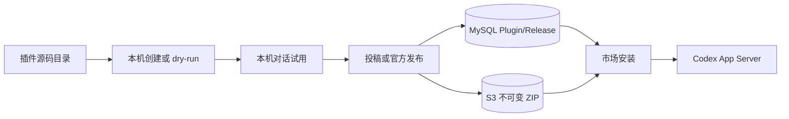

# Wework 插件市场开发指南

面向需要开发、迁移或发布 Wework 插件的同学。架构细节见 [插件市场 V2](./plugin-marketplace-v2.md)；本机 Codex 运行时细节见 [Codex 插件运行时](./wework-codex-plugins.md)。

## 1. 先建立正确心智模型

Wework 同时存在两层相关但不相同的能力：

| 层 | 职责 | 事实源 |
| --- | --- | --- |
| 本机 Codex 运行面 | 真正安装、启停、在对话中使用 skill / MCP / command | 本机 Executor + Codex App Server |
| Wegent 云端市场 V2 | 目录、版本、可见性、审核、设备期望状态 | MySQL 元数据 + 私有 S3 不可变 ZIP |

开发插件时记住三件事：

1. **安装单位始终是 Codex Plugin**。Skill 只是展示类型；单 Skill 插件仍然是一个 Plugin ZIP。
2. **Git 目录不是生产分发源**。源码可以放在仓库或本地目录；上线后只通过云端 `PluginRelease` 分发。
3. **不要把密钥打进包**。Token、MCP 凭据、`.env`、私钥永远不进 ZIP。



## 2. 插件包目录规范

最小可用结构：

```text
my-plugin/
├── .codex-plugin/
│   └── plugin.json          # 必填
├── skills/
│   └── review/
│       └── SKILL.md         # 可选，至少一个能力通常更有用
├── commands/                # 可选
├── agents/                  # 可选
├── hooks/                   # 可选
└── bins/                    # 可选，可执行文件需可审计
```

也兼容 `.claude-plugin/plugin.json`，但新插件优先使用 `.codex-plugin/plugin.json`。

### `plugin.json` 示例

```json
{
  "name": "gitlab-engineering",
  "version": "1.0.0",
  "description": "Review merge requests and diagnose pipelines",
  "interface": {
    "displayName": "GitLab Engineering",
    "shortDescription": "GitLab review and CI workflows",
    "developerName": "Wegent",
    "category": "Productivity",
    "defaultPrompt": [
      {
        "title": "审查 MR",
        "prompt": "请审查当前仓库中的这个 Merge Request："
      }
    ]
  }
}
```

约定：

- `name` 必须是 slug：小写字母、数字、`.` `_` `-`，最长约 100 字符。
- `version` 必须是 SemVer，例如 `1.2.0`。官方发布禁止用更低版本覆盖更高的 `latest`。
- `interface.displayName` / `shortDescription` 会出现在市场卡片；尽量写清楚价值，而不是技术实现。
- 单 Skill 插件投稿时，系统可识别为 `listing_type=skill`。

### `SKILL.md` 示例

```markdown
---
name: review
description: Review a merge request and summarize risks
---

# Review

1. 读取 MR 描述与变更文件。
2. 标出风险、测试缺口和建议改动。
```

## 3. 本地开发闭环

### 方式 A：在 Wework 里创建

1. 打开桌面 **插件** 页。
2. 使用创建入口，按 Codex plugin creator 流程生成插件到 `wework-personal`。
3. 安装后，在插件详情或市场行点击试用；对话输入框会插入 `plugin://...` mention。
4. 修改本地目录后刷新市场/管理页，再在对话中验证。

本地创建**不会**自动上传到云端。只有显式“发布到市场”才会进入扫描和审核。

### 方式 B：在独立仓库开发官方插件

WeWork 自研官方插件维护在
[github.com/wecode-ai/wework-plugins](https://github.com/wecode-ai/wework-plugins)，
并以 `--visibility public` 发布到「Wework官方」Tab。

布局对齐 openai/plugins：检出后目录为 `<checkout>/plugins/<slug>/`，并在
`.agents/plugins/marketplace.json` 登记。源码仓只服务开发、评审、CI；
Backend / Wework **不会**在启动时扫描它。建议与 Wegent 同级检出（例如
`wework-plugins-public`）。

若需要把已评审的本地源码树发布到组织目录，可使用
`--visibility workspace`。共享文档中不要写入私有主机名或内网仓库路径。

本地只构建扫描：

```bash
cd backend
uv run python scripts/publish_official_plugin.py \
  ../wework-plugins-public/plugins/<plugin-slug> --dry-run
```

成功时输出 `name`、`version`、`sha256`。失败时先修扫描错误，再进入发布。

### 本机联调云端市场

需要 MySQL、Redis、MinIO，以及当前源码 Backend，不要用过期的 Compose Backend 镜像。

```bash
# 迁移
cd backend
uv run alembic upgrade head

# 启动 Backend（可用 ./start.sh）
./start.sh --host 127.0.0.1 --port 8000

# 启动 Wework
cd ..
VITE_WEGENT_BACKEND_URL=http://127.0.0.1:8000 \
WEGENT_DISABLE_SCCACHE=1 \
pnpm --filter wework dev:mac -- --executor-isolation
```

## 4. 如何发布到市场

### 社区投稿

适合个人或团队自研插件。

1. 在 Wework 完成本地验证。
2. 确认账号具备发布能力：`PLUGIN_PUBLISH_ENABLED`、白名单或管理员。
3. 在 UI 执行“发布到市场”。客户端会打包、计算 SHA256，走：
   - `POST /plugins/submissions/init`
   - 预签名 PUT 到 `plugins/staging/...`
   - `POST /plugins/submissions/{id}/complete`
   - 上传或完成失败时，`POST /plugins/submissions/{id}/cancel`
4. 扫描通过后进入待审；管理员审核通过后才可被搜索安装。

取消、扫描拒绝或超过上传/扫描超时的投稿不会永久占用版本号。客户端可以用相同 `version` 重新调用 `init`；仍在有效上传或扫描中的版本会返回 `409`，避免并发投稿互相覆盖。

### WeWork 官方插件

适合公司维护的内置能力。统一字段：

- `source_type=native`
- `source_provider=wework`
- `owner_user_id=NULL`

从公开官方源码仓发布：

```bash
cd backend

# 空库/重建：一次性初始化 Wework官方 Tab（公开仓插件）
uv run python scripts/seed_wework_public_plugins.py

# Wework官方 Tab（公开仓，单个插件）
uv run python scripts/publish_official_plugin.py \
  ../wework-plugins-public/plugins/<plugin-slug> \
  --visibility public \
  --commit-sha "$CI_COMMIT_SHA" \
  --build-url "$CI_JOB_URL" \
  --publisher release-bot
```

`--visibility public` 进入「Wework官方」Tab。仅在需要把已评审的本地源码树发布到组织目录时，再使用 `--visibility workspace`。

规则：

- 同 `slug + version + SHA256` 幂等成功。
- 同版本不同内容直接拒绝，禁止覆盖。
- 回滚只能发更高 SemVer，或调整目录指针；绝不改已发布 ZIP。

### 精选 Codex / 开源上游镜像

适合已经是官方或合规开源、只需企业内分发的插件。管理员录入：

- `marketplace_name`
- `remote_plugin_id`
- `upstream_url`（HTTPS）
- `license_info`
- `sync_policy`（默认 `auto_after_scan`，可选 `review_required`）

系统定时同步：下载 → 扫描 → 适配 → 写入 S3。`auto_after_scan` 会在扫描
通过后单调提升 `latest_release_id`；`review_required` 只生成待审核 Release，
管理员批准后才提升 latest。开源镜像默认使用 `auto_after_scan`，高风险上游可
显式切换为 `review_required`。上游回退版本不会拉低 latest。

## 5. 迁移开源插件 checklist

把 GitHub / Codex / Claude 生态插件迁到 Wework 市场时，按下面顺序做。

### 5.1 产品与合规

- [ ] 明确产品价值：解决什么场景，是否与现有官方插件重复。
- [ ] 确认许可证允许企业内部分发与再打包。
- [ ] 指定维护人或团队；无人维护不要上架。
- [ ] 理清鉴权方式：OAuth、PAT、本地 CLI、MCP 密钥。
- [ ] 敏感权限分级：命令执行、浏览器、企业数据读写要单独评审。

### 5.2 包结构改造

- [ ] 保证存在 `.codex-plugin/plugin.json`（或兼容的 `.claude-plugin/plugin.json`）。
- [ ] `name` 改成稳定 slug；不要用空格或中文。
- [ ] 补齐 SemVer `version`。
- [ ] 补齐 `interface.displayName` / `shortDescription`，方便市场展示。
- [ ] 删除 `.env`、密钥、session、私钥、符号链接。
- [ ] 去掉仓库无关文件：`.git`、`node_modules`、测试缓存、超大样例数据。
- [ ] 多插件上游 ZIP 只保留目标插件根目录内容。

### 5.3 能力核对

| 原能力 | Wework 落点 | 注意 |
| --- | --- | --- |
| Skill | `skills/*/SKILL.md` | frontmatter 需要 `name` / `description` |
| Slash command | `commands/` | Markdown 命令文件 |
| MCP | 插件内 MCP 声明 | 密钥走本地安全存储，不写死在包内 |
| Hook / bin | `hooks/` / `bins/` | 可执行文件会被扫描报告，需人工确认 |
| App / Connector | Codex app 机制 | 远端 Apps 开关与本机授权独立 |

### 5.4 验证与上架

```bash
# 1. dry-run 构建扫描
uv run python scripts/publish_official_plugin.py /path/to/plugin --dry-run

# 2. 本机安装试用
# 在 Wework 插件页安装后，打开新对话并发送试用模板

# 3. 选择发布路径
# - 官方维护：publish_official_plugin.py
# - 社区维护：Wework 发布到市场
# - 持续跟随上游：admin upstreams + sync
```

验收标准：

- 扫描通过：无路径穿越、重复路径、符号链接、加密成员、敏感文件、超大展开体积。
- 安装后设备状态为 `installed`，且 `actual_release_id` 等于期望 Release。
- 对话 mention 能正确触发能力；失败路径有明确错误，不静默回退。

## 6. GitHub 插件（OpenAI 官方）

GitHub 插件直接使用 OpenAI 官方市场中的 `github` 条目（`openai/plugins` /
Codex 官方 Tab），**不再**维护 Wework 国内公开镜像，也不再通过
`configure_openai_github_mirror.py` 发布适配包，也不再提供 Wegent 云端
GitHub OAuth「第三方应用」设置入口。

用户从「OpenAI官方」筛选安装即可；授权走 OpenAI / Codex 官方连接器链路。

## 7. 安全红线

包体积：压缩包 ≤ 50 MB，展开 ≤ 200 MB，条目 ≤ 10000。

禁止出现：

- `..` 路径或绝对路径
- 符号链接
- ZIP 加密成员
- `.env`、`credentials.json`、`id_rsa`、`.pem` 等敏感文件
- 同路径重复条目

发布侧：

- final S3 key 不可覆盖；staging 需生命周期清理。
- 社区投稿必须审核；官方发布必须保留 provenance 审计。
- 真正离线必备能力应做进 Executor / 内置 hook，不要伪装成市场插件强塞进安装包。

## 8. 常见问题

**为什么我改了仓库目录，市场里没变化？**  
因为运行时不读仓库目录。需要 dry-run / 发布新版本，或在本机 `wework-personal` 中直接改本地创建物。

**Skill 和 Plugin 有什么区别？**  
对用户来说 Skill 更轻；对系统来说安装单位仍是 Plugin。单 Skill 插件用 `listing_type=skill` 展示。

**开源插件能否直接把 GitHub URL 配给普通用户？**  
不能。普通用户只能看到云端市场目录。开源内容需官方发布、社区投稿审核，或管理员配置精选 upstream。

**更新失败会怎样？**  
账号期望版本可更新，但设备安装失败时保留旧实际版本，并在设备状态里记录错误；不会静默升级。

**旧 `/plugins/upload` 还能用吗？**  
默认 `410`。新链路走投稿或官方发布 CLI。

## 8. 相关文档与代码入口

| 用途 | 位置 |
| --- | --- |
| 市场架构与运维 Runbook | [plugin-marketplace-v2.md](./plugin-marketplace-v2.md) |
| 本机 Codex 插件运行时 | [wework-codex-plugins.md](./wework-codex-plugins.md) |
| 用户侧插件说明 | [../plugins-and-skills.md](../plugins-and-skills.md) |
| 官方发布 CLI | `backend/scripts/publish_official_plugin.py` |
| 统一扫描 | `backend/app/services/plugin_package_scanner.py` |
| 市场控制面 | `backend/app/services/plugin_marketplace_service.py` |
| Wework 市场 UI | `wework/src/components/plugins/` |
