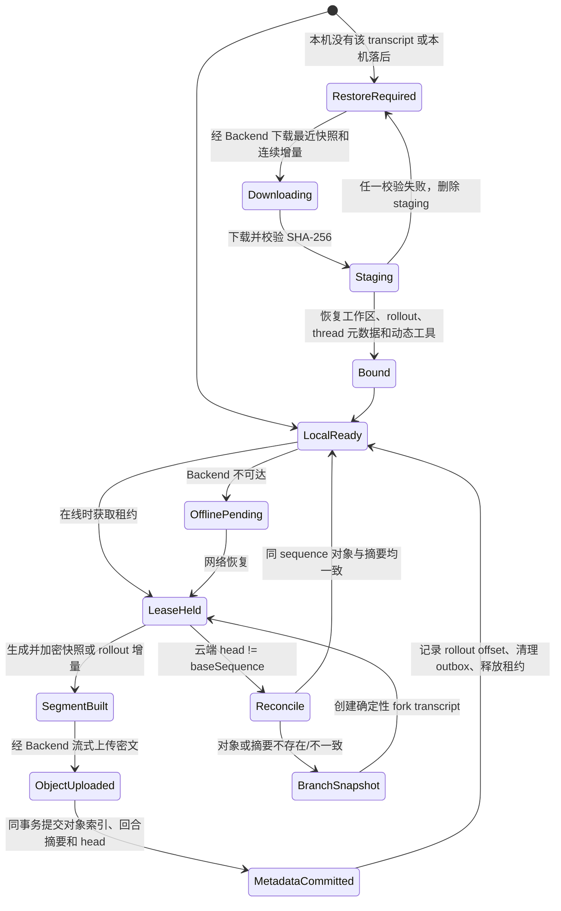

# Wework 会话与配置云同步

Wework 的 Core DSH 插件 `@wegent/dsh-transcript-sync` 同步原生 Codex
rollout、任务工作区、旧版本同结构的回合摘要和可移植偏好。双机恢复不再把会话压缩成
用户/助手文本，也不再通过 `thread/inject_items` 重建历史。

## 存储边界

Backend 使用三张表：

| 表                           | 用途                                                          |
| ---------------------------- | ------------------------------------------------------------- |
| `wework_transcripts`         | transcript 身份、分支关系、全局 sequence、状态和单写租约      |
| `wework_transcript_archives` | 不可变原生 segment 的 sequence、对象 key、SHA-256、大小和格式 |
| `wework_transcript_turns`    | 每个已完成回合的结构化摘要，沿用旧版本的数据契约              |

正文先在 Executor 中使用 AES-256-GCM 加密，再通过已认证的 Backend API 上传。Backend
负责把密文写入私有 `wework-transcripts` 对象存储；桌面客户端不会获得对象存储地址、
凭据或预签名 URL。MySQL 的 `wework_transcript_turns.payload` 会按回合保存原有协议中的
用户消息、助手最终文本、reasoning 摘要、完成状态和任务 ID，但不保存完整工具协议、
usage、rollout JSONL 或工作区文件。摘要是一回合一行 JSON，不会把整个 transcript 持续
追加进单个字段；完整数据容量和精确恢复均由分段 tgz 对象承担。

同一 sequence 的 archive 索引、turn 摘要和 transcript head 在一个 MySQL 事务中提交。
仅当对象元数据与摘要都完全一致时，重复提交才视为幂等；任一侧缺失或不一致都会报冲突，
不会形成“数据库显示已同步但摘要或 tgz 缺一份”的半状态。

Backend 基于 `WEWORK_TRANSCRIPT_ENCRYPTION_SECRET` 和用户 ID 派生稳定的每用户密钥，
通过已认证的 `GET /{id}/encryption-key` 接口短暂下发。同一用户的所有 transcript 使用
同一密钥，不同用户的密钥不同。密钥不写入同步状态、outbox 或对象内容。
每个 segment 的 nonce 由密钥、AAD 和明文摘要确定性派生；AAD 绑定 transcript ID、
sequence 和格式。相同内容重试会得到相同密文，仍可通过 SHA-256 对账；不同内容不会
复用 nonce。

每个云端 sequence 恰好对应一个对象：

- 第 1 个 sequence、每第 10 个 sequence、冲突分支的第 1 个 sequence，以及跨设备恢复
  后首次继续对话的 sequence，是完整加密快照 `codex-snapshot.v1.tgz.aes256gcm`。恢复
  会重写本机 thread ID 和工作区路径，因此必须用新快照建立新的可移植字节基线。
- 其他 sequence 是加密增量 `codex-delta.v1.tgz.aes256gcm`。
- 每个 segment 同时携带工作区覆盖层，避免只恢复会话却丢失最近文件。
- 工作区打包会排除 `.git`、`node_modules`、构建产物和常见缓存目录，避免重复上传
  仓库对象库或无关的大体积派生文件。
- outbox 只保存任务、session、turn、sequence 和分支路由，不复制正文。
- 原生对象的快照清理不会删除 `wework_transcript_turns` 中对应的结构化摘要。
- 新完整快照提交后，服务端保留“上一个完整快照 + 其后的全部 segment”，删除更旧的
  OSS 对象和元数据。快照间隔为 10 时，每个持续活跃的 transcript 通常保留 11 个、
  峰值不超过约 20 个对象，不会随对话轮数无限增长。

两台电脑可以同时保持 Wework 打开。客户端每 5 秒拉取一次云端进度，写入时才申请短租约，
上传完成立即释放；没有新 turn 的公司电脑不会长期占锁。正在运行的本地任务不会被云端恢复
覆盖。两台电脑若同时完成同一 sequence，先提交者进入主线，后提交者按确定性 ID 建立分支，
两边内容都保留。

已有 `wework_transcript_turns` 表继续保留，并沿用旧版本的摘要字段。该表不参与双机
恢复，也不能替代原生 tgz。

## 状态转换

冲突时不合并两个 rollout 文件。云端主线保持不变，本机冲突链切换到由
`clientId + transcriptId + turnId` 确定的分支，并以完整快照作为分支 sequence 1。

## 双设备验证

GitHub CI 的 `transcript-sync` desktop checkpoint 启动真实 Electron、Executor 和
Codex，并在同一个测试中顺序模拟设备 A、设备 B。两个设备使用不同的 `HOME`、
`WEGENT_EXECUTOR_HOME`、`WEGENT_CODEX_HOME`、`CODEX_SQLITE_HOME`、
Electron user data、应用配置目录和 device identity；切换到设备 B 时不会删除或复用
设备 A 的状态。

该 checkpoint 必须验证设备 A 上传加密快照和增量，设备 B 从空状态恢复工作区与完整
历史，并继续对话、上传下一个 sequence；每个 sequence 还必须产生对应结构化摘要。
共享同一本地状态的重启测试不能替代该验证。
两台物理电脑的测试保留为发布验收，用于覆盖真实网络、休眠和操作系统差异，但不作为
GitHub CI 的执行前提。

## 恢复顺序

1. 从 `wework_transcript_archives` 选择不晚于当前 head 的最近完整快照。
2. 下载快照及后续连续增量并逐个校验密文 SHA-256、格式和 sequence。
3. 使用当前用户密钥验证 GCM tag 并解密，再校验 identity，在 staging 目录恢复工作区，并拼接、解析 rollout JSONL。
4. 重写目标设备的工作区路径；thread ID 冲突时生成新 ID。
5. 在事务中恢复 Codex `threads` 和 `thread_dynamic_tools` 状态。
6. 全部成功后绑定本地任务；失败时删除 staging、rollout 和工作区，不留下半恢复状态。

## API

认证前缀为 `/api/wework-transcripts`：

| 方法与路径                                | 用途                                    |
| ----------------------------------------- | --------------------------------------- |
| `GET /`                                   | 列出 transcript 和原生 segment 元数据   |
| `GET /{id}`                               | 读取一个 transcript                     |
| `GET /{id}/turns`                         | 分页读取结构化回合摘要                  |
| `GET /{id}/encryption-key`                | 获取当前用户的 transcript 加解密密钥    |
| `POST /{id}/lease`                        | 创建 transcript 或获取写租约            |
| `PUT /{id}/lease/{token}`                 | 续租                                    |
| `POST /{id}/lease/release`                | 释放租约                                |
| `POST /{id}/segments`                     | 接收密文并提交对象索引、回合摘要和 head |
| `POST /{id}/archive`                      | 标记 transcript 为 archived             |
| `GET /{id}/archives/{archiveId}/download` | 通过 Backend 流式下载密文               |

对象 key 使用 transcript ID 的 SHA-256 摘要，不暴露原始 transcript 标识。

## 部署配置

对象存储复用 `ATTACHMENT_S3_*` 连接配置：

| 环境变量                              | 默认值               | 说明                           |
| ------------------------------------- | -------------------- | ------------------------------ |
| `WEWORK_TRANSCRIPT_S3_BUCKET`         | `wework-transcripts` | 私有原生会话 segment bucket    |
| `WEWORK_TRANSCRIPT_ENCRYPTION_SECRET` | 空                   | 派生每用户密钥的稳定高熵根密钥 |

本方案直接复用已有的三张 transcript 表，不新增 Alembic migration，也不要求已有部署
调整数据库结构。对象存储不可用时，segment 不会提交到 MySQL，outbox 继续保留定位
信息，本地任务仍可离线执行。

未配置独立根密钥时兼容使用 `SECRET_KEY`。生产环境应配置独立值，并在相关 tgz 保留期间
保持不变。
